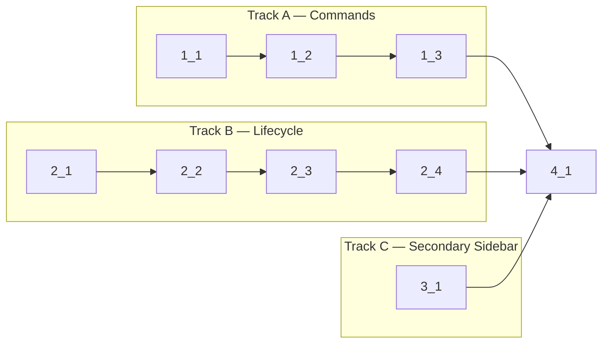

<!-- Dependency graph: a track is a sequential chain of tasks executed by one sub-agent. -->
<!-- Different tracks run as concurrent sub-agents. -->
<!-- A track may contain tasks from different sections. -->
<!-- Spikes (0_x) run before the graph and are NOT included in it. -->
<!-- If any 0_x spikes exist, complete ALL spikes before starting any track. -->
<!-- Every Deps entry MUST have a matching arrow in the graph, and vice versa. -->
<!-- Mermaid node IDs use `t` prefix (t1_1); labels show the task ID ("1_1"). -->

## 1. Commands Registration

- [x] 1_1 Declare all commands and menus in package.json
  - **Track**: A
  - **Refs**: specs/commands-registration/spec.md#Command-Declarations, specs/commands-registration/spec.md#View-Toolbar-Menu-Buttons, specs/commands-registration/spec.md#Command-Activation-Events
  - **Done**: `package.json` contains all 6 command declarations (newTerminal, newTerminalInEditor, killTerminal, clearTerminal, focusSidebar, focusPanel) + moveToSecondary, `contributes.menus.view/title` has + and trash entries, activation events include newTerminal/focusSidebar/focusPanel/moveToSecondary
  - **Test**: N/A — config-only (package.json declarative manifest)
  - **Files**: `package.json`

- [x] 1_2 Add getActiveSessionId() to TerminalViewProvider
  - **Track**: A
  - **Deps**: 1_1
  - **Refs**: specs/commands-registration/spec.md#Provider-Public-Access-for-Commands
  - **Done**: `TerminalViewProvider.getActiveSessionId()` returns the active session ID for the view or undefined. Unit test passes.
  - **Test**: `src/test/providers/TerminalViewProvider.test.ts` (unit)
  - **Files**: `src/providers/TerminalViewProvider.ts`

- [x] 1_3 Register all command handlers in extension.ts
  - **Track**: A
  - **Deps**: 1_2
  - **Refs**: specs/commands-registration/spec.md#Command-Handler-Registration
  - **Done**: All 6 command handlers registered: newTerminal creates tab in focused view, killTerminal destroys active session, clearTerminal clears scrollback, focusSidebar/focusPanel focus respective views. All disposables pushed to context.subscriptions. Unit test passes.
  - **Test**: `src/test/extension.test.ts` (unit)
  - **Files**: `src/extension.ts`

## 2. View Lifecycle Resilience

- [x] 2_1 Add pause() and resume() to OutputBuffer
  - **Track**: B
  - **Refs**: specs/view-lifecycle-resilience/spec.md#OutputBuffer-Pause-and-Resume
  - **Done**: `OutputBuffer.pause()` stops flush timer, `OutputBuffer.resume()` restarts timer and flushes buffered data. Unit test passes.
  - **Test**: `src/test/session/OutputBuffer.test.ts` (unit)
  - **Files**: `src/session/OutputBuffer.ts`

- [x] 2_2 Add view-level visibility methods to SessionManager
  - **Track**: B
  - **Deps**: 2_1
  - **Refs**: specs/view-lifecycle-resilience/spec.md#SessionManager-Webview-Reference-Update, specs/view-lifecycle-resilience/spec.md#Scrollback-Cache-Access, specs/view-lifecycle-resilience/spec.md#View-Visibility-Output-Pause
  - **Done**: `SessionManager.updateWebviewForView()`, `getScrollbackData()`, `pauseOutputForView()`, `resumeOutputForView()` all implemented. Unit tests pass.
  - **Test**: `src/test/session/SessionManager.test.ts` (unit)
  - **Files**: `src/session/SessionManager.ts`

- [x] 2_3 Implement scrollback replay in TerminalViewProvider onReady
  - **Track**: B
  - **Deps**: 2_2
  - **Refs**: specs/view-lifecycle-resilience/spec.md#Scrollback-Cache-Replay-on-Webview-Re-creation
  - **Done**: `onReady()` detects existing sessions for viewId, sends `init` with existing tabs, sends `restore` messages with scrollback data, updates webview references. First-time creation still creates new session. Unit test passes.
  - **Test**: `src/test/providers/TerminalViewProvider.test.ts` (unit)
  - **Files**: `src/providers/TerminalViewProvider.ts`

- [x] 2_4 Wire visibility pause/resume in TerminalViewProvider
  - **Track**: B
  - **Deps**: 2_3
  - **Refs**: specs/view-lifecycle-resilience/spec.md#View-Visibility-Output-Pause, specs/view-lifecycle-resilience/spec.md#PTY-Anchored-to-Extension-Host
  - **Done**: `onDidChangeVisibility` calls `pauseOutputForView` when hidden, `resumeOutputForView` when visible. `onDidDispose` only destroys sessions when appropriate (not during re-creation). Unit test passes.
  - **Test**: `src/test/providers/TerminalViewProvider.test.ts` (unit)
  - **Files**: `src/providers/TerminalViewProvider.ts`

## 3. Secondary Sidebar

- [x] 3_1 Register moveToSecondary command
  - **Track**: C
  - **Refs**: specs/secondary-sidebar/spec.md#Move-to-Secondary-Command, specs/secondary-sidebar/spec.md#Move-Command-Activation-Event
  - **Done**: `anywhereTerminal.moveToSecondary` command registered in extension.ts, focuses sidebar view then executes `workbench.action.moveView`. Command declared in package.json with activation event.
  - **Test**: N/A — command delegates to VS Code built-in commands, no testable logic beyond wiring
  - **Files**: `src/extension.ts`, `package.json`

## 4. Integration

- [x] 4_1 Verify type check and lint pass with all changes
  - **Track**: (join)
  - **Deps**: 1_3, 2_4, 3_1
  - **Refs**: All specs
  - **Done**: `pnpm run check-types` passes, `pnpm run lint` passes, `pnpm run test:unit` passes
  - **Test**: N/A — verification task
  - **Files**: All modified files
