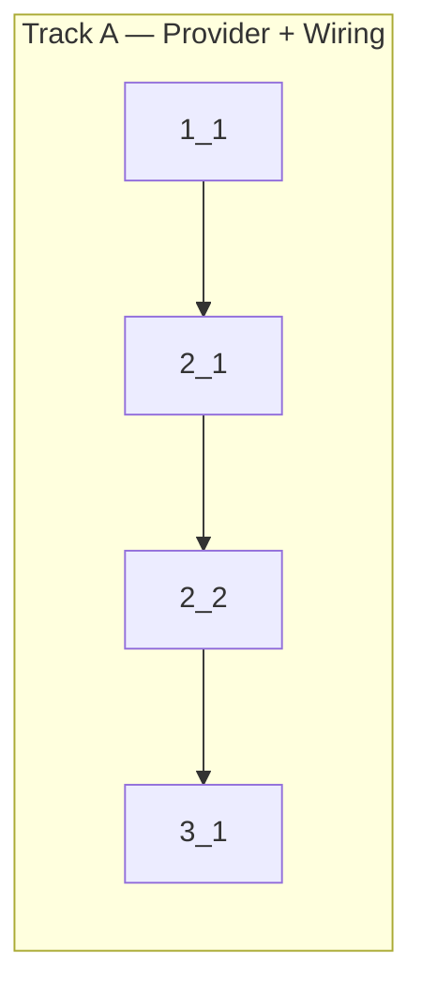

<!-- Dependency graph: a track is a sequential chain of tasks executed by one sub-agent. -->
<!-- Different tracks run as concurrent sub-agents. -->
<!-- A track may contain tasks from different sections. -->
<!-- Every Deps entry MUST have a matching arrow in the graph, and vice versa. -->
<!-- Mermaid node IDs use `t` prefix (t1_1); labels show the task ID ("1_1"). -->

## 1. Package Configuration

- [x] 1_1 Add command declaration and activation event to package.json
  - **Track**: A
  - **Refs**: specs/editor-command-registration/spec.md#Command-Declaration, specs/editor-command-registration/spec.md#Command-Activation-Event
  - **Done**: `package.json` contains `contributes.commands` entry for `anywhereTerminal.newTerminalInEditor` with title "AnyWhere Terminal: New Terminal in Editor", and `activationEvents` includes `onCommand:anywhereTerminal.newTerminalInEditor`
  - **Test**: N/A — config-only change; validated by type-check and manual palette test
  - **Files**: `package.json`
  - **Self-check**: Added `contributes.commands` array and `onCommand` activation event. JSON validated.

## 2. Editor Terminal Provider

- [x] 2_1 Create TerminalEditorProvider with WebviewPanel lifecycle
  - **Track**: A
  - **Deps**: 1_1
  - **Refs**: specs/editor-terminal-provider/spec.md#Editor-Panel-Creation, specs/editor-terminal-provider/spec.md#Editor-Panel-Message-Handling, specs/editor-terminal-provider/spec.md#Editor-Panel-Lifecycle, docs/design/webview-provider.md#§7
  - **Done**: `src/providers/TerminalEditorProvider.ts` exists with static `createPanel()` method that creates a WebviewPanel with correct options (`viewType`, `title`, `enableScripts`, `retainContextWhenHidden`, `localResourceRoots`), generates HTML with CSP/nonce and `data-terminal-location="editor"`, handles ready handshake (spawn PTY, create OutputBuffer, send init), handles input/resize/ack messages, handles PTY onData/onExit, and cleans up on panel dispose
  - **Test**: `src/providers/TerminalEditorProvider.test.ts` (unit) — 6 tests pass: createPanel returns Disposable, panel options correct, HTML contains location attr, CSP with nonce, PTY spawned on ready, cleanup on dispose, multiple independent panels
  - **Files**: `src/providers/TerminalEditorProvider.ts`, `src/providers/TerminalEditorProvider.test.ts`
  - **Self-check**: tests added/executed (6 new, all pass), vitest 141/141 green, also extended vscode mock with createWebviewPanel + ViewColumn

- [x] 2_2 Register command handler in extension.ts
  - **Track**: A
  - **Deps**: 2_1
  - **Refs**: specs/editor-command-registration/spec.md#Command-Handler-Registration, docs/design/webview-provider.md#§2
  - **Done**: `extension.ts` registers `anywhereTerminal.newTerminalInEditor` command in `activate()` that calls `TerminalEditorProvider.createPanel(context)` and pushes disposable to `context.subscriptions`
  - **Test**: N/A — integration concern; verified by type-check + manual test
  - **Files**: `src/extension.ts`
  - **Self-check**: Import added, command registered, disposable pushed. Also added commands.registerCommand to vscode mock.

## 3. Verification

- [x] 3_1 Run type-check, lint, and unit tests
  - **Track**: A
  - **Deps**: 2_2
  - **Refs**: project.md § Commands
  - **Done**: `pnpm run check-types` passes, `pnpm run lint` passes, `pnpm run test:unit` passes (141/141)
  - **Test**: N/A — this IS the verification step
  - **Files**: N/A
  - **Self-check**: type-check clean, lint auto-fixed 2 files (formatting), 141 tests green
