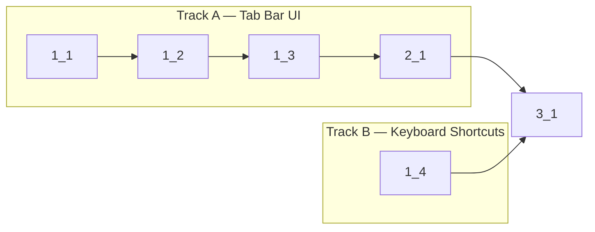

<!-- Dependency graph: a track is a sequential chain of tasks executed by one sub-agent. -->
<!-- Different tracks run as concurrent sub-agents. -->
<!-- A track may contain tasks from different sections. -->
<!-- Every Deps entry MUST have a matching arrow in the graph, and vice versa. -->
<!-- Mermaid node IDs use `t` prefix (t1_1); labels show the task ID ("1_1"). -->

## 1. Tab Bar Component

- [x] 1_1 Add tab bar CSS styles to webviewHtml.ts
  - **Track**: A
  - **Refs**: specs/tab-bar-component/spec.md#Tab-Bar-Styling; docs/design/flow-multi-tab.md#Data-Routing-Architecture
  - **Done**: Tab bar CSS rules exist in `webviewHtml.ts` inline `<style>` block using VS Code CSS variables for tab colors, backgrounds, and hover states. Tab bar height is ~30px with `flex-shrink: 0`. Active tab visually distinct from inactive.
  - **Test**: N/A — CSS-only change, verified visually and by type check
  - **Files**: src/providers/webviewHtml.ts

- [x] 1_2 Implement `renderTabBar()` function in webview main.ts
  - **Track**: A
  - **Deps**: 1_1
  - **Refs**: specs/tab-bar-component/spec.md#Tab-Bar-Rendering; docs/design/flow-multi-tab.md#Create-Tab-Flow
  - **Done**: `renderTabBar()` function exists in `main.ts` that: (1) clears `#tab-bar` innerHTML, (2) iterates `terminals` map to create tab elements with name + close button, (3) appends "+" add button, (4) hides tab bar when only 1 tab exists, (5) shows tab bar when 2+ tabs exist. Type check passes.
  - **Test**: src/webview/TabBar.test.ts (unit) — test renderTabBar output for 0, 1, 2, 3 tabs; test active tab class; test hidden when single tab
  - **Files**: src/webview/main.ts

- [x] 1_3 Wire tab bar click handlers and integrate `renderTabBar()` calls into message handler
  - **Track**: A
  - **Deps**: 1_2
  - **Refs**: specs/tab-bar-component/spec.md#Tab-Click-Handlers; specs/tab-bar-component/spec.md#Tab-Bar-Update-Integration; docs/design/flow-multi-tab.md
  - **Done**: (1) Tab click calls `switchTab(tabId)`, (2) Close "×" click sends `closeTab` message with `stopPropagation()`, (3) "+" click sends `createTab` message, (4) `renderTabBar()` is called in `handleInit`, after `tabCreated` processing, after `tabRemoved` processing, and inside `switchTab()`. Type check passes.
  - **Test**: src/webview/TabBar.test.ts (unit) — test click handler wiring, test stopPropagation on close button
  - **Files**: src/webview/main.ts

- [x] 1_4 Add Ctrl+Tab / Ctrl+Shift+Tab keyboard shortcut handler
  - **Track**: B
  - **Refs**: specs/tab-keyboard-shortcuts/spec.md#Tab-Cycling-Shortcuts; docs/design/flow-multi-tab.md#Keyboard-Shortcut
  - **Done**: Document-level `keydown` listener in `bootstrap()` that: (1) detects `e.ctrlKey && e.key === 'Tab'`, (2) calls `e.preventDefault()`, (3) calculates next/prev tab index with wrap-around, (4) calls `switchTab()` with the target tab ID. Ctrl+Shift+Tab cycles backward. No-op when single tab. Type check passes.
  - **Test**: src/webview/TabBar.test.ts (unit) — test forward cycling, backward cycling, wrap-around, single-tab no-op
  - **Files**: src/webview/main.ts

## 2. Integration & Polish

- [x] 2_1 Update `removeTerminal()` to call `renderTabBar()` and handle empty state
  - **Track**: A
  - **Deps**: 1_3
  - **Refs**: specs/tab-bar-component/spec.md#Tab-Bar-Update-Integration; docs/design/flow-multi-tab.md#Close-Tab-Flow
  - **Done**: (1) `removeTerminal()` calls `renderTabBar()` after removing the terminal, (2) when no tabs remain after removal, tab bar shows empty state or is hidden. Type check passes. Lint passes.
  - **Test**: src/webview/TabBar.test.ts (unit) — test tab bar state after removal of last tab, after removal of non-last tab
  - **Files**: src/webview/main.ts

## 3. Verification

- [x] 3_1 Run type check, lint, and unit tests to verify all changes
  - **Track**: A
  - **Deps**: 2_1, 1_4
  - **Refs**: cyberk-flow/project.md#Commands
  - **Done**: `pnpm run check-types` passes, `pnpm run lint` passes, `pnpm run test:unit` passes with all new TabBar tests green
  - **Test**: N/A — this IS the verification task
  - **Files**: N/A — verification only
