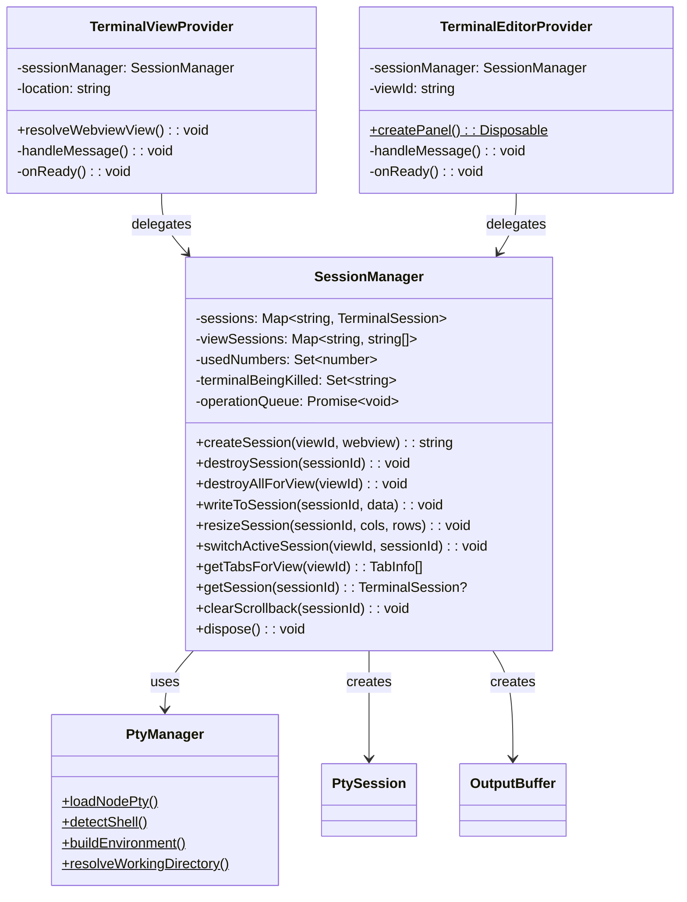

# Design: add-session-manager-editor

## Architecture Decisions

### 1. SessionManager as Singleton Class

SessionManager is a class (not module-level functions like PtyManager) because it holds mutable state (session maps, operation queue). It extends VS Code's Disposable pattern for automatic cleanup.

### 2. Operation Queue via Promise Chain

Destructive operations are serialized via a single `operationQueue: Promise<void>`. This is the simplest correct approach — no external queue library needed, and it matches the VS Code reference implementation.

### 3. Shared HTML Utility

Extract `getTerminalHtml(webview, extensionUri, location)` to `src/providers/webviewHtml.ts`. Both providers import and call this function. This eliminates ~60 lines of duplicated HTML generation.

### 4. Provider Refactoring Strategy

Providers keep their existing external API (WebviewViewProvider interface, static createPanel). Internal changes:
- Remove `_ptySession`, `_outputBuffer`, `_sessionId` fields
- Add `_sessionManager` constructor parameter
- Delegate all session operations to SessionManager
- Wire Phase 2 message handlers (createTab, switchTab, closeTab, clear)

## Interface Sketch

## Risk Map

| Component | Risk | Mitigation |
|---|---|---|
| SessionManager core (create/get/write/resize) | LOW | Straightforward map operations, well-tested patterns |
| Operation queue | LOW | Simple Promise chain, proven pattern |
| Kill tracking | MEDIUM | Two exit paths (intentional vs crash) — unit test both paths |
| Provider refactoring | MEDIUM | Keep same external API, comprehensive tests verify behavior preserved |
| Scrollback cache | LOW | Simple ring buffer with size cap |
| Extension.ts wiring | LOW | Minimal changes — add SessionManager creation and pass to providers |

**Overall Risk: MEDIUM** — No HIGH risk items, no spikes needed.

## File Changes

| File | Change Type | Description |
|---|---|---|
| `src/session/SessionManager.ts` | NEW | Central session registry |
| `src/session/SessionManager.test.ts` | NEW | Unit tests |
| `src/providers/webviewHtml.ts` | NEW | Shared HTML generation utility |
| `src/providers/TerminalViewProvider.ts` | MODIFY | Delegate to SessionManager |
| `src/providers/TerminalEditorProvider.ts` | MODIFY | Delegate to SessionManager |
| `src/extension.ts` | MODIFY | Create SessionManager, pass to providers |
