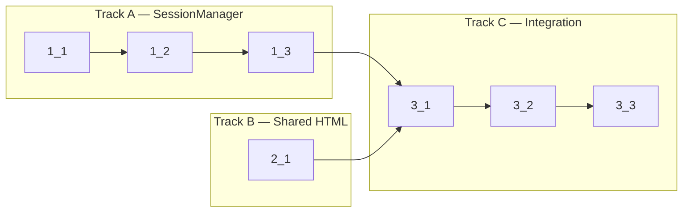

<!-- Dependency graph: a track is a sequential chain of tasks executed by one sub-agent. -->
<!-- Different tracks run as concurrent sub-agents. -->
<!-- A track may contain tasks from different sections. -->
<!-- Every Deps entry MUST have a matching arrow in the graph, and vice versa. -->
<!-- Mermaid node IDs use `t` prefix (t1_1); labels show the task ID ("1_1"). -->

## 1. SessionManager Core

- [x] 1_1 Create SessionManager class with data model and core CRUD operations
  - **Track**: A
  - **Refs**: specs/session-manager-core/spec.md; specs/session-manager-numbering/spec.md; docs/design/session-manager.md
  - **Done**: SessionManager class exists with `createSession`, `writeToSession`, `resizeSession`, `switchActiveSession`, `getTabsForView`, `getSession`, `clearScrollback` methods. Terminal number recycling works with gap-filling. Scrollback cache with FIFO eviction is implemented. Type check passes.
  - **Test**: src/session/SessionManager.test.ts (unit) — test create, get, write, resize, switch, tabs, clear, number recycling, scrollback cache
  - **Files**: src/session/SessionManager.ts

- [x] 1_2 Add destroy operations with operation queue and kill tracking
  - **Track**: A
  - **Deps**: 1_1
  - **Refs**: specs/session-manager-lifecycle/spec.md; docs/design/session-manager.md#§4-§5
  - **Done**: `destroySession`, `destroyAllForView`, `dispose` methods work with Promise-chain serialization. Kill tracking prevents re-entrant cleanup. Unexpected PTY crash triggers cleanup and sends exit message. Type check passes.
  - **Test**: src/session/SessionManager.test.ts (unit) — test destroy, destroyAll, operation queue serialization, kill tracking (intentional vs crash), dispose
  - **Files**: src/session/SessionManager.ts

- [x] 1_3 Add unit tests for SessionManager
  - **Track**: A
  - **Deps**: 1_2
  - **Refs**: specs/session-manager-core/spec.md; specs/session-manager-lifecycle/spec.md; specs/session-manager-numbering/spec.md
  - **Done**: All scenarios from specs pass. Tests cover: session CRUD, number recycling (gap-filling), scrollback cache eviction, operation queue serialization, kill tracking (both paths), dispose cleanup. `pnpm run test:unit` passes.
  - **Test**: src/session/SessionManager.test.ts (unit)
  - **Files**: src/session/SessionManager.test.ts

## 2. Shared HTML Utility

- [x] 2_1 Extract shared HTML generation to utility function
  - **Track**: B
  - **Refs**: specs/provider-integration/spec.md#Shared-HTML-Generation; docs/design/webview-provider.md#§4
  - **Done**: `getTerminalHtml(webview, extensionUri, location)` function exists in `src/providers/webviewHtml.ts`. Generates identical HTML to current providers (CSP, nonce, script/style URIs, data-terminal-location attribute). Type check passes.
  - **Test**: N/A — pure template function, tested indirectly via provider integration
  - **Files**: src/providers/webviewHtml.ts

## 3. Provider Integration

- [x] 3_1 Refactor TerminalViewProvider to use SessionManager
  - **Track**: C
  - **Deps**: 1_3, 2_1
  - **Refs**: specs/provider-integration/spec.md#TerminalViewProvider-SessionManager-Integration; docs/design/webview-provider.md
  - **Done**: TerminalViewProvider constructor accepts SessionManager. All message handlers delegate to SessionManager. Phase 2 handlers (createTab, switchTab, closeTab, clear) are wired. Direct PtySession/OutputBuffer/PtyManager usage removed. Uses shared `getTerminalHtml`. Type check passes.
  - **Test**: N/A — integration tested via existing extension tests; SessionManager unit tests cover logic
  - **Files**: src/providers/TerminalViewProvider.ts

- [x] 3_2 Refactor TerminalEditorProvider to use SessionManager
  - **Track**: C
  - **Deps**: 3_1
  - **Refs**: specs/editor-session-manager/spec.md#Editor-Terminal-SessionManager-Integration; docs/design/webview-provider.md#§7
  - **Done**: TerminalEditorProvider.createPanel accepts SessionManager. Generates unique viewId `editor-${crypto.randomUUID()}`. All message handlers delegate to SessionManager. Uses shared `getTerminalHtml`. On panel dispose calls `destroyAllForView`. Type check passes.
  - **Test**: N/A — integration tested via existing extension tests; SessionManager unit tests cover logic
  - **Files**: src/providers/TerminalEditorProvider.ts

- [x] 3_3 Update extension.ts to create and wire SessionManager
  - **Track**: C
  - **Deps**: 3_2
  - **Refs**: specs/editor-session-manager/spec.md#Extension-Activation-Wiring; docs/design/webview-provider.md#§2
  - **Done**: `activate()` creates a single SessionManager, passes it to both TerminalViewProvider instances and to TerminalEditorProvider.createPanel. SessionManager registered in `context.subscriptions`. `pnpm run check-types` passes. `pnpm run lint` passes. `pnpm run test:unit` passes.
  - **Test**: N/A — wiring only, tested via type check and existing tests
  - **Files**: src/extension.ts
