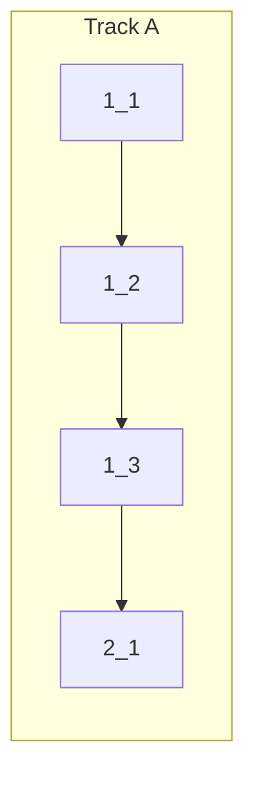

<!-- Dependency graph: a track is a sequential chain of tasks executed by one sub-agent. -->
<!-- Different tracks run as concurrent sub-agents. -->
<!-- A track may contain tasks from different sections. -->
<!-- Every Deps entry MUST have a matching arrow in the graph, and vice versa. -->
<!-- Mermaid node IDs use `t` prefix (t1_1); labels show the task ID ("1_1"). -->

## 1. Biome Setup & ESLint Removal

- [x] 1_1 Install `@biomejs/biome` and create `biome.json` with lint rules and formatter config
  - Self-check: @biomejs/biome@2.4.5 installed; biome.json created with recommended+4 custom rules; formatter enabled with semicolons always; `pnpm biome check` runs successfully (config valid)
  - **Track**: A
  - **Refs**: specs/biome-linting/spec.md#biome-lint-config; specs/biome-formatting/spec.md#biome-formatter-config
  - **Done**: `biome.json` exists at project root with `useBlockStatements`, `noDoubleEquals`, `useThrowOnlyError`, `useNamingConvention` rules enabled; `recommended` preset active; `javascript.formatter.semicolons` set to `"always"`; `@biomejs/biome` in devDependencies; `files.ignore` includes `dist/`, `out/`, `node_modules/`
  - **Test**: N/A — config-only
  - **Files**: `package.json`, `biome.json`

- [x] 1_2 Remove ESLint dependencies and config file
  - Self-check: `eslint` and `typescript-eslint` removed from devDependencies; `eslint.config.mjs` deleted
  - **Track**: A
  - **Deps**: 1_1
  - **Refs**: specs/biome-linting/spec.md#eslint-removed
  - **Done**: `eslint` and `typescript-eslint` removed from `package.json` devDependencies; `eslint.config.mjs` deleted
  - **Test**: N/A — config-only removal
  - **Files**: `package.json`, `eslint.config.mjs` (delete)

- [x] 1_3 Update npm scripts and format existing source files
  - Self-check: `lint` → `biome check src/`; added `format` → `biome format --write src/`; ran `biome check --write --unsafe` on src/; `pnpm run lint` exits 0; `pnpm biome check src/` exits 0
  - **Track**: A
  - **Deps**: 1_2
  - **Refs**: specs/build-integration/spec.md#npm-scripts-updated; specs/biome-formatting/spec.md#source-files-formatted
  - **Done**: `lint` script runs `biome check src/`; `format` script runs `biome format --write src/`; `pnpm run lint` passes; `pnpm biome format --check src/` exits 0
  - **Test**: N/A — config-only; verified by running `pnpm run lint`
  - **Files**: `package.json`, `src/**/*.ts`

## 2. Documentation

- [x] 2_1 Update `cyberk-flow/project.md` with new lint/format commands
  - Self-check: Lint command updated to reference Biome; Format command added
  - **Track**: A
  - **Deps**: 1_3
  - **Refs**: specs/build-integration/spec.md#project-md-updated
  - **Done**: `project.md` Lint command updated to reference Biome; Format command added
  - **Test**: N/A — doc-only
  - **Files**: `cyberk-flow/project.md`
