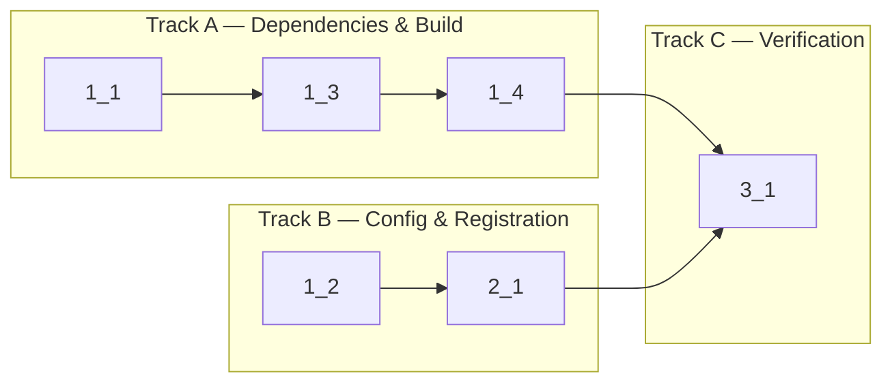

<!-- Dependency graph: a track is a sequential chain of tasks executed by one sub-agent. -->
<!-- Different tracks run as concurrent sub-agents. -->
<!-- Every Deps entry MUST have a matching arrow in the graph, and vice versa. -->
<!-- Mermaid node IDs use `t` prefix (t1_1); labels show the task ID ("1_1"). -->

## 0. Spikes

_(None — LOW risk, no HIGH risk items)_

## 1. Build Infrastructure

- [x] 1_1 Install xterm.js packages, remove alchemy, and externalize node-pty
  - **Track**: A
  - **Refs**: specs/build-infrastructure/spec.md#xterm.js-Dependencies, specs/build-infrastructure/spec.md#Remove-Leftover-Dependencies
  - **Done**: `@xterm/xterm`, `@xterm/addon-fit`, `@xterm/addon-web-links` in `devDependencies`; `alchemy` removed from `dependencies` (section empty or removed); `pnpm install` succeeds without errors
  - **Test**: N/A — dependency config only
  - **Files**: `package.json`, `pnpm-lock.yaml`

- [x] 1_2 Update tsconfig.json to include DOM lib
  - **Track**: B
  - **Refs**: specs/build-infrastructure/spec.md#TypeScript-DOM-Support, docs/design/build-system.md#§7
  - **Done**: `tsconfig.json` has `"lib": ["ES2022", "DOM"]`; `pnpm run check-types` passes
  - **Test**: N/A — config-only
  - **Files**: `tsconfig.json`

- [x] 1_3 Rewrite esbuild.js for dual-target build with CSS copy plugin
  - **Track**: A
  - **Deps**: 1_1
  - **Refs**: specs/build-infrastructure/spec.md#Dual-Target-esbuild-Build, specs/build-infrastructure/spec.md#xterm-CSS-Copy, specs/build-infrastructure/spec.md#node-pty-Externalization, docs/design/build-system.md#§10
  - **Done**: Running `node esbuild.js` produces all three artifacts: `dist/extension.js` (CJS, externals: vscode + node-pty), `media/webview.js` (IIFE, browser), `media/xterm.css` (copied from node_modules). The `media/` directory is auto-created if missing. Watch mode (`--watch`) starts without error. Production mode (`--production`) produces minified output without sourcemaps.
  - **Test**: N/A — build config (verified by output file existence check in task 3_1)
  - **Files**: `esbuild.js`
  - **Note**: Requires a minimal `src/webview/main.ts` entry point (can be an empty file or `console.log('webview')`) for esbuild to have a valid entry. Create this placeholder file as part of this task.

- [x] 1_4 Create .vscodeignore and update .gitignore for media build artifacts
  - **Track**: A
  - **Deps**: 1_3
  - **Refs**: specs/build-infrastructure/spec.md#Clean-Packaging-Config, specs/build-infrastructure/spec.md#Media-Directory-Structure
  - **Done**: `.vscodeignore` exists with rules: include `dist/**`, `media/**`, `package.json`, `README.md`, `CHANGELOG.md`, `LICENSE`; exclude `src/**`, `node_modules/**`, `docs/**`, `*.ts`, `tsconfig*.json`, `esbuild.js`, `.git/**`, `cyberk-flow/**`. `.gitignore` updated to ignore `media/webview.js`, `media/xterm.css` (build artifacts).
  - **Test**: N/A — config-only
  - **Files**: `.vscodeignore`, `.gitignore`

## 2. View Registration

- [x] 2_1 Configure package.json with view container, view, activation event, and register minimal provider stub
  - **Track**: B
  - **Deps**: 1_2
  - **Refs**: specs/view-registration/spec.md (all requirements), docs/design/build-system.md#§8, docs/design/webview-provider.md#§2
  - **Done**: `package.json` has: (a) `viewsContainers.activitybar` with `id: "anywhereTerminal"`, `title: "AnyWhere Terminal"`, `icon: "$(terminal)"`; (b) `views.anywhereTerminal` with `id: "anywhereTerminal.sidebar"`, `name: "Terminal"`, `type: "webview"`; (c) `activationEvents` includes `"onView:anywhereTerminal.sidebar"`; (d) helloWorld command and registration removed. `src/extension.ts` registers a minimal `WebviewViewProvider` that renders placeholder HTML. `pnpm run check-types` passes.
  - **Test**: N/A — config + minimal stub (full provider tested in task 1.3 of PLAN.md)
  - **Files**: `package.json`, `src/extension.ts`

## 3. Verification

- [x] 3_1 Verify full build pipeline, type checking, and lint
  - **Track**: C
  - **Deps**: 1_4, 2_1
  - **Refs**: All specs
  - **Done**: All pass: (1) `pnpm run compile` (check-types + lint + esbuild) succeeds; (2) `dist/extension.js` exists; (3) `media/webview.js` exists; (4) `media/xterm.css` exists; (5) No TypeScript errors; (6) No lint errors; (7) `dist/extension.js` does NOT contain inlined node-pty code
  - **Test**: N/A — integration verification (build pipeline)
  - **Files**: _(none — read-only verification)_
