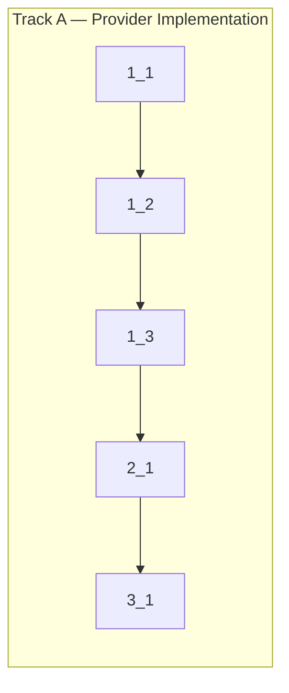

<!-- Dependency graph: single track — sequential execution -->
<!-- No spikes needed (LOW risk, design fully documented) -->

## 1. Types & Provider Core

- [x] 1_1 Create shared message type definitions in `src/types/messages.ts`
  - **Track**: A
  - **Refs**: docs/design/message-protocol.md#§3-§6, docs/design/webview-provider.md#§6
  - **Done**: File exists with all Phase 1 message interfaces (`ReadyMessage`, `InputMessage`, `ResizeMessage`, `AckMessage`, `InitMessage`, `OutputMessage`, `ExitMessage`, `ErrorMessage`), `ViewShowMessage` (internal, for visibility change), discriminated union types (`WebViewToExtensionMessage`, `ExtensionToWebViewMessage`), `TerminalConfig` interface; `pnpm run check-types` passes
  - **Test**: N/A — pure type definitions (no runtime behavior)
  - **Files**: `src/types/messages.ts`

- [x] 1_2 Create `TerminalViewProvider` class with `resolveWebviewView()` and HTML generation
  - **Track**: A
  - **Deps**: 1_1
  - **Refs**: docs/design/webview-provider.md#§2-§4, docs/design/flow-initialization.md, PLAN.md#1.3
  - **Done**: `src/providers/TerminalViewProvider.ts` exists; class implements `vscode.WebviewViewProvider`; `resolveWebviewView()` sets `enableScripts: true`, `localResourceRoots: [media/]`, generates HTML with nonce-based CSP (`default-src 'none'`, `script-src 'nonce-...'`, `style-src ... 'unsafe-inline'`, `font-src ...`); HTML contains `
`, `
`, loads `media/xterm.css` and `media/webview.js` via `asWebviewUri()`; nonce generated using `crypto.randomBytes(16).toString('hex')`; `pnpm run check-types` passes
  - **Test**: N/A — VS Code API integration (requires Extension Host runtime, verified by build in task 3_1)
  - **Files**: `src/providers/TerminalViewProvider.ts`

- [x] 1_3 Implement message handler router and lifecycle handlers in `TerminalViewProvider`
  - **Track**: A
  - **Deps**: 1_2
  - **Refs**: docs/design/webview-provider.md#§8-§9, docs/design/message-protocol.md#§7-§10
  - **Done**: `resolveWebviewView()` wires: (a) `onDidReceiveMessage` with switch/case router for Phase 1 message types (ready, input, resize, ack — all handlers are stubs that log only, since SessionManager doesn't exist yet); incoming messages validated with basic shape check (`typeof msg.type === 'string'`); unknown types logged with `console.warn`; (b) `onDidDispose` cleans up (`this.view = undefined`, disposes subscriptions); (c) `onDidChangeVisibility` posts `{ type: 'viewShow' }` to webview when view becomes visible (for deferred resize); all event subscriptions collected in disposables array and cleaned up on dispose; `pnpm run check-types` passes
  - **Test**: N/A — VS Code API event handlers (requires Extension Host runtime)
  - **Files**: `src/providers/TerminalViewProvider.ts`

## 2. Registration

- [x] 2_1 Update `extension.ts` to import and register `TerminalViewProvider`, remove inline stub
  - **Track**: A
  - **Deps**: 1_3
  - **Refs**: docs/design/webview-provider.md#§2, PLAN.md#1.3
  - **Done**: `src/extension.ts` imports `TerminalViewProvider` from `./providers/TerminalViewProvider`; creates instance with `context.extensionUri`; registers via `registerWebviewViewProvider` with `{ webviewOptions: { retainContextWhenHidden: true } }` (set at registration, NOT in resolveWebviewView — per VS Code API); inline `TerminalViewProvider` class and `crypto` import removed; `pnpm run check-types` passes; `pnpm run lint` passes
  - **Test**: N/A — registration wiring (verified by build + manual F5)
  - **Files**: `src/extension.ts`

## 3. Verification

- [x] 3_1 Verify build pipeline and runtime behavior
  - **Track**: A
  - **Deps**: 2_1
  - **Refs**: cyberk-flow/project.md#Commands
  - **Done**: All pass: (1) `pnpm run check-types` — no TypeScript errors; (2) `pnpm run lint` — no lint errors; (3) `pnpm run compile` — produces `dist/extension.js` containing TerminalViewProvider code and `media/webview.js`; (4) CSP in generated HTML contains `default-src 'none'` and `script-src 'nonce-...'`; (5) `localResourceRoots` restricted to `media/` directory only
  - **Test**: N/A — build pipeline verification
  - **Files**: _(none — read-only verification)_
