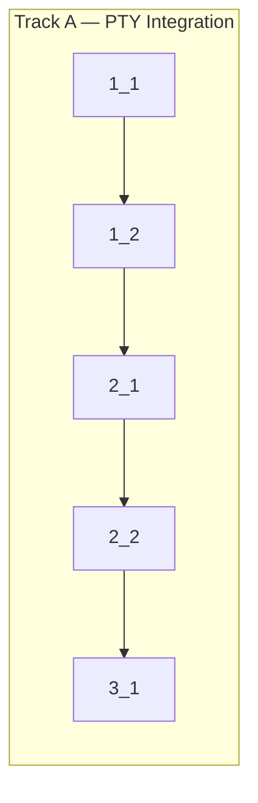

<!-- Dependency graph: single track — sequential execution (all files are new, no concurrent edit conflicts) -->
<!-- Single-track is appropriate: 3 new files with sequential deps (errors → manager → session), appetite S (<=1d) -->

## 1. Error Types & PtyManager

- [x] 1_1 Create error type classes for PTY-related failures
  - **Track**: A
  - **Refs**: specs/pty-integration/spec.md#Requirement-Error-Types; docs/design/error-handling.md#§7
  - **Done**: `src/types/errors.ts` exists with: string `ErrorCode` enum (NOT `const enum` — for runtime inspection in tests/logging) with values `PtyLoadFailed`, `ShellNotFound`, `SpawnFailed`, `CwdNotFound`, `WebViewDisposed`, `SessionNotFound`, `BufferOverflow`; base `AnyWhereTerminalError` class extending `Error` with `code: ErrorCode` property; `PtyLoadError` (with `attemptedPaths: string[]`), `ShellNotFoundError` (with `attemptedShells: string[]`), `SpawnError` (with `shellPath: string`, `cause: Error`), `CwdNotFoundError` (with `cwdPath: string`, `fallbackPath: string`); `pnpm run check-types` passes
  - **Test**: N/A — pure type/class definitions with no logic branching
  - **Files**: `src/types/errors.ts`

- [x] 1_2 Create PtyManager with node-pty loading, shell detection, environment building, and CWD resolution
  - **Track**: A
  - **Deps**: 1_1
  - **Refs**: specs/pty-integration/spec.md#Requirement-node-pty-Dynamic-Loading; specs/pty-integration/spec.md#Requirement-Shell-Detection; specs/pty-integration/spec.md#Requirement-PTY-Environment-Setup; specs/pty-integration/spec.md#Requirement-Working-Directory-Resolution; docs/design/pty-manager.md
  - **Done**: `src/pty/PtyManager.ts` exists with:
    (1) `loadNodePty()` tries `appRoot/node_modules.asar/node-pty` then `appRoot/node_modules/node-pty` using `module.require` (bypasses esbuild), caches on success (module-level variable), throws `PtyLoadError` with attempted paths on failure;
    (2) `detectShell()` follows fallback chain `$SHELL` → `/bin/zsh` → `/bin/bash` → `/bin/sh` with `validateShell(path)` checking `fs.statSync` + executable bit (`mode & 0o111`), returns `{ shell, args: ['--login'] }`;
    (3) `buildEnvironment()` clones `process.env`, sets `TERM=xterm-256color`, `COLORTERM=truecolor`, `LANG=en_US.UTF-8` (only if unset), `TERM_PROGRAM=AnyWhereTerminal`, `TERM_PROGRAM_VERSION=<extension version from vscode.extensions.getExtension()>`, does NOT override `PATH/HOME/SHELL`;
    (4) `resolveWorkingDirectory()` returns first `vscode.workspace.workspaceFolders[0].uri.fsPath` if available, else `os.homedir()`;
    `pnpm run check-types` passes
  - **Test**: N/A — PtyManager methods depend on `vscode` API (`vscode.env.appRoot`, `vscode.workspace.workspaceFolders`, `vscode.extensions.getExtension()`), which requires Extension Host runtime. Pure utility `validateShell()` is simple enough to verify via build + manual testing. Unit tests for these functions would require extensive VS Code API mocking with limited value for an S-sized change. Integration testing via F5 in task 2_2.
  - **Files**: `src/pty/PtyManager.ts`
  - **Notes**: User config for shell path (`anywhereTerminal.shell.macOS`) and custom CWD (`anywhereTerminal.defaultCwd`) are deferred to Phase 3 task 3.2. Spawn fallback chain (retry with next shell) is the caller's responsibility (SessionManager, task 1.6).

## 2. PtySession

- [x] 2_1 Create PtySession class with spawn, write, resize, kill, and graceful shutdown
  - **Track**: A
  - **Deps**: 1_2
  - **Refs**: specs/pty-integration/spec.md#Requirement-PTY-Session-Lifecycle; specs/pty-integration/spec.md#Requirement-Graceful-Shutdown; docs/design/pty-manager.md#§5
  - **Done**: `src/pty/PtySession.ts` exists with: `PtySession` class with:
    - Properties: `id: string`, `isAlive: boolean` (getter);
    - Constructor: takes `id: string`;
    - `spawn(shell, args, options: { cols, rows, cwd, env })` creates PTY via loaded node-pty `spawn()` with `name='xterm-256color'`, wires `pty.onData` → `this._onDataCallback`, wires `pty.onExit` → sets `_isAlive=false`, clears timers, fires `_onExitCallback`;
    - `write(data)` forwards to `ptyProcess.write()` — no-op if not alive or shutting down;
    - `resize(cols, rows)` clamps both to `Math.max(1, value)` then calls `ptyProcess.resize()` — no-op if not alive;
    - `kill()` implements graceful shutdown per VS Code pattern: (a) sets `_isShuttingDown=true`, (b) starts 250ms data flush timer that resets on each `onData` event, (c) after flush timeout fires `ptyProcess.kill()`, (d) starts 5000ms max shutdown timer → `pty.kill('SIGKILL')` if still alive;
    - Event setters: `set onData(cb)`, `set onExit(cb)`;
    - `dispose()` clears all timers, kills if alive, nullifies callbacks;
    `pnpm run check-types` passes
  - **Test**: N/A — PtySession requires actual node-pty module (native addon). Unit tests with mocked node-pty would test mock behavior, not real behavior. Integration testing via F5 in task 2_2. Shutdown logic (timers, state transitions) is straightforward enough to verify via code review.
  - **Files**: `src/pty/PtySession.ts`
  - **Notes**: `CwdNotFoundError` is defined in 1_1 but not raised by PtySession — it will be raised by SessionManager (task 1.6) which validates CWD before calling PtySession.spawn().

- [x] 2_2 Verify build compiles with PtyManager + PtySession and all imports resolve
  - **Track**: A
  - **Deps**: 2_1
  - **Refs**: docs/design/flow-initialization.md
  - **Done**: `pnpm run check-types` passes; `pnpm run lint` passes; `pnpm run compile` produces `dist/extension.js` containing PtyManager and PtySession code; no import errors, circular dependencies, or unused imports; `node-pty` remains externalized in bundle (not bundled)
  - **Test**: N/A — build verification
  - **Files**: _(none — read-only verification)_

## 3. Verification

- [x] 3_1 Run full verify gate (type-check + lint + build)
  - **Track**: A
  - **Deps**: 2_2
  - **Refs**: cyberk-flow/project.md#Commands
  - **Done**: All pass: (1) `pnpm run check-types` — zero errors; (2) `pnpm run lint` — zero issues; (3) `pnpm run compile` — produces both `dist/extension.js` and `media/webview.js`; (4) `node-pty` correctly externalized (already configured in esbuild.js)
  - **Test**: N/A — build pipeline verification
  - **Files**: _(none — read-only verification)_
