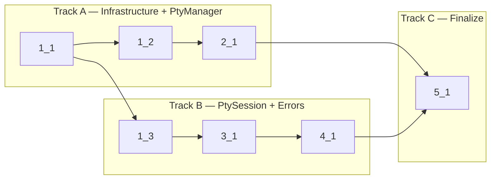

<!-- Dependency graph: a track is a sequential chain of tasks executed by one sub-agent. -->
<!-- Different tracks run as concurrent sub-agents. -->
<!-- A track may contain tasks from different sections. -->
<!-- Mermaid node IDs use `t` prefix (t1_1); labels show the task ID ("1_1"). -->

## 1. Test Infrastructure

- [x] 1_1 Install Vitest and create configuration
  - **Track**: A
  - **Refs**: specs/test-infrastructure/spec.md#vitest-configuration, specs/test-infrastructure/spec.md#test-scripts
  - **Done**: `vitest.config.ts` exists at project root; `pnpm run test:unit` executes Vitest without errors (0 tests found is OK); `package.json` has `test:unit`, `test:unit:watch`, `test:unit:coverage` scripts; existing `test` script unchanged
  - **Test**: N/A — config-only task
  - **Files**: `vitest.config.ts`, `package.json`

- [x] 1_2 Create vscode mock module
  - **Track**: A
  - **Deps**: 1_1
  - **Refs**: specs/test-infrastructure/spec.md#vscode-mock-module
  - **Done**: `src/test/__mocks__/vscode.ts` exports all stubs listed in spec; importing a module that uses `vscode` in a test resolves to the mock; Vitest `resolve.alias` maps `vscode` to the mock
  - **Test**: N/A — test infrastructure (validated by downstream test tasks)
  - **Files**: `src/test/__mocks__/vscode.ts`, `vitest.config.ts`

- [x] 1_3 Create node-pty mock helper for PtySession tests
  - **Track**: B
  - **Deps**: 1_1
  - **Refs**: specs/pty-session-tests/spec.md#spawn-lifecycle-tests
  - **Done**: `src/test/__mocks__/node-pty.ts` exports a `createMockPty()` factory that returns a mock `Pty` and `NodePtyModule` with controllable `onData`/`onExit` triggers
  - **Test**: N/A — test infrastructure (validated by downstream test tasks)
  - **Files**: `src/test/__mocks__/node-pty.ts`

## 2. PtyManager Tests

- [x] 2_1 Write PtyManager unit tests
  - **Track**: A
  - **Deps**: 1_2
  - **Refs**: specs/pty-manager-tests/spec.md (all requirements)
  - **Done**: All 5 requirements pass: detectShell (3 scenarios), validateShell (4 cases), buildEnvironment (LANG preservation, env vars), resolveWorkingDirectory (workspace vs homedir), loadNodePty (cache, fallback, error); `pnpm run test:unit` passes with these tests
  - **Test**: `src/pty/PtyManager.test.ts` (unit)
  - **Files**: `src/pty/PtyManager.test.ts`

## 3. PtySession Tests

- [x] 3_1 Write PtySession unit tests
  - **Track**: B
  - **Deps**: 1_3
  - **Refs**: specs/pty-session-tests/spec.md (all requirements)
  - **Done**: All 5 requirements pass: spawn lifecycle (success, already-alive, already-spawned, clamp), write/resize guards, kill graceful shutdown (flush timer, force kill, grace period, idempotent), dispose, exit callbacks; uses `vi.useFakeTimers()` for timer-based tests
  - **Test**: `src/pty/PtySession.test.ts` (unit)
  - **Files**: `src/pty/PtySession.test.ts`

## 4. Error Type Tests

- [x] 4_1 Write error class unit tests
  - **Track**: B
  - **Deps**: 3_1
  - **Refs**: specs/error-type-tests/spec.md (all requirements)
  - **Done**: All error classes tested for: construction, `code` value, `name` property, `message` content, `instanceof` chain, stored properties; ErrorCode enum completeness verified
  - **Test**: `src/types/errors.test.ts` (unit)
  - **Files**: `src/types/errors.test.ts`

## 5. Finalize

- [x] 5_1 Configure coverage thresholds and update project.md
  - **Track**: C
  - **Deps**: 2_1, 4_1
  - **Refs**: specs/test-infrastructure/spec.md#coverage-threshold
  - **Done**: `vitest.config.ts` has coverage config with v8 provider, 80% threshold for lines/functions/branches, `text` + `lcov` reporters; `pnpm run test:unit:coverage` passes with all thresholds met; `cyberk-flow/project.md` updated with `test:unit`, `test:unit:coverage` commands
  - **Test**: N/A — config-only (validated by running `pnpm run test:unit:coverage` successfully)
  - **Files**: `vitest.config.ts`, `cyberk-flow/project.md`
