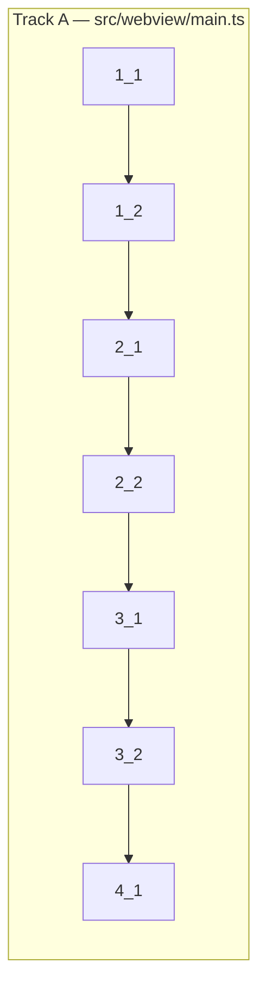

<!-- Dependency graph: a track is a sequential chain of tasks executed by one sub-agent. -->
<!-- Different tracks run as concurrent sub-agents. -->
<!-- All tasks are in a single track since they all modify the same file: src/webview/main.ts -->

## 1. Core Initialization

- [x] 1_1 Implement webview entry point with acquireVsCodeApi and ready handshake
  - **Track**: A
  - **Refs**: specs/xterm-init/spec.md#Webview-Entry-Point, docs/design/xterm-integration.md#§3, docs/design/message-protocol.md#§7
  - **Done**: `main.ts` acquires VS Code API, sets up message listener, sends `{ type: 'ready' }` on DOMContentLoaded. Build passes (`pnpm run compile`).
  - **Test**: N/A — bootstrap wiring, no testable logic without browser DOM
  - **Files**: `src/webview/main.ts`

- [x] 1_2 Implement terminal instance creation from init message with xterm.js + addons
  - **Track**: A
  - **Deps**: 1_1
  - **Refs**: specs/xterm-init/spec.md#Terminal-Instance-Creation, specs/xterm-init/spec.md#Terminal-Instance-Interface, docs/design/xterm-integration.md#§3-§6
  - **Done**: On receiving `init` message, creates xterm Terminal with config, loads FitAddon + WebLinksAddon, opens in container, fits, focuses. Terminal appears in webview.
  - **Test**: N/A — requires browser DOM + xterm.js rendering context
  - **Files**: `src/webview/main.ts`

## 2. Message Handling & Resize

- [x] 2_1 Implement full Extension→WebView message router (output, exit, tabCreated, tabRemoved, restore, configUpdate, viewShow, error)
  - **Track**: A
  - **Deps**: 1_2
  - **Refs**: specs/message-handler/spec.md#Extension-to-WebView-Message-Router, docs/design/message-protocol.md#§4
  - **Done**: All 9 Ext→WV message types handled correctly. Output writes to correct terminal. Config updates apply to all terminals. Exit displays styled message. tabCreated creates new terminal. tabRemoved disposes terminal.
  - **Test**: N/A — requires browser DOM; logic follows spec deterministically
  - **Files**: `src/webview/main.ts`

- [x] 2_2 Implement ResizeObserver with 100ms debounce and visibility-deferred resize
  - **Track**: A
  - **Deps**: 2_1
  - **Refs**: specs/resize-handler/spec.md, docs/design/resize-handling.md#§3-§5
  - **Done**: ResizeObserver attached to container. Debounced fit at 100ms. Zero-dimension containers skip fit (set pendingResize). viewShow triggers deferred fit. Resize message sent after fit.
  - **Test**: N/A — requires browser DOM + ResizeObserver API
  - **Files**: `src/webview/main.ts`

## 3. Theme, Input & Flow Control

- [x] 3_1 Implement theme manager (CSS variable reading, location-aware background, MutationObserver)
  - **Track**: A
  - **Deps**: 2_2
  - **Refs**: specs/theme-manager/spec.md, docs/design/theme-integration.md#§2-§6
  - **Done**: `getXtermTheme()` reads 20+ CSS variables. Location-aware background fallback works. MutationObserver on body class re-applies theme on switch. Theme applied at terminal creation time.
  - **Test**: N/A — requires browser DOM + getComputedStyle
  - **Files**: `src/webview/main.ts`

- [x] 3_2 Implement input handler (Cmd+C/V/K/A, bracketed paste, IME tracking) and ack batching
  - **Track**: A
  - **Deps**: 3_1
  - **Refs**: specs/input-handler/spec.md, specs/flow-control/spec.md, docs/design/keyboard-input.md#§2-§5
  - **Done**: `attachCustomKeyEventHandler` registered on each terminal. Cmd+C copies with selection / passes SIGINT without. Cmd+V pastes with bracketed paste support. Cmd+K clears. Cmd+A selects all. IME composition tracked. Ack batching sends ack after 5K chars written.
  - **Test**: N/A — requires browser DOM + clipboard API + xterm.js
  - **Files**: `src/webview/main.ts`

## 4. Final Integration

- [x] 4_1 Implement terminal lifecycle (tab switching, disposal) and verify build
  - **Track**: A
  - **Deps**: 3_2
  - **Refs**: specs/terminal-lifecycle/spec.md, docs/design/xterm-integration.md#§6-§7
  - **Done**: Tab switching via CSS display toggle works. Disposal cleans up terminal + container + map entry. Active tab switches to remaining on close. Build passes: `pnpm run compile && pnpm run check-types && pnpm run lint`.
  - **Test**: N/A — requires browser DOM; verified via build + manual testing
  - **Files**: `src/webview/main.ts`
