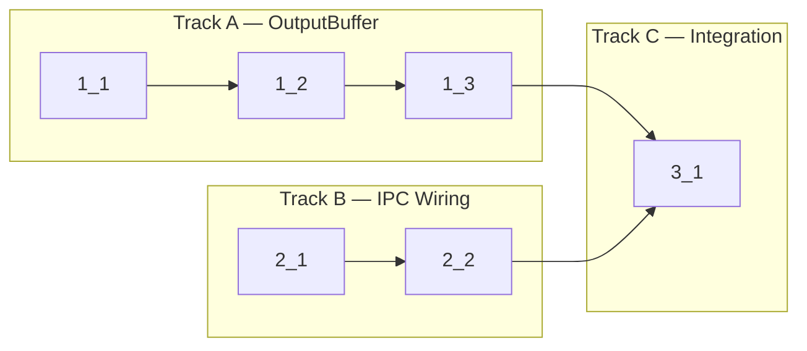

<!-- Dependency graph: Track A is OutputBuffer + PtySession, Track B is IPC wiring, Track C is integration -->
<!-- Different tracks run as concurrent sub-agents. -->
<!-- Every Deps entry MUST have a matching arrow in the graph, and vice versa. -->
<!-- Mermaid node IDs use `t` prefix (t1_1); labels show the task ID ("1_1"). -->

## 1. OutputBuffer + PtySession Flow Control

- [x] 1_1 Add pause() and resume() methods to PtySession
  - **Track**: A
  - **Refs**: `specs/ipc-wiring/spec.md#PtySession-Flow-Control-Exposure`; `src/pty/PtyManager.ts` (Pty interface lines 38-40)
  - **Done**: `PtySession` has `pause()` and `resume()` methods that delegate to `Pty.pause()`/`Pty.resume()`; no-op if process is not alive
  - **Test**: `src/pty/PtySession.test.ts` (unit) — add tests for pause/resume delegation
  - **Files**: `src/pty/PtySession.ts`, `src/pty/PtySession.test.ts`

- [x] 1_2 Create OutputBuffer class with output coalescing and flow control
  - **Track**: A
  - **Deps**: 1_1
  - **Refs**: `specs/output-buffer/spec.md#Output-Buffer-Coalescing`, `specs/output-buffer/spec.md#Flow-Control-via-Watermarks`, `specs/output-buffer/spec.md#OutputBuffer-Disposal`; `docs/design/output-buffering.md`
  - **Done**: OutputBuffer class exists at `src/session/OutputBuffer.ts` with append/flush/handleAck/dispose methods; 8ms timer flush, 64KB size flush, MAX_CHUNKS=100, 100K/5K watermarks, pause/resume; sizes measured in string `.length`; ack clamps unackedCharCount to >= 0; postMessage wrapped in try/catch
  - **Test**: `src/session/OutputBuffer.test.ts` (unit)
  - **Files**: `src/session/OutputBuffer.ts`

- [x] 1_3 Write unit tests for OutputBuffer
  - **Track**: A
  - **Deps**: 1_2
  - **Refs**: `specs/output-buffer/spec.md` (all scenarios)
  - **Done**: All scenarios from spec pass; tests cover: timer flush, size flush, MAX_CHUNKS flush, flow control pause/resume, ack clamping, dispose cleanup, postMessage error handling
  - **Test**: `src/session/OutputBuffer.test.ts` (unit)
  - **Files**: `src/session/OutputBuffer.test.ts`

## 2. IPC Wiring

- [x] 2_1 Wire TerminalViewProvider message handlers to PtySession and OutputBuffer
  - **Track**: B
  - **Refs**: `specs/ipc-wiring/spec.md` (all requirements); `docs/design/webview-provider.md#§8`
  - **Done**: `handleMessage` cases for `ready`, `input`, `resize`, `ack` are fully implemented (no TODO comments):
    - `ready`: spawns PTY + creates OutputBuffer + sends `init` with default config `{ fontSize: 14, cursorBlink: true, scrollback: 10000 }`
    - `input`: calls `ptySession.write()` (ignored if no session)
    - `resize`: calls `ptySession.resize()` (ignored if no session)
    - `ack`: calls `outputBuffer.handleAck()` (ignored if no buffer)
    - PTY exit: flushes buffer + sends exit message + disposes buffer
    - View dispose: kills PTY + disposes buffer
    - Spawn failure: sends error message + cleans up partial state
  - **Test**: N/A — integration logic tested via OutputBuffer unit tests + manual testing (task 1.8); message routing requires mocking VS Code API (deferred)
  - **Files**: `src/providers/TerminalViewProvider.ts`

- [x] 2_2 Update extension.ts entry point to support PTY integration
  - **Track**: B
  - **Deps**: 2_1
  - **Refs**: `docs/design/webview-provider.md#§2`
  - **Done**: `extension.ts` imports are clean; TerminalViewProvider constructor signature is consistent; `deactivate()` handles cleanup if needed
  - **Test**: N/A — config-only change to entry point wiring
  - **Files**: `src/extension.ts`

## 3. Integration

- [x] 3_1 Verify type check, lint, and unit tests pass
  - **Track**: C
  - **Deps**: 1_3, 2_2
  - **Refs**: `cyberk-flow/project.md#Commands`
  - **Done**: `pnpm run check-types` passes; `pnpm run lint` passes; `pnpm run test:unit` passes
  - **Test**: N/A — verification step
  - **Files**: —
