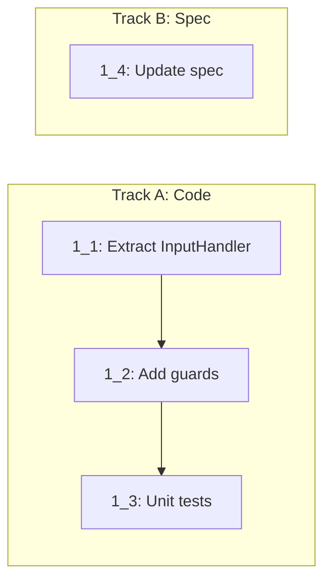

# Tasks: add-basic-clipboard

## 0. Spikes

_(none — LOW risk, no HIGH items)_

## 1. Clipboard Robustness & Tests

- [x] 1_1 Extract InputHandler to testable module
  - **Track**: A
  - **Refs**: `specs/clipboard-robustness/spec.md`, `docs/design/keyboard-input.md`
  - **Done**: `src/webview/InputHandler.ts` exports `createKeyEventHandler()` and `handlePaste()` with dependency injection. `main.ts` imports and wires real dependencies. `pnpm run check-types` passes.
  - **Test**: `src/webview/InputHandler.test.ts` (unit) — created in task 1_3
  - **Files**: `src/webview/InputHandler.ts` (new), `src/webview/main.ts` (modified)

- [x] 1_2 Add robustness guards to InputHandler
  - **Track**: A
  - **Deps**: 1_1
  - **Refs**: `specs/clipboard-robustness/spec.md`
  - **Done**: (1) Clipboard API availability check before paste, (2) `getSelection()` empty string guard, (3) Cmd+K sends `{ type: 'clear', tabId }` to extension, (4) empty clipboard (`readText` returns "") skips `terminal.paste()`, (5) Verified extension host `clear` handler exists in TerminalViewProvider.ts. `pnpm run check-types` passes.
  - **Test**: `src/webview/InputHandler.test.ts` (unit) — created in task 1_3
  - **Files**: `src/webview/InputHandler.ts`

- [x] 1_3 Add unit tests for InputHandler
  - **Track**: A
  - **Deps**: 1_2
  - **Refs**: `specs/input-handler-tests/spec.md`
  - **Done**: `src/webview/InputHandler.test.ts` passes with `pnpm run test:unit`. Covers: Cmd+C (with/without selection, empty selection), Cmd+V (available/unavailable/error clipboard), Cmd+K (clear + notification), Cmd+A, non-modifier passthrough, keyup ignored, IME composition guard.
  - **Test**: `src/webview/InputHandler.test.ts` — unit
  - **Files**: `src/webview/InputHandler.test.ts` (new)

- [x] 1_4 Update input-handler spec
  - **Track**: B
  - **Refs**: `specs/clipboard-robustness/spec.md`
  - **Done**: `cyberk-flow/specs/input-handler/spec.md` reflects: `terminal.paste()` native handling, clipboard API guard, getSelection guard, Cmd+K notification. `cf_validate` passes.
  - **Test**: N/A — spec-only change
  - **Files**: `cyberk-flow/specs/input-handler/spec.md`
