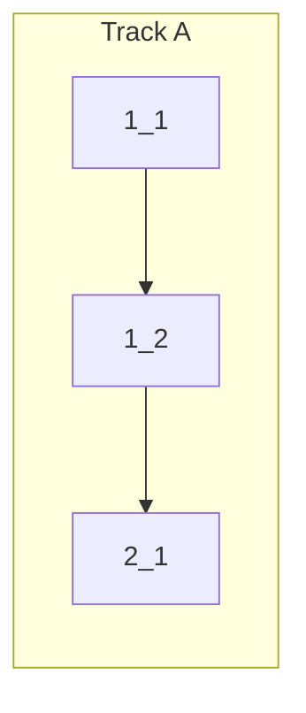

<!-- Dependency graph: a track is a sequential chain of tasks executed by one sub-agent. -->
<!-- Different tracks run as concurrent sub-agents. -->
<!-- This change is small enough for a single track. -->

## 1. Package Configuration

- [x] 1_1 Add panel view container, view, and activation event to package.json
  - **Track**: A
  - **Refs**: specs/view-registration/spec.md#Panel-View-Container, #Panel-Webview-View, #Panel-Activation-Event
  - **Done**: `package.json` contains `viewsContainers.panel` with id `anywhereTerminalPanel`, `views.anywhereTerminalPanel` with id `anywhereTerminal.panel` (type `webview`), and `activationEvents` includes `onView:anywhereTerminal.panel`
  - **Test**: N/A — config-only (validated by `pnpm run check-types` and manual load)
  - **Files**: `package.json`

- [x] 1_2 Register panel TerminalViewProvider instance in extension.ts
  - **Track**: A
  - **Deps**: 1_1
  - **Refs**: specs/view-registration/spec.md#Panel-Provider-Registration
  - **Done**: `extension.ts` creates a second `TerminalViewProvider` with `location: "panel"`, registers it for `TerminalViewProvider.panelViewType` with `retainContextWhenHidden: true`, and pushes disposable to `context.subscriptions`
  - **Test**: N/A — registration wiring (validated by `pnpm run check-types`; functional behavior already covered by existing TerminalViewProvider tests)
  - **Files**: `src/extension.ts`

## 2. Verification

- [x] 2_1 Run type check and lint to verify changes
  - **Track**: A
  - **Deps**: 1_2
  - **Refs**: project.md#Commands
  - **Done**: `pnpm run check-types` and `pnpm run lint` pass with zero errors
  - **Test**: N/A — verification step
  - **Files**: _(none — read-only verification)_
