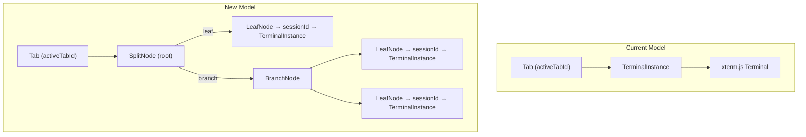
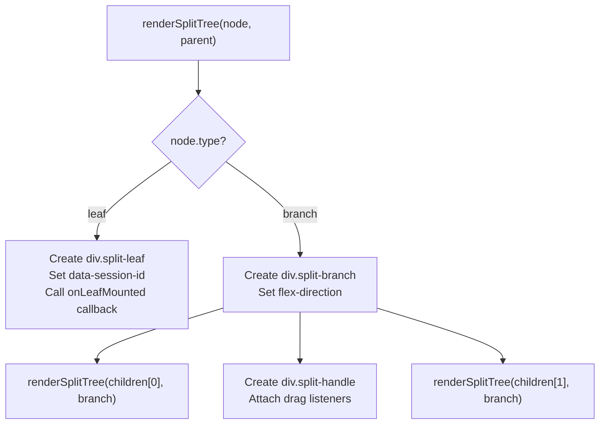
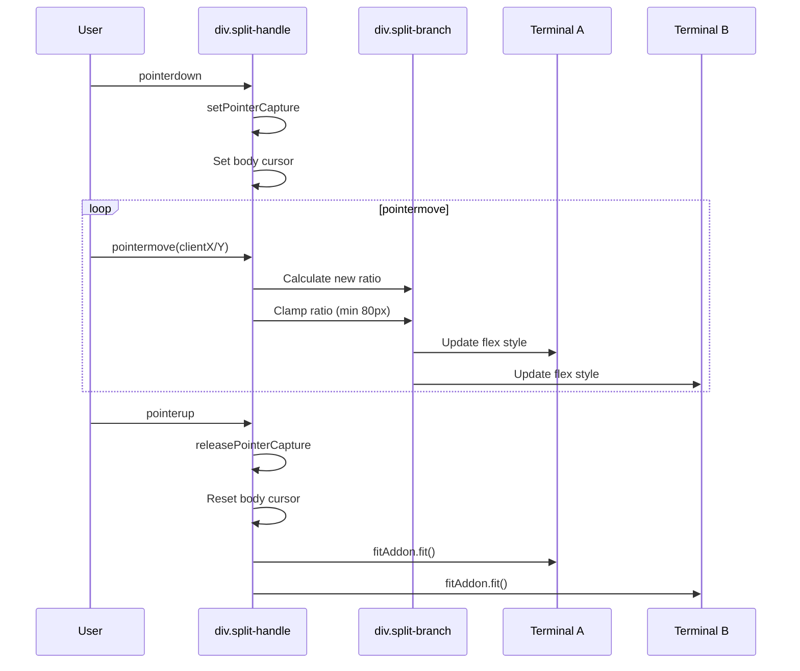

# Design: split-layout-core

## Architecture Decisions

### 1. Binary Split Tree as Discriminated Union

The split layout uses a TypeScript discriminated union (`type: 'leaf' | 'branch'`) rather than a class hierarchy. This enables:
- Simple JSON serialization (no class instances)
- Pattern matching via `switch(node.type)`
- Immutable tree operations (return new tree on mutation)

### 2. Integration with Existing Tab Model



- The existing `terminals: Map<string, TerminalInstance>` remains the source of truth for terminal instances
- A new `tabLayouts: Map<string, SplitNode>` maps each tab to its layout tree root
- `LeafNode.sessionId` references into the `terminals` map
- Single-terminal tabs have a simple `LeafNode` root (backward compatible)

### 3. Rendering Strategy



The renderer is a pure function that takes a `SplitNode` and a parent element, recursively building the DOM. Terminal attachment happens via the `onLeafMounted` callback — the caller (main.ts) moves the terminal's container div into the leaf element.

### 4. Resize Handle Drag Flow



### 5. File Structure

```
src/webview/
├── SplitModel.ts          # SplitNode types + tree utility functions
├── SplitContainer.ts      # renderSplitTree + DOM rendering
├── SplitResizeHandle.ts   # Drag-to-resize logic
├── SplitModel.test.ts     # Unit tests for tree operations
├── SplitContainer.test.ts # Unit tests for rendering
├── SplitResizeHandle.test.ts # Unit tests for resize logic
└── main.ts                # Integration point (modified)
```

## Risk Map

| Component | Risk | Mitigation |
|---|---|---|
| SplitModel (data model) | LOW | Pure functions, easy to test |
| SplitContainer (rendering) | MEDIUM | Recursive DOM manipulation; test with JSDOM |
| SplitResizeHandle (drag) | MEDIUM | Pointer events + ratio math; test calculation logic separately |
| main.ts integration | MEDIUM | Careful integration — add `tabLayouts` map alongside existing `terminals` map |

**Overall change risk: MEDIUM** — No HIGH risk items, no spikes needed.
