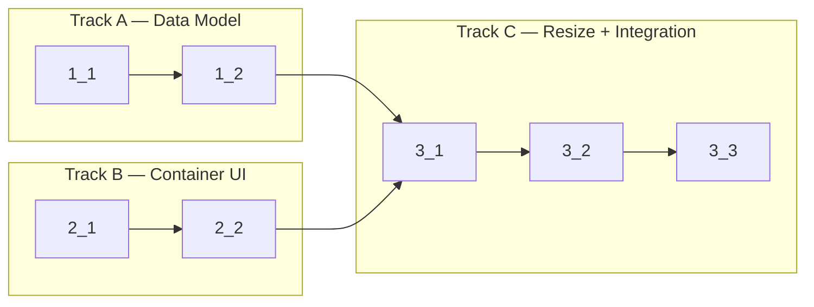

<!-- Dependency graph: a track is a sequential chain of tasks executed by one sub-agent. -->
<!-- Different tracks run as concurrent sub-agents. -->
<!-- A track may contain tasks from different sections. -->
<!-- Spikes (0_x) run before the graph and are NOT included in it. -->
<!-- If any 0_x spikes exist, complete ALL spikes before starting any track. -->
<!-- Every Deps entry MUST have a matching arrow in the graph, and vice versa. -->
<!-- Mermaid node IDs use `t` prefix (t1_1); labels show the task ID ("1_1"). -->

## 1. Split Layout Data Model

- [x] 1_1 Implement SplitNode types and tree utility functions
  - **Track**: A
  - **Refs**: specs/split-layout-data-model/spec.md#SplitNode-Discriminated-Union, specs/split-layout-data-model/spec.md#Layout-Tree-Utility-Functions
  - **Done**: `SplitNode`, `LeafNode`, `BranchNode` types exported; `createLeaf`, `createBranch`, `findLeaf`, `getAllSessionIds`, `replaceNode` functions implemented; `replaceNode` returns the original tree unchanged when `targetSessionId` is not found
  - **Test**: src/webview/SplitModel.test.ts (unit)
  - **Files**: src/webview/SplitModel.ts

- [x] 1_2 Add unit tests for SplitModel tree operations
  - **Track**: A
  - **Deps**: 1_1
  - **Refs**: specs/split-layout-data-model/spec.md#Layout-Tree-Utility-Functions, specs/split-layout-data-model/spec.md#Layout-Tree-State-Storage
  - **Done**: Tests cover: createLeaf, createBranch with default/custom ratio, findLeaf (found/not-found), getAllSessionIds (flat/nested), replaceNode (root/nested/not-found returns original), JSON serialization round-trip (serialize → parse → deep equal); all pass with `pnpm run test:unit`
  - **Test**: src/webview/SplitModel.test.ts (unit)
  - **Files**: src/webview/SplitModel.test.ts

## 2. Split Container UI

- [x] 2_1 Implement SplitContainer recursive renderer
  - **Track**: B
  - **Refs**: specs/split-container-ui/spec.md#SplitContainer-Recursive-Renderer, specs/split-container-ui/spec.md#Flexbox-Split-Layout-CSS, design.md#Rendering-Strategy
  - **Done**: `renderSplitTree(node, parent, callbacks)` creates correct DOM structure: `div.split-leaf` for leaves with `data-session-id`, `div.split-branch` with correct `flex-direction` for branches, resize handle divs with `data-direction` attribute and `flex: 0 0 4px` between children; flex ratios applied correctly to children
  - **Test**: src/webview/SplitContainer.test.ts (unit)
  - **Files**: src/webview/SplitContainer.ts

- [x] 2_2 Add unit tests for SplitContainer rendering
  - **Track**: B
  - **Deps**: 2_1
  - **Refs**: specs/split-container-ui/spec.md#SplitContainer-Recursive-Renderer, specs/split-container-ui/spec.md#Flexbox-Split-Layout-CSS
  - **Done**: Tests cover: single leaf rendering (div.split-leaf with data-session-id), branch with two leaves (div.split-branch + handle + children), nested branches (3-deep), correct flex-direction for horizontal (column) / vertical (row), correct flex ratios, handle attributes (data-direction, 4px size, flex: 0 0 4px), onLeafMounted callback invocation with correct sessionId and container; all pass with `pnpm run test:unit`
  - **Test**: src/webview/SplitContainer.test.ts (unit)
  - **Files**: src/webview/SplitContainer.test.ts

## 3. Resize Handles & Integration

- [x] 3_1 Implement drag-to-resize handle logic
  - **Track**: C
  - **Deps**: 1_2, 2_2
  - **Refs**: specs/split-resize-handles/spec.md#Drag-to-Resize-Handle, specs/split-resize-handles/spec.md#Pointer-Based-Drag-Resize, specs/split-resize-handles/spec.md#Minimum-Pane-Size-Constraint, specs/split-resize-handles/spec.md#Cursor-Feedback-on-Resize-Handle, specs/split-resize-handles/spec.md#Re-fit-Terminals-After-Resize, design.md#Resize-Handle-Drag-Flow
  - **Done**: `attachResizeHandle(handle, branchEl, direction, callbacks)` function: captures pointer via `setPointerCapture` on pointerdown, calculates ratio from pointer position relative to branch bounds, clamps to min 80px per child, updates flex styles on children during drag, sets body cursor (`col-resize`/`row-resize`) during drag, releases capture and resets cursor on both `pointerup` AND `pointercancel`, calls `onRatioChange(newRatio)` callback after drag ends, calls `onResizeComplete()` callback to trigger re-fit of all affected leaf terminals
  - **Test**: src/webview/SplitResizeHandle.test.ts (unit)
  - **Files**: src/webview/SplitResizeHandle.ts

- [x] 3_2 Add unit tests for resize handle logic
  - **Track**: C
  - **Deps**: 3_1
  - **Refs**: specs/split-resize-handles/spec.md#Pointer-Based-Drag-Resize, specs/split-resize-handles/spec.md#Minimum-Pane-Size-Constraint, specs/split-resize-handles/spec.md#Re-fit-Terminals-After-Resize
  - **Done**: Tests cover: ratio calculation for vertical drag (clientX-based), ratio calculation for horizontal drag (clientY-based), minimum size clamping for first child (ratio >= 80/containerSize), minimum size clamping for second child (ratio <= (containerSize-80)/containerSize), cursor style applied to body during drag, cursor reset on pointerup, cursor reset on pointercancel, onRatioChange callback invoked with correct ratio, onResizeComplete callback invoked after drag ends; all pass with `pnpm run test:unit`
  - **Test**: src/webview/SplitResizeHandle.test.ts (unit)
  - **Files**: src/webview/SplitResizeHandle.test.ts

- [x] 3_3 Integrate split layout into main.ts with state persistence and CSS
  - **Track**: C
  - **Deps**: 3_2
  - **Refs**: specs/split-layout-data-model/spec.md#Layout-Tree-State-Storage, specs/split-container-ui/spec.md#Per-Leaf-Terminal-Fitting, design.md#Integration-with-Existing-Tab-Model
  - **Done**: `main.ts` imports SplitModel, SplitContainer, SplitResizeHandle; adds `tabLayouts: Map<string, SplitNode>` state; `createTerminal` initializes leaf layout for new tabs; `switchTab` re-renders split tree and calls debounced `fitAddon.fit()` on all visible leaf terminals; layout state serialized to `vscode.setState()` on every layout change and restored from `vscode.getState()` on init (with fallback to single leaf if state is missing/malformed); CSS styles for `.split-branch`, `.split-leaf`, `.split-handle` added with correct flexbox rules; existing single-terminal tabs work unchanged (backward compatible — leaf-only tree); type check passes (`pnpm run check-types`); lint passes (`pnpm run lint`); existing unit tests still pass (`pnpm run test:unit`)
  - **Test**: N/A — integration wiring verified by type check + lint + existing tests still pass
  - **Files**: src/webview/main.ts, src/webview/split.css
