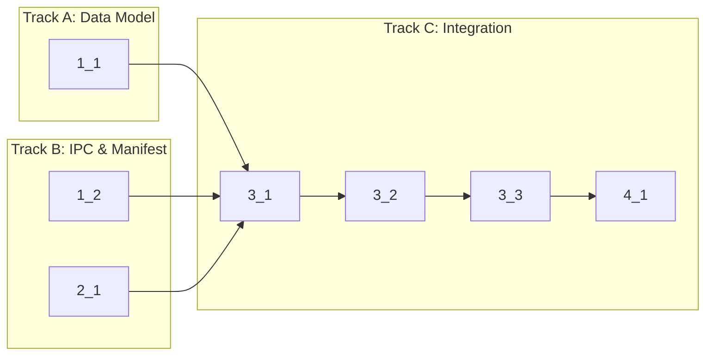

<!-- Dependency graph: a track is a sequential chain of tasks executed by one sub-agent. -->
<!-- Different tracks run as concurrent sub-agents. -->
<!-- A track may contain tasks from different sections. -->
<!-- Spikes (0_x) run before the graph and are NOT included in it. -->
<!-- If any 0_x spikes exist, complete ALL spikes before starting any track. -->
<!-- Every Deps entry MUST have a matching arrow in the graph, and vice versa. -->
<!-- Mermaid node IDs use `t` prefix (t1_1); labels show the task ID ("1_1"). -->

## 1. Data Model & IPC Types

- [x] 1_1 Add `removeLeaf` operation to SplitModel
  - **Track**: A
  - **Refs**: specs/split-model-remove/spec.md#Layout-Tree-Utility-Functions
  - **Done**: `removeLeaf` returns sibling when leaf removed from branch, returns null for last leaf, returns original tree for non-existent leaf. All 4 scenarios pass.
  - **Test**: src/webview/__tests__/SplitModel.test.ts (unit)
  - **Files**: src/webview/SplitModel.ts

- [x] 1_2 Add split IPC message types to messages.ts
  - **Track**: B
  - **Refs**: specs/split-ipc-messages/spec.md
  - **Done**: `SplitPaneMessage`, `SplitPaneCreatedMessage`, `CloseSplitPaneMessage` added to `ExtensionToWebViewMessage`; `RequestSplitSessionMessage`, `RequestCloseSplitPaneMessage` added to `WebViewToExtensionMessage`. Type check passes.
  - **Test**: N/A — type definitions only, validated by type checker
  - **Files**: src/types/messages.ts

## 2. Package Manifest

- [x] 2_1 Declare split commands, keybindings, and menu entries in package.json
  - **Track**: B
  - **Refs**: specs/split-commands/spec.md#Split-Commands-in-Package-Manifest, specs/split-commands/spec.md#Split-Keyboard-Shortcuts, specs/split-ui-controls/spec.md#Split-Action-Buttons-in-View-Title
  - **Done**: `anywhereTerminal.splitHorizontal`, `anywhereTerminal.splitVertical`, `anywhereTerminal.closeSplitPane` declared in commands. Keybindings for Cmd+\/Cmd+Shift+\ with `when` clause. Menu entries in `view/title` with codicon icons. `activationEvents` updated.
  - **Test**: N/A — config-only, validated by VS Code extension host
  - **Files**: package.json

## 3. Extension Host & WebView Integration

- [x] 3_1 Register split commands in extension.ts and handle split IPC in TerminalViewProvider
  - **Track**: C
  - **Deps**: 1_1, 1_2, 2_1
  - **Refs**: specs/split-commands/spec.md#Split-Horizontal-Command, specs/split-commands/spec.md#Split-Vertical-Command, specs/split-commands/spec.md#Close-Split-Pane-Command, specs/split-ipc-messages/spec.md#RequestSplitSession, specs/split-ipc-messages/spec.md#SplitPaneCreated, specs/split-ipc-messages/spec.md#RequestCloseSplitPane
  - **Done**: 3 commands registered in extension.ts. TerminalViewProvider handles `requestSplitSession` (creates session, sends `splitPaneCreated`) and `requestCloseSplitPane` (destroys session, sends `tabRemoved`). Type check passes.
  - **Test**: N/A — integration wiring, validated by type checker and manual testing
  - **Files**: src/extension.ts, src/providers/TerminalViewProvider.ts

- [x] 3_2 Handle split messages in webview main.ts (split/unsplit logic)
  - **Track**: C
  - **Deps**: 3_1
  - **Refs**: specs/split-ipc-messages/spec.md#SplitPane, specs/split-ipc-messages/spec.md#SplitPaneCreated, specs/split-ipc-messages/spec.md#CloseSplitPane, specs/split-model-remove/spec.md
  - **Done**: `handleMessage` handles `splitPane` (sends `requestSplitSession`), `splitPaneCreated` (creates terminal, updates split tree via `replaceNode`/`createBranch`, re-renders), `closeSplitPane` (removes leaf via `removeLeaf`, destroys terminal, sends `requestCloseSplitPane`, re-renders). Single-pane close falls back to tab close. Type check passes.
  - **Test**: N/A — DOM integration, validated by type checker
  - **Files**: src/webview/main.ts

- [x] 3_3 Implement focus management in webview (activePaneId, click-to-focus, visual indicator, tab bar update)
  - **Track**: C
  - **Deps**: 3_2
  - **Refs**: specs/split-focus-management/spec.md
  - **Done**: `activePaneId` state tracked per tab. Click on `.split-leaf` updates `activePaneId` and calls `terminal.focus()`. `.active-pane` CSS class applied to active leaf (only when 2+ panes). Tab bar shows active pane's session name. Focus updates on split/unsplit. CSS for `.split-leaf.active-pane` added to split.css. `activePaneId` persisted/restored via `vscode.setState()`/`getState()` with fallback to first leaf if stored pane no longer exists. Edge cases handled: stale `activePaneId` after restore, close of last pane falls back to tab close.
  - **Test**: N/A — DOM/CSS integration, validated by type checker
  - **Files**: src/webview/main.ts, src/webview/SplitContainer.ts, src/webview/split.css

## 4. Verification

- [x] 4_1 Verify type check, lint, and unit tests pass
  - **Track**: C
  - **Deps**: 3_3
  - **Refs**: project.md#Commands
  - **Done**: `pnpm run check-types` passes. `pnpm run lint` passes. `pnpm run test:unit` passes (including new SplitModel.removeLeaf tests).
  - **Test**: N/A — verification task
  - **Files**: N/A
