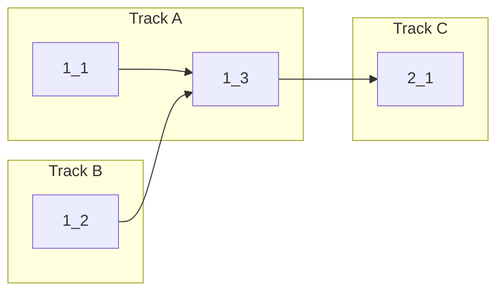

<!-- Dependency graph: a track is a sequential chain of tasks executed by one sub-agent. -->
<!-- Different tracks run as concurrent sub-agents. -->
<!-- A track may contain tasks from different sections. -->
<!-- Spikes (0_x) run before the graph and are NOT included in it. -->
<!-- If any 0_x spikes exist, complete ALL spikes before starting any track. -->
<!-- Every Deps entry MUST have a matching arrow in the graph, and vice versa. -->
<!-- Mermaid node IDs use `t` prefix (t1_1); labels show the task ID ("1_1"). -->

## 1. Edge Case Handling

- [x] 1_1 Add last-pane-close handling to create new default terminal when no tabs remain
  - **Track**: A
  - **Refs**: specs/split-integration-edge-cases/spec.md#Last-Pane-Close-Creates-New-Default-Terminal
  - **Done**: In `removeTerminal`, when no remaining tabs exist after removal, a `createTab` message is sent exactly once; guard against double-create if both close paths trigger; new terminal becomes active tab after `tabCreated` response
  - **Test**: src/webview/__tests__/splitIntegrationEdgeCases.test.ts (unit) — test cases: last tab removed sends createTab, second-to-last tab removed does NOT send createTab, closing last pane in single-pane tab triggers closeTab then createTab flow
  - **Files**: src/webview/main.ts

- [x] 1_2 Add unit tests for recursive split tree restructuring at 3+ depth levels
  - **Track**: B
  - **Refs**: specs/split-integration-edge-cases/spec.md#Recursive-Split-Tree-Restructuring
  - **Done**: Unit tests pass for: split→split→split→close inner panes (both left and right subtree removal); tree structure is correct after each removal; active pane updates to first remaining leaf
  - **Test**: src/webview/__tests__/splitIntegrationEdgeCases.test.ts (unit) — test cases: 3-level deep removeLeaf from left subtree, 3-level deep removeLeaf from right subtree, close all inner panes one by one until single leaf remains, verify getAllSessionIds returns correct IDs after each removal
  - **Files**: src/webview/SplitModel.ts (read-only verification), src/webview/__tests__/splitIntegrationEdgeCases.test.ts

- [x] 1_3 Verify view resize propagation to all split panes and layout persistence round-trip
  - **Track**: A
  - **Deps**: 1_1, 1_2
  - **Refs**: specs/split-integration-edge-cases/spec.md#View-Resize-Propagates-to-All-Split-Panes, specs/split-integration-edge-cases/spec.md#Split-Layout-Persists-Across-Hide-Show
  - **Done**: (Resize) debouncedFit calls fitAddon.fit() on all leaf terminals in active tab's split tree; (Persistence) persistLayoutState/restoreLayoutState round-trips correctly for nested trees with 3+ panes; malformed vscode.getState() returns empty map without crash; restored layout with stale session IDs is handled gracefully (stale pane IDs ignored)
  - **Test**: src/webview/__tests__/splitIntegrationEdgeCases.test.ts (unit) — test cases: persistence round-trip for 3-pane nested tree, malformed state fallback, stale session ID in restored active pane falls back to first leaf
  - **Files**: src/webview/main.ts

## 2. Verification

- [x] 2_1 Run type check, lint, and unit tests to verify all changes
  - **Track**: C
  - **Deps**: 1_3
  - **Refs**: project.md#Commands
  - **Done**: `pnpm run check-types` passes, `pnpm run lint` passes, `pnpm run test:unit` passes
  - **Test**: N/A — verification task
  - **Files**: N/A
