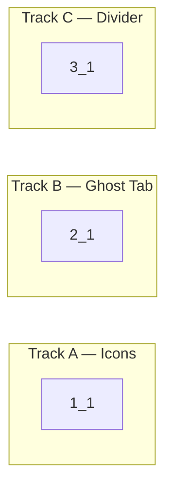

<!-- Dependency graph: a track is a sequential chain of tasks executed by one sub-agent. -->
<!-- Different tracks run as concurrent sub-agents. -->
<!-- All 3 bugs are independent — they can be fixed in parallel tracks. -->
<!-- Mermaid node IDs use `t` prefix (t1_1); labels show the task ID ("1_1"). -->

## 1. Fix Split Button Icons

- [x] 1_1 Swap split command icon assignments in package.json
  - **Track**: A
  - **Refs**: specs/split-icon-fix/spec.md#Split-Action-Button-Icons
  - **Done**: `anywhereTerminal.splitHorizontal` has icon `$(split-horizontal)` and `anywhereTerminal.splitVertical` has icon `$(split-vertical)` in package.json. `pnpm run check-types` passes.
  - **Test**: N/A — config-only change (package.json icon field swap)
  - **Files**: package.json

## 2. Fix Ghost Tab for Split Pane Sessions

- [x] 2_1 Remove tabRemoved message from requestCloseSplitPane handler
  - **Track**: B
  - **Refs**: specs/split-ghost-tab-fix/spec.md#Split-Pane-Close-IPC
  - **Done**: `requestCloseSplitPane` handler in `TerminalViewProvider.ts` calls `destroySession()` but does NOT send `tabRemoved` message. The 3 lines sending `safePostMessage({ type: "tabRemoved", tabId: closeMsg.sessionId })` are removed. `pnpm run check-types` passes.
  - **Test**: N/A — removing incorrect IPC message; webview already handles pane removal internally via split layout tree in main.ts closeSplitPane handler
  - **Files**: src/providers/TerminalViewProvider.ts

## 3. Fix Invisible Split Divider

- [x] 3_1 Add visible separator styling for split handles via inline CSS in webviewHtml.ts
  - **Track**: C
  - **Refs**: specs/split-divider-visibility/spec.md#Split-Handle-Visual-Separator
  - **Done**: Split handle has visible 1px separator at rest using `--vscode-panel-border` as background. Handle shows hover feedback with `--vscode-sash-hoverBorder`. Styles are applied via inline `<style>` block in `webviewHtml.ts` (single source of truth — `split.css` is updated for consistency but is NOT loaded as a separate stylesheet). Both horizontal and vertical handle orientations are styled. `pnpm run check-types` passes.
  - **Test**: N/A — CSS-only styling change (inline styles in HTML template)
  - **Files**: src/providers/webviewHtml.ts, src/webview/split.css
