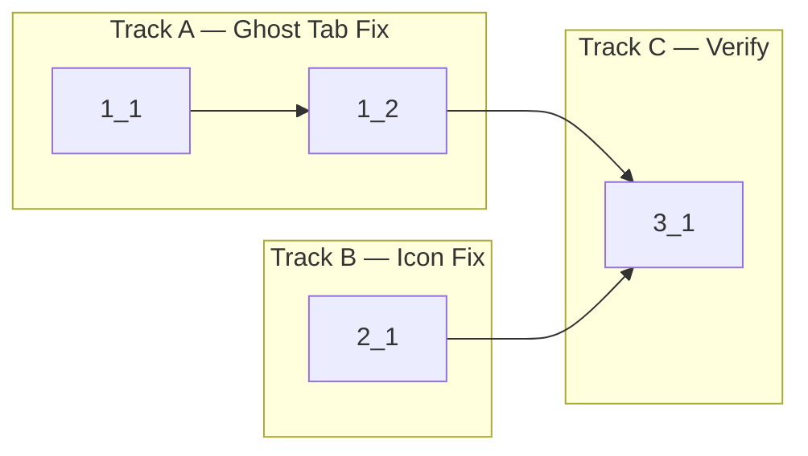

<!-- Dependency graph -->
<!-- Two independent bugs → two parallel tracks -->

## 1. Fix Ghost Tab for Split Pane Sessions

- [x] 1_1 Add `isSplitPane` flag to `TerminalSession` and `createSession()` method
  - **Track**: A
  - **Refs**: specs/ghost-tab-fix/spec.md#Split-Pane-Session-Filtering
  - **Done**: `TerminalSession` interface has `isSplitPane: boolean` field (default `false`). `createSession()` accepts optional `options?: { isSplitPane?: boolean }` parameter. When `isSplitPane: true`: session is marked as split pane, `isActive` is set to `false`, and existing sessions' active state is NOT changed. `getTabsForView()` filters out sessions where `isSplitPane === true`. Unit tests cover: default isSplitPane=false, split pane excluded from getTabsForView, split pane does not deactivate root tab.
  - **Test**: src/session/SessionManager.test.ts (unit)
  - **Files**: src/session/SessionManager.ts, src/session/SessionManager.test.ts

- [x] 1_2 Pass `isSplitPane: true` when creating split pane sessions in providers
  - **Track**: A
  - **Deps**: 1_1
  - **Refs**: specs/ghost-tab-fix/spec.md#Split-Pane-Session-Filtering
  - **Done**: `requestSplitSession` handler in `TerminalViewProvider.ts` calls `createSession(viewId, webview, { isSplitPane: true })`. Ghost tabs no longer appear when webview re-initializes after split.
  - **Test**: src/providers/TerminalViewProvider.test.ts (unit) — verify split session creation passes isSplitPane flag
  - **Files**: src/providers/TerminalViewProvider.ts, src/providers/TerminalViewProvider.test.ts

## 2. Fix Split Button Icons

- [x] 2_1 Swap split command icon assignments in package.json
  - **Track**: B
  - **Refs**: specs/split-icon-fix/spec.md#Split-Action-Button-Icons
  - **Done**: `anywhereTerminal.splitVertical` has icon `$(split-horizontal)` and `anywhereTerminal.splitHorizontal` has icon `$(split-vertical)` in package.json.
  - **Test**: N/A — config-only change (package.json icon field swap)
  - **Files**: package.json

## 3. Verification

- [x] 3_1 Run type check and unit tests
  - **Track**: C
  - **Deps**: 1_2, 2_1
  - **Refs**: project.md § Commands
  - **Done**: `pnpm run check-types` passes. `pnpm run test:unit` passes.
  - **Test**: N/A — verification step
  - **Files**: (none)
