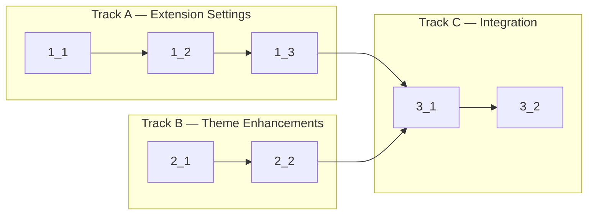

<!-- Dependency graph: a track is a sequential chain of tasks executed by one sub-agent. -->
<!-- Different tracks run as concurrent sub-agents. -->
<!-- A track may contain tasks from different sections. -->
<!-- Every Deps entry MUST have a matching arrow in the graph, and vice versa. -->
<!-- Mermaid node IDs use `t` prefix (t1_1); labels show the task ID ("1_1"). -->

## 1. Extension Settings

- [x] 1_1 Define `contributes.configuration` schema in package.json and extend TerminalConfig interface
  - **Track**: A
  - **Refs**: specs/extension-settings/spec.md#settings-schema, specs/extension-settings/spec.md#terminal-config-interface
  - **Done**: `package.json` has `contributes.configuration` with all 7 settings including descriptions and defaults; `TerminalConfig` in `src/types/messages.ts` includes `fontFamily: string` field
  - **Test**: N/A — config-only (schema validated by VS Code at runtime)
  - **Files**: `package.json`, `src/types/messages.ts`

- [x] 1_2 Create settings reader module with font/shell/cwd resolution chains
  - **Track**: A
  - **Deps**: 1_1
  - **Refs**: specs/extension-settings/spec.md#settings-reader, docs/design/theme-integration.md#§5
  - **Done**: `readTerminalSettings()` returns resolved config with correct fallback precedence; font size clamped [6,100]; font family falls through chain; shell/cwd resolution works; invalid/missing values produce safe defaults
  - **Test**: `src/settings/SettingsReader.test.ts` (unit) — test font size clamping, all fallback chains (extension → terminal.integrated → editor → default), empty vs configured values, invalid value handling
  - **Files**: `src/settings/SettingsReader.ts`, `src/settings/SettingsReader.test.ts`

- [x] 1_3 Wire `onDidChangeConfiguration` listener in extension.ts and replace hardcoded config in providers
  - **Track**: A
  - **Deps**: 1_2
  - **Refs**: specs/extension-settings/spec.md#settings-change-listener, specs/extension-settings/spec.md#settings-replace-hardcoded
  - **Done**: Config changes push `configUpdate` to ALL active webviews (sidebar, panel, editor); unrelated config changes do NOT trigger updates; `onReady()` in both providers uses `readTerminalSettings()` instead of hardcoded values; `createSession()` uses configured shell/args/cwd; existing location-aware background behavior is preserved (no regression)
  - **Test**: `src/settings/SettingsReader.test.ts` (unit) — verify `affectsConfiguration` filtering logic, verify resolved config structure
  - **Files**: `src/extension.ts`, `src/providers/TerminalViewProvider.ts`, `src/providers/TerminalEditorProvider.ts`

## 2. Theme Enhancements

- [x] 2_1 Add high-contrast theme detection and dynamic `minimumContrastRatio`
  - **Track**: B
  - **Refs**: specs/advanced-theme/spec.md#high-contrast-support, docs/design/theme-integration.md#§4
  - **Done**: High-contrast themes detected via body class (`vscode-high-contrast`, `vscode-high-contrast-light`); `minimumContrastRatio` set to 7 for HC themes, 4.5 for normal; theme re-application on switch works; existing location-aware background and ANSI color reading are NOT regressed
  - **Test**: N/A — webview DOM code not unit-testable without browser environment; verified by manual theme switching
  - **Files**: `src/webview/main.ts`

- [x] 2_2 Add `fontFamily` handling to webview `applyConfig()` and `createTerminal()`
  - **Track**: B
  - **Deps**: 2_1
  - **Refs**: specs/advanced-theme/spec.md#font-config-application
  - **Done**: `applyConfig()` applies `fontFamily` and re-fits all terminals; `createTerminal()` uses `config.fontFamily` with CSS variable fallback; empty fontFamily falls back to `--vscode-editor-font-family` CSS var → 'monospace'; `currentConfig` updated with fontFamily for future tab creation
  - **Test**: N/A — webview DOM code; verified by manual config change
  - **Files**: `src/webview/main.ts`

## 3. Integration

- [x] 3_1 Wire settings reader into SessionManager.createSession for shell/args/cwd and verify end-to-end config flow
  - **Track**: C
  - **Deps**: 1_3, 2_2
  - **Refs**: specs/extension-settings/spec.md#settings-reader, specs/extension-settings/spec.md#settings-change-listener
  - **Done**: New terminals use configured shell/args/cwd from settings; SessionManager.createSession accepts optional shell/args/cwd overrides; config changes propagate to webview and apply to both existing and new terminals; `pnpm run check-types` passes
  - **Test**: `src/settings/SettingsReader.test.ts` (unit) — integration-level assertions on full config resolution
  - **Files**: `src/session/SessionManager.ts`, `src/pty/PtyManager.ts`

- [x] 3_2 Run full verification suite (type-check, lint, unit tests)
  - **Track**: C
  - **Deps**: 3_1
  - **Refs**: cyberk-flow/project.md#Commands
  - **Done**: `pnpm run check-types` exits 0; `pnpm run lint` exits 0; `pnpm run test:unit` exits 0
  - **Test**: N/A — this IS the verification task
  - **Files**: N/A
