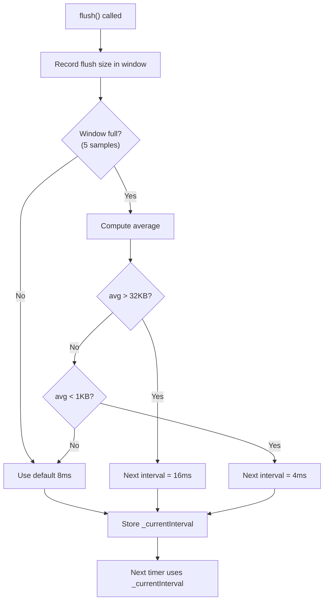
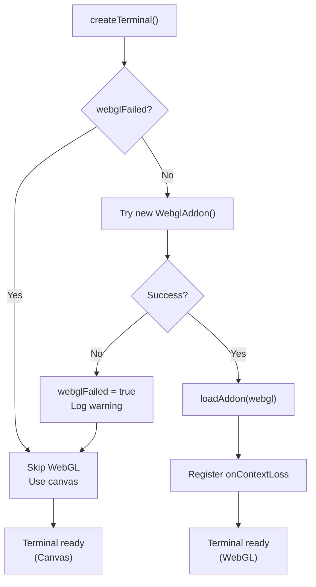
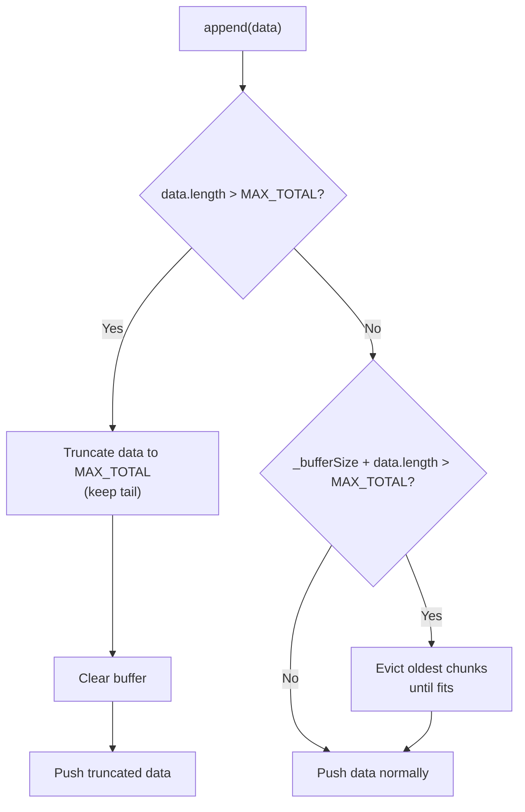

# Design: optimize-performance

## Architecture Decisions

### 1. Adaptive Buffering — Throughput Window

**Decision**: Use a fixed-size rolling window (array of last 5 flush sizes) to compute average throughput.

**Rationale**: Simple, O(1) amortized, no external dependencies. A sliding window of 5 samples provides enough smoothing to avoid oscillation while responding quickly to throughput changes. The window is reset on dispose.

**Alternative considered**: Exponential moving average (EMA). Rejected because the discrete interval tiers (4/8/16ms) don't benefit from continuous smoothing — a simple average over recent flushes is sufficient.

### 2. WebGL Failure Tracking — Module-Level Variable

**Decision**: Use a module-level `let webglFailed = false` in `main.ts` rather than a class or singleton.

**Rationale**: The webview has a single entry point (`main.ts`) with module-scoped state. A module variable is the simplest mechanism and matches the existing pattern (e.g., `activeTabId`, `currentConfig`). No class needed since there's no instance lifecycle to manage.

### 3. Buffer Overflow — FIFO Eviction

**Decision**: Evict oldest chunks from the front of `_chunks[]` when total exceeds 1MB cap.

**Rationale**: Consistent with the scrollback cache eviction pattern in `SessionManager.appendToScrollback()`. Oldest data is least valuable for terminal display. The 1MB cap is generous — flow control (100K high watermark) normally prevents buffer growth beyond ~100KB. The cap is a safety net for edge cases (e.g., paused output accumulation).

### 4. Memory Metrics — Read-Only Accessors

**Decision**: Expose `bufferSize` as a getter on OutputBuffer; add `getMemoryMetrics()` to SessionManager.

**Rationale**: Non-invasive, zero overhead when not called. Useful for debugging and future telemetry. No continuous monitoring — metrics are computed on demand.

## Risk Map

| Component | Risk | Level | Mitigation |
|---|---|---|---|
| Adaptive flush interval | Interval oscillation under bursty workloads | MEDIUM | 5-sample window smooths bursts; bounded range [4,16]ms; unit tests for edge cases |
| WebGL static flag | Flag persists even if WebGL becomes available again | LOW | Acceptable — WebGL failures are typically permanent (driver issues). Webview reload resets flag. |
| Buffer overflow eviction | Data loss during eviction | LOW | 1MB cap is 10x the flow control high watermark; eviction only triggers in extreme edge cases |
| Memory metrics iteration | Performance of iterating all sessions | LOW | Typically <10 sessions; O(n) with n small |

**Overall change risk**: MEDIUM (highest item is adaptive interval oscillation)

## Interface Sketches

### Adaptive Buffering — Interval Selection

### WebGL Initialization Flow

### Buffer Overflow Protection

