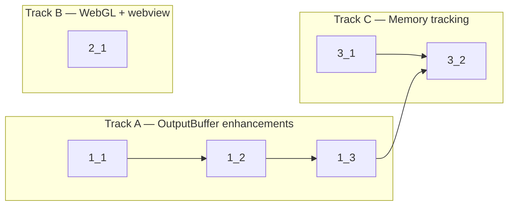

<!-- Dependency graph: a track is a sequential chain of tasks executed by one sub-agent. -->
<!-- Different tracks run as concurrent sub-agents. -->
<!-- A track may contain tasks from different sections. -->
<!-- Every Deps entry MUST have a matching arrow in the graph, and vice versa. -->
<!-- Mermaid node IDs use `t` prefix (t1_1); labels show the task ID ("1_1"). -->

## 1. Output Buffer Enhancements

- [x] 1_1 Add adaptive flush interval to OutputBuffer
  - **Track**: A
  - **Refs**: specs/adaptive-buffering/spec.md#Adaptive-Flush-Interval; design.md#Adaptive-Buffering
  - **Done**: Unit tests pass for high/low/medium throughput scenarios; cold start uses 8ms default; existing flush triggers (64KB, 100 chunks) still work
  - **Test**: src/session/OutputBuffer.test.ts (unit)
  - **Files**: src/session/OutputBuffer.ts

- [x] 1_2 Add buffer overflow protection with FIFO eviction to OutputBuffer
  - **Track**: A
  - **Deps**: 1_1
  - **Refs**: specs/buffer-overflow-protection/spec.md#Output-Buffer-Size-Cap; design.md#Buffer-Overflow
  - **Done**: Unit tests pass for eviction when exceeding 1MB cap; single oversized chunk truncation works; normal operation unaffected
  - **Test**: src/session/OutputBuffer.test.ts (unit)
  - **Files**: src/session/OutputBuffer.ts

- [x] 1_3 Add bufferSize accessor to OutputBuffer
  - **Track**: A
  - **Deps**: 1_2
  - **Refs**: specs/memory-tracking/spec.md#OutputBuffer-Memory-Accessors
  - **Done**: `bufferSize` getter returns current `_bufferSize`; unit tests verify value before/after flush
  - **Test**: src/session/OutputBuffer.test.ts (unit)
  - **Files**: src/session/OutputBuffer.ts

## 2. WebGL Renderer Hardening

- [x] 2_1 Add static WebGL failure tracking and context loss recovery to webview
  - **Track**: B
  - **Refs**: specs/webgl-renderer-hardening/spec.md#WebGL-Static-Failure-Tracking; specs/webgl-renderer-hardening/spec.md#WebGL-Context-Loss-Recovery; design.md#WebGL-Initialization-Flow
  - **Done**: Module-level `webglFailed` flag prevents repeated WebGL init after failure; context loss sets flag and disposes addon; console warnings logged; existing canvas fallback preserved
  - **Test**: N/A — WebGL initialization is tightly coupled to browser APIs and xterm.js internals; not unit-testable in Vitest (no WebGL context). Verified by code review and manual testing.
  - **Files**: src/webview/main.ts

## 3. Memory Tracking

- [x] 3_1 Add MemoryMetrics interface and type definition
  - **Track**: C
  - **Refs**: specs/memory-tracking/spec.md#SessionManager-Memory-Metrics
  - **Done**: `MemoryMetrics` interface exported from types; includes sessionCount, totalBufferSize, totalScrollbackSize, per-session breakdown
  - **Test**: N/A — type-only change, verified by type check
  - **Files**: src/session/SessionManager.ts

- [x] 3_2 Add getMemoryMetrics() method to SessionManager
  - **Track**: C
  - **Deps**: 3_1, 1_3
  - **Refs**: specs/memory-tracking/spec.md#SessionManager-Memory-Metrics
  - **Done**: `getMemoryMetrics()` returns correct aggregate and per-session metrics; unit tests verify with 0 sessions and multiple sessions
  - **Test**: src/session/SessionManager.test.ts (unit)
  - **Files**: src/session/SessionManager.ts
