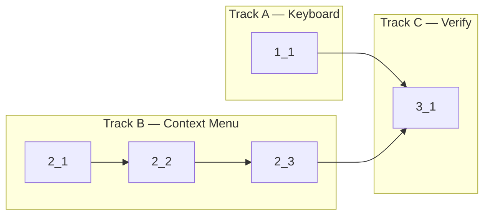

<!-- Dependency graph: a track is a sequential chain of tasks executed by one sub-agent. -->
<!-- Different tracks run as concurrent sub-agents. -->
<!-- A track may contain tasks from different sections. -->
<!-- Spikes (0_x) run before the graph and are NOT included in it. -->
<!-- If any 0_x spikes exist, complete ALL spikes before starting any track. -->
<!-- Every Deps entry MUST have a matching arrow in the graph, and vice versa. -->
<!-- Mermaid node IDs use `t` prefix (t1_1); labels show the task ID ("1_1"). -->

## 1. Escape Key Handling

- [x] 1_1 Add Escape key handling to `createKeyEventHandler()` and unit tests
  - **Track**: A
  - **Refs**: specs/escape-key-handling/spec.md#Custom-Key-Event-Handler
  - **Done**: Escape clears selection when present, passes through when no selection; 3 new test cases pass in InputHandler.test.ts (Escape+selection, Escape+no-selection, Escape+IME)
  - **Test**: src/webview/InputHandler.test.ts (unit)
  - **Files**: src/webview/InputHandler.ts, src/webview/InputHandler.test.ts

## 2. Context Menu

- [x] 2_1 Add context menu commands, contribution points, and message types
  - **Track**: B
  - **Refs**: specs/terminal-context-menu/spec.md#Context-Menu-Contribution-Points, specs/terminal-context-menu/spec.md#Context-Menu-Commands-Registration
  - **Done**: 6 new commands declared in package.json; 6 new `webview/context` entries with groups clipboard@1, terminal@2; existing split entries renumbered to group `split@3`; all new commands hidden from command palette; `ExtensionToWebViewMessage` union in messages.ts includes `ctxCopy`, `ctxPaste`, `ctxSelectAll`, `ctxClear` message types
  - **Test**: N/A — declarative JSON config + type definitions
  - **Files**: package.json, src/types/messages.ts

- [x] 2_2 Register context menu command handlers in extension.ts
  - **Track**: B
  - **Deps**: 2_1
  - **Refs**: specs/terminal-context-menu/spec.md#Context-Menu-Commands-Registration
  - **Done**: 6 commands registered; `ctx.copy/paste/selectAll/clearTerminal` send typed messages to visible webview via `postToVisibleWebview()`; `ctx.newTerminal` calls `doNewTerminal(getFocusedProvider())`; `ctx.killTerminal` calls `doKillTerminal(getFocusedProvider())`; `pnpm run check-types` passes
  - **Test**: N/A — integration wiring reusing existing helpers, verified by type check
  - **Files**: src/extension.ts

- [x] 2_3 Add webview message handlers for context menu clipboard/terminal operations
  - **Track**: B
  - **Deps**: 2_2
  - **Refs**: specs/terminal-context-menu/spec.md#Webview-Context-Menu-Message-Handlers
  - **Done**: `handleMessage()` handles `ctxCopy`, `ctxPaste`, `ctxSelectAll`, `ctxClear` on the active pane's terminal; `ctxCopy` copies selection to clipboard if present (no-op if no selection, matching Cmd+C behavior); `ctxPaste` reuses `handlePaste()` (handles clipboard unavailable/failure); `ctxSelectAll` calls `selectAll()`; `ctxClear` calls `clear()`; handles edge case of no active terminal gracefully (early return)
  - **Test**: N/A — thin message handler wiring in main.ts delegates to already-tested InputHandler functions; verified by type check
  - **Files**: src/webview/main.ts

## 3. Verification

- [x] 3_1 Run type check, lint, and unit tests to verify all changes
  - **Track**: C
  - **Deps**: 1_1, 2_3
  - **Refs**: project.md#Commands
  - **Done**: `pnpm run check-types` passes; `pnpm run lint` passes; `pnpm run test:unit` passes (including new Escape key tests)
  - **Test**: N/A — verification task
  - **Files**: N/A
