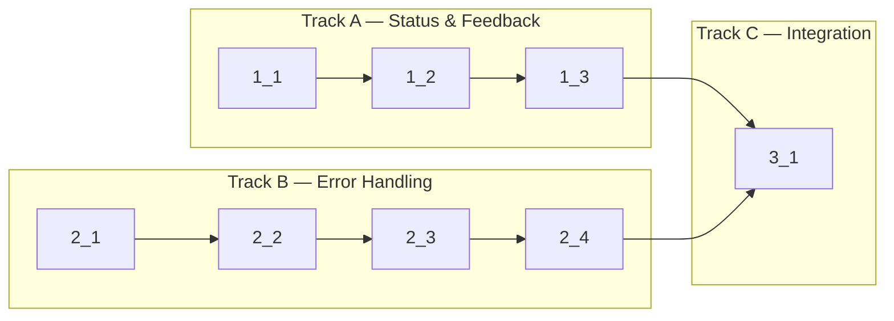

<!-- Dependency graph: a track is a sequential chain of tasks executed by one sub-agent. -->
<!-- Different tracks run as concurrent sub-agents. -->
<!-- Every Deps entry MUST have a matching arrow in the graph, and vice versa. -->
<!-- Mermaid node IDs use `t` prefix (t1_1); labels show the task ID ("1_1"). -->

## 1. Status & Feedback

- [x] 1_1 Add OSC title change listener to webview terminal instances and update tab names dynamically
  - **Track**: A
  - **Refs**: specs/process-title-tracking/spec.md#OSC-Title-Change-Handling
  - **Done**: `terminal.onTitleChange` listener added in `createTerminal()`. Updates `TerminalInstance.name` and calls `updateTabBar()`. Fallback: name stays "Terminal N" if no OSC title is emitted.
  - **Test**: src/webview/TabBar.test.ts (unit) — test that renderTabBar displays updated names
  - **Files**: src/webview/main.ts

- [x] 1_2 Add exited state to tab bar rendering with visual indicator CSS class and label suffix
  - **Track**: A
  - **Deps**: 1_1
  - **Refs**: specs/terminal-exit-indicator/spec.md#Tab-Visual-Exit-State, specs/terminal-exit-indicator/spec.md#Exit-State-in-Tab-Bar-Data
  - **Done**: `TabInfo` interface extended with `exited?: boolean`. `renderTabBar` applies `tab-exited` CSS class when `exited=true`. CSS rule: `.tab-exited .tab-name { opacity: 0.5; font-style: italic; }`. Tab bar in `main.ts` passes `exited` from `TerminalInstance.exited`. Tab label appends " (exited)" suffix when exited.
  - **Test**: src/webview/TabBar.test.ts (unit) — test tab-exited class applied and "(exited)" suffix shown when exited=true
  - **Files**: src/webview/TabBarUtils.ts, src/webview/main.ts, media/terminal.css

- [x] 1_3 Call updateTabBar after exit event to reflect exited state visually
  - **Track**: A
  - **Deps**: 1_2
  - **Refs**: specs/terminal-exit-indicator/spec.md#Tab-Visual-Exit-State
  - **Done**: In `handleMessage` case "exit", after setting `instance.exited = true` and writing exit message, `updateTabBar()` is called so the tab immediately shows the exited visual indicator.
  - **Test**: N/A — covered by 1_2 unit tests; the wiring is a single function call
  - **Files**: src/webview/main.ts

## 2. Error Handling

- [x] 2_1 Add error banner display function to webview and wire it to the "error" message handler
  - **Track**: B
  - **Refs**: specs/error-display/spec.md#Webview-Error-Banner
  - **Done**: `showErrorBanner(message, severity)` function creates a styled banner element in `#terminal-container`. Error=red bg, warn=amber bg, info=blue bg. Dismiss button removes banner. Info severity auto-dismisses after 5s. The `case "error"` in `handleMessage` calls `showErrorBanner` instead of only `console.error`.
  - **Test**: N/A — DOM rendering function, verified by manual testing
  - **Files**: src/webview/main.ts, media/terminal.css

- [x] 2_2 Wrap createTab and requestSplitSession handlers with try/catch to send error messages on spawn failure
  - **Track**: B
  - **Deps**: 2_1
  - **Refs**: specs/spawn-error-handling/spec.md#Graceful-PTY-Spawn-Failure
  - **Done**: `createTab` and `requestSplitSession` message handlers in `TerminalViewProvider` are wrapped in try/catch. On error, an `ErrorMessage` with `severity: "error"` is sent to the webview with a user-friendly description. Existing terminals remain unaffected.
  - **Test**: N/A — error paths require mocking node-pty spawn; covered by existing error type tests and manual verification
  - **Files**: src/providers/TerminalViewProvider.ts

- [x] 2_3 Add activation-time PtyLoadError handling with VS Code error notification
  - **Track**: B
  - **Deps**: 2_2
  - **Refs**: specs/spawn-error-handling/spec.md#node-pty-Load-Failure-Display
  - **Done**: In `extension.ts` `activate()`, wrap `loadNodePty()` call (if any early call exists) or ensure that when `createSession()` throws `PtyLoadError`, the provider calls `vscode.window.showErrorMessage()` with version requirement text. Extension does not crash on PtyLoadError.
  - **Test**: N/A — requires VS Code integration test environment; verified by code review
  - **Files**: src/extension.ts, src/providers/TerminalViewProvider.ts

- [x] 2_4 Implement safeSendWithRetry utility for transient postMessage failures
  - **Track**: B
  - **Deps**: 2_3
  - **Refs**: specs/retry-transient/spec.md#Retry-Wrapper-for-Transient-postMessage-Failures
  - **Done**: `safeSendWithRetry(webview, message, maxRetries=2)` async function retries postMessage with 50ms delay on throw or `false` resolution. Returns boolean. Used in critical message paths: `init`, `tabCreated`, `splitPaneCreated`, `error` messages.
  - **Test**: src/providers/TerminalViewProvider.test.ts (unit) — test retry logic with mock webview returning false then true
  - **Files**: src/providers/TerminalViewProvider.ts

## 3. Integration

- [x] 3_1 Verify all status feedback and error handling features work together
  - **Track**: C
  - **Deps**: 1_3, 2_4
  - **Refs**: All specs
  - **Done**: `pnpm run check-types` passes. `pnpm run lint` passes. `pnpm run test:unit` passes.
  - **Test**: N/A — integration verification task
  - **Files**: N/A
