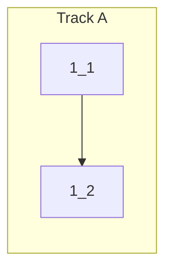

## 1. Cmd+Delete Kill Line Shortcut

- [x] 1_1 Add `case "backspace"` to `createKeyEventHandler` switch to send `\x15` (Ctrl+U kill-line) when Cmd+Backspace is pressed
  - **Track**: A
  - **Refs**: src/webview/InputHandler.ts L100-L136 (existing switch block)
  - **Done**: Pressing Cmd+Backspace in terminal sends `\x15` to PTY and returns `false` (event consumed)
  - **Test**: src/webview/InputHandler.test.ts (unit)
  - **Files**: src/webview/InputHandler.ts

- [x] 1_2 Add unit tests for Cmd+Backspace kill-line shortcut
  - **Track**: A
  - **Deps**: 1_1
  - **Refs**: src/webview/InputHandler.test.ts (follow existing Cmd+K test pattern)
  - **Done**: Tests verify: (1) Cmd+Backspace calls `terminal.paste("\x15")` and returns false, (2) Ctrl+Backspace on non-Mac also works
  - **Test**: src/webview/InputHandler.test.ts (unit)
  - **Files**: src/webview/InputHandler.test.ts
