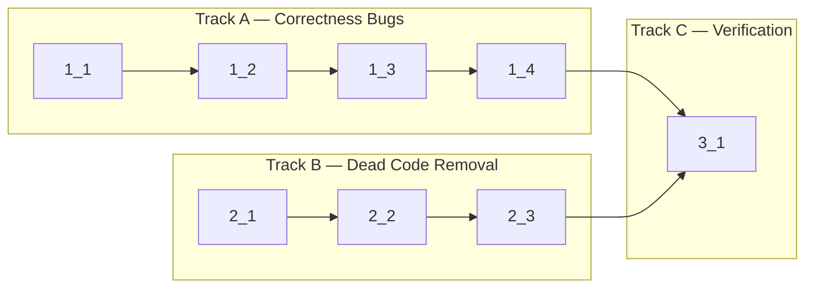

<!-- Tasks are executed sequentially in dependency order (topological sort). -->
<!-- Tasks with no Deps run first; tasks whose Deps are all complete run next. -->
<!-- Group tasks into sections by concern for readability. -->

## 1. Correctness Bugs

- [x] 1_1 Add `tabId` field to `AckMessage` type and update webview ack logic to track per-session char counts
  - **Refs**: specs/ack-routing/spec.md#Session-Scoped-Ack-Message; docs/refactor/webview-implementation-vs-design.md
  - **Done**: `AckMessage` has `tabId: string`. `ackChars()` replaced with per-session Map tracking. Each ack message includes the correct `tabId`.
  - **Test**: N/A — pure refactor of internal protocol; covered by type check + existing tests
  - **Files**: src/types/messages.ts, src/webview/main.ts
  - **Approach**: Add `tabId: string` to `AckMessage` interface in messages.ts. In main.ts, replace the single `let unsentAckChars = 0` with `const unsentAckCharsMap = new Map<string, number>()`. Modify `ackChars(count, tabId)` to accumulate per tabId and send `{ type: "ack", charCount, tabId }`. Update both call sites in the `"output"` case to pass `msg.tabId`.

- [x] 1_2 Update TerminalViewProvider and TerminalEditorProvider to route ack by `message.tabId`
  - **Deps**: 1_1
  - **Refs**: specs/ack-routing/spec.md#Session-Scoped-Ack-Message
  - **Done**: Both providers use `message.tabId` directly instead of finding the active tab. No `tabs.find((t) => t.isActive)` in ack handler.
  - **Test**: N/A — internal routing change; verified by type check
  - **Files**: src/providers/TerminalViewProvider.ts, src/providers/TerminalEditorProvider.ts
  - **Approach**: In both files, replace the `case "ack"` block: remove `getTabsForView`/`find(isActive)` lookup. Instead, directly call `this.sessionManager.handleAck(message.tabId, message.charCount)` after validating both fields exist.

- [x] 1_3 Split shared `resizeTimeout` into two independent timer variables
  - **Refs**: specs/ack-routing/spec.md#Independent-Resize-Debounce-Timers
  - **Done**: `fitResizeTimeout` used by `debouncedFit()`, `splitFitTimeout` used by `debouncedFitAllLeaves()`. No shared timer variable.
  - **Test**: N/A — variable rename, no logic change; verified by type check
  - **Files**: src/webview/main.ts
  - **Approach**: Replace `let resizeTimeout: number | undefined` with `let fitResizeTimeout: number | undefined` and `let splitFitTimeout: number | undefined`. Update `debouncedFit()` to use `fitResizeTimeout` (clearTimeout + assign). Update `debouncedFitAllLeaves()` to use `splitFitTimeout` (clearTimeout + assign).

- [x] 1_4 Add null guard on `core._renderService.clear()` call in `fitTerminal()`
  - **Refs**: specs/ack-routing/spec.md#Null-Guard-on-Render-Service
  - **Done**: Line uses `core?._renderService?.clear()` with optional chaining.
  - **Test**: N/A — single character change; verified by type check
  - **Files**: src/webview/main.ts
  - **Approach**: Change `core._renderService.clear()` to `core?._renderService?.clear()` at the `fitTerminal()` function around line 699.

## 2. Dead Code Removal

- [x] 2_1 Remove dead `fitAddon` and `webLinksAddon` properties from `TerminalInstance` interface and object literal
  - **Refs**: docs/refactor/webview-implementation-vs-design.md; docs/PLAN.md#7.1
  - **Done**: `TerminalInstance` no longer has `fitAddon` or `webLinksAddon` properties. `createTerminal()` still calls `terminal.loadAddon()` for both addons. Local variables `fitAddon` and `webLinksAddon` in `createTerminal()` remain for the `loadAddon()` calls.
  - **Test**: N/A — dead property removal; verified by type check
  - **Files**: src/webview/main.ts
  - **Approach**: Remove `fitAddon: FitAddon` and `webLinksAddon: WebLinksAddon` from the `TerminalInstance` interface (lines 41-42). Remove `fitAddon,` and `webLinksAddon,` from the object literal in `createTerminal()` (lines 896-897). Keep the `new FitAddon()`, `new WebLinksAddon()`, and `terminal.loadAddon()` calls since the addons themselves are still active.

- [x] 2_2 Remove dead `handlePaste()` function and `paste` from `TerminalLike` interface, plus associated tests
  - **Refs**: docs/refactor/webview-implementation-vs-design.md; docs/PLAN.md#7.2
  - **Done**: `handlePaste()` removed from InputHandler.ts. `paste` removed from `TerminalLike` interface. Associated tests removed from InputHandler.test.ts.
  - **Test**: N/A — dead code removal; verified by type check + test:unit
  - **Files**: src/webview/InputHandler.ts, src/webview/InputHandler.test.ts
  - **Approach**: In InputHandler.ts: remove `paste(data: string): void` from `TerminalLike` interface (line 21). Remove `handlePaste()` function (lines 45-58). In InputHandler.test.ts: remove `handlePaste` from import (line 9). Remove all `handlePaste` test cases (lines 247, 400-462). Remove `paste` from mock `TerminalLike` objects in tests. Keep `ClipboardProvider` import if still used by other tests.

- [x] 2_3 Remove dead error classes (`SpawnError`, `CwdNotFoundError`, `WebViewDisposedError`, `SessionNotFoundError`) and their enum values, plus associated tests
  - **Refs**: docs/refactor/webview-implementation-vs-design.md; docs/PLAN.md#7.3
  - **Done**: 4 dead error classes removed from errors.ts. 4 dead `ErrorCode` enum values removed. Associated tests removed from errors.test.ts. `PtyLoadError`, `ShellNotFoundError`, and `AnyWhereTerminalError` remain.
  - **Test**: N/A — dead code removal; verified by type check + test:unit
  - **Files**: src/types/errors.ts, src/types/errors.test.ts
  - **Approach**: In errors.ts: remove `SpawnFailed`, `CwdNotFound`, `WebViewDisposed`, `SessionNotFound` from `ErrorCode` enum (lines 10-14). Remove `SpawnError` (lines 55-65), `CwdNotFoundError` (lines 68-78), `WebViewDisposedError` (lines 81-89), `SessionNotFoundError` (lines 92-99) class definitions. In errors.test.ts: remove test suites for the 4 dead classes (lines 109-213 approximately).

## 3. Verification

- [x] 3_1 Run type check, lint, and unit tests to verify all changes
  - **Deps**: 1_4, 2_3
  - **Refs**: All specs
  - **Done**: `pnpm run check-types` passes. `pnpm run lint` passes. `pnpm run test:unit` passes.
  - **Test**: N/A — verification task
  - **Files**: N/A
  - **Approach**: Run `pnpm run check-types`, `pnpm run lint`, `pnpm run test:unit` sequentially. Fix any issues found.
