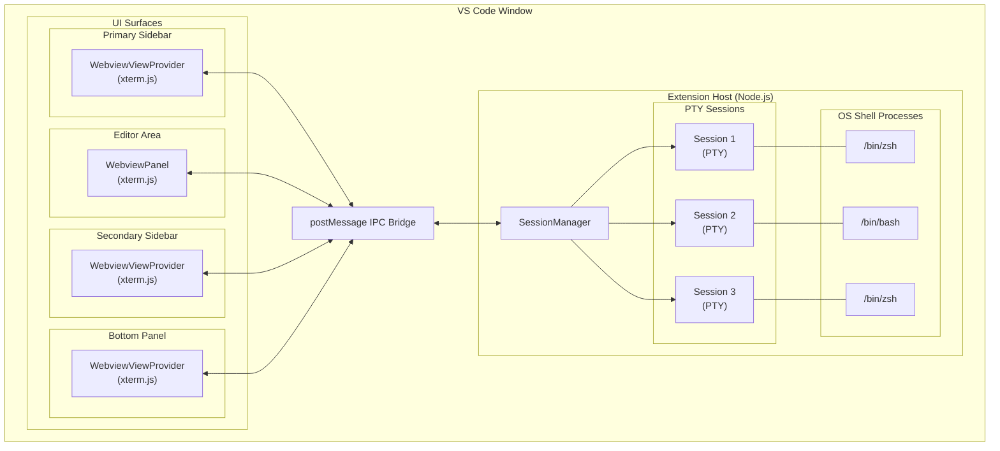
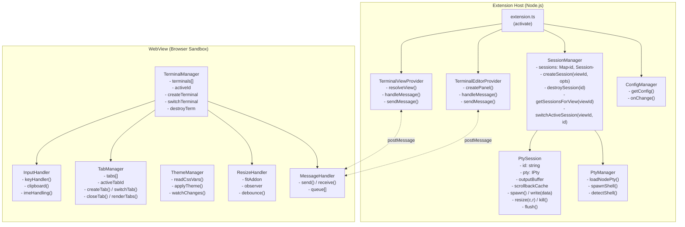
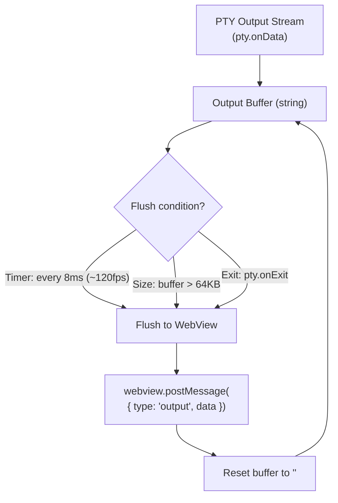
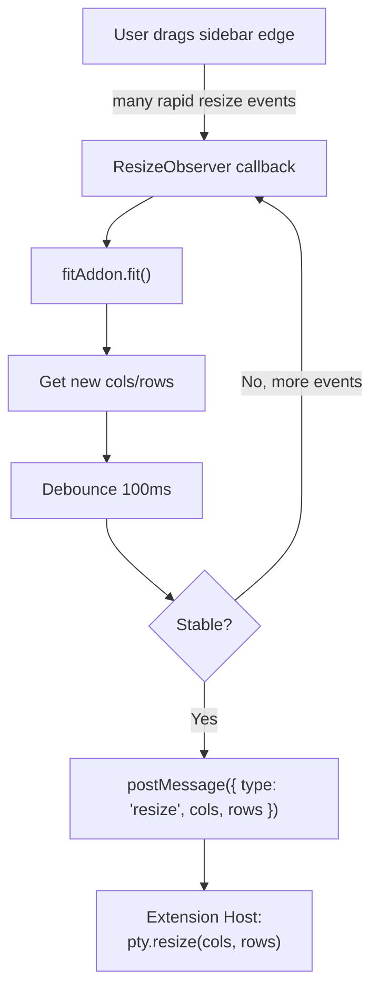
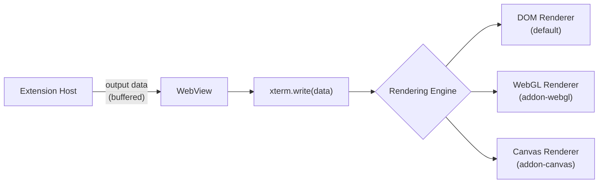
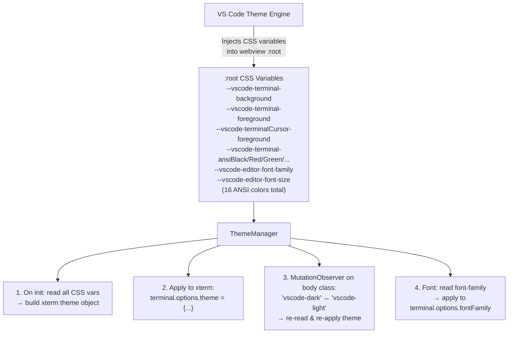
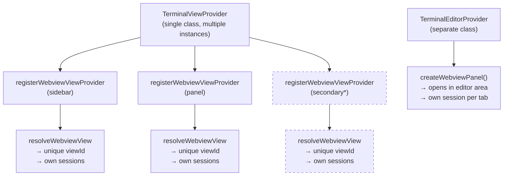
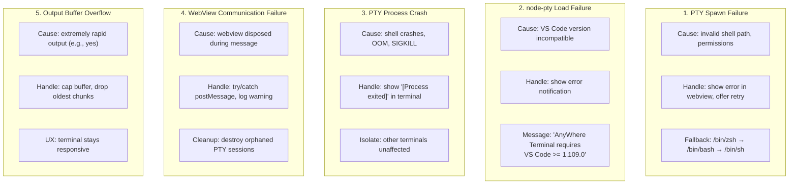

# AnyWhere Terminal - System Design

## 1. Architecture Overview

AnyWhere Terminal follows a **3-layer architecture** with strict separation between the VS Code Extension Host (backend), the IPC Bridge (transport), and the WebView (frontend).



---

## 2. Component Design

### 2.1 Component Diagram



### 2.2 File Structure

```
src/
├── extension.ts                    # Entry point, activate/deactivate
├── providers/
│   ├── TerminalViewProvider.ts     # WebviewViewProvider for sidebar/panel
│   └── TerminalEditorProvider.ts   # WebviewPanel for editor area
├── session/
│   ├── SessionManager.ts          # Central session registry
│   └── PtySession.ts              # Single PTY session wrapper
├── pty/
│   └── PtyManager.ts              # node-pty loader and shell detection
├── config/
│   └── ConfigManager.ts           # Settings reader
├── types/
│   └── messages.ts                # Shared message type definitions
└── webview/
    ├── main.ts                    # Webview entry point
    ├── terminal/
    │   ├── TerminalManager.ts     # xterm.js instance management
    │   └── InputHandler.ts        # Keyboard/clipboard handling
    ├── ui/
    │   ├── TabManager.ts          # Tab bar UI
    │   └── ThemeManager.ts        # Theme integration
    └── utils/
        ├── ResizeHandler.ts       # FitAddon + debounced resize
        └── MessageHandler.ts      # postMessage wrapper
media/
├── webview.js                     # Bundled webview code
├── webview.css                    # Additional styles (if needed)
└── icon.svg                       # Extension icon
```

---

## 3. Data Flow & Sequence Diagrams

Detailed data flow diagrams are documented in separate files for maintainability:

| Flow | Document | Description |
|------|----------|-------------|
| Terminal Initialization | [flow-initialization.md](design/flow-initialization.md) | WebView creation → PTY spawn → first prompt |
| User Input Round-Trip | [flow-user-input.md](design/flow-user-input.md) | Keystroke → PTY → output with flow control |
| Clipboard (Copy/Paste) | [flow-clipboard.md](design/flow-clipboard.md) | Cmd+C/V handling, SIGINT vs copy |
| View Collapse/Expand | [flow-view-lifecycle.md](design/flow-view-lifecycle.md) | retainContextWhenHidden, scrollback cache |
| Multi-Tab Lifecycle | [flow-multi-tab.md](design/flow-multi-tab.md) | Create, switch, close tabs with operation queue |

---

## 4. Message Protocol

> Full specification: [design/message-protocol.md](design/message-protocol.md)

The extension and webview communicate via `postMessage` using discriminated union types. 8 message types flow from WebView → Extension (`ready`, `input`, `resize`, `createTab`, `switchTab`, `closeTab`, `clear`, `ack`) and 8 from Extension → WebView (`init`, `output`, `exit`, `tabCreated`, `tabRemoved`, `restore`, `configUpdate`, `error`).

---

## 5. Component Designs

Detailed component designs are documented in separate files:

| Component | Document | Description |
|-----------|----------|-------------|
| PtyManager | [design/pty-manager.md](design/pty-manager.md) | node-pty loading, shell detection, spawn config |
| SessionManager | [design/session-manager.md](design/session-manager.md) | Session lifecycle, operation queue, kill tracking |
| Output Buffering | [design/output-buffering.md](design/output-buffering.md) | Two-layer buffering, flow control (100K/5K watermarks) |
| xterm.js Integration | [design/xterm-integration.md](design/xterm-integration.md) | Terminal setup, addon loading, renderer selection |
| Theme Integration | [design/theme-integration.md](design/theme-integration.md) | CSS variable mapping, location-aware background |
| Resize Handling | [design/resize-handling.md](design/resize-handling.md) | Smart resize, debouncing, DPI-aware dimensions |
| Keyboard & Input | [design/keyboard-input.md](design/keyboard-input.md) | Custom key handler, clipboard, IME, bracketed paste |
| WebView Provider | [design/webview-provider.md](design/webview-provider.md) | WebviewViewProvider lifecycle, CSP, ready handshake |
| Error Handling | [design/error-handling.md](design/error-handling.md) | Error categories, fallback chains, user notifications |
| Build System | [design/build-system.md](design/build-system.md) | Dual-target esbuild, dependencies, packaging |

---

## 6. Build System

> Full specification: [design/build-system.md](design/build-system.md)

Dual-target esbuild configuration: Extension Host bundle (Node.js, CJS) and WebView bundle (Browser, IIFE). `node-pty` and `vscode` are externalized from the extension bundle. The webview bundle includes xterm.js and all addons as a self-contained IIFE.

---

## 7. Performance Design

### 7.1 Output Buffering Strategy



See [output-buffering.md](design/output-buffering.md) for the complete two-layer buffering and flow control design (100K high watermark / 5K low watermark).

### 7.2 Resize Debouncing



### 7.3 Rendering Pipeline



---

## 8. Theme Integration



See [theme-integration.md](design/theme-integration.md) for the complete theme design including location-aware background colors.

---

## 9. View Placement Strategy

### 9.1 Supported Locations and APIs

| Location | API | Registration | Notes |
|----------|-----|-------------|-------|
| **Primary Sidebar** | `WebviewViewProvider` | `viewsContainers.activitybar` | Fully supported |
| **Bottom Panel** | `WebviewViewProvider` | `viewsContainers.panel` | Fully supported |
| **Editor Area** | `WebviewPanel` | `createWebviewPanel()` | Opens as editor tab |
| **Secondary Sidebar** | `WebviewViewProvider` | `viewsContainers.secondarySidebar` (proposed) OR user "Move View" | Proposed API in VS Code 1.104+ |

### 9.2 Provider Reuse Pattern



> *Secondary sidebar uses same provider, different viewId. Dashed = proposed API.

---

## 10. Error Handling



See [error-handling.md](design/error-handling.md) for the complete error handling design including error categories, fallback chains, and user notification patterns.

---

## 11. Security Considerations

### 11.1 WebView Content Security Policy

```
Content-Security-Policy:
  default-src 'none';                    # Block all by default
  style-src ${webview.cspSource}         # Allow VS Code webview styles
           'unsafe-inline';              # Allow inline styles for xterm
  script-src 'nonce-${nonce}';           # Only nonce-tagged scripts
  font-src ${webview.cspSource};         # Allow VS Code fonts
  img-src ${webview.cspSource};          # Allow webview images
```

### 11.2 PTY Security

- Shell spawned with user's environment (`process.env`)
- Working directory defaults to workspace root
- No elevated privileges
- PTY processes are children of the Extension Host process
- All PTY processes killed on extension deactivation

---

## 12. Testing Strategy

### 12.1 Unit Tests
- `SessionManager`: session CRUD, number recycling, cleanup
- `PtyManager`: shell detection, node-pty loading
- `ConfigManager`: setting reads, defaults, changes
- Message protocol: serialization/deserialization

### 12.2 Integration Tests
- Extension activation/deactivation
- WebView creation and message flow
- PTY spawn and I/O round-trip
- View lifecycle (create, hide, show, dispose)

### 12.3 Manual Test Matrix

| Test Case | Sidebar | Panel | Editor | Secondary |
|-----------|---------|-------|--------|-----------|
| Shell prompt appears | [ ] | [ ] | [ ] | [ ] |
| `ls -la` output correct | [ ] | [ ] | [ ] | [ ] |
| Resize works | [ ] | [ ] | [ ] | [ ] |
| Copy/paste works | [ ] | [ ] | [ ] | [ ] |
| Ctrl+C interrupts | [ ] | [ ] | [ ] | [ ] |
| Multi-tab works | [ ] | [ ] | [ ] | [ ] |
| vim opens and works | [ ] | [ ] | [ ] | [ ] |
| Theme matches | [ ] | [ ] | [ ] | [ ] |
| Collapse/expand recovery | [ ] | [ ] | [ ] | [ ] |
| Heavy output (`find /`) | [ ] | [ ] | [ ] | [ ] |
