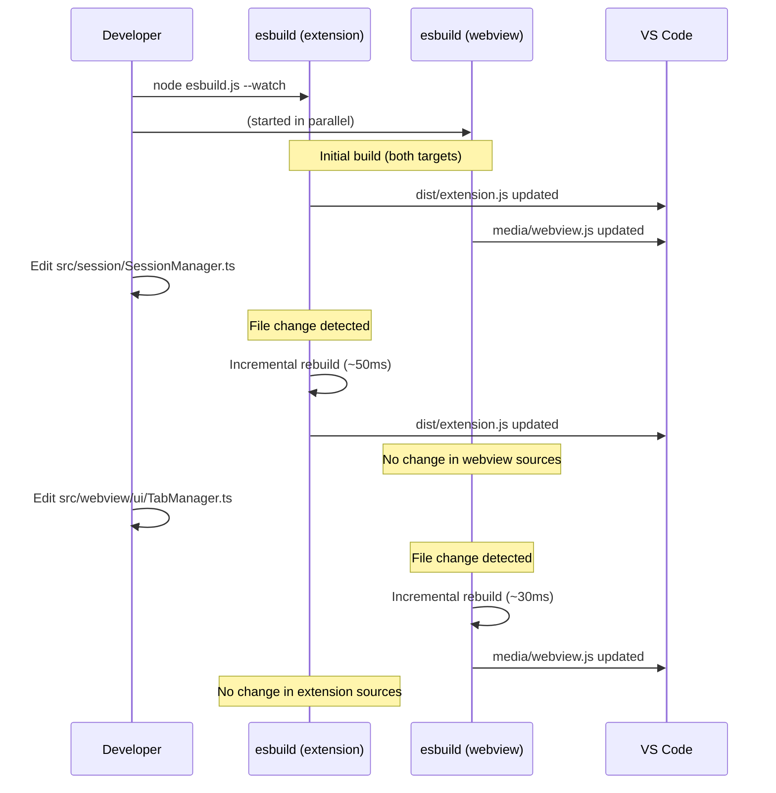
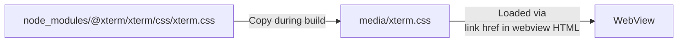

# Build System — Detailed Design

## 1. Overview

AnyWhere Terminal has a **dual-target build** that produces two separate bundles from a single TypeScript codebase:

1. **Extension bundle** — Node.js code running in the VS Code Extension Host
2. **WebView bundle** — Browser code running inside a VS Code WebView sandbox

Both targets are built with **esbuild** for speed and simplicity. TypeScript type checking is performed separately via `tsc --noEmit`.

### Reference
- Parent design: `docs/DESIGN.md` §6 (Build System Design)
- File structure: `docs/DESIGN.md` §2.2

---

## 2. Build Architecture

```mermaid
flowchart TD
    subgraph Sources["Source Files"]
        EXT_SRC["src/extension.ts<br/>src/providers/**<br/>src/session/**<br/>src/pty/**<br/>src/config/**<br/>src/types/**"]
        WV_SRC["src/webview/main.ts<br/>src/webview/terminal/**<br/>src/webview/ui/**<br/>src/webview/utils/**"]
        SHARED["src/types/messages.ts<br/>(shared type definitions)"]
    end

    subgraph Build["esbuild (dual-target)"]
        B1["Extension Build<br/>platform: node<br/>format: cjs"]
        B2["WebView Build<br/>platform: browser<br/>format: iife"]
    end

    subgraph Output["Build Output"]
        O1["dist/extension.js<br/>(CJS, Node.js)"]
        O2["media/webview.js<br/>(IIFE, browser)"]
        O3["media/xterm.css<br/>(copied)"]
    end

    EXT_SRC --> B1
    SHARED --> B1
    SHARED --> B2
    WV_SRC --> B2

    B1 --> O1
    B2 --> O2
    B2 -->|"CSS loader"| O3

    style SHARED fill:#345,stroke:#6af
```



---

## 3. Dual-Target esbuild Configuration

### 3.1 Extension Bundle

| Setting | Value | Rationale |
|---------|-------|-----------|
| Entry point | `src/extension.ts` | Extension activation entry |
| Output | `dist/extension.js` | Matches `package.json` `"main"` field |
| Format | `cjs` (CommonJS) | VS Code Extension Host requires CJS |
| Platform | `node` | Access to Node.js APIs (fs, path, child_process) |
| Target | `node18` | Minimum Node.js version in supported VS Code |
| Externals | `vscode`, `node-pty` | `vscode` is provided by VS Code runtime; `node-pty` is loaded dynamically from VS Code internals at runtime |
| Sourcemap | `true` (dev), `false` (prod) | Debugging support in development |
| Minify | `false` (dev), `true` (prod) | Smaller VSIX for production |

### 3.2 WebView Bundle

| Setting | Value | Rationale |
|---------|-------|-----------|
| Entry point | `src/webview/main.ts` | WebView bootstrap entry |
| Output | `media/webview.js` | Loaded via `<script>` tag in webview HTML |
| Format | `iife` | Self-contained, no module system in webview |
| Platform | `browser` | DOM APIs, no Node.js |
| Target | `es2020` | VS Code's Electron Chromium supports ES2020+ |
| Externals | *(none)* | All dependencies bundled into the output |
| Sourcemap | `true` (dev), `false` (prod) | |
| Minify | `false` (dev), `true` (prod) | |

### 3.3 Bundled vs External Dependencies

```mermaid
graph LR
    subgraph Bundled["Bundled into webview.js"]
        XT["@xterm/xterm"]
        FIT["@xterm/addon-fit"]
        WL["@xterm/addon-web-links"]
    end

    subgraph External["External (not bundled)"]
        VS["vscode<br/>(provided by runtime)"]
        PTY["node-pty<br/>(loaded from VS Code internals)"]
    end

    subgraph Output["Output Files"]
        WJS["media/webview.js<br/>~350KB (minified)"]
        EJS["dist/extension.js<br/>~15KB (minified)"]
    end

    Bundled --> WJS
    External -.->|"not included"| EJS

    style Bundled fill:#345,stroke:#6af
    style External fill:#543,stroke:#fa6
```



---

## 4. Watch Mode

Both targets are watched in parallel during development. The `esbuild.context()` API provides incremental rebuilds:



### npm Scripts

```json
{
  "scripts": {
    "compile": "pnpm run check-types && pnpm run lint && node esbuild.js",
    "watch": "npm-run-all -p watch:*",
    "watch:esbuild": "node esbuild.js --watch",
    "watch:tsc": "tsc --noEmit --watch --project tsconfig.json",
    "package": "pnpm run check-types && pnpm run lint && node esbuild.js --production",
    "vscode:prepublish": "pnpm run package"
  }
}
```

The `watch` script runs three processes in parallel:
1. `watch:esbuild` — incremental bundling for both targets
2. `watch:tsc` — type checking (reports errors without emitting)

---

## 5. Dependencies

### 5.1 devDependencies

| Package | Purpose | Bundle Target |
|---------|---------|---------------|
| `@xterm/xterm` | Terminal emulator library | WebView (bundled) |
| `@xterm/addon-fit` | Auto-resize terminal to container | WebView (bundled) |
| `@xterm/addon-web-links` | Clickable URLs in terminal | WebView (bundled) |
| `esbuild` | JavaScript/TypeScript bundler | Build tool |
| `typescript` | Type checking (`tsc --noEmit`) | Build tool |
| `@types/vscode` | VS Code API type definitions | Type checking |
| `@types/node` | Node.js API type definitions | Type checking |
| `npm-run-all` | Parallel script runner | Build tool |
| `eslint` | Linting | Build tool |
| `typescript-eslint` | TypeScript ESLint rules | Build tool |
| `@vscode/test-cli` | Extension test runner | Testing |
| `@vscode/test-electron` | Extension test environment | Testing |

### 5.2 Runtime Dependencies

**There are no runtime `dependencies`** in `package.json`:

- **node-pty**: Loaded dynamically from VS Code's built-in modules at runtime via `require(path.join(vscode.env.appRoot, 'node_modules.asar', 'node-pty'))`. Not listed as a dependency at all.
- **xterm.js + addons**: Bundled into `media/webview.js` at build time by esbuild. They are `devDependencies` because they are only needed during the build process.
- **vscode**: Provided by the VS Code runtime. Listed as an `external` in esbuild config.

### 5.3 Dependency Graph

```mermaid
graph TD
    subgraph Runtime["Runtime Dependencies (0)"]
        NONE["(none — all bundled or provided)"]
    end

    subgraph DevDeps["devDependencies"]
        subgraph BundledIntoWebview["Bundled into media/webview.js"]
            XT["@xterm/xterm"]
            FIT["@xterm/addon-fit"]
            WL["@xterm/addon-web-links"]
        end

        subgraph BuildTools["Build Tools"]
            ESB["esbuild"]
            TS["typescript"]
            NRA["npm-run-all"]
            ESL["eslint"]
            TSE["typescript-eslint"]
        end

        subgraph TypeDefs["Type Definitions"]
            TVS["@types/vscode"]
            TN["@types/node"]
        end

        subgraph Testing["Test Tools"]
            VTC["@vscode/test-cli"]
            VTE["@vscode/test-electron"]
        end
    end

    subgraph ProvidedByVSCode["Provided by VS Code Runtime"]
        VSAPI["vscode (API)"]
        NPTY["node-pty (native module)"]
    end

    style NONE fill:#363,stroke:#6f6
    style ProvidedByVSCode fill:#345,stroke:#6af
```



---

## 6. CSS Handling

### 6.1 xterm.css

xterm.js requires its CSS file for proper rendering. The CSS is handled during the build:



The CSS is **copied**, not bundled into JS, because:
- It must be loaded as a separate `<link>` stylesheet in the webview HTML
- The webview's Content Security Policy specifies `style-src ${webview.cspSource}`, which requires the CSS to come from a trusted local file
- `'unsafe-inline'` covers xterm's runtime-injected styles, but the base CSS should be a file

### 6.2 CSS Copy in esbuild.js

The CSS copy is implemented as an esbuild plugin or a post-build step:

```javascript
const { copyFileSync } = require('fs');
const path = require('path');

// Post-build: copy xterm.css to media/
function copyXtermCss() {
  copyFileSync(
    path.join(__dirname, 'node_modules', '@xterm', 'xterm', 'css', 'xterm.css'),
    path.join(__dirname, 'media', 'xterm.css')
  );
}
```

---

## 7. TypeScript Configuration

### 7.1 Current Configuration

The project uses a single `tsconfig.json` with `lib: ["ES2022"]`:

```jsonc
{
  "compilerOptions": {
    "module": "Node16",
    "target": "ES2022",
    "lib": ["ES2022"],
    "sourceMap": true,
    "rootDir": "src",
    "strict": true
  }
}
```

### 7.2 Required Changes for WebView Support

The webview code uses DOM APIs (`document`, `window`, `ResizeObserver`, `navigator.clipboard`, etc.). The current config lacks `"DOM"` in the `lib` array.

**Option A: Single tsconfig with both libs** (recommended for MVP)

```jsonc
{
  "compilerOptions": {
    "module": "Node16",
    "target": "ES2022",
    "lib": ["ES2022", "DOM"],
    "sourceMap": true,
    "rootDir": "src",
    "strict": true,
    "skipLibCheck": true
  }
}
```

Trade-off: Extension code can accidentally use DOM APIs without a compile error. Acceptable for a small codebase with clear directory separation.

**Option B: Separate tsconfig files** (recommended for later phases)

```
tsconfig.json              ← Base config (shared settings)
tsconfig.extension.json    ← Extension: lib: ["ES2022"], no DOM
tsconfig.webview.json      ← WebView: lib: ["ES2022", "DOM"], no Node
```

```jsonc
// tsconfig.extension.json
{
  "extends": "./tsconfig.json",
  "compilerOptions": {
    "lib": ["ES2022"],
    "types": ["node"]
  },
  "include": ["src/**/*"],
  "exclude": ["src/webview/**/*"]
}
```

```jsonc
// tsconfig.webview.json
{
  "extends": "./tsconfig.json",
  "compilerOptions": {
    "lib": ["ES2022", "DOM"]
  },
  "include": ["src/webview/**/*", "src/types/**/*"]
}
```

### 7.3 Shared Types

The `src/types/` directory contains type definitions shared between extension and webview code (notably `messages.ts`). Both tsconfig files include this directory. These files must only use types that exist in both `lib` sets (i.e., pure TypeScript types, no DOM or Node-specific APIs).

---

## 8. package.json Contributions

The `contributes` section of `package.json` declares all VS Code integration points:

### 8.1 View Containers

```jsonc
{
  "contributes": {
    "viewsContainers": {
      "activitybar": [
        {
          "id": "anywhereTerminal",
          "title": "AnyWhere Terminal",
          "icon": "$(terminal)"
        }
      ],
      "panel": [
        {
          "id": "anywhereTerminalPanel",
          "title": "AnyWhere Terminal"
        }
      ]
    }
  }
}
```

### 8.2 Views

```jsonc
{
  "contributes": {
    "views": {
      "anywhereTerminal": [
        {
          "id": "anywhereTerminal.sidebar",
          "name": "Terminal",
          "type": "webview"
        }
      ],
      "anywhereTerminalPanel": [
        {
          "id": "anywhereTerminal.panel",
          "name": "Terminal",
          "type": "webview"
        }
      ]
    }
  }
}
```

### 8.3 Commands

```jsonc
{
  "contributes": {
    "commands": [
      {
        "command": "anywhereTerminal.newTerminal",
        "title": "New Terminal",
        "icon": "$(plus)",
        "category": "AnyWhere Terminal"
      },
      {
        "command": "anywhereTerminal.newTerminalInEditor",
        "title": "New Terminal in Editor",
        "category": "AnyWhere Terminal"
      },
      {
        "command": "anywhereTerminal.killTerminal",
        "title": "Kill Terminal",
        "icon": "$(trash)",
        "category": "AnyWhere Terminal"
      },
      {
        "command": "anywhereTerminal.clearTerminal",
        "title": "Clear Terminal",
        "icon": "$(clear-all)",
        "category": "AnyWhere Terminal"
      }
    ]
  }
}
```

### 8.4 Menus

```jsonc
{
  "contributes": {
    "menus": {
      "view/title": [
        {
          "command": "anywhereTerminal.newTerminal",
          "when": "view =~ /anywhereTerminal/",
          "group": "navigation@1"
        },
        {
          "command": "anywhereTerminal.killTerminal",
          "when": "view =~ /anywhereTerminal/",
          "group": "navigation@2"
        },
        {
          "command": "anywhereTerminal.clearTerminal",
          "when": "view =~ /anywhereTerminal/",
          "group": "navigation@3"
        }
      ]
    }
  }
}
```

### 8.5 Configuration

```jsonc
{
  "contributes": {
    "configuration": {
      "title": "AnyWhere Terminal",
      "properties": {
        "anywhereTerminal.shell.macOS": {
          "type": "string",
          "default": "",
          "description": "Path to shell executable on macOS (empty = auto-detect)"
        },
        "anywhereTerminal.shell.args": {
          "type": "array",
          "items": { "type": "string" },
          "default": [],
          "description": "Arguments to pass to the shell"
        },
        "anywhereTerminal.scrollback": {
          "type": "number",
          "default": 10000,
          "minimum": 100,
          "maximum": 100000,
          "description": "Maximum number of lines in scrollback buffer"
        },
        "anywhereTerminal.fontSize": {
          "type": "number",
          "default": 0,
          "description": "Terminal font size (0 = inherit from VS Code)"
        },
        "anywhereTerminal.cursorBlink": {
          "type": "boolean",
          "default": true,
          "description": "Enable cursor blinking"
        },
        "anywhereTerminal.defaultCwd": {
          "type": "string",
          "default": "",
          "description": "Default working directory (empty = workspace root)"
        }
      }
    }
  }
}
```

---

## 9. Packaging

### 9.1 VSIX Packaging

The extension is packaged into a `.vsix` file using `@vscode/vsce`:

```bash
# Install vsce
pnpm add -D @vscode/vsce

# Package
npx vsce package
```

### 9.2 Files Included in VSIX

The `.vscodeignore` file controls what is included:

```
# Include
dist/extension.js
media/webview.js
media/xterm.css
media/icon.svg
package.json
README.md
CHANGELOG.md
LICENSE

# Exclude (by .vscodeignore)
src/**
node_modules/**
docs/**
*.ts
tsconfig*.json
esbuild.js
eslint.config.mjs
.git/**
```

### 9.3 Platform-Specific VSIX

**Not needed for MVP**. AnyWhere Terminal does not bundle any native modules — node-pty is loaded from VS Code's built-in modules at runtime. Therefore, a single universal VSIX works on all platforms (macOS, Linux, Windows).

If in the future we need platform-specific builds (e.g., for bundled native addons), we would use `@vscode/vsce package --target <platform>` with targets like `darwin-arm64`, `linux-x64`, etc.

### 9.4 VSIX Size Estimate

| Component | Estimated Size |
|-----------|---------------|
| `dist/extension.js` (minified) | ~15 KB |
| `media/webview.js` (minified, with xterm) | ~350 KB |
| `media/xterm.css` | ~10 KB |
| `package.json` + metadata | ~5 KB |
| **Total VSIX** | **~400 KB** |

---

## 10. Complete esbuild.js

```javascript
// esbuild.js

const esbuild = require('esbuild');
const { copyFileSync, mkdirSync, existsSync } = require('fs');
const path = require('path');

const production = process.argv.includes('--production');
const watch = process.argv.includes('--watch');

/**
 * esbuild problem matcher plugin for VS Code task integration.
 * Formats errors in a way that VS Code's problem matcher can parse.
 * @type {import('esbuild').Plugin}
 */
const esbuildProblemMatcherPlugin = {
  name: 'esbuild-problem-matcher',
  setup(build) {
    build.onStart(() => {
      console.log('[watch] build started');
    });
    build.onEnd((result) => {
      result.errors.forEach(({ text, location }) => {
        console.error(`✘ [ERROR] ${text}`);
        if (location) {
          console.error(`    ${location.file}:${location.line}:${location.column}:`);
        }
      });
      console.log('[watch] build finished');
    });
  },
};

/**
 * Plugin to copy xterm.css to media/ after a successful build.
 * @type {import('esbuild').Plugin}
 */
const copyXtermCssPlugin = {
  name: 'copy-xterm-css',
  setup(build) {
    build.onEnd((result) => {
      if (result.errors.length === 0) {
        const src = path.join(__dirname, 'node_modules', '@xterm', 'xterm', 'css', 'xterm.css');
        const dest = path.join(__dirname, 'media', 'xterm.css');

        // Ensure media/ directory exists
        const mediaDir = path.join(__dirname, 'media');
        if (!existsSync(mediaDir)) {
          mkdirSync(mediaDir, { recursive: true });
        }

        try {
          copyFileSync(src, dest);
          console.log('[copy] xterm.css → media/xterm.css');
        } catch (err) {
          console.warn('[copy] Failed to copy xterm.css:', err.message);
        }
      }
    });
  },
};

// ─── Extension Host Bundle ──────────────────────────────────────────
const extensionConfig = {
  entryPoints: ['./src/extension.ts'],
  bundle: true,
  outfile: './dist/extension.js',
  format: 'cjs',
  platform: 'node',
  target: 'node18',
  external: [
    'vscode',      // Provided by VS Code runtime
    'node-pty',    // Loaded dynamically from VS Code internals
  ],
  sourcemap: !production,
  sourcesContent: false,
  minify: production,
  logLevel: 'silent',
  plugins: [
    esbuildProblemMatcherPlugin,
  ],
};

// ─── WebView Bundle ─────────────────────────────────────────────────
const webviewConfig = {
  entryPoints: ['./src/webview/main.ts'],
  bundle: true,
  outfile: './media/webview.js',
  format: 'iife',
  platform: 'browser',
  target: 'es2020',
  // No externals — everything is bundled:
  //   @xterm/xterm, @xterm/addon-fit, @xterm/addon-web-links
  sourcemap: !production,
  sourcesContent: false,
  minify: production,
  logLevel: 'silent',
  plugins: [
    esbuildProblemMatcherPlugin,
    copyXtermCssPlugin,
  ],
};

// ─── Build Entry Point ──────────────────────────────────────────────
async function main() {
  if (watch) {
    // Watch mode: both targets rebuild incrementally in parallel
    const [extCtx, wvCtx] = await Promise.all([
      esbuild.context(extensionConfig),
      esbuild.context(webviewConfig),
    ]);
    await Promise.all([extCtx.watch(), wvCtx.watch()]);
    console.log('Watching for changes...');
  } else {
    // Single build: build both targets in parallel
    await Promise.all([
      esbuild.build(extensionConfig),
      esbuild.build(webviewConfig),
    ]);
    console.log('Build complete.');
  }
}

main().catch((e) => {
  console.error(e);
  process.exit(1);
});
```

---

## 11. Build Pipeline Diagram

```mermaid
flowchart TD
    subgraph Input["Source Input"]
        TS_EXT["src/extension.ts<br/>+ extension modules"]
        TS_WV["src/webview/main.ts<br/>+ webview modules"]
        TYPES["src/types/*.ts<br/>(shared)"]
        CSS["node_modules/@xterm/<br/>xterm/css/xterm.css"]
    end

    subgraph TypeCheck["Type Checking (tsc)"]
        TSC["tsc --noEmit<br/>(separate from bundling)"]
    end

    subgraph Lint["Linting"]
        ESL["eslint src/"]
    end

    subgraph Bundle["Bundling (esbuild)"]
        B1["Extension Build<br/>CJS, node, node18<br/>externals: vscode, node-pty"]
        B2["WebView Build<br/>IIFE, browser, es2020<br/>bundles: xterm + addons"]
        COPY["Copy Plugin:<br/>xterm.css → media/"]
    end

    subgraph Output["Build Output"]
        O1["dist/extension.js"]
        O2["media/webview.js"]
        O3["media/xterm.css"]
    end

    subgraph Package["Packaging"]
        VSCE["vsce package"]
        VSIX["anywhere-terminal-0.0.1.vsix"]
    end

    TS_EXT --> TSC
    TS_WV --> TSC
    TYPES --> TSC
    TS_EXT --> ESL
    TS_WV --> ESL

    TS_EXT --> B1
    TYPES --> B1
    TYPES --> B2
    TS_WV --> B2
    CSS --> COPY

    B1 --> O1
    B2 --> O2
    COPY --> O3

    O1 --> VSCE
    O2 --> VSCE
    O3 --> VSCE
    VSCE --> VSIX

    style TSC fill:#345,stroke:#6af
    style B1 fill:#453,stroke:#af6
    style B2 fill:#453,stroke:#af6
```



---

## 12. NPM Script Pipeline

```mermaid
flowchart LR
    subgraph Dev["Development"]
        W["pnpm watch"]
        W --> W1["watch:esbuild<br/>(incremental)"]
        W --> W2["watch:tsc<br/>(type check)"]
    end

    subgraph CI["CI / Build"]
        C["pnpm compile"]
        C --> C1["check-types<br/>(tsc --noEmit)"]
        C1 --> C2["lint<br/>(eslint src)"]
        C2 --> C3["node esbuild.js"]
    end

    subgraph Release["Release"]
        P["pnpm package"]
        P --> P1["check-types"]
        P1 --> P2["lint"]
        P2 --> P3["node esbuild.js<br/>--production"]
    end

    subgraph Publish["vscode:prepublish"]
        PP["pnpm run package"]
    end

    style Dev fill:#345,stroke:#6af
    style CI fill:#453,stroke:#af6
    style Release fill:#543,stroke:#fa6
```



---

## 13. File Locations

| File | Purpose |
|------|---------|
| `esbuild.js` | Build script (dual-target configuration) |
| `tsconfig.json` | TypeScript configuration (type checking) |
| `package.json` | Dependencies, scripts, VS Code contributions |
| `eslint.config.mjs` | ESLint configuration |
| `.vscodeignore` | Files excluded from VSIX package |
| `dist/extension.js` | Built extension bundle (gitignored) |
| `media/webview.js` | Built webview bundle (gitignored) |
| `media/xterm.css` | Copied xterm stylesheet (gitignored) |
