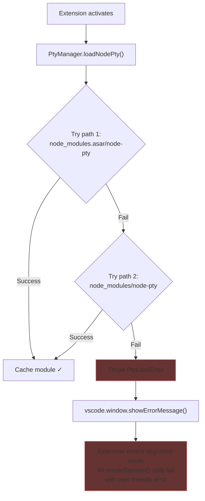
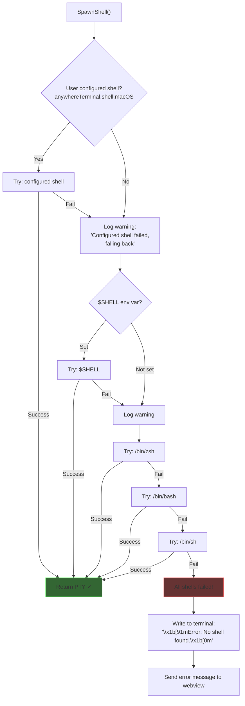
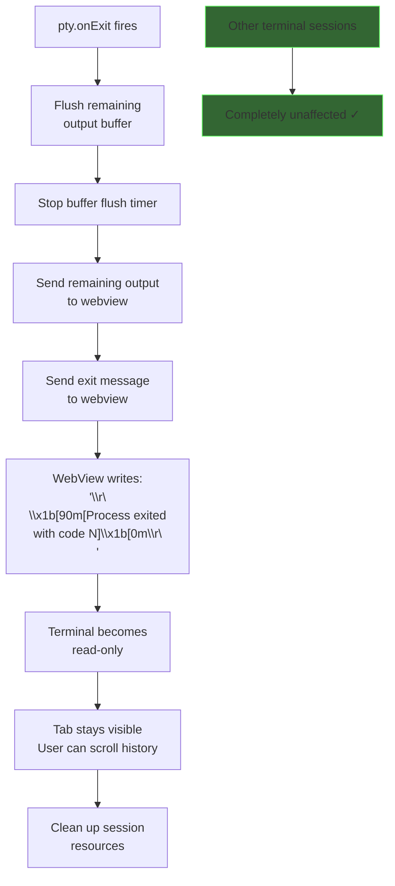
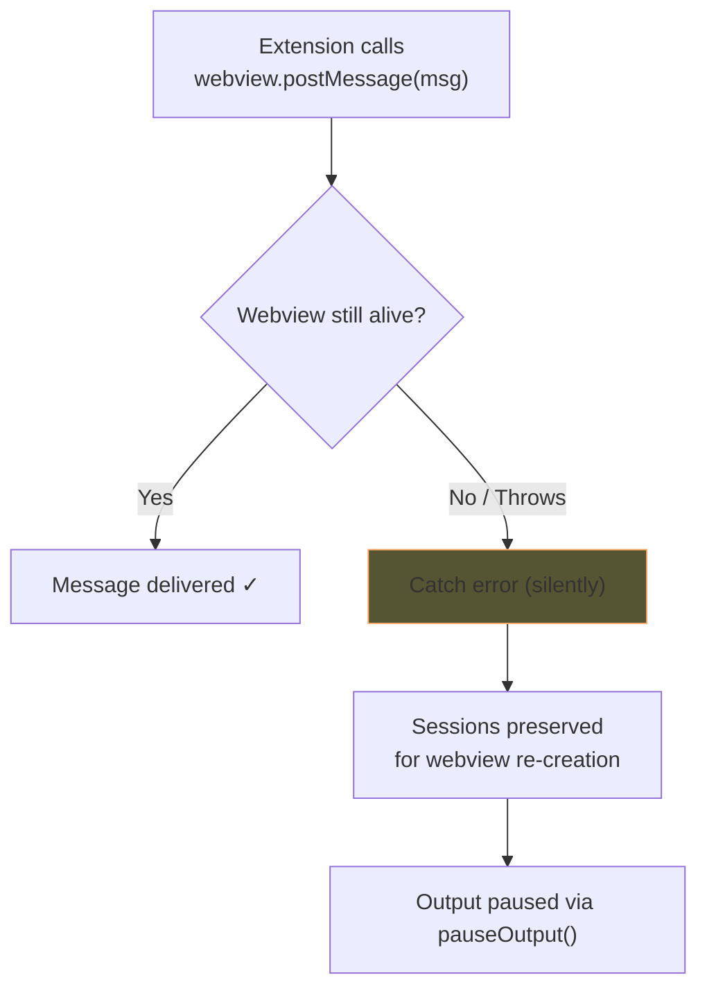
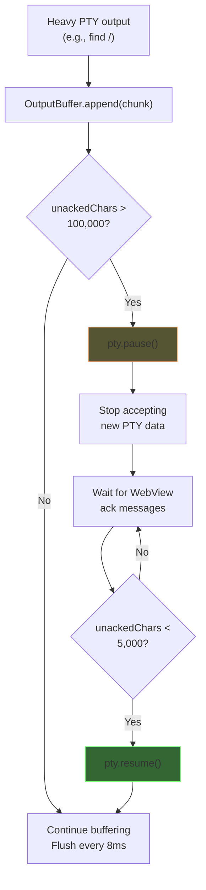
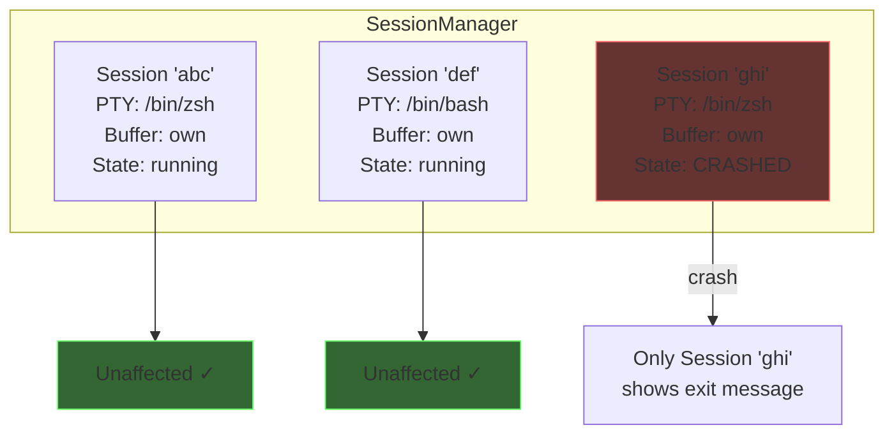
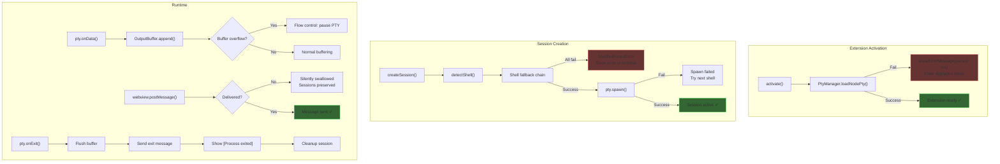

# Error Handling — Detailed Design

## 1. Overview

AnyWhere Terminal must handle errors gracefully across three boundaries: the Node.js Extension Host, the PTY process layer, and the browser-sandboxed WebView. Errors at any layer should be contained, surfaced appropriately to the user, and never cause cascading failures across independent terminal sessions.

### Design Goals
- **Isolation**: One terminal crash does not affect others
- **Visibility**: Never silently fail — always inform the user
- **Graceful degradation**: Fall back to alternatives when possible
- **Defensive coding**: Assume every external call can fail

### Reference
- Parent design: `docs/DESIGN.md` §10 (Error Handling Design)
- PTY manager: `docs/design/pty-manager.md` §6 (Error Handling)
- Output buffering: `docs/design/output-buffering.md` §8 (Edge Cases)

---

## 2. Error Categories

### 2.1 Category Summary

| # | Category | Severity | Frequency | User Impact |
|---|----------|----------|-----------|-------------|
| 1 | node-pty load failure | Critical | Rare (once per activation) | Extension cannot function |
| 2 | PTY spawn failure | High | Occasional | Single tab fails to start |
| 3 | PTY process crash | Medium | Occasional | Single tab stops |
| 4 | WebView communication failure | Medium | Rare | Temporary message loss |
| 5 | Output buffer overflow | Low | Rare (heavy output) | Potential lag |

---

## 3. Error Category Details

### 3.1 node-pty Load Failure

**Cause**: VS Code version is too old and does not bundle node-pty, or the asar archive is corrupted.

**Detection**: `PtyManager.loadNodePty()` tries both candidate paths and throws `PtyLoadError`.

**Recovery**: None — the extension cannot function without node-pty.

**User-Facing Action**:
- Show `vscode.window.showErrorMessage()` with version requirement
- Message: *"AnyWhere Terminal requires VS Code >= 1.109.0. Please update VS Code."*
- The extension activates but all terminal creation attempts show the same error
- No retry (the VS Code version won't change within a session)



---

### 3.2 PTY Spawn Failure

**Cause**: Invalid shell path, insufficient permissions, or shell binary missing.

**Detection**: `pty.spawn()` throws an error or the process exits immediately with a non-zero code.

**Recovery**: Fallback shell chain — try the next shell in the priority list.

**User-Facing Action**:
- If all shells fail: write error message directly into the terminal (ANSI-styled)
- If a fallback succeeds: log warning, proceed with fallback shell

#### Fallback Shell Chain



#### Validation Before Spawn

Each candidate shell is validated before attempting spawn:

```typescript
function validateShell(shellPath: string): boolean {
  try {
    const stat = fs.statSync(shellPath);
    // Check: file exists, is a file (not directory), and is executable
    return stat.isFile() && (stat.mode & fs.constants.X_OK) !== 0;
  } catch {
    return false;
  }
}
```

---

### 3.3 PTY Process Crash

**Cause**: Shell process crashes (segfault, OOM killed), user types `exit`, or shell receives a fatal signal (SIGKILL, SIGTERM from external source).

**Detection**: `pty.onExit({ exitCode, signal })` event fires.

**Recovery**: No automatic restart — the user decides whether to create a new tab.

**User-Facing Action**:
- Flush any remaining output buffer to the terminal
- Write exit message in the terminal: `[Process exited with code N]` (ANSI dim grey)
- The tab remains visible — user can scroll history
- Other terminal tabs are completely unaffected



---

### 3.4 WebView Communication Failure

**Cause**: The webview is disposed while the extension is trying to send a message via `postMessage()`. This can happen when:
- User closes the sidebar/panel while output is being sent
- VS Code is shutting down
- The webview view is being relocated (moved to different container)

**Detection**: `webview.postMessage()` may throw synchronously or the returned thenable may reject.

**Recovery**:
- `OutputBuffer` wraps `postMessage()` in try/catch and `.then(undefined, () => {})` 
- On failure: error is silently swallowed (no logging, no cleanup)
- Sessions are preserved for potential webview re-creation
- Output is paused via `pauseOutput()` when the view becomes hidden

**User-Facing Action**: None needed — the view is already gone.



---

### 3.5 Output Buffer Overflow

**Cause**: Extremely rapid PTY output (e.g., `yes`, `find /`, `cat /dev/urandom`) that overwhelms the IPC channel and xterm.js rendering.

**Detection**: `unackedCharCount` exceeds `HIGH_WATERMARK_CHARS` (100,000).

**Recovery**: Flow control — pause the PTY until the webview catches up. See `docs/design/output-buffering.md` for full details.

**User-Facing Action**: Terminal may appear to lag slightly during heavy output, but it remains responsive and does not crash. No error message is shown — this is expected behavior during heavy output.



---

## 4. Error Isolation

### 4.1 Session Independence

Each terminal tab runs in its own isolated `TerminalSession`:



### 4.2 Isolation Boundaries

| Resource | Scope | Failure Isolation |
|----------|-------|-------------------|
| PTY process | Per session | Crash kills one session only |
| Output buffer | Per session | Overflow pauses one PTY only |
| Scrollback cache | Per session | Eviction affects one session only |
| Flush timer | Per session | Timer cleanup is per-session |
| xterm.js instance | Per session (webview-side) | Rendering issues are per-terminal |

### 4.3 Cross-Cutting Failures

Some failures affect all sessions:

| Failure | Scope | Reason |
|---------|-------|--------|
| node-pty load failure | All sessions | Single module, loaded once |
| WebView disposed | All sessions in that view | Shared webview container |
| Extension host crash | All sessions | All run in same Node.js process |

---

## 5. User-Facing Error Display

### 5.1 In-Terminal Error Messages

For errors related to a specific terminal session, the error is displayed directly in the terminal using ANSI escape codes:

```typescript
// Process exit
terminal.write('\r\n\x1b[90m[Process exited with code 1]\x1b[0m\r\n');

// Spawn failure (after all fallbacks exhausted)
terminal.write('\x1b[91mError: Failed to start shell.\x1b[0m\r\n');
terminal.write('\x1b[90mTried: /bin/zsh, /bin/bash, /bin/sh\x1b[0m\r\n');
terminal.write('\x1b[90mCheck your shell configuration.\x1b[0m\r\n');
```

ANSI color codes used:

| Code | Color | Usage |
|------|-------|-------|
| `\x1b[90m` | Dim grey | Informational (exit messages) |
| `\x1b[91m` | Bright red | Error messages |
| `\x1b[93m` | Bright yellow | Warning messages |
| `\x1b[0m` | Reset | End of colored text |

### 5.2 VS Code Notifications

For extension-level errors that are not tied to a specific terminal:

```typescript
// Critical: Extension cannot function
vscode.window.showErrorMessage(
  'AnyWhere Terminal: Failed to load terminal support. ' +
  'Please ensure VS Code >= 1.109.0 is installed.'
);

// Warning: Degraded functionality
vscode.window.showWarningMessage(
  'AnyWhere Terminal: Configured shell "/usr/local/bin/fish" not found. ' +
  'Using /bin/zsh instead.'
);

// Info: Non-critical notification
vscode.window.showInformationMessage(
  'AnyWhere Terminal: Terminal settings updated.'
);
```

### 5.3 WebView Error Messages

For errors that should be displayed in the webview but are not terminal output, the `error` message type is used:

```typescript
// Extension sends error to webview
webview.postMessage({
  type: 'error',
  message: 'Failed to create new terminal. Maximum session limit reached.',
  severity: 'error'
});
```

The webview can display these as toast notifications or inline messages, styled according to severity.

### 5.5 Error Banner UI (BannerService)

For errors delivered via the `error` message type, the webview displays banners using `BannerService` (`src/webview/ui/BannerService.ts`):

```typescript
function showBanner(container: HTMLElement, message: string, severity: 'error' | 'warn' | 'info'): void;
```

- Severity determines CSS class: `error-banner-error` (red), `error-banner-warn` (amber), `error-banner-info` (blue)
- All banners have a dismiss button (x)
- Info banners auto-dismiss after 5 seconds (`INFO_BANNER_DISMISS_MS = 5000`)
- Banners are inserted at the top of `#terminal-container`

### 5.4 Display Strategy Summary

```mermaid
flowchart TD
    A["Error occurs"] --> B{"Error scope?"}
    B -->|"Single terminal"| C["In-terminal ANSI message<br/>(dim grey / red text)"]
    B -->|"Extension-wide"| D["VS Code notification<br/>(showErrorMessage)"]
    B -->|"WebView-wide"| E["WebView error message<br/>({ type: 'error' })"]

    C --> F["Examples:<br/>• [Process exited with code N]<br/>• Error: Failed to start shell"]
    D --> G["Examples:<br/>• node-pty load failure<br/>• Shell not found (with fallback info)"]
    E --> H["Examples:<br/>• Session limit reached<br/>• Connection lost"]

    style C fill:#345,stroke:#6af
    style D fill:#543,stroke:#fa6
    style E fill:#453,stroke:#af6
```



---

## 6. Retry Strategies

### 6.1 PTY Spawn: Fallback Shell Chain

The shell fallback chain (§3.2) is the primary retry strategy for spawn failures. This is a **single-pass fallback** — the chain is tried once, not repeatedly:

1. User-configured shell
2. `$SHELL` environment variable
3. `/bin/zsh`
4. `/bin/bash`
5. `/bin/sh`

If all fail, the error is final. No automatic retry timer — the user must fix their configuration and create a new tab.

### 6.2 WebView Message: Retry on Transient Failure

For the specific case where `postMessage` fails transiently (webview is being relocated, not fully disposed), a simple retry can be used:

```typescript
private async safeSendWithRetry(
  webview: vscode.Webview,
  message: ExtensionToWebViewMessage,
  maxRetries: number = 2
): Promise<boolean> {
  for (let attempt = 0; attempt <= maxRetries; attempt++) {
    try {
      const delivered = await webview.postMessage(message);
      if (delivered) return true;
      // Message not delivered — webview may be transitioning
      await this.delay(50);
    } catch {
      if (attempt === maxRetries) return false;
      await this.delay(50);
    }
  }
  return false;
}
```

### 6.3 What Is NOT Retried

| Scenario | Retry? | Reason |
|----------|--------|--------|
| node-pty load failure | No | VS Code version won't change mid-session |
| PTY process crash | No | User should decide (may have been intentional `exit`) |
| All fallback shells fail | No | System configuration issue requires user action |
| WebView fully disposed | No | View is gone, no target for messages |

---

## 7. Error Types (TypeScript)

After Phase 7 (dead code removal), only 3 error classes remain. 4 previously documented classes (`SpawnError`, `CwdNotFoundError`, `WebViewDisposedError`, `SessionNotFoundError`) were removed because they were never thrown.

```typescript
// === Base Error ===

/** Base class for all AnyWhere Terminal errors. */
class AnyWhereTerminalError extends Error {
  constructor(
    message: string,
    public readonly code: ErrorCode
  ) {
    super(message);
    this.name = 'AnyWhereTerminalError';
  }
}

/** Error code enum for programmatic error handling. String enum (not const enum). */
enum ErrorCode {
  PtyLoadFailed = 'PTY_LOAD_FAILED',
  ShellNotFound = 'SHELL_NOT_FOUND',
  BufferOverflow = 'BUFFER_OVERFLOW',
}

// === Specific Errors ===

/** node-pty could not be loaded from VS Code's internals. */
class PtyLoadError extends AnyWhereTerminalError {
  constructor(public readonly attemptedPaths: string[]) {
    super(`Could not load node-pty. Tried: ${attemptedPaths.join(', ')}`, ErrorCode.PtyLoadFailed);
    this.name = 'PtyLoadError';
  }
}

/** No valid shell executable could be found. */
class ShellNotFoundError extends AnyWhereTerminalError {
  constructor(public readonly attemptedShells: string[]) {
    super(`No valid shell found. Tried: ${attemptedShells.join(', ')}`, ErrorCode.ShellNotFound);
    this.name = 'ShellNotFoundError';
  }
}
```

> **Removed in Phase 7**: `SpawnError`, `CwdNotFoundError`, `WebViewDisposedError`, `SessionNotFoundError` were defined but never thrown. Their error codes (`SPAWN_FAILED`, `CWD_NOT_FOUND`, `WEBVIEW_DISPOSED`, `SESSION_NOT_FOUND`) were also removed from the `ErrorCode` enum.

---

## 8. Error Handling Flowchart (Complete)



---

## 9. Logging Strategy

### 9.1 Log Levels

| Level | When | Example |
|-------|------|---------|
| `error` | Unrecoverable failures | node-pty load failure, all shells failed |
| `warn` | Recovered failures, fallbacks used | Shell fallback, WebGL context loss |
| `info` | Normal lifecycle events | Session created, session destroyed |

### 9.2 Console Logging

All logging uses `console.*` methods (`console.error`, `console.warn`, `console.log`). There is no VS Code Output Channel or structured logging infrastructure. Log messages are prefixed with `[AnyWhere Terminal]` for identification in the developer tools console.

```typescript
// Extension Host
console.error('[AnyWhere Terminal] Failed to load node-pty:', err);

// WebView
console.warn('[AnyWhere Terminal] WebGL renderer failed, using canvas fallback');
console.error(`[AnyWhere Terminal] ${msg.severity}: ${msg.message}`);
```

---

## 10. File Locations

| File | Error Types Defined |
|------|-------------------|
| `src/types/errors.ts` | `AnyWhereTerminalError`, `PtyLoadError`, `ShellNotFoundError`, `ErrorCode` enum (3 values) |
| `src/pty/PtyManager.ts` | Throws `PtyLoadError`, `ShellNotFoundError` |
| `src/session/SessionManager.ts` | Catches spawn errors, handles session cleanup |
| `src/session/OutputBuffer.ts` | Handles buffer overflow via 1MB cap + FIFO eviction, flow control via watermarks |
| `src/webview/ui/BannerService.ts` | Error/warning/info banner display in webview |

### Dependencies
- `vscode` — for error notifications (`showErrorMessage`, `showWarningMessage`)
- `fs` — for shell validation
- `node-pty` — source of PTY-related errors

### Dependents
- All components that can fail reference these error types
- `extension.ts` — top-level activation error handling
