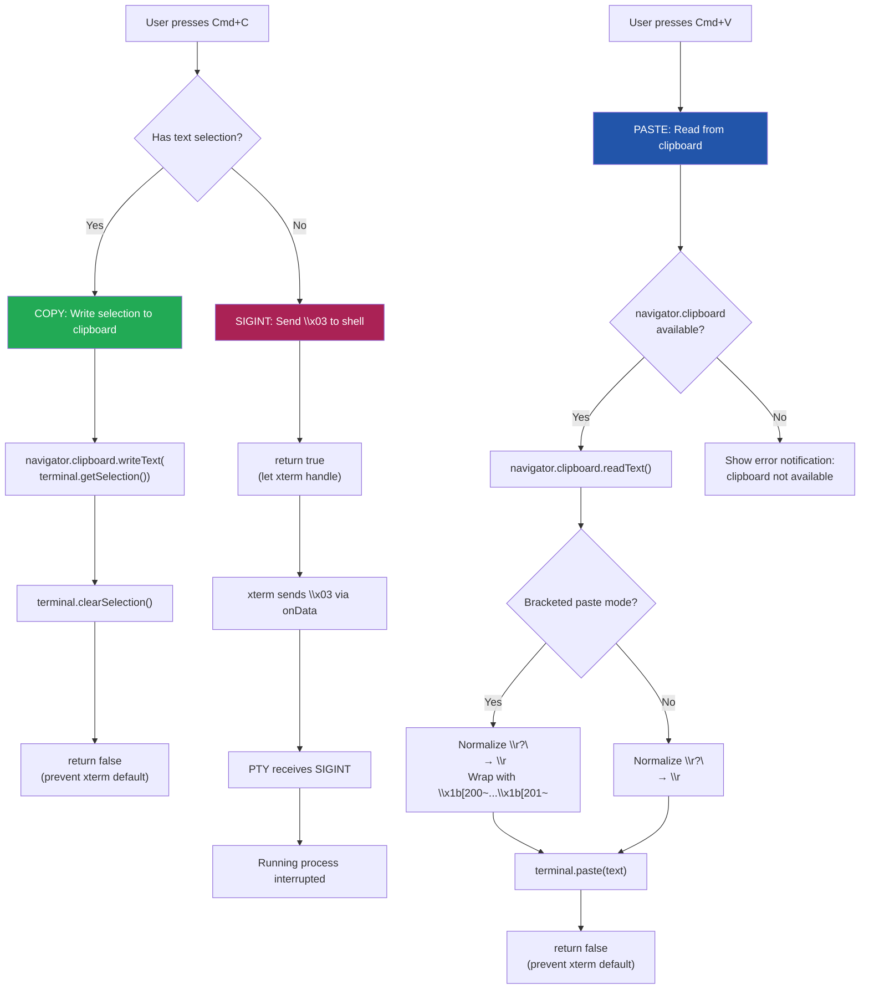
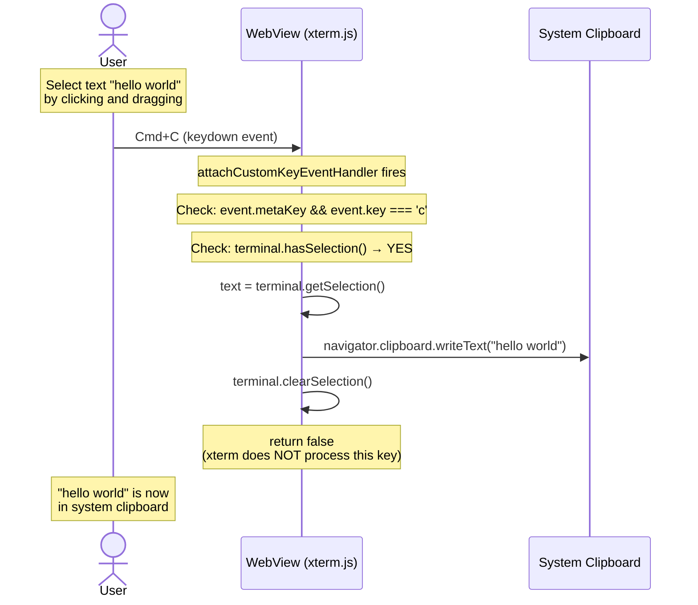
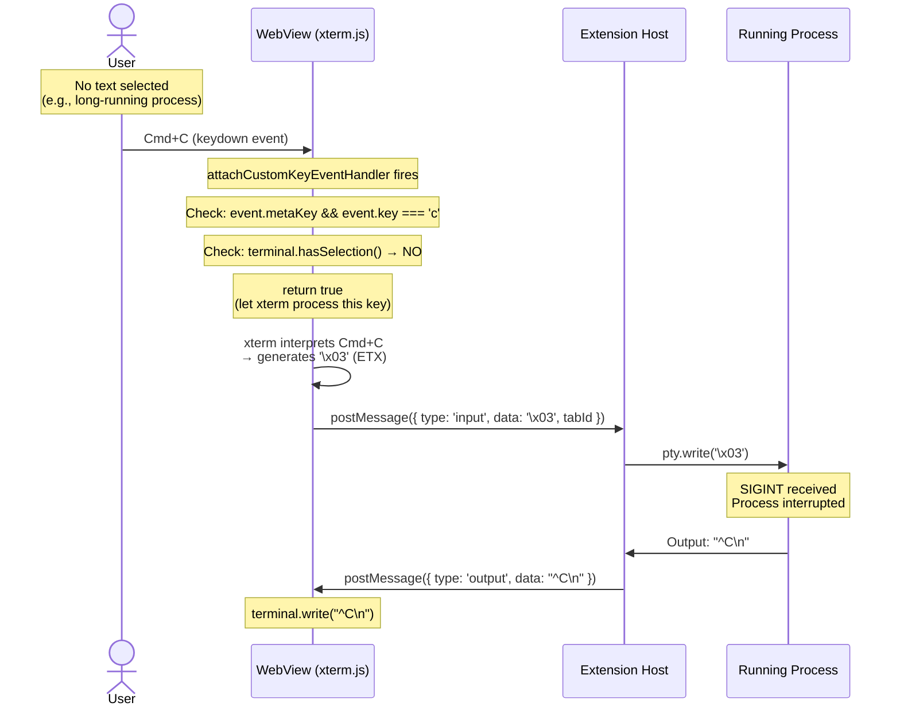
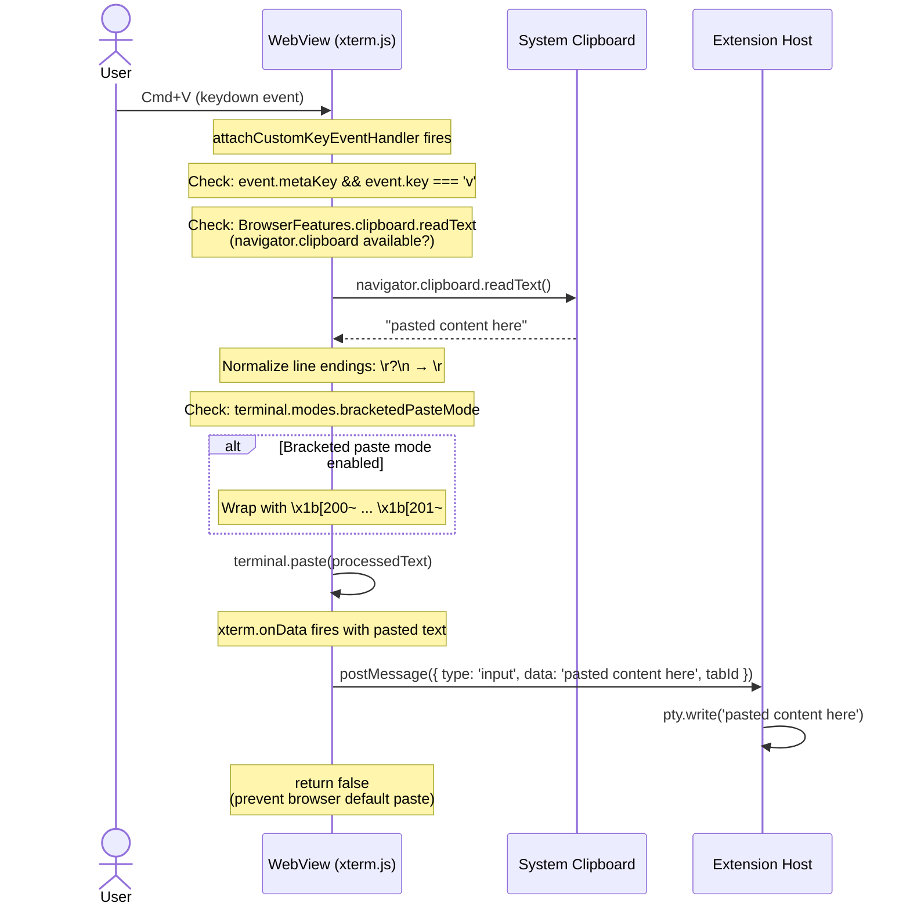

# Flow: Clipboard (Copy/Paste) on macOS

> Part of [DESIGN.md](../DESIGN.md) - Section 3.3

## Overview

Clipboard handling in a WebView terminal is non-trivial because `Cmd+C` has dual meaning: **copy** (when text is selected) and **SIGINT** (when nothing is selected). This document details the decision logic and all clipboard flows.

> **Cross-references**: [keyboard-input.md](keyboard-input.md) | [message-protocol.md](message-protocol.md)

## Decision Flow



## Sequence Diagrams

### Copy with Selection



### Copy without Selection (SIGINT)



### Paste



## Implementation Code

```typescript
terminal.attachCustomKeyEventHandler((event: KeyboardEvent): boolean => {
  // Only handle keydown, not keyup
  if (event.type !== 'keydown') return true;

  const isMac = navigator.platform.includes('Mac');
  const modifier = isMac ? event.metaKey : event.ctrlKey;

  // Cmd+C / Ctrl+C
  if (modifier && event.key === 'c') {
    if (terminal.hasSelection()) {
      // COPY: write selection to clipboard
      navigator.clipboard.writeText(terminal.getSelection());
      terminal.clearSelection();
      return false; // prevent xterm from processing
    }
    // No selection: let xterm send SIGINT (\x03)
    return true;
  }

  // Cmd+V / Ctrl+V
  if (modifier && event.key === 'v') {
    // Check clipboard API availability (may not be available in all contexts)
    if (!navigator.clipboard?.readText) {
      console.warn('Clipboard API not available');
      return false;
    }
    navigator.clipboard.readText().then((text) => {
      if (text) {
        // Normalize line endings
        text = text.replace(/\r?\n/g, '\r');
        terminal.paste(text);
      }
    });
    return false; // prevent browser default paste
  }

  // Cmd+A / Ctrl+A: Select All
  if (modifier && event.key === 'a') {
    terminal.selectAll();
    return false;
  }

  // Cmd+K: Clear terminal
  if (isMac && event.metaKey && event.key === 'k') {
    terminal.clear();
    vscode.postMessage({ type: 'clear', tabId: activeTabId });
    return false;
  }

  // All other keys: let xterm handle normally
  return true;
});
```

## Platform Differences

| Shortcut | macOS | Linux/Windows | Action |
|----------|-------|---------------|--------|
| Copy | `Cmd+C` | `Ctrl+Shift+C` or `Ctrl+C` (with selection) | Copy selected text |
| Paste | `Cmd+V` | `Ctrl+Shift+V` or `Ctrl+V` | Paste from clipboard |
| Interrupt | `Cmd+C` (no selection) | `Ctrl+C` (no selection) | Send SIGINT |
| Select All | `Cmd+A` | `Ctrl+Shift+A` | Select all terminal text |
| Clear | `Cmd+K` | `Ctrl+Shift+K` | Clear terminal |

> **MVP scope**: macOS only. Linux/Windows shortcuts are documented for future reference.

## Edge Cases

1. **Clipboard permission denied**: `navigator.clipboard.readText()` may throw if the WebView doesn't have clipboard permission. Wrap in try/catch and fall back to showing an error notification.

2. **Clipboard API not available**: `navigator.clipboard` may not exist in all WebView contexts. From VS Code: check `BrowserFeatures.clipboard.readText` before attempting. If unavailable, log a warning and skip the operation.

3. **Large paste**: If the user pastes a very large text block (>1MB), consider chunking the input to avoid blocking the PTY.

4. **Bracketed paste mode**: Modern shells (zsh, bash 4.4+) support bracketed paste mode. When `terminal.modes.bracketedPasteMode` is true, the paste handler wraps content with `\x1b[200~` and `\x1b[201~` escape sequences. Line endings are normalized from `\r?\n` to `\r` before wrapping.

## OSC 52 Clipboard Protocol (Future Phase)

Programs like `tmux`, `vim`, and `neovim` can read/write the system clipboard via OSC 52 escape sequences. The xterm.js `ClipboardAddon` handles this protocol:

```
OSC 52 ; c ; <base64-data> ST   → Write to clipboard
OSC 52 ; c ; ? ST               → Read from clipboard (query)
```

This is a **future phase** feature. For MVP, clipboard access is limited to Cmd+C/V shortcuts handled by our custom key event handler. The `ClipboardAddon` can be loaded later to support programmatic clipboard access from terminal applications.

See [keyboard-input.md](keyboard-input.md) for the complete keyboard handling design including IME composition tracking.
