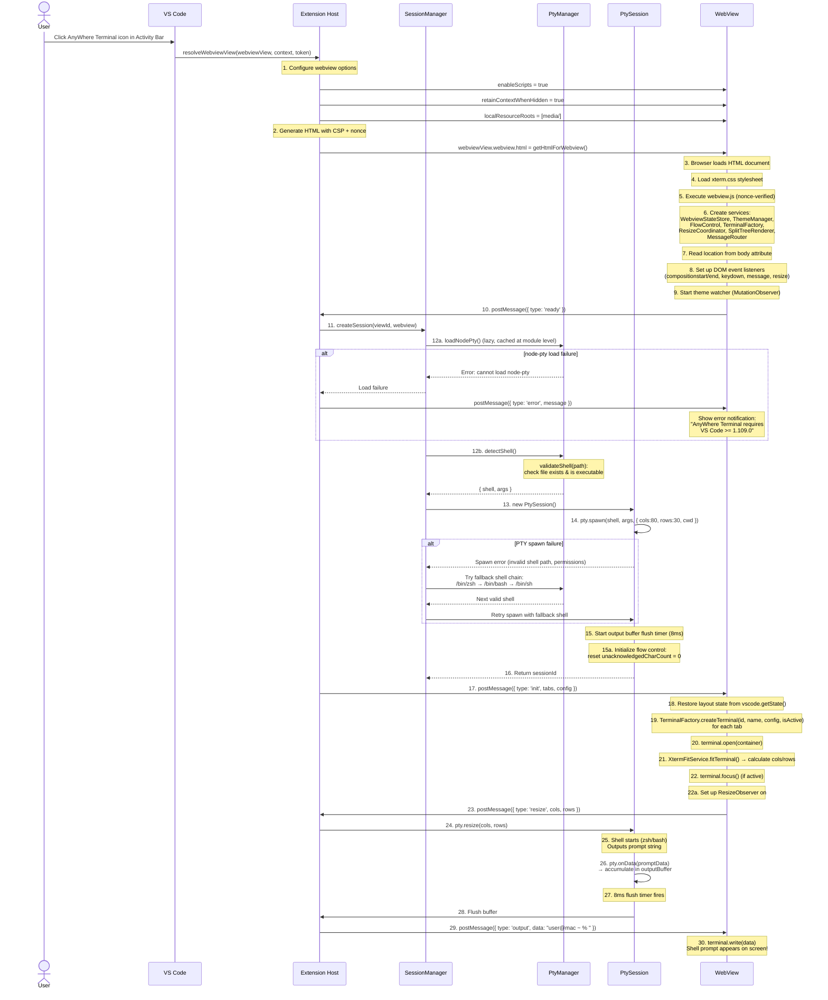

# Flow: Terminal Initialization

> Part of [DESIGN.md](../DESIGN.md) - Section 3.1

## Overview

This diagram shows the complete initialization sequence when a user opens an AnyWhere Terminal view for the first time. It covers WebView creation, PTY spawning, and the first shell prompt appearing.

> **Cross-references**: [pty-manager.md](pty-manager.md) | [session-manager.md](session-manager.md) | [webview-provider.md](webview-provider.md) | [output-buffering.md](output-buffering.md)

## Sequence Diagram



## Key Implementation Notes

### WebView Options

| Option | Value | Reason |
|--------|-------|--------|
| `enableScripts` | `true` | Required for xterm.js to run |
| `retainContextWhenHidden` | `true` | Preserves terminal state when view is collapsed |
| `localResourceRoots` | `[media/]` | Restricts file access to bundled assets only |

### Module Loading (xterm.js)

The xterm.js `Terminal` constructor is imported statically in `TerminalFactory.ts`. Since the webview is bundled via esbuild, all imports are resolved at bundle time:

```typescript
import { Terminal } from '@xterm/xterm';
```

### No Pre-Launch Input Queue

The pre-launch input queue described in earlier designs was never implemented. Keystrokes typed before the PTY process is ready may be lost during the brief startup window. In practice, this window is imperceptible for users.

### Shell Detection & Validation

Shell detection includes a validation step that checks the shell binary exists before attempting to spawn:

```
detectShell() → candidate path
  → validateShell(path): fs.existsSync(path) && fs.accessSync(path, X_OK)
  → if invalid, try next in fallback chain
```

See [pty-manager.md](pty-manager.md) for the full shell detection algorithm.

### Flow Control Initialization

On first connection, the flow control subsystem resets the `unacknowledgedCharCount` to 0. This counter tracks how many bytes of output have been sent to the webview but not yet acknowledged. If it exceeds the high watermark (100K), PTY reads are paused. See [output-buffering.md](output-buffering.md) for the complete flow control design.

### Initialization Race Conditions

The `ready` message from the WebView is critical for synchronization. The Extension Host must **not** create a PTY session until the WebView signals it's ready to receive output. Otherwise, early PTY output would be lost.

```
Timeline:
  WebView loading...   |████████████|
  ready msg            |            |→
  PTY spawn            |            |  →→→|
  First output         |            |     |→→→→|
  term.write()         |            |     |    |→ visible!
```

### ResizeObserver Timing

The `ResizeObserver` is set up in `handleInit()` (not during bootstrap). This ensures the observer is attached only after terminals are created and the container has content. The `ResizeCoordinator.setup()` call happens after all initial terminals are created.

### First Resize

The initial resize is important because the PTY starts with default dimensions (80x30). After `XtermFitService.fitTerminal()` calculates the actual container size, the real cols/rows are sent to the PTY so the shell can correctly wrap text.

### Error Paths Summary

| Error | Detection | Recovery |
|-------|-----------|----------|
| node-pty load failure | `require()` throws | Show error notification with VS Code version requirement |
| PTY spawn failure | `spawn()` throws or exits immediately | Try fallback shell chain: `/bin/zsh` → `/bin/bash` → `/bin/sh` |
| Shell not found | `validateShell()` returns false | Skip to next candidate in fallback chain |
| WebView disposed during init | `postMessage()` throws | Destroy orphaned PTY session |
