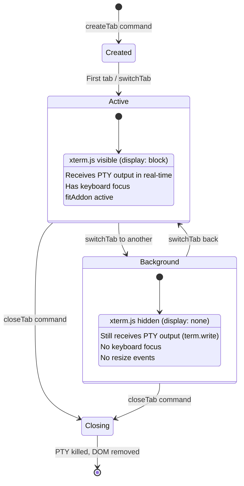
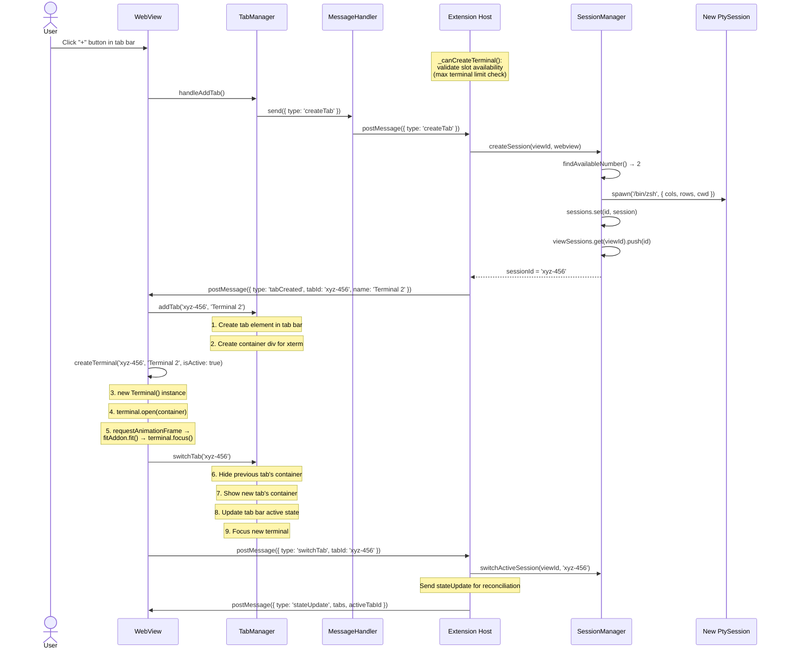
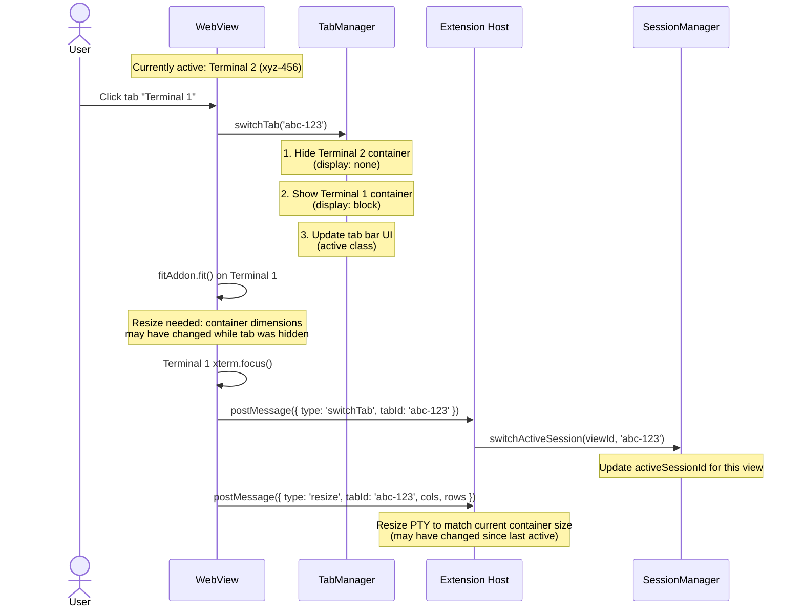
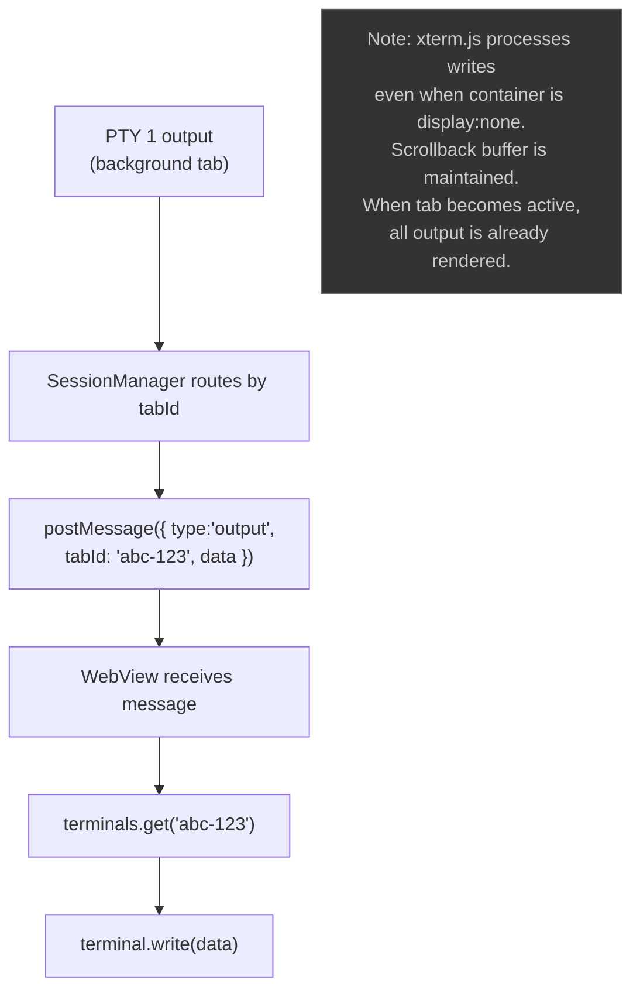
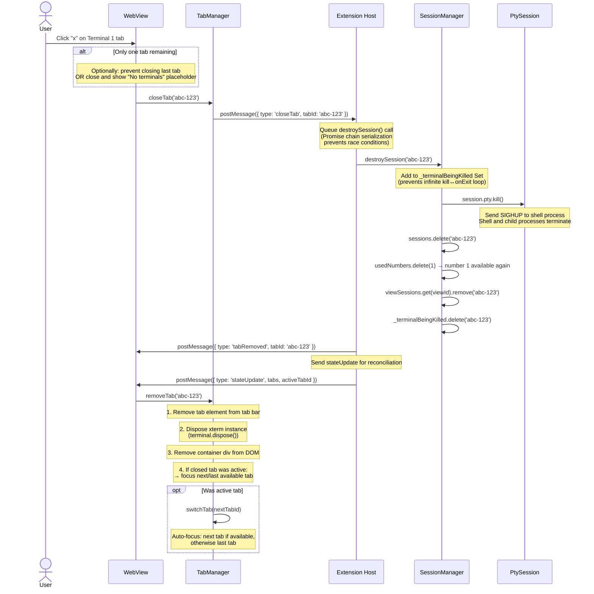
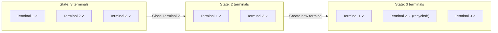
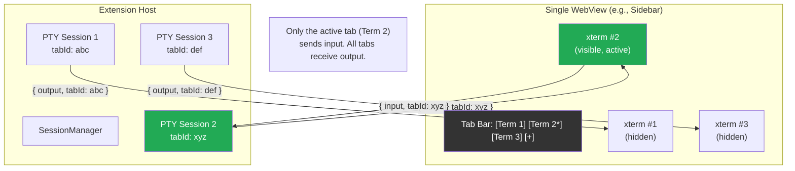
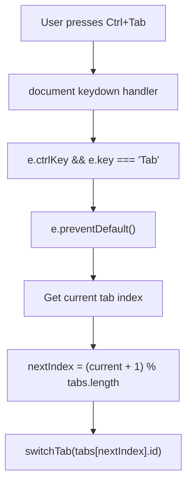

# Flow: Multi-Tab Lifecycle

> Part of [DESIGN.md](../DESIGN.md) - Section 3.5

## Overview

Each terminal view (sidebar, panel, editor) can host multiple terminal tabs. Each tab corresponds to an independent PTY session. This document covers the full lifecycle: create, switch, close, and the data routing between tabs.

> **Cross-references**: [session-manager.md](session-manager.md) | [message-protocol.md](message-protocol.md)

## Tab State Machine



## Create Tab Flow



### Max Terminal Limit

Before creating a new terminal, the extension checks `_canCreateTerminal()` to validate slot availability:

```typescript
private _canCreateTerminal(): boolean {
  const maxTabs = this.configManager.get('maxTabs', 10);
  const currentCount = this.sessionManager.getSessionCountForView(this.viewId);
  if (currentCount >= maxTabs) {
    vscode.window.showWarningMessage(
      `Maximum terminal limit (${maxTabs}) reached for this view.`
    );
    return false;
  }
  return true;
}
```

### Tab Focus Management

When a new tab is created, focus is managed using `requestAnimationFrame` to ensure the DOM is ready:

```typescript
requestAnimationFrame(() => {
  fitAddon.fit();
  terminal.focus();
});
```

This pattern ensures the terminal container has been laid out before fitting and focusing.

## Switch Tab Flow



### Resize-on-Switch Detail

When switching tabs, the newly active tab may need a resize because the container dimensions could have changed while the tab was hidden (e.g., the user resized the sidebar while a different tab was active). The `fitAddon.fit()` call recalculates cols/rows based on current container dimensions and emits a resize message if they differ from the previous values.

### Background Tab Output



## Close Tab Flow



### Operation Queue for Tab Close

Tab close operations are serialized through a Promise chain to prevent race conditions (pattern from reference project):

```typescript
private _operationQueue: Promise<void> = Promise.resolve();

closeTab(tabId: string): void {
  this._operationQueue = this._operationQueue.then(async () => {
    await this.sessionManager.destroySession(tabId);
    this.webview.postMessage({ type: 'tabRemoved', tabId });
  });
}
```

This ensures that if multiple tabs are closed rapidly (e.g., "close all"), each destroy completes before the next begins.

### Kill Tracking: `_terminalBeingKilled`

To prevent an infinite loop between `kill()` and `onExit()`, the SessionManager tracks terminals being killed:

```typescript
private _terminalBeingKilled = new Set<string>();

async destroySession(id: string): Promise<void> {
  if (this._terminalBeingKilled.has(id)) return;
  this._terminalBeingKilled.add(id);
  
  try {
    const session = this.sessions.get(id);
    if (session) {
      session.pty.kill();
      // ... cleanup
    }
  } finally {
    this._terminalBeingKilled.delete(id);
  }
}
```

Without this guard, `kill()` triggers `onExit()`, which might call `destroySession()` again.

### State Sync After Mutations

After tab mutations (create, close), the extension sends a `stateUpdate` message so the WebView can reconcile its state:

```typescript
// After create or close
webview.postMessage({
  type: 'stateUpdate',
  tabs: this.sessionManager.getTabsForView(viewId),
  activeTabId: this.sessionManager.getActiveSessionId(viewId),
});
```

This ensures the WebView's tab state matches the extension's session state, even if messages were lost or delivered out of order.

## Tab Number Recycling



### Number Recycling Algorithm

```typescript
private findAvailableNumber(): number {
  // Scan 1..MAX for first unused number
  for (let i = 1; i <= MAX_TABS; i++) {
    if (!this.usedNumbers.has(i)) {
      this.usedNumbers.add(i);
      return i;
    }
  }
  // Fallback: use size + 1
  return this.usedNumbers.size + 1;
}
```

## Data Routing Architecture



**Key principle**: All tabs receive output simultaneously (so scrollback is up-to-date), but only the active tab sends input (keyboard focus).

## Keyboard Shortcut: Ctrl+Tab



Ctrl+Shift+Tab cycles in reverse order.
