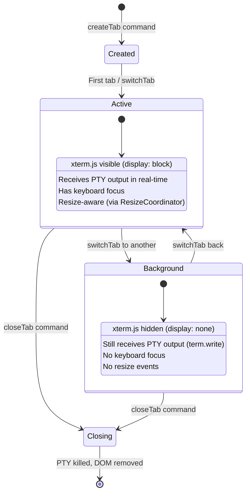
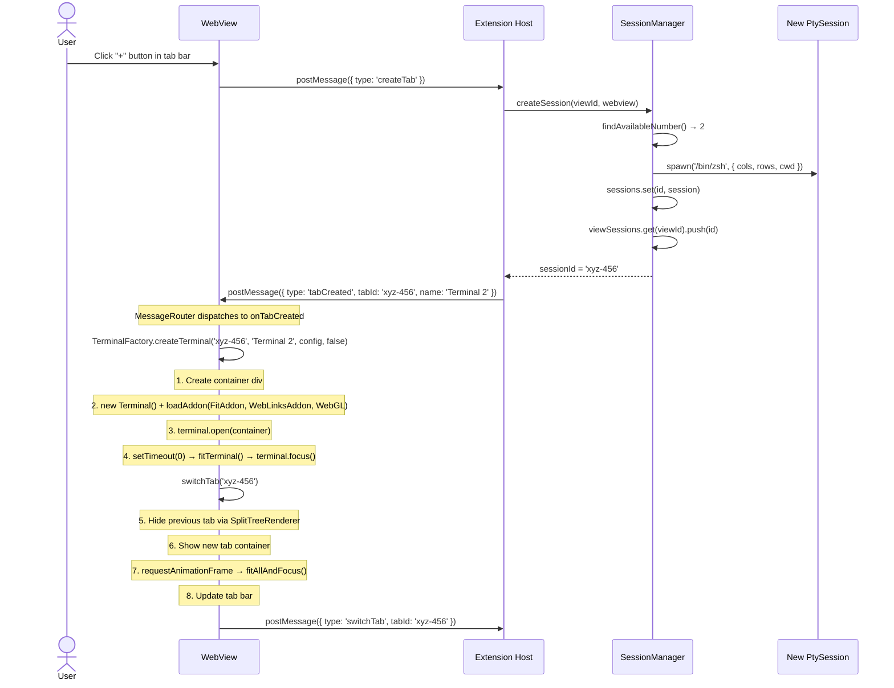
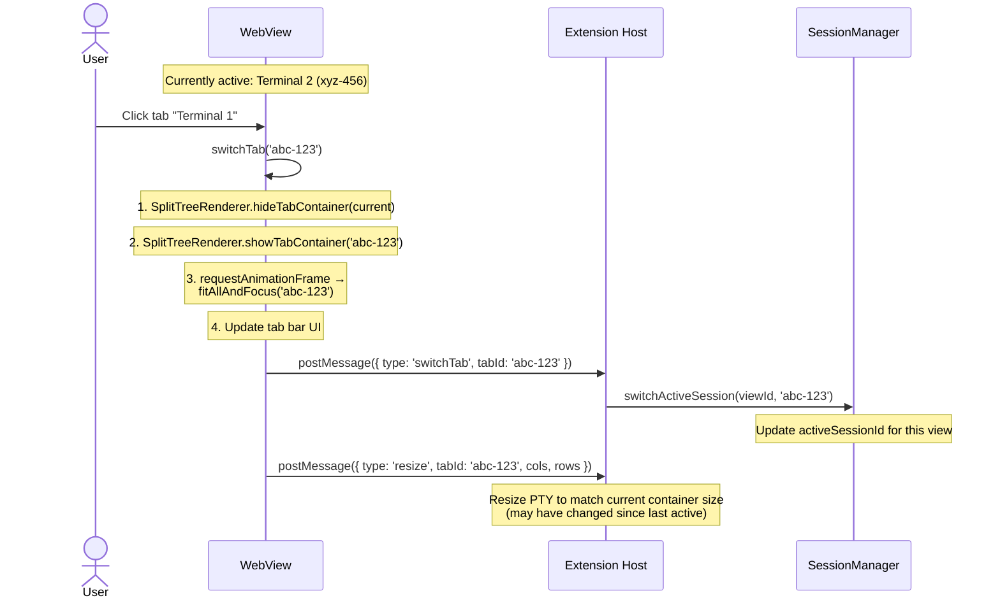
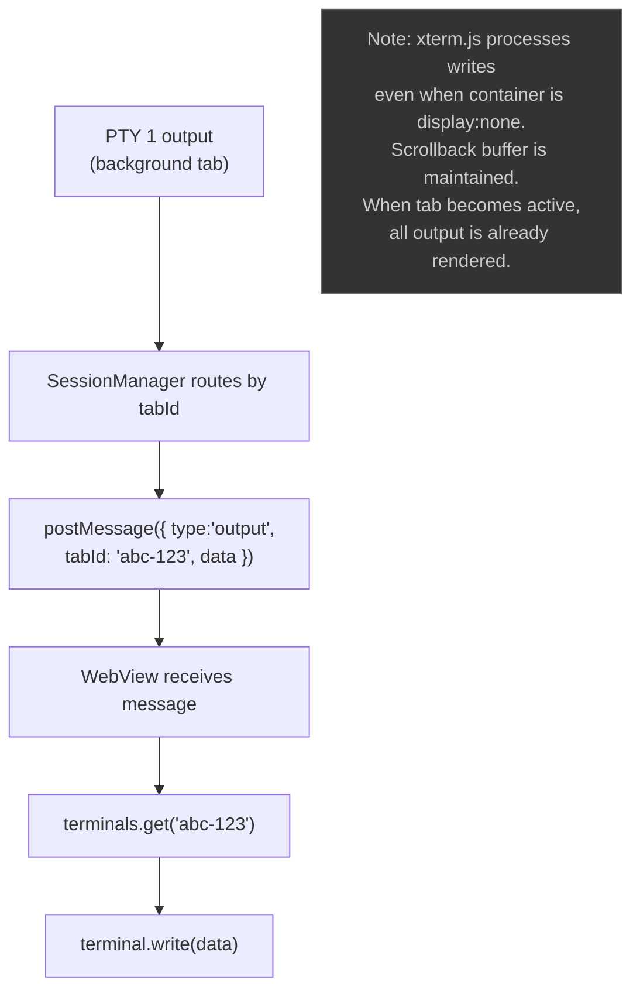
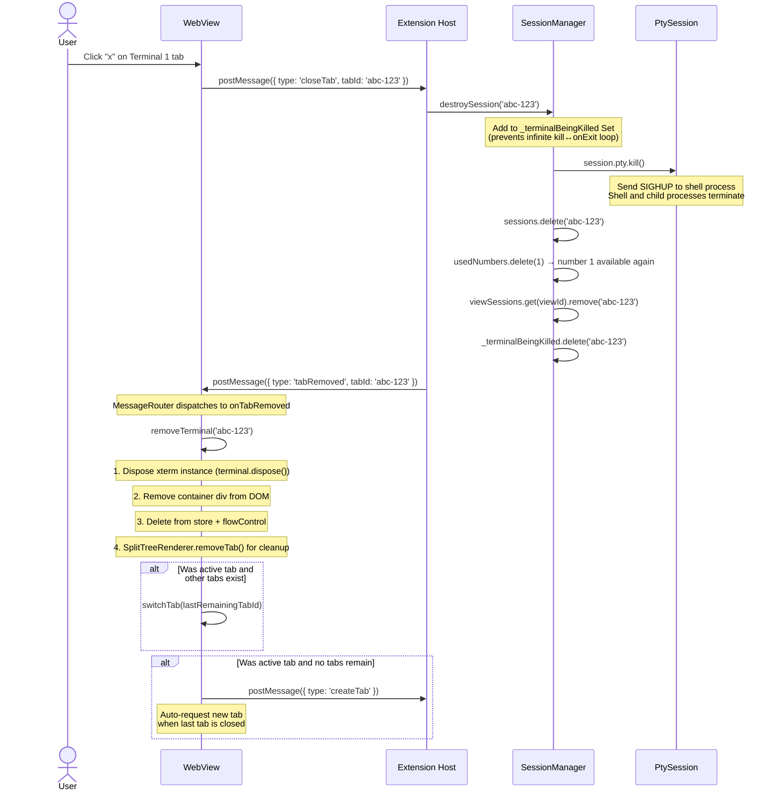
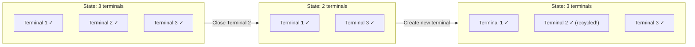
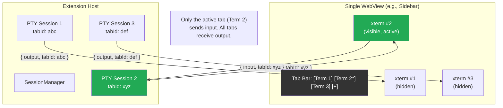
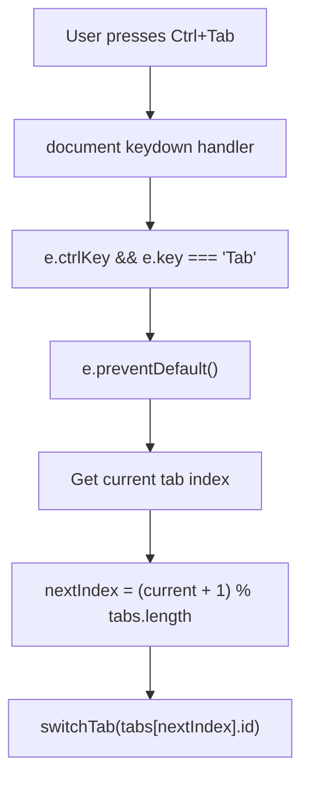

# Flow: Multi-Tab Lifecycle

> Part of [DESIGN.md](../DESIGN.md) - Section 3.5

## Overview

Each terminal view (sidebar, panel, editor) can host multiple terminal tabs. Each tab corresponds to an independent PTY session. This document covers the full lifecycle: create, switch, close, and the data routing between tabs.

> **Cross-references**: [session-manager.md](session-manager.md) | [message-protocol.md](message-protocol.md)

## Tab State Machine



## Create Tab Flow



### Tab Focus Management

When a new tab is created, focus is managed using `requestAnimationFrame` to ensure the DOM is ready:

```typescript
requestAnimationFrame(() => {
  factory.fitAllAndFocus(tabId, instance);
});
```

This pattern ensures the terminal container has been laid out before fitting and focusing.

## Switch Tab Flow



### Resize-on-Switch Detail

When switching tabs, the newly active tab may need a resize because the container dimensions could have changed while the tab was hidden (e.g., the user resized the sidebar while a different tab was active). `factory.fitAllAndFocus()` calls `XtermFitService.fitTerminal()` on all leaf terminals in the tab's split tree, recalculating cols/rows and emitting resize messages for any that changed.

### Background Tab Output



## Close Tab Flow



### Kill Tracking: `_terminalBeingKilled`

To prevent an infinite loop between `kill()` and `onExit()`, the SessionManager tracks terminals being killed:

```typescript
private _terminalBeingKilled = new Set<string>();

async destroySession(id: string): Promise<void> {
  if (this._terminalBeingKilled.has(id)) return;
  this._terminalBeingKilled.add(id);
  
  try {
    const session = this.sessions.get(id);
    if (session) {
      session.pty.kill();
      // ... cleanup
    }
  } finally {
    this._terminalBeingKilled.delete(id);
  }
}
```

Without this guard, `kill()` triggers `onExit()`, which might call `destroySession()` again.

### Split Pane Lifecycle

Split pane operations (create, close, restructure) are handled by `SplitTreeRenderer`. When a tab has split panes:
- Closing a split pane removes it from the split tree and restructures the layout
- The `WebviewStateStore` persists layout state via `vscode.setState()`
- `ResizeCoordinator.debouncedFitAllLeaves()` refits all remaining panes after restructure

### Auto-Create on Last Tab Close

When the last tab is closed, the webview automatically requests a new tab:

```typescript
if (remaining.length > 0) {
  switchTab(remaining[remaining.length - 1]);
} else {
  store.activeTabId = null;
  vscode.postMessage({ type: 'createTab' });
}
```

## Tab Number Recycling



### Number Recycling Algorithm

```typescript
private findAvailableNumber(): number {
  // Scan 1..MAX for first unused number
  for (let i = 1; i <= MAX_TABS; i++) {
    if (!this.usedNumbers.has(i)) {
      this.usedNumbers.add(i);
      return i;
    }
  }
  // Fallback: use size + 1
  return this.usedNumbers.size + 1;
}
```

## Data Routing Architecture



**Key principle**: All tabs receive output simultaneously (so scrollback is up-to-date), but only the active tab sends input (keyboard focus).

## Keyboard Shortcut: Ctrl+Tab



Ctrl+Shift+Tab cycles in reverse order.
