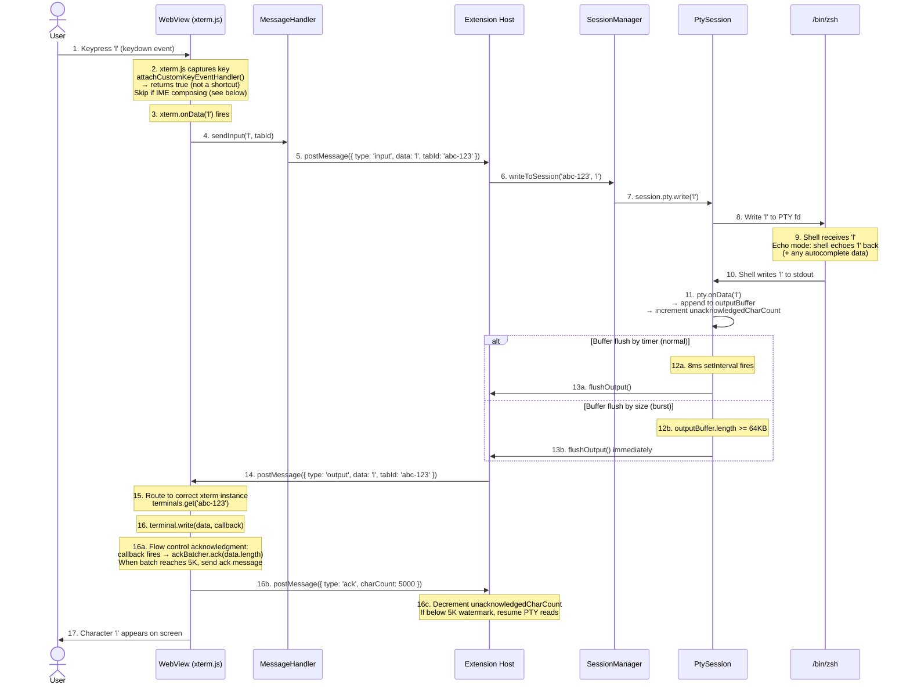
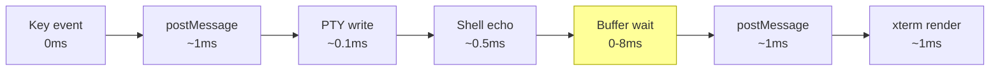
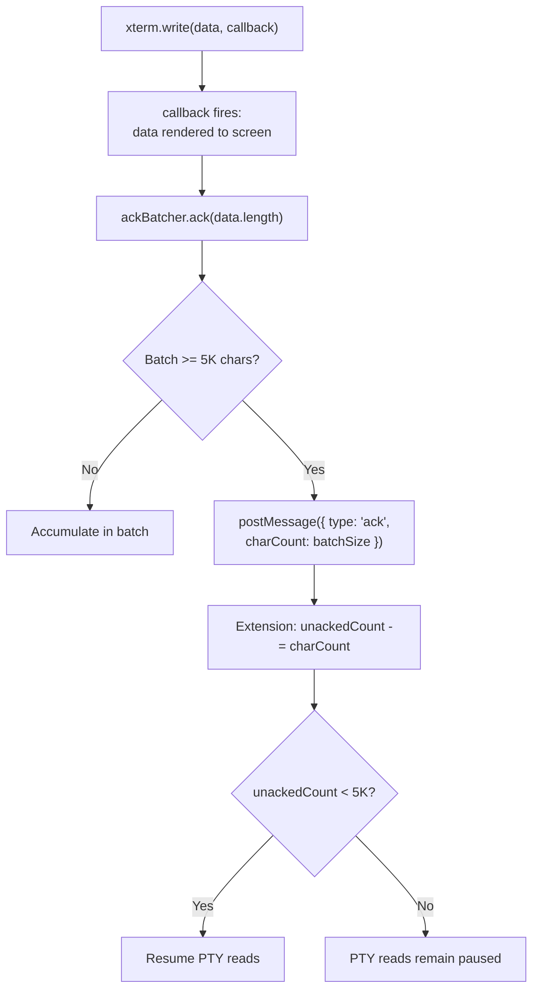

# Flow: User Input (Keystroke → Shell → Output)

> Part of [DESIGN.md](../DESIGN.md) - Section 3.2

## Overview

This diagram traces the complete round-trip of a single keystroke: from user pressing a key, through the IPC bridge, into the PTY shell, and back to the screen as rendered output. Includes flow control acknowledgment on the output path.

> **Cross-references**: [output-buffering.md](output-buffering.md) | [keyboard-input.md](keyboard-input.md)

## Sequence Diagram



## Latency Budget



**Target**: Total round-trip < 12ms for interactive typing feel.
**Bottleneck**: The 8ms buffer timer. For interactive input, this is acceptable because individual keystrokes produce small output and the buffer flushes quickly.

## Flow Control Acknowledgment

The output path includes a flow control mechanism to prevent the PTY from overwhelming the WebView:



See [output-buffering.md](output-buffering.md) for the complete two-layer buffering and flow control design (100K high watermark / 5K low watermark).

## Special Input Cases

### Multi-byte Input (e.g., Arrow Keys)

Arrow keys produce escape sequences, not single characters:

| Key | Escape Sequence | Description |
|-----|----------------|-------------|
| Up | `\x1b[A` | Previous command in history |
| Down | `\x1b[B` | Next command in history |
| Right | `\x1b[C` | Move cursor right |
| Left | `\x1b[D` | Move cursor left |
| Home | `\x1b[H` | Move to line start |
| End | `\x1b[F` | Move to line end |

xterm.js automatically translates these key events into the correct escape sequences via `onData`.

### Paste Input (large data)

When the user pastes a large block of text:
1. xterm.js emits the entire pasted string via `onData` in one call
2. The IPC bridge sends it as a single `input` message
3. The PTY processes it character by character
4. Output buffering prevents flooding the WebView with per-character echoes

### Bracketed Paste Mode

When pasting multi-line text, the terminal may be in bracketed paste mode. The handler checks `terminal.modes.bracketedPasteMode` and wraps the pasted content accordingly:

```
if (terminal.modes.bracketedPasteMode) {
  data = '\x1b[200~' + data + '\x1b[201~';
}
```

This tells the shell that the content is pasted (not typed), preventing it from executing each line immediately. See [keyboard-input.md](keyboard-input.md) for full paste handling.

### IME Composition (CJK Input)

For Chinese, Japanese, and Korean input methods, xterm.js tracks IME composition state:

- `compositionstart` event → set `isComposing = true`
- `compositionend` event → set `isComposing = false`, send composed text
- While `isComposing`, all keyboard shortcuts are **skipped** to avoid interfering with the composition

This is critical for CJK users where multiple keystrokes compose a single character. The custom key event handler must check composition state before processing shortcuts.

### Tab Completion

When pressing `Tab`:
1. `\t` (0x09) is sent to the shell
2. Shell performs completion and may output:
   - The completed text (single match)
   - A bell character `\x07` (ambiguous)
   - A list of possibilities (multiple matches)
3. All output goes through the normal buffered output path
