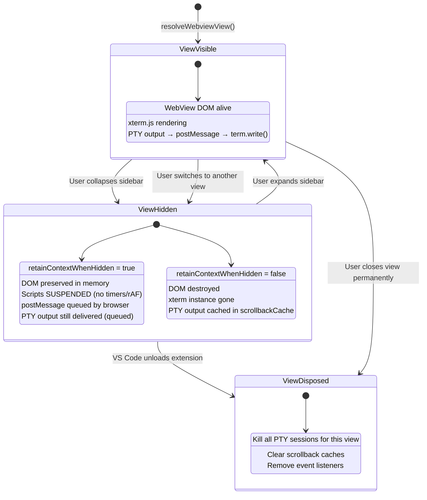
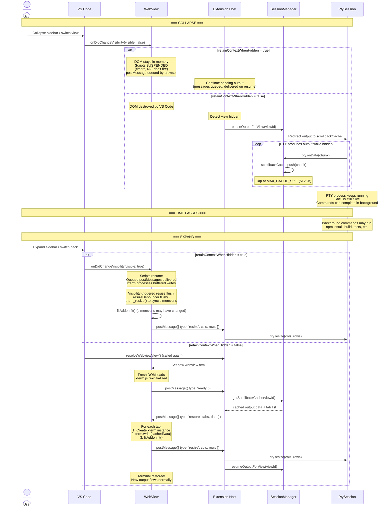
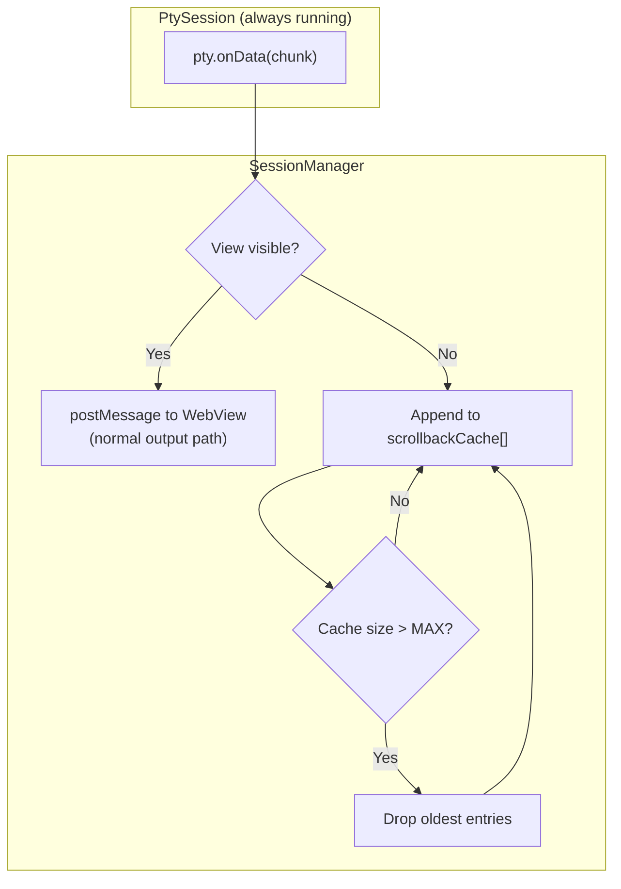

# Flow: View Collapse/Expand Recovery

> Part of [DESIGN.md](../DESIGN.md) - Section 3.4

## Overview

When a user collapses a sidebar or switches away from a panel, VS Code may hide or destroy the WebView. The PTY process must continue running independently, and the terminal must be seamlessly restored when the view becomes visible again.

> **Cross-references**: [webview-provider.md](webview-provider.md) | [resize-handling.md](resize-handling.md) | [output-buffering.md](output-buffering.md)

## State Diagram



## Important: Script Suspension When Hidden

When `retainContextWhenHidden = true`, the DOM is preserved but **scripts are SUSPENDED** by the browser (from VS Code docs). This has critical implications:

| Behavior | When Hidden | When Visible Again |
|----------|------------|-------------------|
| `setTimeout` / `setInterval` | **Do NOT fire** | Resume firing |
| `requestAnimationFrame` | **Does NOT fire** | Resume firing |
| DOM state | **Preserved** | Immediately available |
| `postMessage` delivery | **Queued** by browser | Delivered when scripts resume |
| xterm.js rendering | **Stopped** | Resumes, processes queued writes |

**Key insight**: You CANNOT send messages to a hidden webview that will be processed immediately. Messages are queued by the browser and processed when scripts resume (when the view becomes visible again). This is why the PTY can continue running and output accumulates safely.

### State Persistence via setState()/getState()

As an additional fallback, the WebView can use `vscode.setState()` / `vscode.getState()` to persist critical state:

```typescript
// Save state periodically and before hide
vscode.setState({
  activeTabId,
  tabOrder: [...tabs.keys()],
  scrollPositions: Object.fromEntries(
    [...terminals].map(([id, t]) => [id, t.terminal.buffer.active.viewportY])
  ),
});

// Restore on re-creation (if retainContext fails)
const previousState = vscode.getState();
if (previousState) {
  // Restore tab order and active tab
}
```

## Sequence Diagram: Collapse & Expand



## Visibility-Triggered Resize Flush

When the view becomes visible again, the container dimensions may have changed while hidden (e.g., user resized the sidebar while a different view was active). From VS Code's `terminalInstance.ts` `setVisible()`:

```typescript
// On visibility change to true
if (visible) {
  // Flush any pending resize
  this._resizeDebouncer.flush();
  // Force a resize calculation
  this._resize();
  // Re-fit terminal to current container
  this._fitAddon.fit();
}
```

This ensures the terminal dimensions are synchronized immediately on reveal, rather than waiting for the next resize event.

## WebviewViewPane Claim/Release Model

VS Code internally uses a claim/release model for WebView views:

- **`claim()`** is called when the view becomes visible — the WebView's scripts resume and it begins receiving messages
- **`release()`** is called when the view is hidden — the WebView's scripts are suspended

This is an internal VS Code mechanism and not directly accessible to extensions, but it explains the suspension behavior described above. Our extension observes the effects via `onDidChangeVisibility`.

## Scrollback Cache Design



### Cache Configuration

| Parameter | Value | Notes |
|-----------|-------|-------|
| `MAX_CACHE_SIZE` | 512KB | Caps memory usage per session |
| Storage format | `string[]` | One entry per `onData` chunk |
| Restore method | `chunks.join('')` → `term.write()` | Single write for efficiency |
| Memory estimate | ~100KB-512KB per session | Depends on output volume |

## Recommended Strategy: `retainContextWhenHidden = true`

For AnyWhere Terminal, **always use `retainContextWhenHidden: true`** because:

1. **Simplicity**: No need to implement scrollback cache/restore logic for MVP
2. **Fidelity**: All terminal state (scrollback, cursor position, colors) is perfectly preserved
3. **Performance**: No costly re-initialization on expand
4. **Trade-off**: Slightly higher memory usage (~10-20MB per hidden WebView)

The scrollback cache approach is documented as a **fallback** for future optimization or edge cases where VS Code forces WebView destruction despite `retainContextWhenHidden`.

## Edge Cases

1. **Window reload**: VS Code window reload (`Cmd+Shift+P` → "Reload Window") destroys ALL WebViews and the Extension Host. PTY processes are killed. Session persistence requires `workspaceState` storage (Phase 3).

2. **Extension update**: Updating the extension triggers a full reload. Same behavior as window reload.

3. **Multiple views**: Each view (sidebar, panel) has independent lifecycle. Collapsing the sidebar does not affect the panel terminal.

4. **Rapid toggle**: If a user rapidly collapses and expands the view, the queued messages from the hidden period are delivered in order when scripts resume. No special handling is needed for this case with `retainContextWhenHidden = true`.
