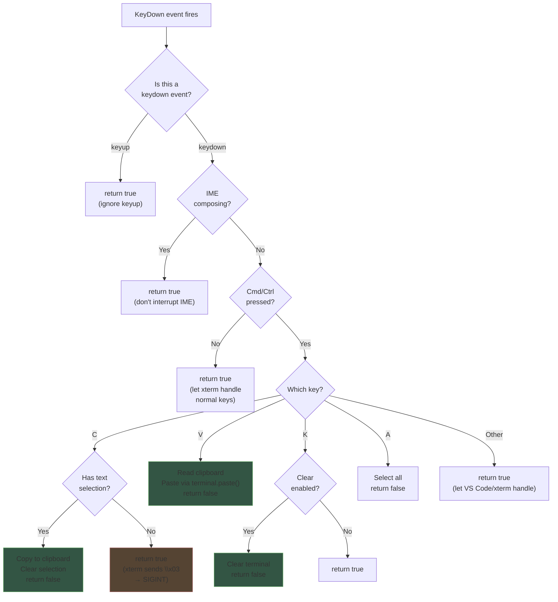
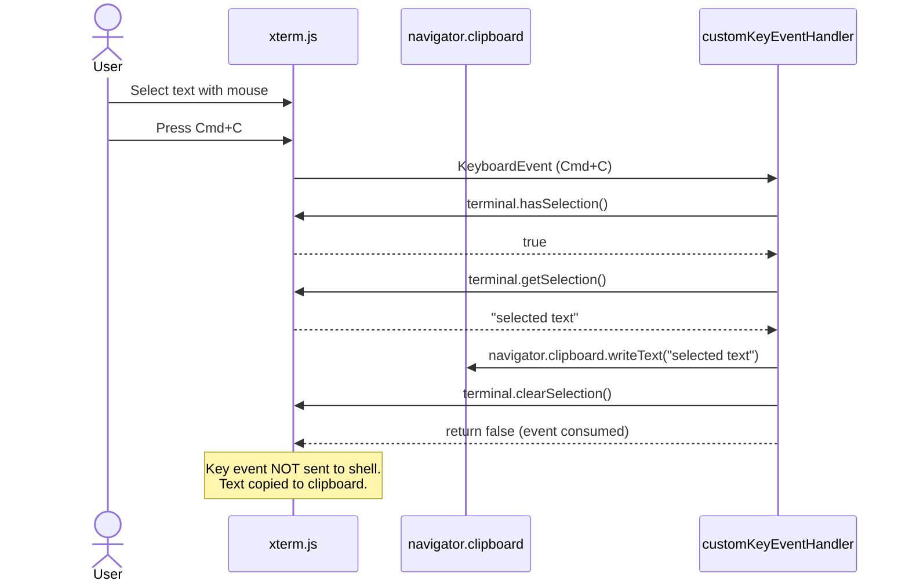
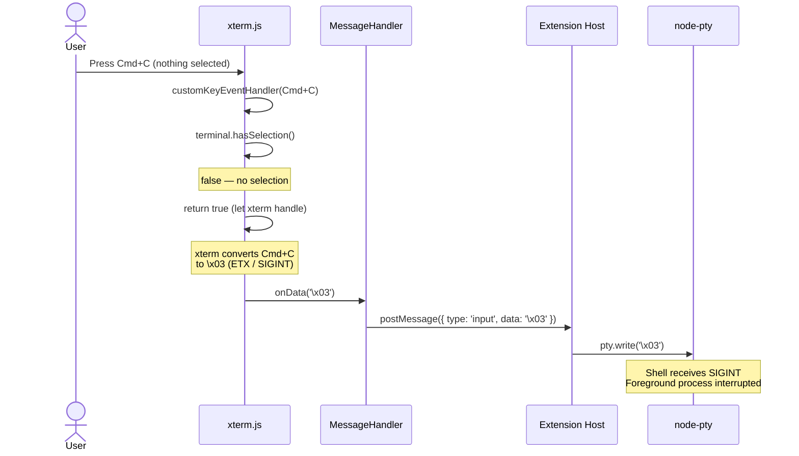
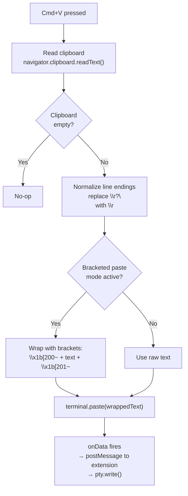
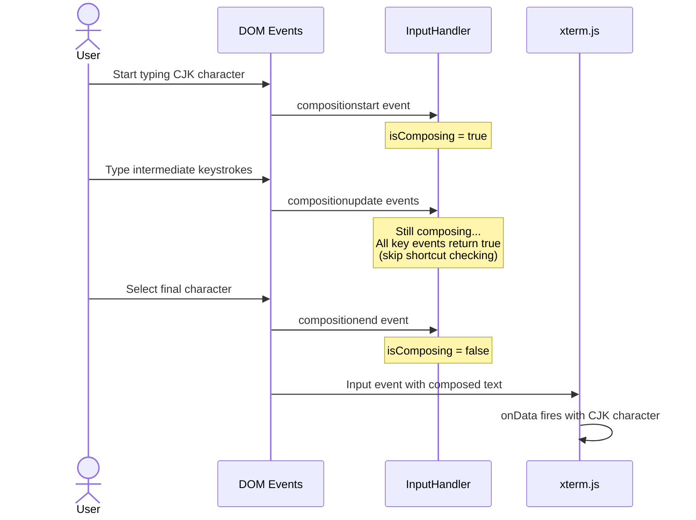
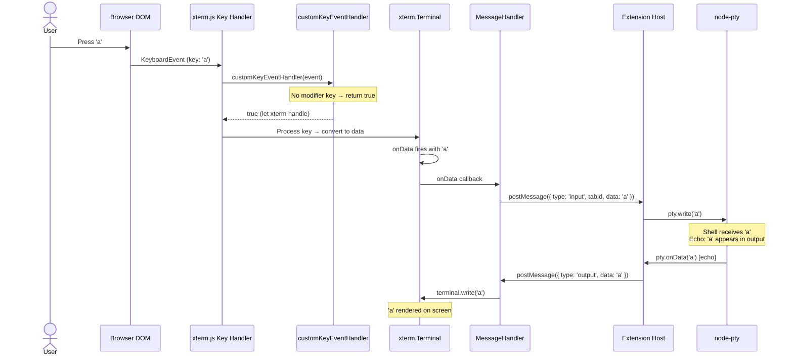
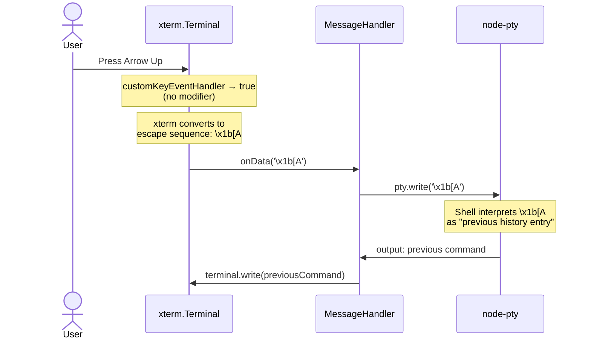

# Keyboard & Input Handling — Detailed Design

## 1. Overview

In a VS Code webview terminal, every keystroke must pass through a gatekeeper: xterm.js's `attachCustomKeyEventHandler`. This handler decides whether a key event should be:

1. **Intercepted** by our code (e.g., Cmd+C for copy, Cmd+V for paste) — returns `false` to prevent xterm from processing the event.
2. **Passed through** to xterm.js — returns `true`, which lets xterm process the key, convert it to terminal data, and fire `onData` with the appropriate escape sequence or character.

Without this handler, standard keyboard shortcuts (copy, paste, clear) would be sent as raw bytes to the shell process instead of performing their expected IDE actions.

### Reference Sources
- VS Code: `src/vs/workbench/contrib/terminal/browser/terminalInstance.ts` (custom key handler, lines ~800-900)
- VS Code: `src/vs/workbench/contrib/terminal/browser/terminalInstance.ts:1343` (bracketed paste)
- Reference project: `webview/InputManager.ts` (IME handling)
- xterm.js: `attachCustomKeyEventHandler` API docs, `terminal.modes.bracketedPasteMode`

---

## 2. Key Event Handler Decision Tree

### Full Decision Flow



### Handler Implementation

```typescript
terminal.attachCustomKeyEventHandler((event: KeyboardEvent): boolean => {
  // Only process keydown events
  if (event.type !== 'keydown') return true;

  // Don't intercept during IME composition
  if (isComposing) return true;

  const isMac = navigator.platform.includes('Mac');
  const modifier = isMac ? event.metaKey : event.ctrlKey;

  if (!modifier) return true; // No modifier key — let xterm handle

  switch (event.key.toLowerCase()) {
    case 'c':
      if (terminal.hasSelection()) {
        // Copy selected text to clipboard
        navigator.clipboard.writeText(terminal.getSelection());
        terminal.clearSelection();
        return false; // Prevent xterm from processing
      }
      // No selection: let xterm handle → sends \x03 (SIGINT)
      return true;

    case 'v':
      handlePaste(terminal);
      return false;

    case 'k':
      if (config.enableCmdK) {
        terminal.clear(); // Clears scrollback, keeps current line
        return false;
      }
      return true;

    case 'a':
      terminal.selectAll();
      return false;

    default:
      // All other Cmd/Ctrl combos: let xterm handle
      // (xterm passes unrecognized combos back to VS Code)
      return true;
  }
});
```

---

## 3. Cmd+C Dual Behavior

The most important key handling subtlety: **Cmd+C must behave differently depending on whether text is selected**.

### Cmd+C with Selection → Copy



### Cmd+C without Selection → SIGINT



---

## 4. Paste Flow with Bracketed Paste Mode

### What is Bracketed Paste Mode?

Bracketed paste mode is a terminal feature (DEC private mode 2004) that wraps pasted text with escape sequences so the shell can distinguish pasted text from typed text. This prevents issues where pasted multi-line text is interpreted as multiple commands.

| Sequence | Meaning |
|---|---|
| `\x1b[200~` | Start of paste |
| `\x1b[201~` | End of paste |

Modern shells (zsh, bash 4.4+, fish) enable this mode automatically. When active, pasted text like `echo hello\necho world` is treated as a single paste event rather than two commands.

### Paste Decision Flow



### Bracketed Paste Implementation

```typescript
async function handlePaste(terminal: Terminal): Promise<void> {
  try {
    const text = await navigator.clipboard.readText();
    if (!text) return;

    // Normalize line endings: \r\n or \n → \r (terminal convention)
    const normalized = text.replace(/\r?\n/g, '\r');

    // Check if bracketed paste mode is active
    if (terminal.modes.bracketedPasteMode) {
      // Wrap paste with bracket sequences
      // The shell will see these markers and treat the content as a paste
      const bracketedText = `\x1b[200~${normalized}\x1b[201~`;
      terminal.paste(bracketedText);
    } else {
      terminal.paste(normalized);
    }
  } catch (err) {
    // Clipboard API may fail due to permissions or focus
    console.warn('Clipboard read failed:', err);
  }
}
```

### Line Ending Normalization

| Source Format | Terminal Format | Reason |
|---|---|---|
| `\n` (Unix) | `\r` | Terminal input uses CR, not LF |
| `\r\n` (Windows) | `\r` | Strip the LF, keep CR |
| `\r` (old Mac) | `\r` | Already correct |

This normalization is critical. Without it, pasting multi-line text from a file or web page would produce incorrect behavior — the shell expects `\r` (carriage return) as the line separator in input.

---

## 5. IME Composition Handling

### Problem

Input Method Editors (IME) are used for CJK (Chinese, Japanese, Korean) text input and other complex scripts. During IME composition, the user types multiple keystrokes that compose into a single character or word. If we process keyboard shortcuts during composition, we'll interrupt the IME and break the input.

### Composition State Tracking



### Implementation

```typescript
let isComposing = false;

// Track IME composition state
document.addEventListener('compositionstart', () => {
  isComposing = true;
});

document.addEventListener('compositionend', () => {
  isComposing = false;
});

// In the custom key event handler:
terminal.attachCustomKeyEventHandler((event: KeyboardEvent): boolean => {
  // CRITICAL: Don't intercept keys during IME composition
  if (isComposing) return true;

  // ... rest of key handling ...
});
```

### Why This Matters

| Without IME tracking | With IME tracking |
|---|---|
| User types `ni` (你 in pinyin) | User types `ni` (你 in pinyin) |
| `n` triggers key handler, checked for shortcuts | `n` passes through (isComposing=true) |
| `i` triggers key handler | `i` passes through |
| IME may be interrupted | IME completes normally |
| Garbled or missing input | 你 appears correctly |

---

## 6. Key Event Flow (End-to-End)

### Normal Keystroke (e.g., typing 'a')



### Special Key (e.g., Arrow Up → command history)



---

## 7. VS Code Keybinding Conflicts

### The Problem

VS Code has hundreds of built-in keybindings (e.g., Cmd+P for file picker, Cmd+Shift+P for command palette, Cmd+B for sidebar toggle). When our terminal webview has focus, these keybindings conflict with terminal input.

### VS Code's Internal Approach

VS Code's built-in terminal uses `softDispatch()` to test whether a keybinding has a registered command before deciding to intercept it. If a keybinding is registered, VS Code handles it; otherwise, the terminal processes the key.

**We cannot use this approach** because:
- `softDispatch()` is an internal VS Code API not available to extensions
- Webviews run in an isolated context without access to the keybinding service
- There is no extension API to query "is this keybinding registered?"

### Our Approach: Explicit Interception List

We maintain an explicit list of key combinations to intercept. Everything else passes through to xterm.js (which, in turn, passes unrecognized Cmd combos back to VS Code's keybinding system through the webview bridge).

### Key Routing Summary

| Key Combination | Terminal Focused | Action |
|---|---|---|
| Regular keys (a-z, 0-9, etc.) | → xterm.js → shell | Normal typing |
| Enter | → xterm.js → `\r` → shell | Execute command |
| Arrow keys | → xterm.js → escape sequences → shell | Navigation |
| Tab | → xterm.js → `\t` → shell | Completion |
| Escape | → xterm.js → `\x1b` → shell | Cancel/escape |
| Ctrl+C (no selection) | → xterm.js → `\x03` → shell | SIGINT |
| Cmd+C (with selection) | **Intercepted** | Copy to clipboard |
| Cmd+V | **Intercepted** | Paste from clipboard |
| Cmd+K | **Intercepted** (configurable) | Clear terminal |
| Cmd+A | **Intercepted** | Select all |
| Cmd+P | → VS Code | File picker (not intercepted) |
| Cmd+Shift+P | → VS Code | Command palette (not intercepted) |
| Cmd+B | → VS Code | Toggle sidebar (not intercepted) |
| Cmd+, | → VS Code | Settings (not intercepted) |

### Why Non-Intercepted Cmd Combos Reach VS Code

When `customKeyEventHandler` returns `true` for a Cmd combo that xterm.js doesn't recognize (e.g., Cmd+P), xterm.js doesn't consume the event. The browser's default behavior propagates the event, and VS Code's webview bridge forwards unhandled Cmd combos to the host window's keybinding system.

---

## 8. Configuration

### Input-Related Settings

| Setting | Type | Default | Description |
|---|---|---|
| `anywhereTerminal.enableCmdK` | `boolean` | `true` | Whether Cmd+K clears the terminal |
| `anywhereTerminal.macOptionIsMeta` | `boolean` | `false` | Treat Option key as Meta (for programs like emacs) |
| `anywhereTerminal.macOptionClickForcesSelection` | `boolean` | `true` | Option+click forces text selection (vs. sending escape) |

### macOptionIsMeta Behavior

When `macOptionIsMeta` is `true`:
- Option+key sends `\x1b` + key (Meta/Alt sequence)
- Useful for: emacs keybindings (M-f, M-b for word movement)
- Side effect: disables special character input (e.g., Option+3 for `#` on UK keyboards)

When `macOptionIsMeta` is `false` (default):
- Option+key types the macOS special character (e.g., Option+e for ´)
- Standard macOS behavior

---

## 9. Edge Cases

### 1. Clipboard Permissions

**Scenario**: `navigator.clipboard.readText()` fails because the webview doesn't have clipboard permissions.

**Handling**: The clipboard API call is wrapped in try/catch. On failure, a warning is logged. In VS Code webviews, clipboard access is generally granted, but may fail if the webview lost focus during the async operation.

### 2. Large Paste

**Scenario**: User pastes 10MB of text from clipboard.

**Handling**: The pasted text passes through `terminal.paste()` which feeds it to `onData()`. This triggers normal output buffering and flow control. The PTY may pause if the input overwhelms the shell. No special handling needed beyond existing flow control.

### 3. Dead Keys

**Scenario**: User types a dead key combination (e.g., Option+e followed by a for á on macOS).

**Handling**: Dead key sequences produce `compositionstart`/`compositionend` events, which are handled by our IME composition tracking. The key handler skips shortcut checking during composition.

### 4. Ctrl+C vs. Cmd+C on macOS

**Scenario**: User presses Ctrl+C on macOS (not Cmd+C).

**Handling**: Our handler checks `event.metaKey` on macOS, not `event.ctrlKey`. Ctrl+C passes through to xterm.js, which converts it to `\x03` (SIGINT) — the standard Unix interrupt. This is correct behavior; Ctrl+C should always send SIGINT regardless of selection state.

---

## 10. Interface Definition

```typescript
interface IInputHandler {
  /**
   * Attach key event handler and clipboard handling to a terminal.
   * Should be called once per terminal instance after terminal.open().
   */
  attach(terminal: Terminal, tabId: string): void;

  /**
   * Detach handlers. Called when terminal is disposed.
   */
  detach(): void;

  /**
   * Update input configuration (e.g., enableCmdK changed).
   */
  updateConfig(config: Partial<InputConfig>): void;
}

interface InputConfig {
  enableCmdK: boolean;
  macOptionIsMeta: boolean;
  macOptionClickForcesSelection: boolean;
}
```

---

## 11. File Location

```
src/webview/terminal/InputHandler.ts
```

### Dependencies
- `@xterm/xterm` — `Terminal` type, `attachCustomKeyEventHandler`, `terminal.modes`
- Browser APIs — `navigator.clipboard`, `compositionstart`/`compositionend` events

### Dependents
- `TerminalWebviewApp` (main.ts) — creates InputHandler and attaches to each terminal
- `TerminalManager` — passes config updates to InputHandler
