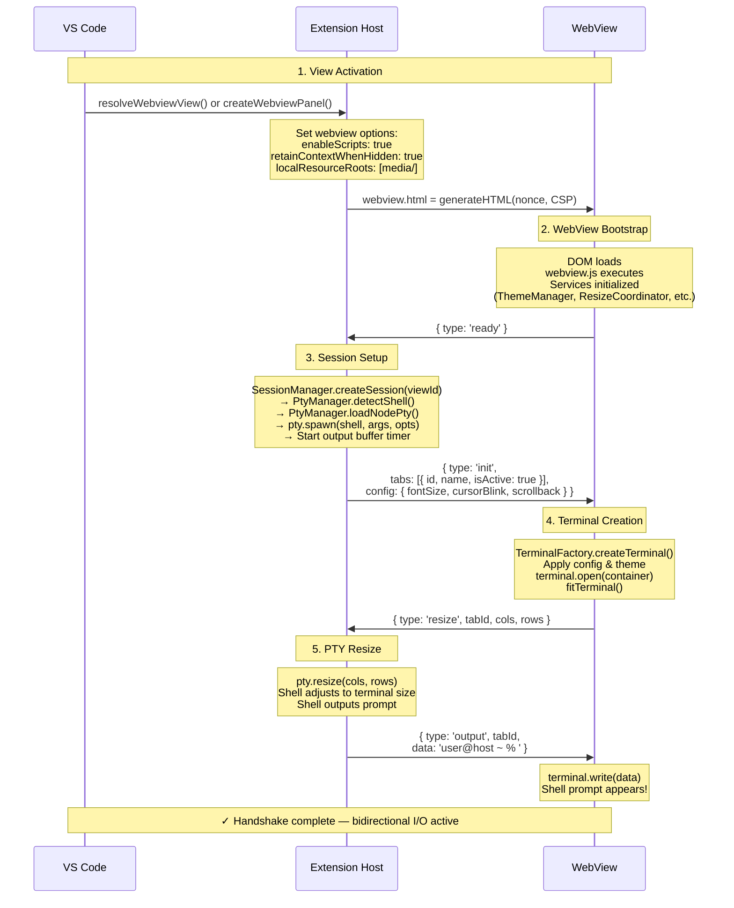
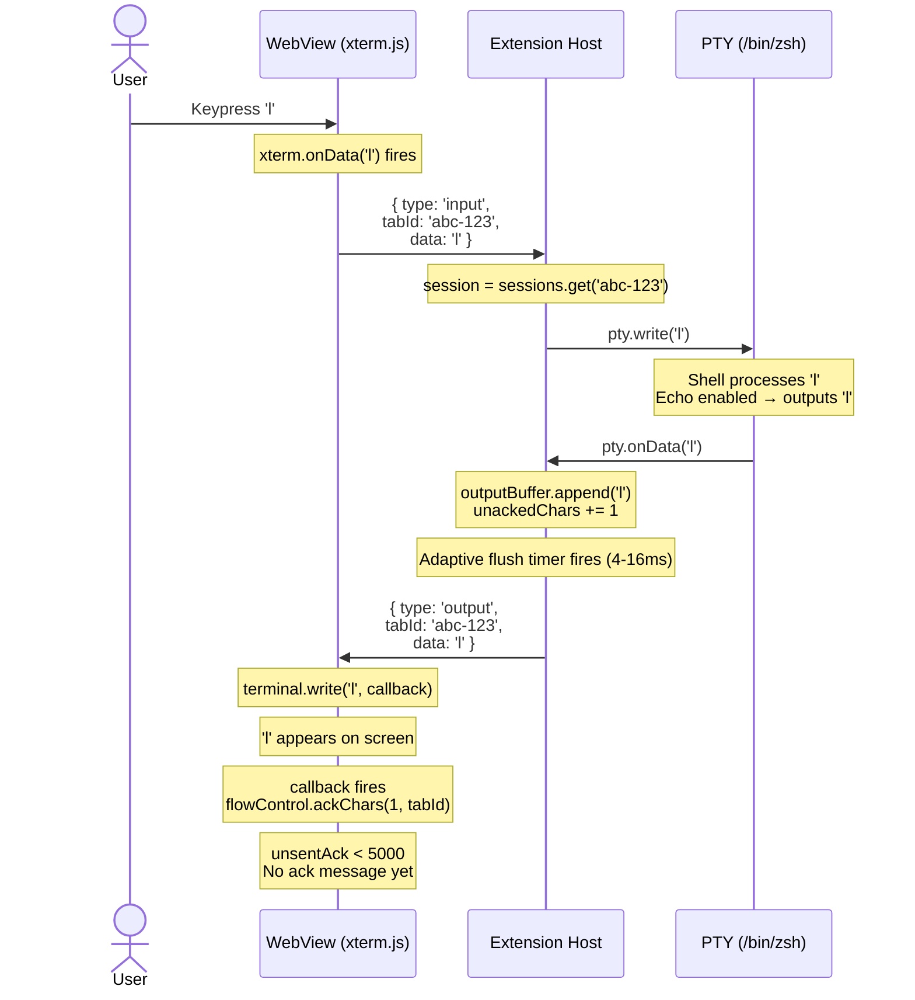
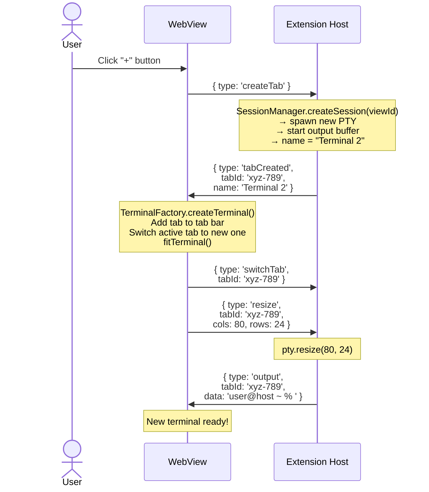
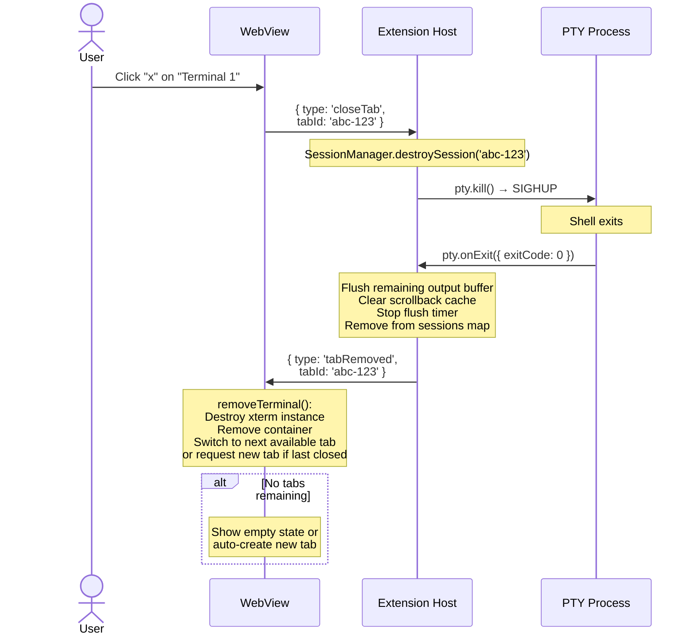
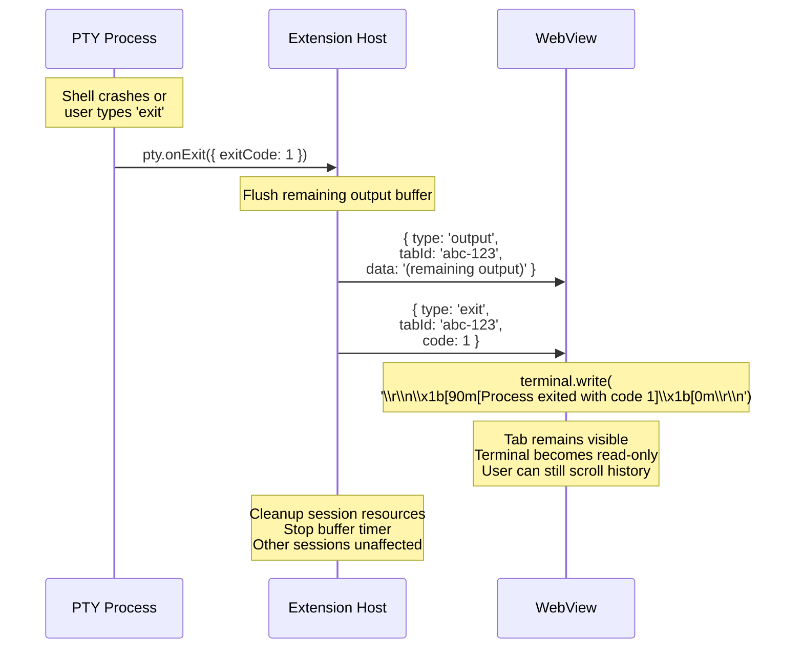
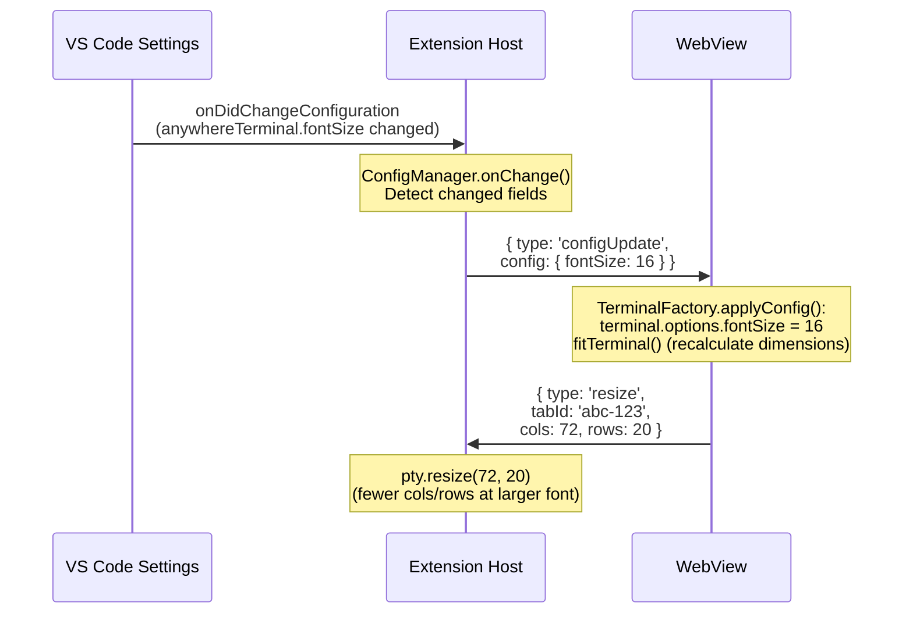
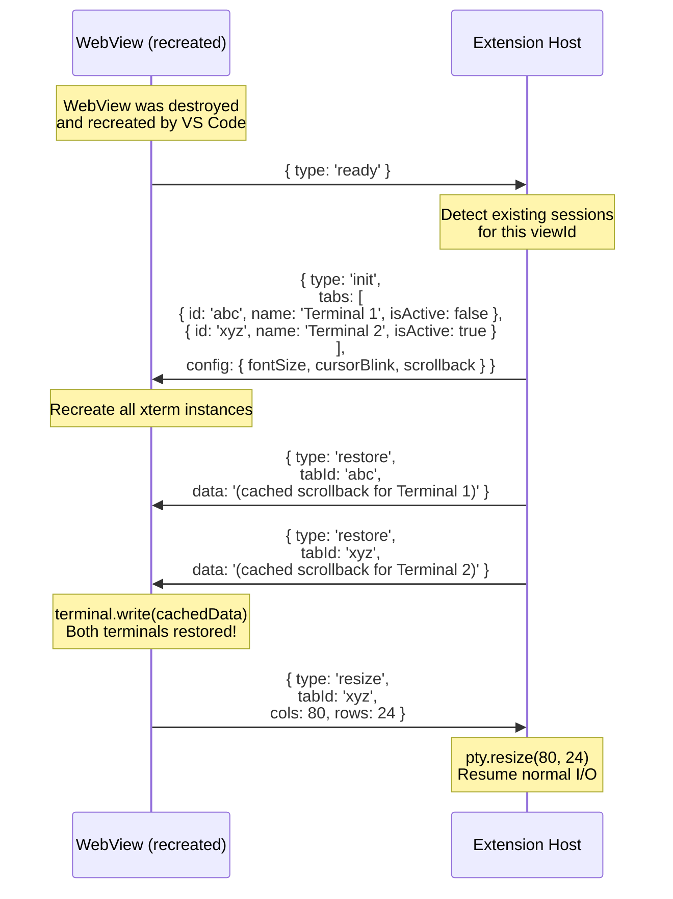

# Message Protocol Specification — Detailed Design

## 1. Overview

AnyWhere Terminal uses a **bidirectional message protocol** over VS Code's `postMessage` IPC to communicate between the Extension Host (Node.js) and WebView (browser sandbox). All messages are JSON objects transported via `Webview.postMessage()` (extension → webview) and `vscode.postMessage()` (webview → extension).

This document is the authoritative specification for every message type, its payload, ordering guarantees, and handshake sequences.

### Reference
- Parent design: `docs/DESIGN.md` §4 (Message Protocol Specification)
- Flow control: `docs/design/output-buffering.md` §4 (Flow Control)

---

## 2. Design Principles

### 2.1 Discriminated Union Types

Every message has a `type` field that acts as the discriminant. TypeScript's narrowing ensures handlers get compile-time type safety:

```typescript
// The 'type' field is the discriminant
switch (msg.type) {
  case 'input':
    // TypeScript knows msg.tabId and msg.data exist here
    session.pty.write(msg.data);
    break;
  case 'ready':
    // TypeScript knows msg has no payload fields
    break;
}
```

### 2.2 Type-Safe TypeScript

- All message types are defined as interfaces with literal `type` fields
- Union types (`WebViewToExtensionMessage`, `ExtensionToWebViewMessage`) enable exhaustive switch/case
- Shared definitions live in `src/types/messages.ts`, imported by both extension and webview code

### 2.3 Minimal Payload

- Only include data the receiver needs
- No redundant fields (e.g., `tabId` is omitted from `ready` because no tab exists yet)
- Binary data is represented as strings (terminal I/O is inherently text/ANSI)

### 2.4 JSON via postMessage

- `postMessage()` uses the structured clone algorithm, but we restrict payloads to JSON-serializable values
- No `Date`, `Map`, `Set`, `ArrayBuffer`, or class instances in payloads
- This ensures compatibility and debuggability (messages are inspectable as plain JSON)

---

## 3. WebView → Extension Messages

### 3.1 Complete Message Catalog

| Type | Purpose | Payload | When Sent |
|------|---------|---------|-----------|
| `ready` | WebView DOM loaded, xterm initialized | *(none)* | Once, after `DOMContentLoaded` |
| `input` | User keystroke or paste data | `{ tabId, data }` | On every `xterm.onData` event |
| `resize` | Terminal dimensions changed | `{ tabId, cols, rows }` | On `xterm.onResize` (debounced 100ms) |
| `createTab` | User requested a new tab | *(none)* | On "+" button click or command |
| `switchTab` | User switched to a different tab | `{ tabId }` | On tab click |
| `closeTab` | User requested tab close | `{ tabId }` | On tab "x" button click |
| `requestSplitSession` | User requested a split pane | `{ direction, sourcePaneId }` | On split command or context menu |
| `requestCloseSplitPane` | User requested closing a split pane | `{ sessionId }` | On close split pane action |
| `clear` | Clear terminal scrollback | `{ tabId }` | On clear command |
| `ack` | Flow control acknowledgment | `{ charCount, tabId }` | After xterm.write() callback, batched per 5K chars |

### 3.2 TypeScript Type Definitions

```typescript
// === Lifecycle ===

/** Sent once when the WebView DOM is fully loaded and xterm.js is initialized. */
interface ReadyMessage {
  type: 'ready';
}

// === Terminal I/O ===

/** Raw terminal input from the user (keystrokes, paste data, IME output). */
interface InputMessage {
  type: 'input';
  /** Target terminal session ID */
  tabId: string;
  /** Raw input data (may contain ANSI escape sequences, e.g., '\x03' for Ctrl+C) */
  data: string;
}

/** Terminal viewport resized (e.g., sidebar dragged, window resized). */
interface ResizeMessage {
  type: 'resize';
  /** Target terminal session ID */
  tabId: string;
  /** New column count */
  cols: number;
  /** New row count */
  rows: number;
}

// === Tab Management ===

/** User requested creation of a new terminal tab. */
interface CreateTabMessage {
  type: 'createTab';
}

/** User switched to a different terminal tab. */
interface SwitchTabMessage {
  type: 'switchTab';
  /** Tab to activate */
  tabId: string;
}

/** User requested closing a terminal tab. */
interface CloseTabMessage {
  type: 'closeTab';
  /** Tab to close */
  tabId: string;
}

// === Actions ===

/** User requested terminal clear (scrollback + viewport). */
interface ClearMessage {
  type: 'clear';
  /** Target terminal session ID */
  tabId: string;
}

// === Split Pane ===

/** User requested a new PTY session for a split pane. */
interface RequestSplitSessionMessage {
  type: 'requestSplitSession';
  /** Direction of the split */
  direction: 'horizontal' | 'vertical';
  /** Session ID of the pane being split */
  sourcePaneId: string;
}

/** User requested destruction of a split pane's session. */
interface RequestCloseSplitPaneMessage {
  type: 'requestCloseSplitPane';
  /** Session ID of the pane to close */
  sessionId: string;
}

// === Flow Control ===

/** Acknowledgment that the WebView has processed terminal output data. */
interface AckMessage {
  type: 'ack';
  /** Number of characters processed (sent in batches of ACK_BATCH_SIZE = 5000) */
  charCount: number;
  /** Session ID this ack belongs to (routes ack to the correct OutputBuffer) */
  tabId: string;
}
```

---

## 4. Extension → WebView Messages

### 4.1 Complete Message Catalog

| Type | Purpose | Payload | When Sent |
|------|---------|---------|-----------|
| `init` | Initial state after handshake | `{ tabs, config }` | Once, in response to `ready` |
| `output` | PTY output (buffered) | `{ tabId, data }` | On buffer flush (adaptive 4-16ms or 64KB) |
| `exit` | PTY process exited | `{ tabId, code }` | When shell process exits |
| `tabCreated` | New tab created | `{ tabId, name }` | In response to `createTab` |
| `tabRemoved` | Tab destroyed | `{ tabId }` | In response to `closeTab` or process exit cleanup |
| `restore` | Scrollback restore data | `{ tabId, data }` | On view re-creation (when `retainContextWhenHidden` fails) |
| `configUpdate` | Settings changed | `{ config }` | When user changes `anywhereTerminal.*` settings |
| `error` | Error notification | `{ message, severity }` | On recoverable errors that the user should see |
| `viewShow` | View became visible | *(none)* | When view transitions from hidden to visible |
| `splitPane` | Trigger split in webview | `{ direction }` | On split terminal command |
| `splitPaneCreated` | New split session confirmed | `{ sourcePaneId, newSessionId, newSessionName, direction }` | After extension creates split PTY |
| `closeSplitPane` | Close active split pane | *(none)* | On close split pane command |
| `closeSplitPaneById` | Close specific split pane | `{ sessionId }` | From context menu |
| `splitPaneAt` | Split specific pane | `{ direction, sourcePaneId }` | From context menu |
| `ctxClear` | Clear specific pane | `{ sessionId? }` | From context menu |

### 4.2 TypeScript Type Definitions

```typescript
// === Lifecycle ===

/** Initial state sent to the WebView after the ready handshake. */
interface InitMessage {
  type: 'init';
  /** List of existing terminal tabs (at least one, the initial tab) */
  tabs: Array<{
    /** Unique session ID */
    id: string;
    /** Display name (e.g., "Terminal 1") */
    name: string;
    /** Whether this tab is currently active */
    isActive: boolean;
  }>;
  /** Terminal configuration from user settings */
  config: TerminalConfig;
}

// === Terminal I/O ===

/**
 * Buffered PTY output data.
 * May contain raw text, ANSI escape sequences, and control characters.
 * Sent after output buffer flush (every 8ms or when buffer exceeds 64KB).
 */
interface OutputMessage {
  type: 'output';
  /** Source terminal session ID */
  tabId: string;
  /** Raw terminal output (ANSI sequences included) */
  data: string;
}

/** PTY process has exited. */
interface ExitMessage {
  type: 'exit';
  /** Terminal session ID that exited */
  tabId: string;
  /** Process exit code (0 = normal, non-zero = error/signal) */
  code: number;
}

// === Tab Management ===

/** A new terminal tab has been created and its PTY is ready. */
interface TabCreatedMessage {
  type: 'tabCreated';
  /** New session ID */
  tabId: string;
  /** Display name (e.g., "Terminal 2") */
  name: string;
}

/** A terminal tab has been removed and its PTY destroyed. */
interface TabRemovedMessage {
  type: 'tabRemoved';
  /** Removed session ID */
  tabId: string;
}

// === Restore ===

/**
 * Cached scrollback data for view restoration.
 * Sent when the WebView is recreated after being disposed
 * (retainContextWhenHidden = false or webview was fully destroyed).
 */
interface RestoreMessage {
  type: 'restore';
  /** Terminal session ID to restore */
  tabId: string;
  /** Cached terminal output (raw ANSI data) */
  data: string;
}

// === Config ===

/** Terminal configuration has changed (user edited settings). */
interface ConfigUpdateMessage {
  type: 'configUpdate';
  /** Only the changed configuration fields */
  config: Partial<TerminalConfig>;
}

// === Error ===

/** Error notification for the WebView to display. */
interface ErrorMessage {
  type: 'error';
  /** Human-readable error message */
  message: string;
  /** Severity level determines display style */
  severity: 'info' | 'warn' | 'error';
}

// === View Lifecycle ===

/** Internal: sent when the view becomes visible again (for deferred resize). */
interface ViewShowMessage {
  type: 'viewShow';
}

// === Split Pane (Extension → WebView) ===

/** Trigger a split action in the webview. */
interface SplitPaneMessage {
  type: 'splitPane';
  /** Direction of the split */
  direction: 'horizontal' | 'vertical';
}

/** Confirms a new split session was created by the extension host. */
interface SplitPaneCreatedMessage {
  type: 'splitPaneCreated';
  /** Session ID of the pane that was split */
  sourcePaneId: string;
  /** New session ID for the split pane */
  newSessionId: string;
  /** Display name for the new session */
  newSessionName: string;
  /** Direction of the split */
  direction: 'horizontal' | 'vertical';
}

/** Close the active split pane in the webview. */
interface CloseSplitPaneMessage {
  type: 'closeSplitPane';
}

/** Close a specific split pane by session ID (from context menu). */
interface CloseSplitPaneByIdMessage {
  type: 'closeSplitPaneById';
  sessionId: string;
}

/** Split a specific pane by session ID (from context menu). */
interface SplitPaneAtMessage {
  type: 'splitPaneAt';
  direction: 'horizontal' | 'vertical';
  sourcePaneId: string;
}

/** Context menu: clear terminal viewport and scrollback for a specific session. */
interface CtxClearMessage {
  type: 'ctxClear';
  sessionId?: string;
}
```

---

## 5. Shared Types

```typescript
/** Terminal configuration (maps to anywhereTerminal.* settings). */
interface TerminalConfig {
  /** Font size in pixels (0 = inherit from VS Code editor) */
  fontSize: number;
  /** Whether the cursor should blink */
  cursorBlink: boolean;
  /** Maximum number of lines in the scrollback buffer */
  scrollback: number;
  /** Font family (empty string = inherit from VS Code) */
  fontFamily: string;
}
```

---

## 6. Discriminated Union Types

### 6.1 WebView → Extension (10 types)

```typescript
/**
 * All messages that can be sent from the WebView to the Extension Host.
 * Use msg.type as the discriminant in switch/case for exhaustive handling.
 */
type WebViewToExtensionMessage =
  | ReadyMessage
  | InputMessage
  | ResizeMessage
  | CreateTabMessage
  | SwitchTabMessage
  | CloseTabMessage
  | ClearMessage
  | AckMessage
  | RequestSplitSessionMessage
  | RequestCloseSplitPaneMessage;
```

### 6.2 Extension → WebView (15 types)

```typescript
/**
 * All messages that can be sent from the Extension Host to the WebView.
 * Use msg.type as the discriminant in switch/case for exhaustive handling.
 */
type ExtensionToWebViewMessage =
  | InitMessage
  | OutputMessage
  | ExitMessage
  | TabCreatedMessage
  | TabRemovedMessage
  | RestoreMessage
  | ConfigUpdateMessage
  | ErrorMessage
  | ViewShowMessage
  | SplitPaneMessage
  | SplitPaneCreatedMessage
  | CloseSplitPaneMessage
  | CloseSplitPaneByIdMessage
  | SplitPaneAtMessage
  | CtxClearMessage;
```

---

## 7. Ready Handshake Sequence

The handshake is the critical initialization path. No messages should be sent before the handshake completes.



### Handshake Invariants

1. **No messages before `ready`**: The extension MUST NOT send any messages to the webview before receiving `ready`. The webview DOM may not be initialized.
2. **No input before `init`**: The webview MUST NOT send `input`, `resize`, or tab messages before receiving `init`. No terminal instances exist yet.
3. **Exactly one `ready` per view lifecycle**: The webview sends `ready` once on creation (or re-creation if `retainContextWhenHidden` is false).
4. **`init` is idempotent**: If the extension receives multiple `ready` messages (shouldn't happen, but defensive), it should respond with `init` each time.

---

## 8. Message Ordering Guarantees

### 8.1 postMessage Ordering

VS Code's `postMessage` API guarantees **FIFO ordering within a single direction**:

- **WebView → Extension**: Messages arrive in the order they were sent via `vscode.postMessage()`
- **Extension → WebView**: Messages arrive in the order they were sent via `webview.postMessage()`

There is **no ordering guarantee between directions**. A message sent from the extension does not guarantee it will be received before a message the webview sends at roughly the same time.

### 8.2 Implications

| Guarantee | Implication |
|-----------|-------------|
| Output messages are ordered | Terminal output appears in correct sequence |
| Input messages are ordered | Keystrokes arrive at PTY in correct order |
| No cross-direction ordering | `resize` and `output` may interleave unpredictably |
| No delivery guarantee on dispose | `postMessage` silently fails if webview is disposed |

### 8.3 No Message Loss (Within Lifetime)

While a webview is alive, `postMessage` does not drop messages. However:

- If the webview is **disposed** during a `postMessage` call, the message is lost silently (returns `false` or throws)
- The extension must wrap `postMessage` in try/catch and handle the disposed case

---

## 9. Message Flow Diagrams

### 9.1 Keystroke Round-Trip



### 9.2 Tab Create Flow



### 9.3 Tab Close Flow



### 9.4 Process Exit (Unexpected)



### 9.5 Config Change Flow



### 9.6 View Restore Flow



---

## 10. Message Validation

### 10.1 Extension-Side Validation

The extension should validate incoming messages defensively:

```typescript
private handleMessage(msg: unknown, view: vscode.WebviewView): void {
  if (!isWebViewMessage(msg)) {
    console.warn('[AnyWhere Terminal] Invalid message from webview:', msg);
    return;
  }

  switch (msg.type) {
    case 'input':
      if (typeof msg.tabId !== 'string' || typeof msg.data !== 'string') {
        console.warn('[AnyWhere Terminal] Malformed input message');
        return;
      }
      this.sessionManager.writeToSession(msg.tabId, msg.data);
      break;

    // ... other cases
  }
}
```

### 10.2 WebView-Side Validation

The webview should similarly validate:

```typescript
window.addEventListener('message', (event) => {
  const msg = event.data;
  if (!msg || typeof msg.type !== 'string') return;

  switch (msg.type) {
    case 'output':
      if (typeof msg.tabId !== 'string' || typeof msg.data !== 'string') return;
      this.terminals.get(msg.tabId)?.terminal.write(msg.data);
      break;

    // ... other cases
  }
});
```

---

## 11. Future Considerations

### 11.1 Potential New Message Types

These are **not** part of the current protocol but may be added in future phases:

| Type | Direction | Purpose |
|------|-----------|---------|
| `rename` | WV → Ext | User renames a tab |
| `search` | WV → Ext | Terminal search (find in buffer) |
| `link` | WV → Ext | User clicked a detected link |
| `ping` / `pong` | Both | Health check / keepalive |
| `serialize` | Ext → WV | Request terminal state for persistence |

### 11.2 Protocol Versioning

If the protocol changes in a breaking way, a `version` field can be added to the `ready` and `init` messages for negotiation. Not needed for MVP.

---

## 12. File Location

```
src/types/messages.ts
```

### Dependencies
- None (pure type definitions)

### Dependents
- `src/providers/TerminalViewProvider.ts` — handles `WebViewToExtensionMessage`
- `src/providers/TerminalEditorProvider.ts` — handles `WebViewToExtensionMessage`
- `src/webview/main.ts` — composition root, handles `init` message directly
- `src/webview/messaging/MessageRouter.ts` — typed dispatch table for all other `ExtensionToWebViewMessage` types
