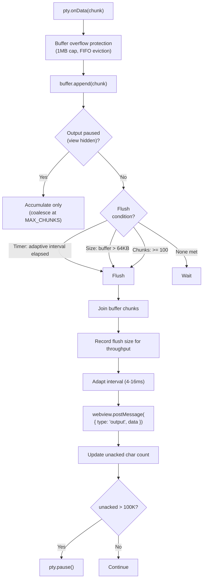
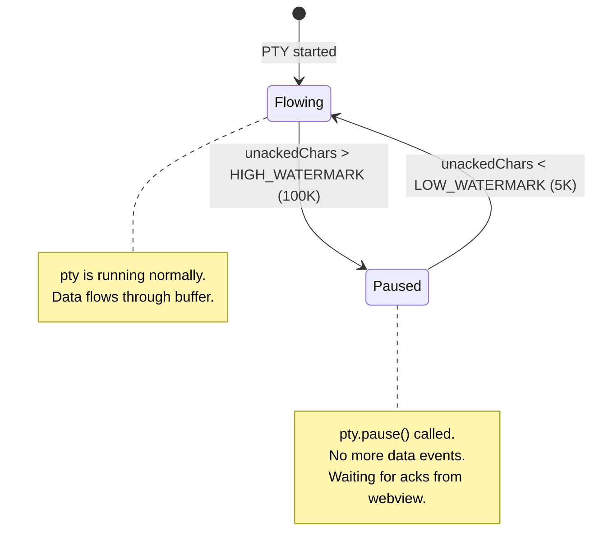
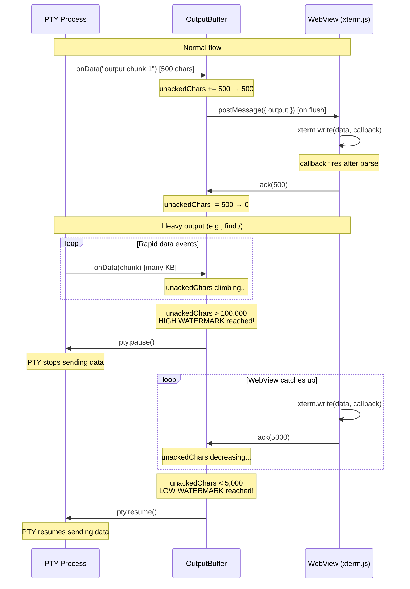
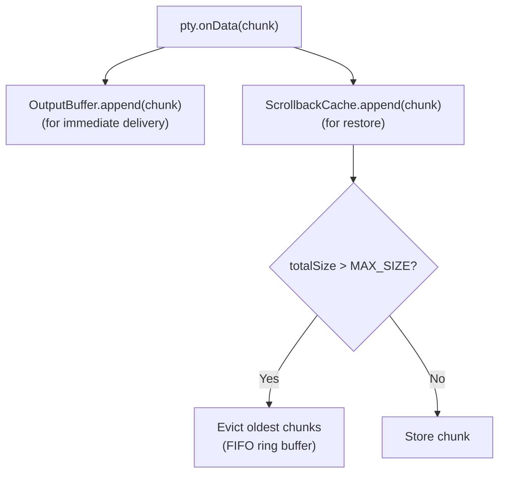
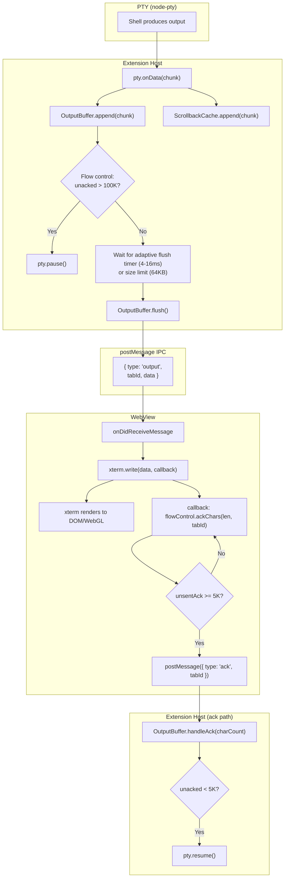

# Output Buffering & Flow Control — Detailed Design

## 1. Overview

Terminal output from PTY processes can arrive at extremely high rates (e.g., `find /`, `yes`, `cat large-file`). Without buffering and flow control, the IPC channel (postMessage) gets overwhelmed and xterm.js rendering falls behind, causing lag and potential memory issues.

This document describes the **two-layer buffering architecture** and **flow control mechanism** used by AnyWhere Terminal.

### Reference Sources
- VS Code: `TerminalDataBufferer` (5ms throttle), `FlowControlConstants` (100K/5K watermarks), `AckDataBufferer`
- Reference project: Extension-side 16ms/50-chunk buffer, webview-side adaptive 4-16ms buffer

---

## 2. Architecture Overview

```mermaid
flowchart LR
    subgraph PTY["PTY Process"]
        P["Shell Output"]
    end

    subgraph ExtHost["Extension Host"]
        OB["Output Buffer<br/>(Layer 1)"]
    end

    subgraph IPC["IPC"]
        PM["postMessage"]
    end

    subgraph WebView["WebView"]
        XT["xterm.write()"]
        ACK["Ack Counter"]
    end

    P -->|"pty.onData<br/>(rapid, unbounded)"| OB
    OB -->|"Flush every 4-16ms<br/>(adaptive) or on size limit"| PM
    PM -->|"{ type: 'output',<br/>tabId, data }"| XT
    XT -->|"write callback"| ACK
    ACK -->|"Batch ack<br/>every 5K chars"| OB
    OB -->|"Pause/Resume"| P

    style OB fill:#345,stroke:#6af
    style ACK fill:#543,stroke:#fa6
```



---

## 3. Layer 1: Extension-Side Output Buffer

### Purpose
Coalesce rapid `pty.onData` events into fewer, larger `postMessage` calls. PTY can fire data events hundreds of times per second; postMessage has overhead per call.

### Design



### Constants

| Constant | Value | Rationale |
|----------|-------|-----------|
| `MIN_FLUSH_INTERVAL_MS` | 4 | Minimum adaptive interval for low-throughput scenarios |
| `DEFAULT_FLUSH_INTERVAL_MS` | 8 | Default interval. Compromise between VS Code (5ms) and reference (16ms) |
| `MAX_FLUSH_INTERVAL_MS` | 16 | Maximum adaptive interval for high-throughput batching |
| `MAX_BUFFER_SIZE` | 65536 (64KB) | Triggers immediate flush |
| `MAX_CHUNKS` | 100 | Safety cap on array length |
| `MAX_TOTAL_BUFFER_CHARS` | 1,048,576 (1MB) | Hard cap on total buffered characters; FIFO eviction when exceeded |
| `THROUGHPUT_WINDOW_SIZE` | 5 | Number of recent flush sizes for throughput estimation |
| `HIGH_THROUGHPUT_THRESHOLD` | 32,768 | Average flush size above which interval increases to MAX |
| `LOW_THROUGHPUT_THRESHOLD` | 1,024 | Average flush size below which interval decreases to MIN |

### Adaptive Flush Interval

The flush interval adapts based on a rolling window of recent flush sizes:
- Low throughput (avg flush < 1KB) → 4ms interval (more responsive)
- Normal throughput → 8ms interval
- High throughput (avg flush > 32KB) → 16ms interval (more batching)

### Buffer Overflow Protection (1MB)

A hard cap of 1MB prevents unbounded memory growth when the view is hidden:
- If a single chunk exceeds 1MB, it is truncated (keep tail)
- If accumulated chunks exceed 1MB, oldest chunks are evicted (FIFO)

### Output Pause/Resume for Hidden Views

When a webview becomes hidden, `OutputBuffer.pauseOutput()` stops the flush timer. Data continues to accumulate but is not sent. When the view becomes visible, `resumeOutput()` flushes all accumulated data immediately. This prevents wasted IPC for hidden views.

### Implementation Notes

- Buffer is a `string[]` array (push chunks, join on flush) — avoids string concatenation overhead
- Timer is created on first data event, not on construction (no idle timers)
- Timer is reset on each flush
- On `pty.onExit`: flush any remaining data, then fire exit event

### Comparison with References

| Aspect | VS Code | Reference Project | Our Design |
|--------|---------|-------------------|------------|
| Throttle interval | 5ms | 16ms | 8ms |
| Buffer type | string[] | string[] (50 max) | string[] (100 max) |
| Size limit | N/A (flow control handles it) | 1000 chars/chunk trigger | 64KB total |
| Immediate flush | N/A | >1000 char chunk | >64KB total buffer |

---

## 4. Flow Control

### Problem

Even with buffering, if the PTY produces output faster than xterm.js can render it, memory grows without bound. The buffer accumulates faster than it drains.

### Solution: Watermark-Based Flow Control

Adapted from VS Code's `TerminalProcess` flow control (`terminalProcess.ts:318-335`) and `AckDataBufferer` (`terminalProcessManager.ts:717`).



### Flow Control Constants

| Constant | Value | Source | Description |
|----------|-------|--------|-------------|
| `HIGH_WATERMARK_CHARS` | 100,000 | VS Code `FlowControlConstants.HighWatermarkChars` | Pause PTY when this many chars are unacknowledged |
| `LOW_WATERMARK_CHARS` | 5,000 | VS Code `FlowControlConstants.LowWatermarkChars` | Resume PTY when unacked drops below this |
| `ACK_BATCH_SIZE` | 5,000 | VS Code `FlowControlConstants.CharCountAckSize` | WebView sends ack after this many chars processed |

### Flow Control Sequence



### WebView-Side Ack Batching (FlowControl)

To avoid excessive ack messages, the `FlowControl` class (`src/webview/flow/FlowControl.ts`) batches acknowledgments per session:

```typescript
class FlowControl {
  private readonly unsentAckCharsMap = new Map<string, number>();

  ackChars(count: number, tabId: string): void {
    const current = this.unsentAckCharsMap.get(tabId) ?? 0;
    const updated = current + count;
    if (updated >= ACK_BATCH_SIZE) {
      this.postMessage({ type: 'ack', charCount: updated, tabId });
      this.unsentAckCharsMap.set(tabId, 0);
    } else {
      this.unsentAckCharsMap.set(tabId, updated);
    }
  }
}
```

Key differences from earlier designs:
- **Per-session tracking**: Each session has its own unsent ack counter (via `unsentAckCharsMap`), ensuring acks route to the correct `OutputBuffer` on the extension side.
- **`if` not `while`**: A single ack message is sent with the full accumulated count, rather than looping to send multiple 5K-char batches.
- **`tabId` included**: The ack message includes `tabId` so the extension can route it to the correct session's `OutputBuffer`.

The xterm.write() callback provides the trigger:

```typescript
terminal.write(data, () => {
  flowControl.ackChars(data.length, msg.tabId);
});
```

---

## 5. Layer 2: WebView-Side Write Strategy

### Decision: Direct Write (No Second Buffer)

The reference project has a webview-side `PerformanceManager` that buffers writes to xterm.js. However, analysis shows this is **largely bypassed** — routed messages (those with `terminalId`) call `terminal.write(data)` directly.

**Our design**: No webview-side buffer. The extension-side buffer already coalesces data. Adding a second buffer layer increases latency without meaningful benefit.

Exception: If profiling during Phase 2 reveals xterm.write() as a bottleneck, we can add webview-side batching as an optimization.

### xterm.write() is Non-Blocking

xterm.js's `write()` method is already internally buffered and uses `requestAnimationFrame` for rendering. Multiple rapid `write()` calls are efficiently batched by xterm itself.

---

## 6. Scrollback Cache (Separate from Output Buffer)

### Purpose

The scrollback cache stores recent terminal output for view restoration when `retainContextWhenHidden` fails or is disabled. It is **separate** from the output buffer.

### Design



### Constants

| Constant | Value | Description |
|----------|-------|-------------|
| `MAX_SCROLLBACK_CACHE_SIZE` | 524,288 (512KB) | Maximum total cache size per session |
| `DEFAULT_SCROLLBACK_LINES` | 1,000 | Approximate line count (at ~50 chars/line) |

---

## 7. Complete Data Flow

### Full Pipeline: PTY Output → Screen



---

## 8. Edge Cases

### 1. Extremely Large Single Output

Scenario: `cat very-large-file` produces a single multi-MB chunk.

Handling:
- `pty.onData` may fire with chunks up to ~64KB (node-pty internal buffering)
- Our 64KB threshold triggers immediate flush per chunk
- Flow control pauses PTY if webview falls behind
- xterm.js handles large writes efficiently via internal batching

### 2. Rapid Small Outputs

Scenario: `while true; do echo x; done` — many tiny outputs per second.

Handling:
- Each `echo x` produces ~2 bytes
- Buffer accumulates for 8ms, then flushes many chunks as one string
- Without buffering: thousands of postMessage calls/sec → with buffering: ~125 calls/sec

### 3. PTY Exit During Buffered Output

Handling:
- `pty.onExit` triggers immediate buffer flush
- Remaining data is sent to webview before exit message
- Exit message `{ type: 'exit', tabId, code }` sent after flush
- Ordering: guaranteed because postMessage is ordered

### 4. WebView Disposed While Buffer Has Data

Handling:
- `webview.postMessage()` may throw when webview is disposed
- OutputBuffer wraps postMessage in try/catch (sync throw) and `.then(undefined, () => {})` (async rejection)
- On failure: the error is silently swallowed (no logging, no cleanup)
- Sessions are preserved for potential webview re-creation, and output is paused via `pauseOutput()`

---

## 9. Interface Definition

```typescript
class OutputBuffer {
  /** Append data from PTY to the buffer */
  append(data: string): void;

  /** Force-flush all buffered data */
  flush(): void;

  /** Handle acknowledgment from webview (flow control) */
  handleAck(charCount: number): void;

  /** Pause output flushing (view hidden) */
  pauseOutput(): void;

  /** Resume output flushing (view shown) */
  resumeOutput(): void;

  /** Update webview reference (on webview re-creation) */
  updateWebview(webview: MessageSender): void;

  /** Dispose the buffer (best-effort final flush) */
  dispose(): void;

  /** Check if PTY is currently paused */
  readonly isPaused: boolean;

  /** Get current unacknowledged char count */
  readonly unackedCharCount: number;

  /** Get current buffered char count */
  readonly bufferSize: number;
}

/** Flow control constants */
const HIGH_WATERMARK_CHARS = 100_000;
const LOW_WATERMARK_CHARS = 5_000;
const ACK_BATCH_SIZE = 5_000;  // WebView-side (FlowControl class)
```

---

## 10. File Location

```
src/session/OutputBuffer.ts
```

### Dependencies
- `node-pty` `IPty` — for `pause()` / `resume()`
- `vscode.Webview` — for `postMessage()`

### Dependents
- `SessionManager` — creates one OutputBuffer per session
