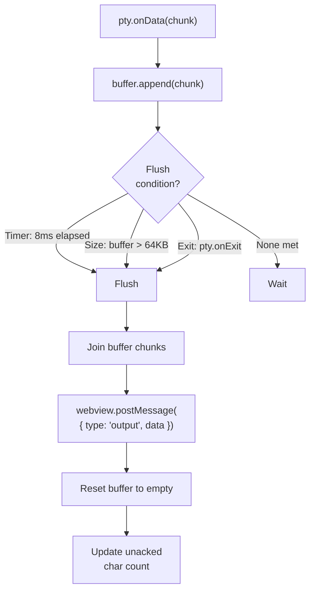
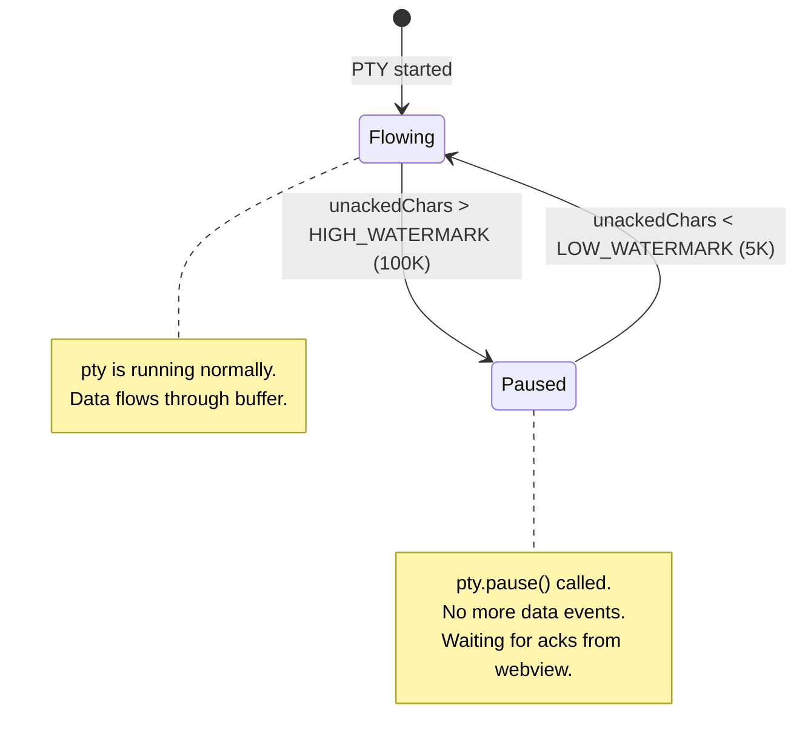
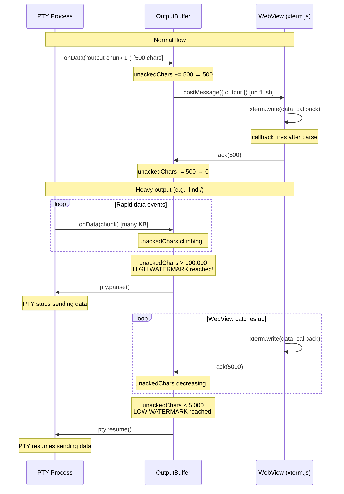
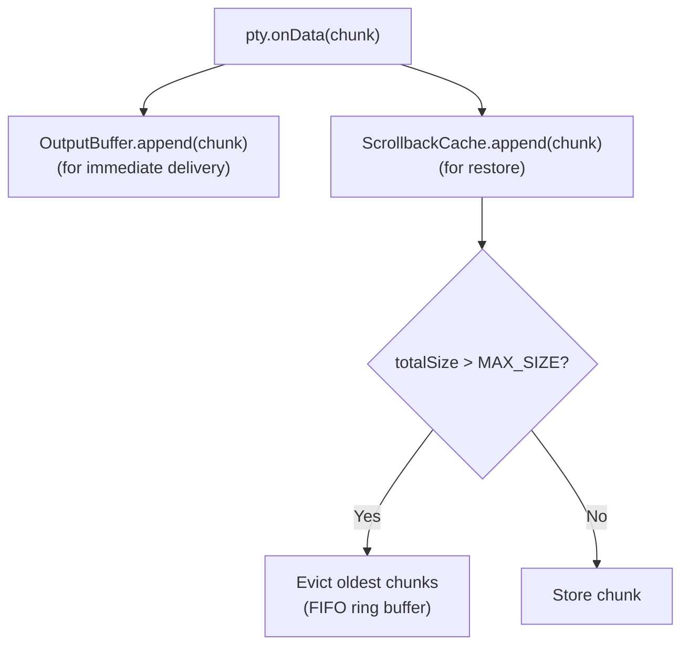
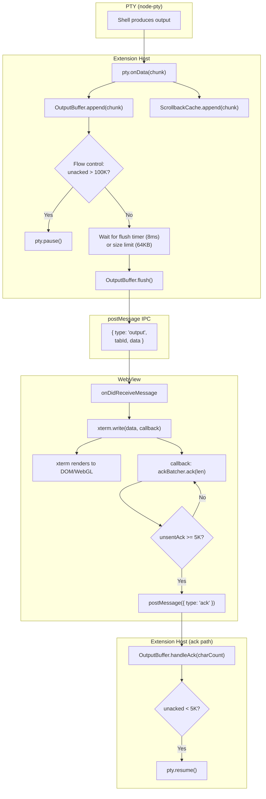

# Output Buffering & Flow Control — Detailed Design

## 1. Overview

Terminal output from PTY processes can arrive at extremely high rates (e.g., `find /`, `yes`, `cat large-file`). Without buffering and flow control, the IPC channel (postMessage) gets overwhelmed and xterm.js rendering falls behind, causing lag and potential memory issues.

This document describes the **two-layer buffering architecture** and **flow control mechanism** used by AnyWhere Terminal.

### Reference Sources
- VS Code: `TerminalDataBufferer` (5ms throttle), `FlowControlConstants` (100K/5K watermarks), `AckDataBufferer`
- Reference project: Extension-side 16ms/50-chunk buffer, webview-side adaptive 4-16ms buffer

---

## 2. Architecture Overview


---

## 3. Layer 1: Extension-Side Output Buffer

### Purpose
Coalesce rapid `pty.onData` events into fewer, larger `postMessage` calls. PTY can fire data events hundreds of times per second; postMessage has overhead per call.

### Design



### Constants

| Constant | Value | Rationale |
|----------|-------|-----------|
| `FLUSH_INTERVAL_MS` | 8 | Compromise between VS Code (5ms) and reference (16ms). 8ms ≈ 120fps ceiling, good balance of responsiveness vs. IPC reduction |
| `MAX_BUFFER_SIZE` | 65536 (64KB) | Large enough to batch big outputs, small enough to avoid visible delay |
| `MAX_CHUNKS` | 100 | Safety cap on array length |

### Implementation Notes

- Buffer is a `string[]` array (push chunks, join on flush) — avoids string concatenation overhead
- Timer is created on first data event, not on construction (no idle timers)
- Timer is reset on each data event that triggers immediate flush
- On `pty.onExit`: flush any remaining data, then fire exit event

### Comparison with References

| Aspect | VS Code | Reference Project | Our Design |
|--------|---------|-------------------|------------|
| Throttle interval | 5ms | 16ms | 8ms |
| Buffer type | string[] | string[] (50 max) | string[] (100 max) |
| Size limit | N/A (flow control handles it) | 1000 chars/chunk trigger | 64KB total |
| Immediate flush | N/A | >1000 char chunk | >64KB total buffer |

---

## 4. Flow Control

### Problem

Even with buffering, if the PTY produces output faster than xterm.js can render it, memory grows without bound. The buffer accumulates faster than it drains.

### Solution: Watermark-Based Flow Control

Adapted from VS Code's `TerminalProcess` flow control (`terminalProcess.ts:318-335`) and `AckDataBufferer` (`terminalProcessManager.ts:717`).



### Flow Control Constants

| Constant | Value | Source | Description |
|----------|-------|--------|-------------|
| `HIGH_WATERMARK_CHARS` | 100,000 | VS Code `FlowControlConstants.HighWatermarkChars` | Pause PTY when this many chars are unacknowledged |
| `LOW_WATERMARK_CHARS` | 5,000 | VS Code `FlowControlConstants.LowWatermarkChars` | Resume PTY when unacked drops below this |
| `ACK_BATCH_SIZE` | 5,000 | VS Code `FlowControlConstants.CharCountAckSize` | WebView sends ack after this many chars processed |

### Flow Control Sequence



### WebView-Side Ack Batching

To avoid excessive ack messages, the webview batches acknowledgments:

```typescript
class AckBatcher {
  private unsentCharCount = 0;

  ack(charCount: number): void {
    this.unsentCharCount += charCount;
    while (this.unsentCharCount >= ACK_BATCH_SIZE) {
      this.unsentCharCount -= ACK_BATCH_SIZE;
      vscode.postMessage({ type: 'ack', charCount: ACK_BATCH_SIZE });
    }
  }
}
```

This means acks are sent in fixed 5K-char batches, not per write call. The xterm.write() callback provides the trigger:

```typescript
terminal.write(data, () => {
  // Called after xterm has parsed the data
  ackBatcher.ack(data.length);
});
```

---

## 5. Layer 2: WebView-Side Write Strategy

### Decision: Direct Write (No Second Buffer)

The reference project has a webview-side `PerformanceManager` that buffers writes to xterm.js. However, analysis shows this is **largely bypassed** — routed messages (those with `terminalId`) call `terminal.write(data)` directly.

**Our design**: No webview-side buffer. The extension-side buffer already coalesces data. Adding a second buffer layer increases latency without meaningful benefit.

Exception: If profiling during Phase 2 reveals xterm.write() as a bottleneck, we can add webview-side batching as an optimization.

### xterm.write() is Non-Blocking

xterm.js's `write()` method is already internally buffered and uses `requestAnimationFrame` for rendering. Multiple rapid `write()` calls are efficiently batched by xterm itself.

---

## 6. Scrollback Cache (Separate from Output Buffer)

### Purpose

The scrollback cache stores recent terminal output for view restoration when `retainContextWhenHidden` fails or is disabled. It is **separate** from the output buffer.

### Design



### Constants

| Constant | Value | Description |
|----------|-------|-------------|
| `MAX_SCROLLBACK_CACHE_SIZE` | 524,288 (512KB) | Maximum total cache size per session |
| `DEFAULT_SCROLLBACK_LINES` | 1,000 | Approximate line count (at ~50 chars/line) |

---

## 7. Complete Data Flow

### Full Pipeline: PTY Output → Screen



---

## 8. Edge Cases

### 1. Extremely Large Single Output

Scenario: `cat very-large-file` produces a single multi-MB chunk.

Handling:
- `pty.onData` may fire with chunks up to ~64KB (node-pty internal buffering)
- Our 64KB threshold triggers immediate flush per chunk
- Flow control pauses PTY if webview falls behind
- xterm.js handles large writes efficiently via internal batching

### 2. Rapid Small Outputs

Scenario: `while true; do echo x; done` — many tiny outputs per second.

Handling:
- Each `echo x` produces ~2 bytes
- Buffer accumulates for 8ms, then flushes many chunks as one string
- Without buffering: thousands of postMessage calls/sec → with buffering: ~125 calls/sec

### 3. PTY Exit During Buffered Output

Handling:
- `pty.onExit` triggers immediate buffer flush
- Remaining data is sent to webview before exit message
- Exit message `{ type: 'exit', tabId, code }` sent after flush
- Ordering: guaranteed because postMessage is ordered

### 4. WebView Disposed While Buffer Has Data

Handling:
- `webview.postMessage()` returns `false` or throws when webview is disposed
- OutputBuffer wraps postMessage in try/catch
- On failure: stop timer, dispose buffer, log warning
- SessionManager handles orphaned sessions cleanup

---

## 9. Interface Definition

```typescript
interface IOutputBuffer extends Disposable {
  /** Append data from PTY to the buffer */
  append(data: string): void;

  /** Force-flush all buffered data */
  flush(): void;

  /** Handle acknowledgment from webview (flow control) */
  handleAck(charCount: number): void;

  /** Check if PTY is currently paused */
  readonly isPaused: boolean;

  /** Get current unacknowledged char count */
  readonly unackedCharCount: number;
}

/** Flow control constants */
const enum FlowControlConstants {
  HighWatermarkChars = 100_000,
  LowWatermarkChars = 5_000,
  AckBatchSize = 5_000,
}

/** Buffer constants */
const enum BufferConstants {
  FlushIntervalMs = 8,
  MaxBufferSize = 65_536,
  MaxChunks = 100,
}
```

---

## 10. File Location

```
src/session/OutputBuffer.ts
```

### Dependencies
- `node-pty` `IPty` — for `pause()` / `resume()`
- `vscode.Webview` — for `postMessage()`

### Dependents
- `SessionManager` — creates one OutputBuffer per session
