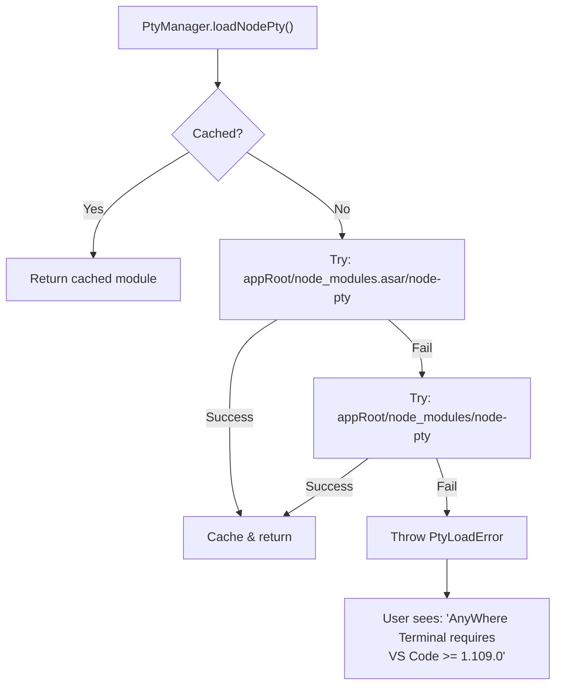
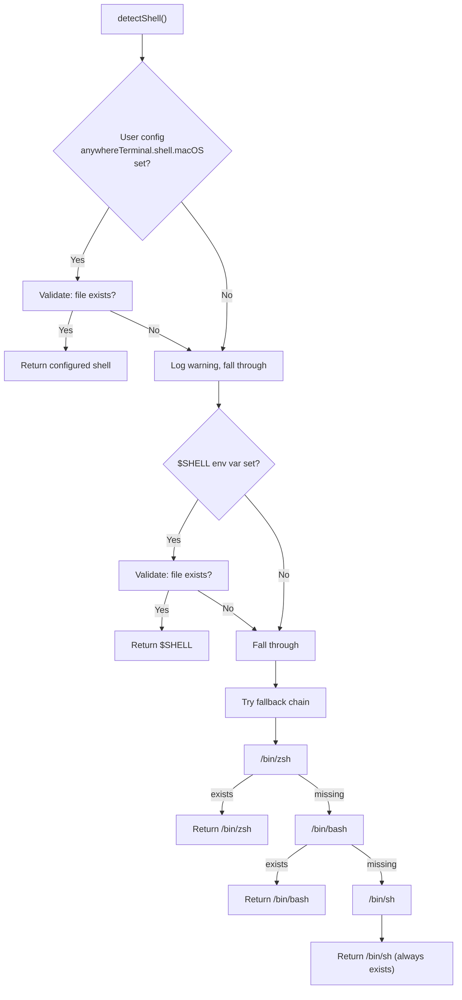
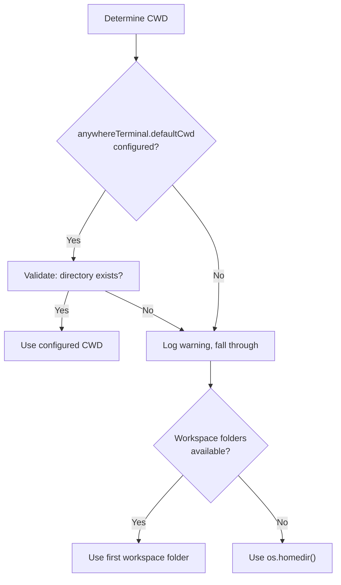
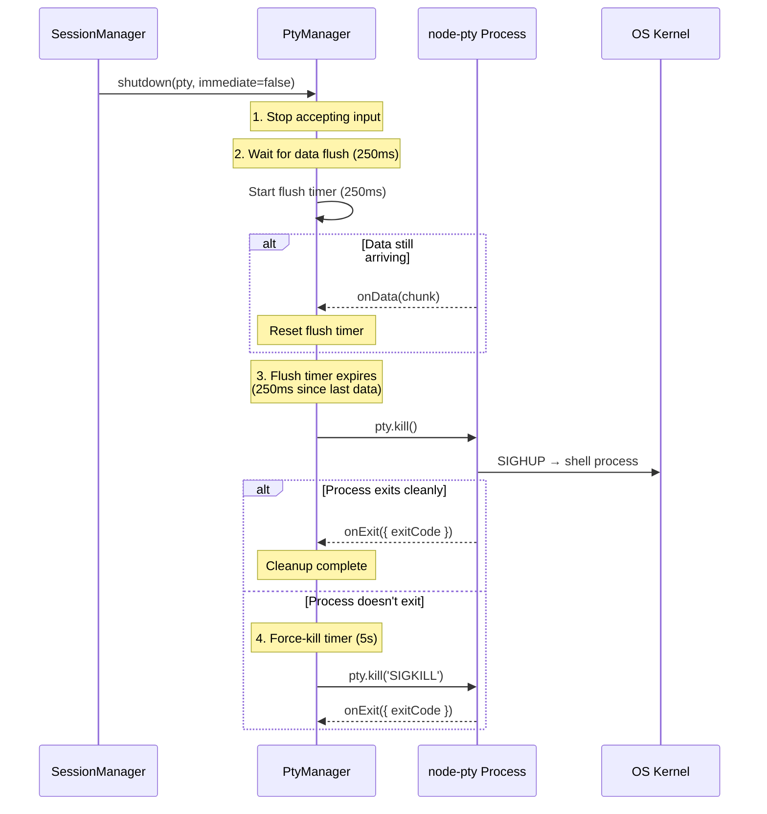

# PTY Manager — Detailed Design

## 1. Overview

The **PtyManager** is responsible for loading the `node-pty` native module, detecting the user's preferred shell, and spawning PTY (pseudo-terminal) processes. It is a singleton service used by the SessionManager.

### Responsibilities
- Load node-pty from VS Code's internal modules (no native compilation)
- Detect and validate the default shell on macOS
- Provide shell spawn configuration (executable, args, environment)
- Handle graceful PTY shutdown with data flush

### Non-Responsibilities
- Session tracking (→ SessionManager)
- Output buffering (→ OutputBuffer / SessionManager)
- Flow control (→ OutputBuffer)

---

## 2. node-pty Loading Strategy

### Problem
node-pty is a native Node.js addon (C++ binding). Bundling it with the extension would require compiling native code for every target platform/architecture. VS Code already ships node-pty internally.

### Solution: Reuse VS Code's Built-in node-pty

VS Code bundles node-pty in its installation. We dynamically require it at runtime.



### Candidate Paths (in order)

| Priority | Path | Notes |
|----------|------|-------|
| 1 | `vscode.env.appRoot/node_modules.asar/node-pty` | Modern VS Code (asar-packed modules) |
| 2 | `vscode.env.appRoot/node_modules/node-pty` | Older VS Code versions |

### Dynamic Require (esbuild compatibility)

esbuild replaces `require()` with its own `__require`. To load node-pty from an external path at runtime, we need the real Node.js `require`:

```typescript
// Handle esbuild's require replacement
const requireFunc = typeof __webpack_require__ === 'function'
  ? __non_webpack_require__
  : typeof module !== 'undefined'
    ? module.require
    : require;
```

### Reference
- VS Code loads node-pty in `src/vs/platform/terminal/node/terminalProcess.ts` via standard import (it's bundled in their build)
- The reference project `vscode-sidebar-terminal` uses `@homebridge/node-pty-prebuilt-multiarch` as a webpack external with `bundledDependencies`
- Our approach avoids shipping native binaries entirely

---

## 3. Shell Detection

### Detection Flow



### Shell Configuration

| Config Key | Type | Default | Description |
|------------|------|---------|-------------|
| `anywhereTerminal.shell.macOS` | `string` | `""` (auto-detect) | Path to shell executable |
| `anywhereTerminal.shell.args` | `string[]` | `[]` | Arguments to pass to shell |

### Default Shell Args

When no custom args are configured:
- **Login shell**: `['--login']` — ensures `.zprofile`, `.bash_profile`, etc. are sourced
- This matches VS Code's behavior (login shell by default on macOS)

### Available Shells Discovery (Future Enhancement)

VS Code reads `/etc/shells` to discover available shells on Unix/macOS:
```
# /etc/shells — typical macOS content
/bin/bash
/bin/csh
/bin/dash
/bin/ksh
/bin/sh
/bin/tcsh
/bin/zsh
```
This can be used for a shell picker UI in later phases.

---

## 4. PTY Spawn Configuration

### Spawn Options

```typescript
interface SpawnOptions {
  name: string;        // Terminal type identifier
  cols: number;        // Initial column count
  rows: number;        // Initial row count
  cwd: string;         // Working directory
  env: Record<string, string>; // Environment variables
}
```

### Default Values

| Option | Value | Rationale |
|--------|-------|-----------|
| `name` | `'xterm-256color'` | Standard terminal type with 256-color support |
| `cols` | `80` | Standard terminal width (overridden by fitAddon on attach) |
| `rows` | `30` | Default height (overridden by fitAddon on attach) |
| `cwd` | Workspace root or `$HOME` | See CWD resolution below |
| `env` | `process.env` + overrides | See environment setup below |

### CWD Resolution



### Environment Setup

The PTY process inherits `process.env` with these overrides/additions:

| Variable | Value | Reason |
|----------|-------|--------|
| `TERM` | `xterm-256color` | Tell programs they're in a color-capable terminal |
| `COLORTERM` | `truecolor` | Advertise 24-bit color support |
| `LANG` | `en_US.UTF-8` (if unset) | Ensure UTF-8 locale for proper character handling |
| `LC_ALL` | (preserve existing) | Don't override if user has locale configured |
| `TERM_PROGRAM` | `AnyWhereTerminal` | Identify our terminal (used by shell integrations) |
| `TERM_PROGRAM_VERSION` | Extension version | For shell integration version checks |

Variables explicitly **excluded** from override:
- `PATH` — always inherited from user environment
- `HOME` — always inherited
- `SHELL` — inherited (describes user's default shell, not current running shell)

---

## 5. Graceful Shutdown

### Shutdown Sequence

Based on VS Code's `TerminalProcess.shutdown()` in `terminalProcess.ts:444`:



### Shutdown Constants

| Constant | Value | Rationale |
|----------|-------|-----------|
| `DATA_FLUSH_TIMEOUT` | 250ms | Wait for final data after last `onData` event (from VS Code) |
| `MAX_SHUTDOWN_TIME` | 5000ms | Force-kill if process doesn't exit (from VS Code `ShutdownConstants`) |
| `IMMEDIATE_KILL` | — | On macOS, direct `pty.kill()` without queue (no conpty issues) |

### macOS-Specific Notes

- On macOS, `pty.kill()` sends `SIGHUP` to the process group, which is the standard Unix signal for terminal hangup
- No kill/spawn throttling needed (VS Code only throttles on Windows for conpty stability)
- Child processes of the shell receive SIGHUP and typically exit cleanly

---

## 6. Error Handling

### Error Categories

| Error | Cause | Recovery |
|-------|-------|----------|
| `PtyLoadError` | VS Code version too old, asar corruption | Show error notification, disable extension gracefully |
| `ShellNotFoundError` | Invalid shell path, permissions denied | Fall through to next shell in fallback chain |
| `SpawnError` | CWD doesn't exist, env issues | Retry with `$HOME` as CWD, log original error |
| `ShutdownError` | Process doesn't respond to SIGTERM | Force-kill with SIGKILL after 5s timeout |

### Error Events

```typescript
interface PtyError {
  type: 'load' | 'spawn' | 'runtime' | 'shutdown';
  message: string;
  shellPath?: string;
  exitCode?: number;
}
```

---

## 7. Interface Definition

```typescript
interface IPtyManager {
  /**
   * Load node-pty from VS Code's internal modules.
   * Caches the module after first successful load.
   * @throws PtyLoadError if node-pty cannot be found
   */
  loadNodePty(): typeof import('node-pty');

  /**
   * Detect the user's preferred shell and arguments.
   * Priority: user config → $SHELL → /bin/zsh → /bin/bash → /bin/sh
   */
  detectShell(): { shell: string; args: string[] };

  /**
   * Build the environment variables for a new PTY process.
   * Clones process.env and adds terminal-specific overrides.
   */
  buildEnvironment(): Record<string, string>;

  /**
   * Resolve the working directory for a new PTY process.
   * Priority: user config → workspace root → $HOME
   */
  resolveWorkingDirectory(): string;

  /**
   * Validate that a shell executable exists and is executable.
   */
  validateShell(shellPath: string): boolean;
}
```

---

## 8. File Location

```
src/pty/PtyManager.ts
```

### Dependencies
- `vscode` (for `env.appRoot`, workspace configuration)
- `path` (for path joining)
- `fs` (for shell validation)
- `os` (for `homedir()`)

### Dependents
- `SessionManager` — calls `loadNodePty()`, `detectShell()`, `buildEnvironment()`, `resolveWorkingDirectory()`
