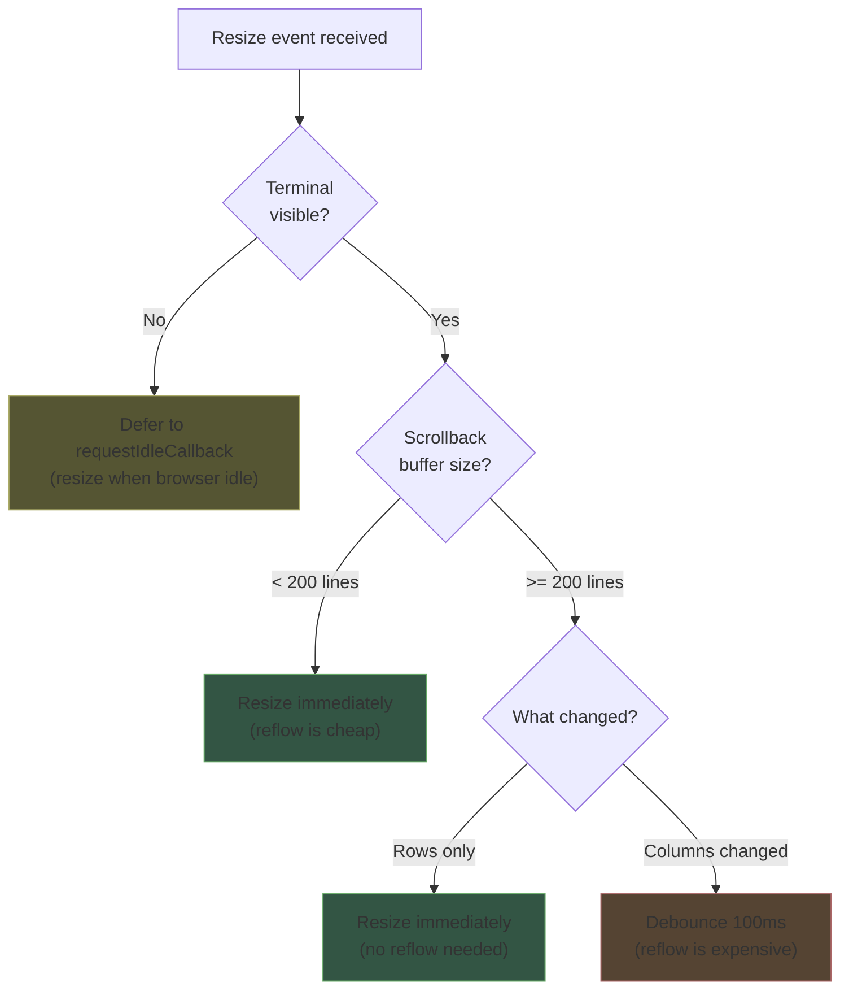
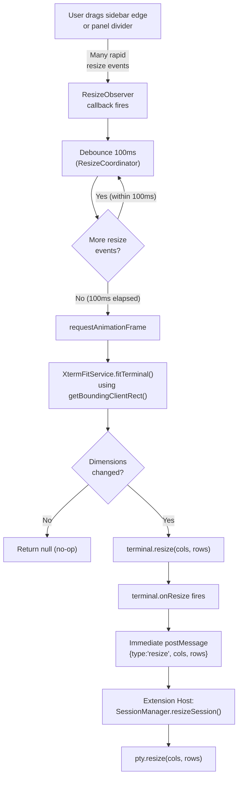
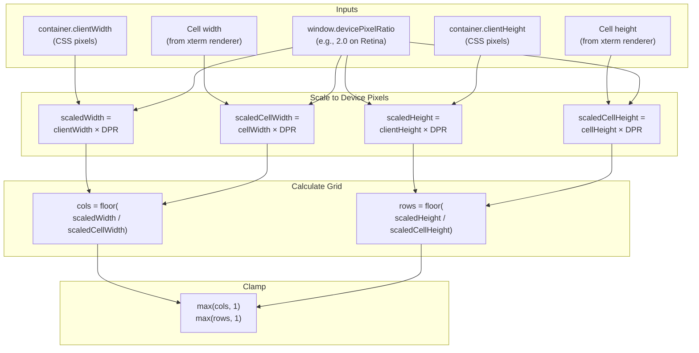
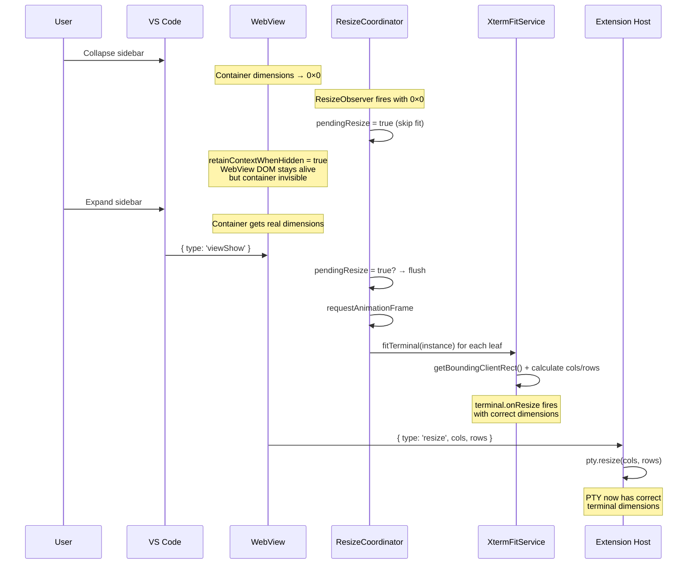
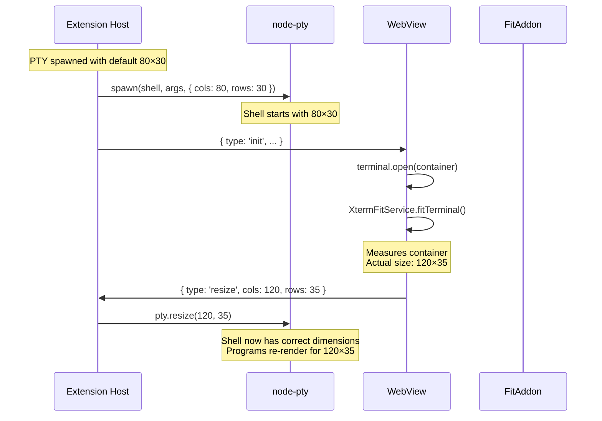
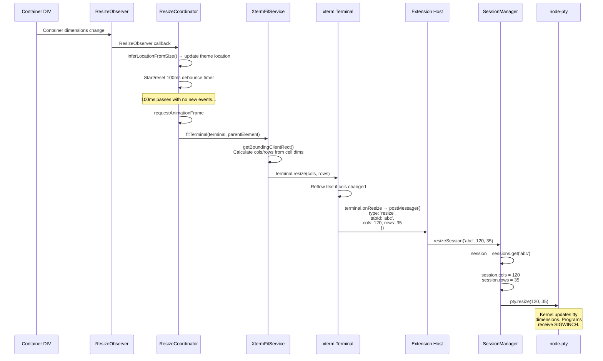
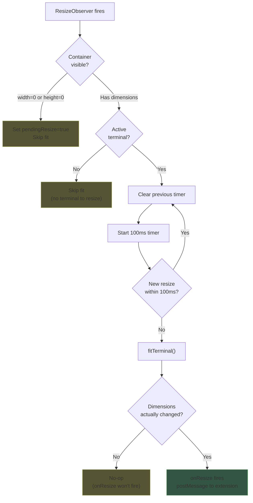

# Resize Handling — Detailed Design

## 1. Overview

Terminal resize is one of the most performance-sensitive operations in a terminal emulator. **Horizontal resize (column change) is expensive** because it triggers text reflow — every line in the scrollback buffer must be re-wrapped. During a user drag gesture (resizing the sidebar edge or panel divider), dozens of resize events fire per second, each potentially triggering a full reflow.

This document covers our resize strategy: how we observe container dimension changes, debounce expensive operations, calculate DPI-aware dimensions, and propagate resize events through the full pipeline from the webview to the PTY process.

### Reference Sources
- VS Code: `src/vs/workbench/contrib/terminal/browser/xterm/xtermTerminal.ts` (getXtermScaledDimensions)
- VS Code: `src/vs/workbench/contrib/terminal/browser/terminalResizeDebouncer.ts` (smart debounce)
- xterm.js: `FitAddon` documentation
- Reference project: `webview/main.ts` (ResizeObserver + debounce)

---

## 2. VS Code's Smart Resize Strategy

VS Code implements a sophisticated resize debouncing strategy in `terminalResizeDebouncer.ts` that adapts based on terminal state. Understanding this helps justify our simplified approach.

### VS Code's Decision Matrix



### Why Column Changes Are Expensive

| Dimension Change | Cost | Reason |
|---|---|---|
| Rows increase | Cheap | Just add empty rows at bottom |
| Rows decrease | Cheap | Remove rows from bottom (content scrolls up) |
| Columns change | Expensive | Every line in scrollback must be re-wrapped. A 10,000-line scrollback means 10,000 line-wrap recalculations |

### VS Code Constants

| Constant | Value | Source |
|---|---|---|
| Small buffer threshold | 200 lines | `terminalResizeDebouncer.ts` |
| Column debounce time | 100ms | `terminalResizeDebouncer.ts` |
| Row debounce time | 0ms (immediate) | `terminalResizeDebouncer.ts` |

---

## 3. Our MVP Resize Design

For MVP, we use a simplified approach: a single 100ms debounce on all resize events. This is a pragmatic compromise that avoids the complexity of VS Code's multi-path strategy while still preventing excessive reflows during drag operations.

### Resize Pipeline



> **Key difference from the original design**: The debounce is between the ResizeObserver and the fit operation, not between `onResize` and `postMessage`. Once `fitTerminal()` runs and changes dimensions, `terminal.onResize` fires and `postMessage` is sent immediately.

### Design Rationale

| Aspect | VS Code Approach | Our MVP Approach | Rationale |
|---|---|---|---|
| Debounce strategy | Adaptive (row/col/buffer-aware) | Fixed 100ms for all | Simpler, good enough for MVP. Column changes are 100ms in VS Code too. |
| Hidden terminal | requestIdleCallback | No resize until shown | retainContextWhenHidden keeps DOM alive but hidden terminals don't resize. |
| Small buffer optimization | Immediate for <200 lines | Not implemented | Minor optimization, can add in Phase 2. |
| Row-only optimization | Immediate row changes | Not implemented | Can add in Phase 2 by comparing previous cols. |

---

## 4. DPI-Aware Dimension Calculation

### Problem

On high-DPI displays (Retina, 4K), `window.devicePixelRatio` is >1 (typically 2 on Retina). The physical pixel count of the container is larger than the CSS pixel count. For sub-pixel accuracy in calculating how many terminal columns and rows fit in the container, we must account for this scaling.

### VS Code's Approach (getXtermScaledDimensions)

From `xtermTerminal.ts`, VS Code computes scaled dimensions:

```typescript
/**
 * Calculate terminal dimensions accounting for device pixel ratio.
 * This ensures sub-pixel accuracy on high-DPI displays.
 *
 * From VS Code: xtermTerminal.ts getXtermScaledDimensions()
 */
function getScaledDimensions(
  terminal: Terminal,
  container: HTMLElement
): { cols: number; rows: number } | undefined {
  const dpr = window.devicePixelRatio;

  // Get cell dimensions from xterm's internal measurements
  const cellWidth = terminal.options.fontSize! * 0.6; // approximate
  const cellHeight = terminal.options.fontSize! * 1.2; // approximate

  // If xterm has rendered, use actual measurements
  const core = (terminal as any)._core;
  if (!core?._renderService?.dimensions) {
    return undefined; // Terminal not yet rendered
  }

  const actualCellWidth = core._renderService.dimensions.css.cell.width;
  const actualCellHeight = core._renderService.dimensions.css.cell.height;

  // Scale container dimensions to device pixels, then divide by scaled cell size
  const scaledContainerWidth = container.clientWidth * dpr;
  const scaledContainerHeight = container.clientHeight * dpr;
  const scaledCellWidth = actualCellWidth * dpr;
  const scaledCellHeight = actualCellHeight * dpr;

  const cols = Math.floor(scaledContainerWidth / scaledCellWidth);
  const rows = Math.floor(scaledContainerHeight / scaledCellHeight);

  return { cols: Math.max(cols, 1), rows: Math.max(rows, 1) };
}
```

### Dimension Calculation Flow



### Actual Implementation: XtermFitService

The custom `fitTerminal()` in `XtermFitService` replaces `FitAddon.fit()`. It uses `getBoundingClientRect()` for actual rendered pixel dimensions (not `getComputedStyle()` which can return stale values during CSS flex layout transitions):

```typescript
function fitTerminal(terminal: Terminal, parentElement: HTMLElement): { cols: number; rows: number } | null {
  const core = (terminal as any)._core;
  const dims = core?._renderService?.dimensions;
  if (!dims || dims.css.cell.width === 0 || dims.css.cell.height === 0) return null;

  const parentRect = parentElement.getBoundingClientRect();
  if (parentRect.width === 0 || parentRect.height === 0) return null;

  // Account for xterm element padding and scrollbar
  const scrollbarWidth = terminal.options.scrollback === 0 ? 0 : terminal.options.overviewRuler?.width || 14;
  const availableWidth = parentRect.width - paddingLeft - paddingRight - scrollbarWidth;
  const availableHeight = parentRect.height - paddingTop - paddingBottom;

  const cols = Math.max(2, Math.floor(availableWidth / dims.css.cell.width));
  const rows = Math.max(1, Math.floor(availableHeight / dims.css.cell.height));

  if (terminal.rows === rows && terminal.cols === cols) return null;

  core?._renderService?.clear();
  return { cols, rows };
}
```

This is the **only module** that accesses xterm private APIs (`_core`, `_renderService`). If xterm updates break internals, only this file needs fixing.

---

## 5. Visibility-Triggered Resize

### Problem

When a terminal view is hidden (sidebar collapsed, tab switched), its container has zero or incorrect dimensions. If a resize event fires while hidden, `fitTerminal()` would calculate 0 columns/0 rows (and return null). When the view becomes visible again, the terminal must be re-fitted to its actual container size.

### Visibility Handling Flow



### Implementation: ResizeCoordinator

There is one `ResizeCoordinator` instance (not per-terminal). It observes the shared `#terminal-container` element and fits all leaf terminals in the active tab's split tree:

```typescript
class ResizeCoordinator {
  private pendingResize = false;
  private fitTimeout: number | undefined;
  private splitFitTimeout: number | undefined;
  private observer: ResizeObserver | undefined;

  constructor(
    private fitTerminal: (instance: FittableInstance) => void,
    private getState: () => { activeTabId, terminals, tabLayouts },
    private onLocationChange: (location: TerminalLocation) => void,
  ) {}

  setup(container: HTMLElement): void {
    this.observer = new ResizeObserver((entries) => {
      for (const entry of entries) {
        const { width, height } = entry.contentRect;
        if (width === 0 || height === 0) {
          this.pendingResize = true;
          return;
        }
        this.onLocationChange(inferLocationFromSize(width, height));
        this.debouncedFit();
      }
    });
    this.observer.observe(container);
  }

  debouncedFit(): void {
    clearTimeout(this.fitTimeout);
    this.fitTimeout = window.setTimeout(() => {
      requestAnimationFrame(() => this.fitAllTerminals());
    }, 100);
  }

  debouncedFitAllLeaves(tabId: string): void {
    clearTimeout(this.splitFitTimeout);
    this.splitFitTimeout = window.setTimeout(() => {
      // Fit all leaves in the tab's split tree
    }, 100);
  }

  onViewShow(): void {
    if (this.pendingResize) {
      this.pendingResize = false;
      requestAnimationFrame(() => {
        // Fit all leaves in active tab
      });
    }
  }
}
```

### Split-Pane Resize

When a split resize handle is dragged, `debouncedFitAllLeaves(tabId)` is called (separate timer from `debouncedFit()` to avoid clobbering). This fits all leaf terminals in the tab's split tree after the drag settles.

### Location Inference

`inferLocationFromSize()` determines the terminal location based on container aspect ratio:

```typescript
private static inferLocationFromSize(width: number, height: number): TerminalLocation {
  return width > height * 1.2 ? 'panel' : 'sidebar';
}
```

This updates the ThemeManager's location for correct background color fallback when the view is moved between sidebar and panel.

---

## 6. Initial Dimensions

### Problem

Before the webview container is measured (before `terminal.open()` and `fitTerminal()`), the PTY process needs initial dimensions. The PTY is spawned in the extension host before the webview reports its actual size.

### Default Dimensions

| Property | Default Value | Rationale |
|---|---|---|
| `cols` | 80 | Standard terminal width (POSIX default) |
| `rows` | 30 | Reasonable default height for sidebar/panel |

### Initial Dimension Flow



The brief window where the PTY has 80×30 dimensions (before the webview reports actual size) is typically imperceptible. The shell prompt renders once at 80 columns, then immediately re-renders at the correct width when the resize arrives.

---

## 7. Full Resize-to-PTY Pipeline

### End-to-End Sequence



### What Happens After pty.resize()

When `pty.resize(cols, rows)` is called:
1. The kernel updates the terminal device's window size (`struct winsize`)
2. The kernel sends `SIGWINCH` (window change) to the foreground process group
3. Programs like `vim`, `htop`, `less` catch SIGWINCH and re-render
4. The shell updates `$COLUMNS` and `$LINES`

---

## 8. Debounce Decision Tree

### When to Fit vs. When to Skip



---

## 9. Edge Cases

### 1. Rapid Sidebar Drag

**Scenario**: User drags the sidebar edge continuously for 2 seconds.

**Handling**: ResizeObserver fires ~120 times. Each callback resets the 100ms debounce timer. Only the final resize (100ms after drag stops) triggers `fitTerminal()` and `pty.resize()`. The terminal "jumps" to the final size rather than reflowing text 120 times.

### 2. Font Size Change

**Scenario**: User changes `anywhereTerminal.fontSize` in settings.

**Handling**: Font size change is applied via `terminal.options.fontSize`. This changes cell dimensions, so `fitTerminal()` must be called afterward to recalculate cols/rows. The `TerminalFactory.applyConfig()` method explicitly calls `fitTerminal()` after font changes.

### 3. Multiple Terminal Tabs

**Scenario**: 3 terminal tabs exist, only one is visible.

**Handling**: ResizeObserver is on the shared `#terminal-container` element. On resize, `ResizeCoordinator.fitAllTerminals()` fits all leaf terminals in the active tab's split tree. Hidden tabs get `pendingResize = true` and are fitted when the view becomes visible via `onViewShow()`.

### 4. Window Maximization

**Scenario**: User maximizes the VS Code window.

**Handling**: The container dimensions change in a single step (no drag). ResizeObserver fires once, debounce timer waits 100ms, then fit is called. The 100ms delay is imperceptible for a single resize event.

### 5. DevicePixelRatio Change

**Scenario**: User moves VS Code window between a Retina display (DPR=2) and an external monitor (DPR=1).

**Handling**: `window.devicePixelRatio` changes. FitAddon accounts for DPR internally. A `matchMedia('(resolution: ...)')` listener could trigger a re-fit, but this is an edge case deferred to Phase 2.

---

## 10. Interface Definition

```typescript
// XtermFitService — pure function, no class
function fitTerminal(
  terminal: Terminal,
  parentElement: HTMLElement
): { cols: number; rows: number } | null;

// ResizeCoordinator — one instance, not per-terminal
class ResizeCoordinator {
  setup(container: HTMLElement): void;
  debouncedFit(): void;
  debouncedFitAllLeaves(tabId: string): void;
  onViewShow(): void;
  dispose(): void;
}
```

---

## 11. File Location

```
src/webview/resize/XtermFitService.ts   — Custom fitTerminal() using xterm _core._renderService
src/webview/resize/ResizeCoordinator.ts — ResizeObserver, debounce, visibility, location inference
```

### Dependencies
- `@xterm/xterm` — `Terminal` type (XtermFitService accesses `_core._renderService` private API)
- Browser APIs — `ResizeObserver`, `requestAnimationFrame`, `getBoundingClientRect()`

### Dependents
- `main.ts` — creates ResizeCoordinator, passes fitTerminal delegate
- `TerminalFactory` — calls `fitTerminal()` for individual terminal fits
- `SplitTreeRenderer` — calls `debouncedFitAllLeaves()` after split resize
