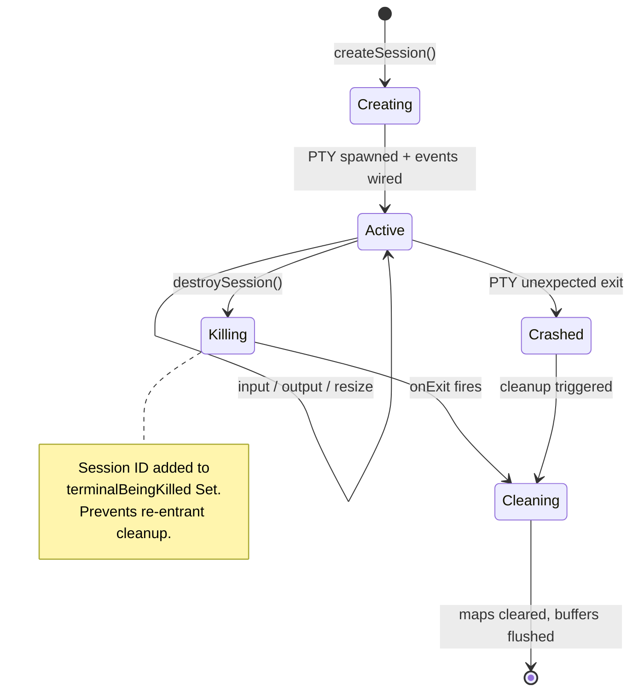
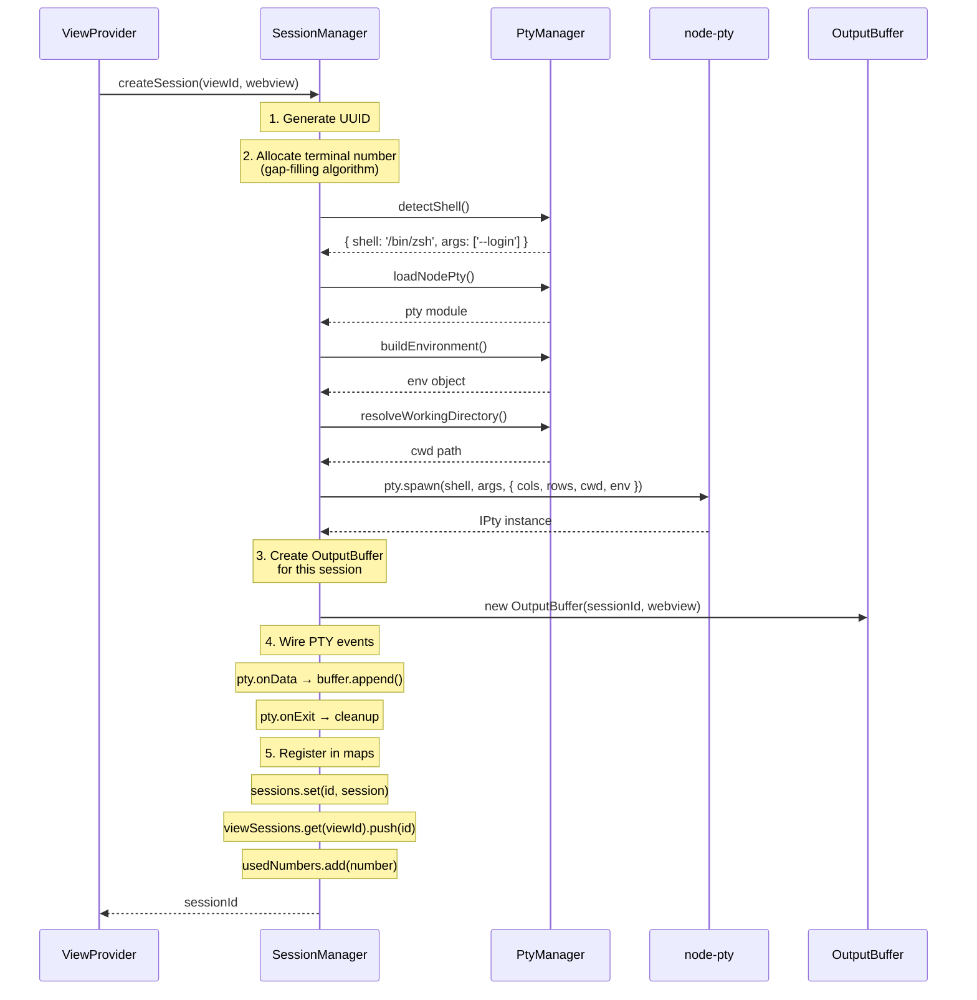
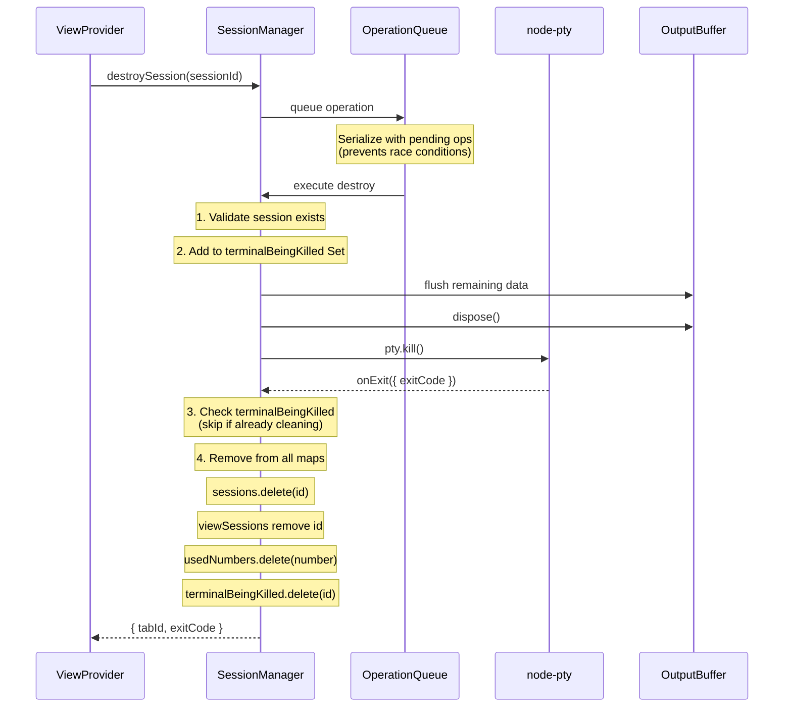
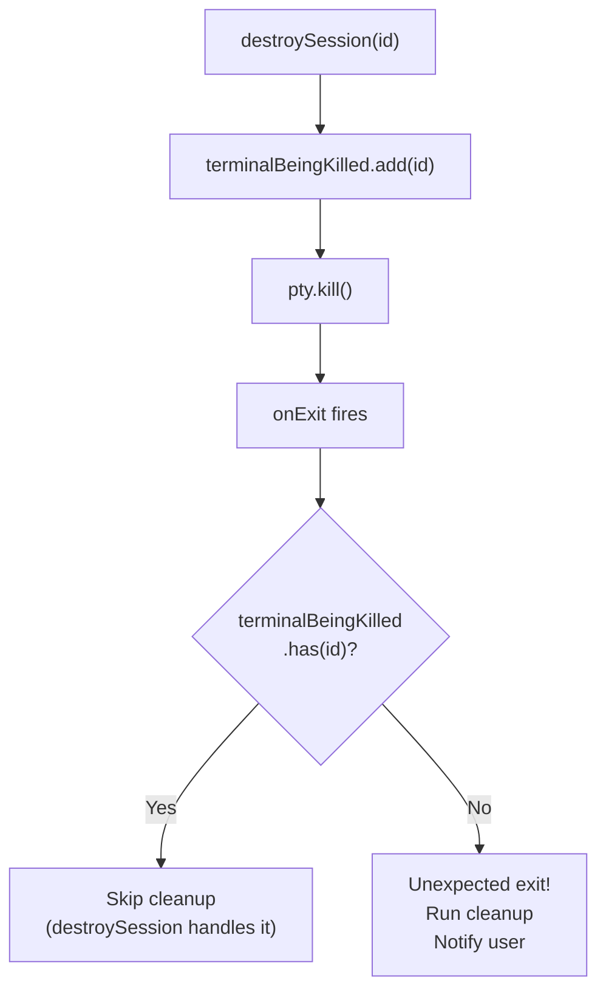
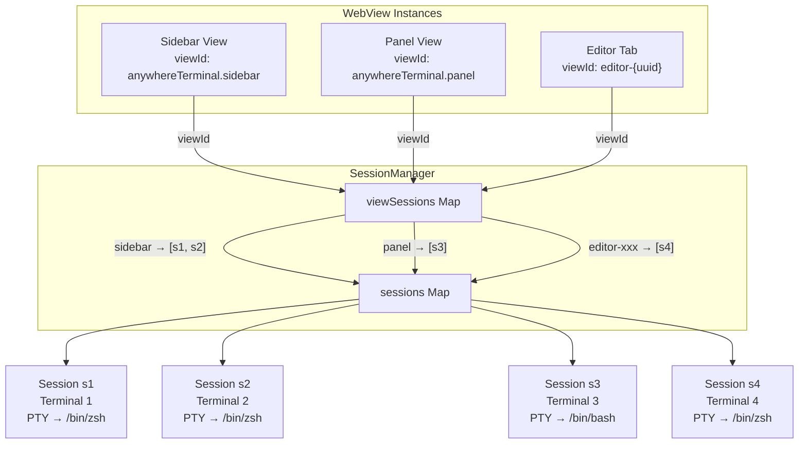

# Session Manager — Detailed Design

## 1. Overview

The **SessionManager** is the central registry for all terminal sessions across all views (sidebar, panel, editor). It owns the lifecycle of each terminal session: creation, input/output routing, resize, and destruction.

### Responsibilities
- Create and track terminal sessions (PTY + metadata)
- Route input from webviews to the correct PTY process
- Route buffered output from PTY to the correct webview
- Manage session lifecycle (create, destroy, cleanup)
- Handle tab numbering with gap-filling recycling
- Serialize destructive operations via operation queue
- Maintain scrollback cache for view restore

### Non-Responsibilities
- PTY module loading / shell detection (→ PtyManager)
- Output buffering / flow control (→ OutputBuffer, documented in output-buffering.md)
- WebView HTML generation (→ TerminalViewProvider)
- xterm.js management (→ webview-side TerminalManager)

---

## 2. Data Model

### TerminalSession

```typescript
interface TerminalSession {
  /** Unique session identifier (UUID) */
  id: string;

  /** Which view this session belongs to (e.g., 'anywhereTerminal.sidebar') */
  viewId: string;

  /** The node-pty IPty process instance */
  pty: IPty;

  /** Display name: "Terminal 1", "Terminal 2", etc. */
  name: string;

  /** Whether this is the active tab in its view */
  isActive: boolean;

  /** Assigned terminal number (for name and recycling) */
  number: number;

  /** Output buffer instance for this session */
  outputBuffer: IOutputBuffer;

  /** Cached scrollback lines for view restore */
  scrollbackCache: string[];

  /** Timestamp of session creation */
  createdAt: number;

  /** Current terminal dimensions */
  cols: number;
  rows: number;
}
```

### Session Maps

```typescript
class SessionManager {
  /** All sessions indexed by session ID */
  private sessions = new Map<string, TerminalSession>();

  /** View ID → ordered list of session IDs */
  private viewSessions = new Map<string, string[]>();

  /** Set of terminal numbers currently in use (for recycling) */
  private usedNumbers = new Set<number>();

  /** Set of session IDs currently being killed (prevent re-entrant cleanup) */
  private terminalBeingKilled = new Set<string>();

  /** Serialized operation queue for destructive operations */
  private operationQueue: Promise<void> = Promise.resolve();
}
```

---

## 3. Session Lifecycle

### State Machine



### Create Session Flow



### Destroy Session Flow



---

## 4. Operation Queue Pattern

### Problem

Rapid terminal operations (e.g., user clicks kill button multiple times, or closes multiple tabs quickly) can cause race conditions:
- Double-kill: `pty.kill()` called twice on same process
- Orphaned session: Session removed from map while PTY still running
- Number collision: Freed number reused before cleanup completes

### Solution: Promise Chain Serialization

From the reference project `vscode-sidebar-terminal/src/terminals/TerminalManager.ts`:

```typescript
private operationQueue: Promise<void> = Promise.resolve();

destroySession(sessionId: string): void {
  this.operationQueue = this.operationQueue.then(async () => {
    await this._performDestroy(sessionId);
  }).catch(err => {
    console.error('Destroy operation failed:', err);
  });
}
```

All destructive operations chain onto the same Promise. This guarantees serial execution without blocking the event loop.

### Queue Scope

Operations that must be serialized:
- `destroySession()`
- `destroyAllForView()`
- `dispose()` (extension deactivation)

Operations that do NOT need serialization (safe for concurrent execution):
- `createSession()` — only adds to maps, no mutation of existing sessions
- `writeToSession()` — simple pty.write(), per-session
- `resizeSession()` — simple pty.resize(), per-session
- `switchActiveSession()` — only toggles `isActive` flags

---

## 5. Kill Tracking

### Problem

When `destroySession()` calls `pty.kill()`, the PTY fires `onExit`. The `onExit` handler also tries to clean up the session. This creates a re-entrant cleanup loop.

### Solution: `terminalBeingKilled` Set



Two distinct exit paths:
1. **Intentional kill**: `destroySession()` → adds to Set → `pty.kill()` → `onExit` → checks Set → skips cleanup → `destroySession()` does cleanup → removes from Set
2. **Unexpected crash**: shell crashes → `onExit` → checks Set → not found → runs cleanup → notifies user with `[Process exited with code N]`

---

## 6. Terminal Number Recycling

### Algorithm

Find the lowest available number starting from 1:

```typescript
private findAvailableNumber(): number {
  for (let i = 1; ; i++) {
    if (!this.usedNumbers.has(i)) {
      this.usedNumbers.add(i);
      return i;
    }
  }
}
```

### Example

| Action | usedNumbers | Next available |
|--------|-------------|----------------|
| Create Terminal 1 | {1} | 2 |
| Create Terminal 2 | {1, 2} | 3 |
| Create Terminal 3 | {1, 2, 3} | 4 |
| Kill Terminal 2 | {1, 3} | 2 |
| Create Terminal | {1, 2, 3} | 4 (2 was recycled) |

This matches VS Code's behavior — terminal numbers fill gaps rather than always incrementing.

---

## 7. View-to-Session Routing

### Architecture



### Message Routing

When a webview sends `{ type: 'input', tabId: 's1', data: 'ls\r' }`:
1. ViewProvider receives message
2. ViewProvider calls `sessionManager.writeToSession('s1', 'ls\r')`
3. SessionManager looks up session `s1` in `sessions` map
4. Writes data to `session.pty.write('ls\r')`

When a PTY produces output:
1. `pty.onData` fires → data goes to `session.outputBuffer`
2. OutputBuffer flushes (after throttle) → calls `webview.postMessage({ type: 'output', tabId: 's1', data })`
3. The webview reference is stored per-session (set during `createSession()`)

---

## 8. Scrollback Cache

### Purpose

When `retainContextWhenHidden` is `false` (or as a safety net), the scrollback cache stores recent terminal output for view restoration.

### Design

```typescript
interface ScrollbackCache {
  /** Ring buffer of output chunks */
  chunks: string[];
  /** Total character count across all chunks */
  totalSize: number;
  /** Maximum total size (configurable, default 512KB) */
  maxSize: number;
}
```

### Eviction Strategy

When `totalSize > maxSize`:
- Remove oldest chunks from the front until under limit
- This is a FIFO ring buffer — old output is discarded first
- Default max: 512KB (~10,000 lines of 50-char average)

### Cache Population

Every `pty.onData` event:
1. Data goes to output buffer (for immediate delivery)
2. Data also appends to scrollback cache
3. If cache exceeds max size, evict from front

### Cache Consumption

On view restore (`resolveWebviewView` called again):
1. Send `{ type: 'restore', tabId, data: cache.join('') }` for each session
2. WebView writes restored data to xterm.js
3. User sees previous terminal output

---

## 9. Disposable Pattern

Following VS Code's pattern, SessionManager extends `Disposable` and uses `this._register()` for automatic cleanup:

```typescript
class SessionManager extends Disposable {
  constructor(private ptyManager: PtyManager) {
    super();
    // Register cleanup for extension deactivation
    this._register(toDisposable(() => this.destroyAll()));
  }

  createSession(viewId: string, webview: Webview): string {
    // ... create session ...

    // Register PTY event listeners for auto-cleanup
    const onData = pty.onData(data => { /* buffer */ });
    const onExit = pty.onExit(({ exitCode }) => { /* cleanup */ });

    // Store disposables with session for per-session cleanup
    session.disposables = [onData, onExit, outputBuffer];
    return session.id;
  }

  private cleanupSession(sessionId: string): void {
    const session = this.sessions.get(sessionId);
    if (!session) return;

    // Dispose all session-specific resources
    session.disposables.forEach(d => d.dispose());
    session.outputBuffer.dispose();

    // Remove from maps
    this.sessions.delete(sessionId);
    this.usedNumbers.delete(session.number);
    // ... remove from viewSessions ...
  }

  private destroyAll(): void {
    for (const session of this.sessions.values()) {
      session.pty.kill();
      session.disposables.forEach(d => d.dispose());
    }
    this.sessions.clear();
    this.viewSessions.clear();
    this.usedNumbers.clear();
  }
}
```

---

## 10. Public Interface

```typescript
interface ISessionManager extends Disposable {
  /** Create a new terminal session for a view */
  createSession(viewId: string, webview: Webview): string;

  /** Write input data to a session's PTY */
  writeToSession(sessionId: string, data: string): void;

  /** Resize a session's PTY */
  resizeSession(sessionId: string, cols: number, rows: number): void;

  /** Destroy a session (queued, serialized) */
  destroySession(sessionId: string): void;

  /** Destroy all sessions for a specific view */
  destroyAllForView(viewId: string): void;

  /** Switch active session within a view */
  switchActiveSession(viewId: string, sessionId: string): void;

  /** Get tab info for a view (for init/restore messages) */
  getTabsForView(viewId: string): Array<{ id: string; name: string; isActive: boolean }>;

  /** Get a session by ID */
  getSession(sessionId: string): TerminalSession | undefined;

  /** Clear scrollback for a session */
  clearScrollback(sessionId: string): void;
}
```

---

## 11. File Location

```
src/session/SessionManager.ts
```

### Dependencies
- `PtyManager` — for spawning PTY processes
- `OutputBuffer` — for per-session output buffering
- `vscode.Webview` — for posting messages to views

### Dependents
- `TerminalViewProvider` — creates/destroys sessions on user actions
- `TerminalEditorProvider` — same, for editor-area terminals
- `extension.ts` — creates SessionManager on activation, disposes on deactivation
