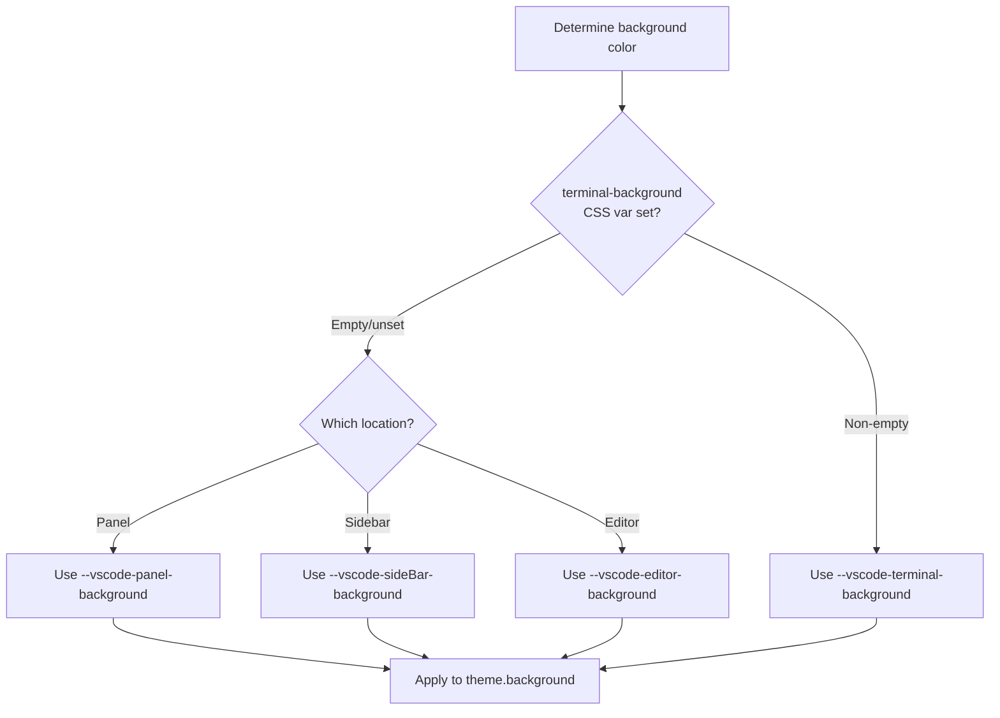
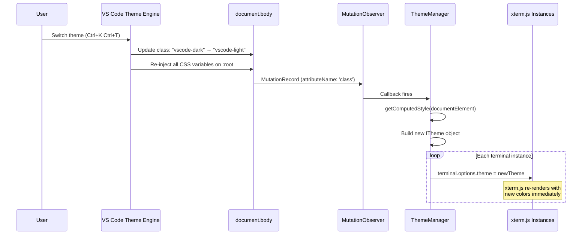
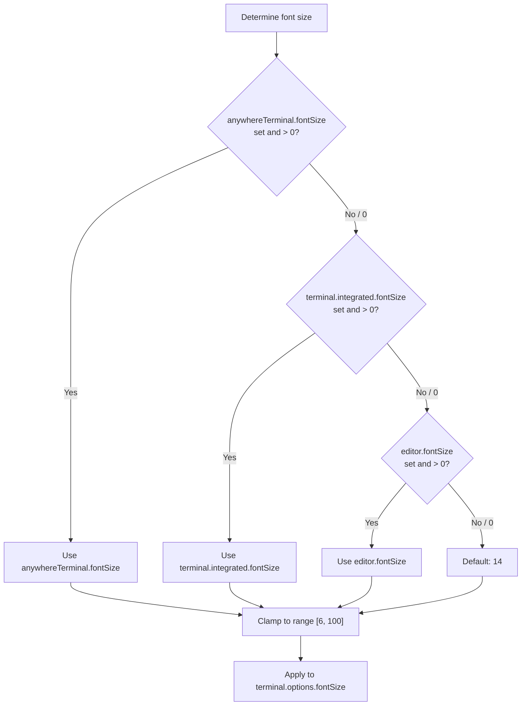
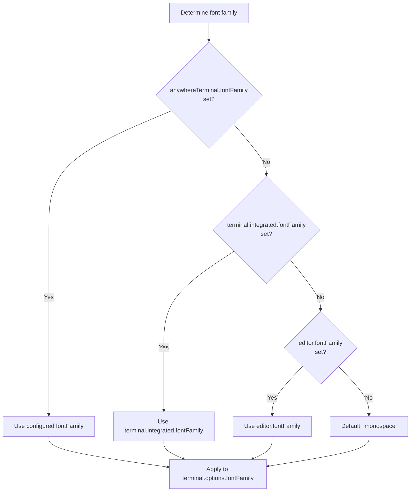
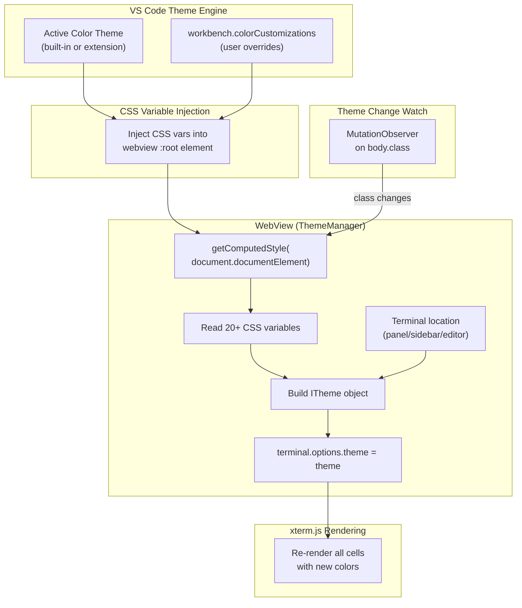
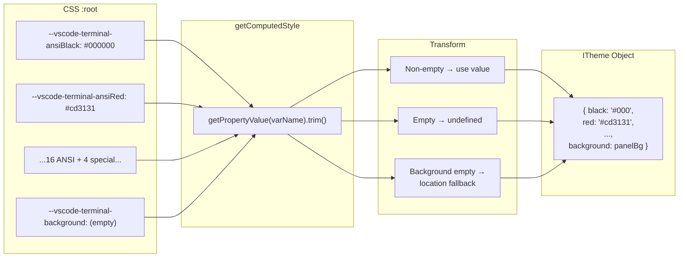
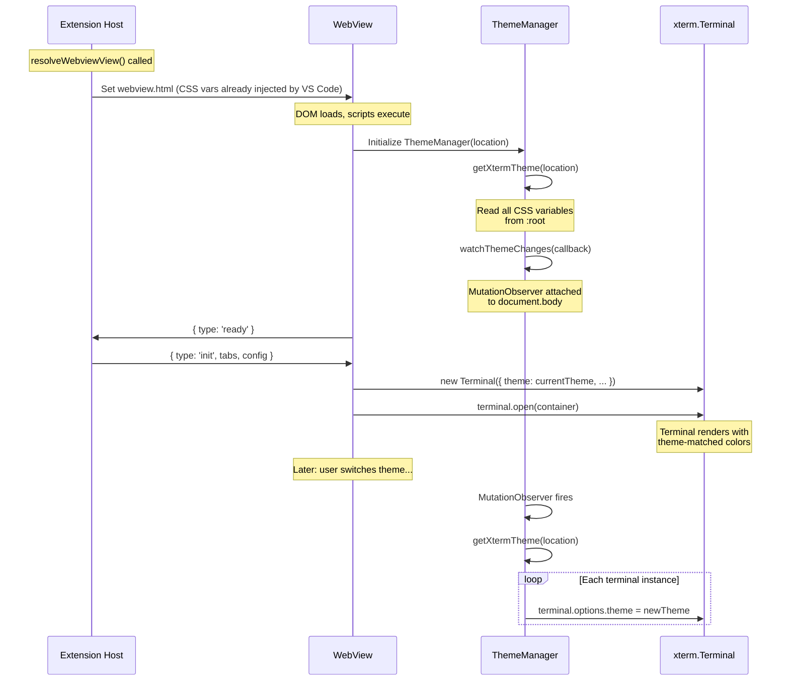

# Theme Integration — Detailed Design

## 1. Overview

AnyWhere Terminal renders xterm.js inside VS Code webviews. VS Code's theme engine automatically injects CSS custom properties (variables) into the webview's `:root` element, reflecting the user's active color theme. Our **ThemeManager** reads these CSS variables at runtime using `getComputedStyle()`, constructs an xterm.js `ITheme` object, and applies it to every terminal instance.

This approach ensures the terminal always matches the user's VS Code theme — including third-party themes — without hardcoding any color values.

### Reference Sources
- VS Code: `src/vs/workbench/contrib/terminal/browser/xterm/xtermTerminal.ts` (theme building)
- VS Code: `src/vs/workbench/contrib/terminal/common/terminalColorRegistry.ts` (CSS variable definitions)
- VS Code: `src/vs/workbench/contrib/terminal/browser/terminalInstance.ts` (font resolution)
- xterm.js: `ITheme` interface documentation

---

## 2. CSS Variable Mapping

VS Code registers terminal-specific color contributions in `terminalColorRegistry.ts`. These are injected into webview `:root` as CSS custom properties. The ThemeManager reads all of them and maps them to xterm.js `ITheme` properties.

### 2.1 ANSI Color Mapping Table

| CSS Variable | xterm.js `ITheme` Property | ANSI Code | Description |
|---|---|---|---|
| `--vscode-terminal-ansiBlack` | `theme.black` | 0 | Black |
| `--vscode-terminal-ansiRed` | `theme.red` | 1 | Red |
| `--vscode-terminal-ansiGreen` | `theme.green` | 2 | Green |
| `--vscode-terminal-ansiYellow` | `theme.yellow` | 3 | Yellow |
| `--vscode-terminal-ansiBlue` | `theme.blue` | 4 | Blue |
| `--vscode-terminal-ansiMagenta` | `theme.magenta` | 5 | Magenta |
| `--vscode-terminal-ansiCyan` | `theme.cyan` | 6 | Cyan |
| `--vscode-terminal-ansiWhite` | `theme.white` | 7 | White |
| `--vscode-terminal-ansiBrightBlack` | `theme.brightBlack` | 8 | Bright Black (Gray) |
| `--vscode-terminal-ansiBrightRed` | `theme.brightRed` | 9 | Bright Red |
| `--vscode-terminal-ansiBrightGreen` | `theme.brightGreen` | 10 | Bright Green |
| `--vscode-terminal-ansiBrightYellow` | `theme.brightYellow` | 11 | Bright Yellow |
| `--vscode-terminal-ansiBrightBlue` | `theme.brightBlue` | 12 | Bright Blue |
| `--vscode-terminal-ansiBrightMagenta` | `theme.brightMagenta` | 13 | Bright Magenta |
| `--vscode-terminal-ansiBrightCyan` | `theme.brightCyan` | 14 | Bright Cyan |
| `--vscode-terminal-ansiBrightWhite` | `theme.brightWhite` | 15 | Bright White |

### 2.2 Special Color Mapping Table

| CSS Variable | xterm.js `ITheme` Property | Description |
|---|---|---|
| `--vscode-terminal-background` | `theme.background` | Terminal default background |
| `--vscode-terminal-foreground` | `theme.foreground` | Terminal default text color |
| `--vscode-terminalCursor-foreground` | `theme.cursor` | Cursor color |
| `--vscode-terminal-selectionBackground` | `theme.selectionBackground` | Text selection highlight |

> **Note:** The cursor foreground variable uses `terminalCursor` (no hyphen before "Cursor"), not `terminal-cursor`. This is a VS Code naming convention difference.

---

## 3. Location-Aware Background Color

### Problem

VS Code's built-in terminal uses different background colors depending on where the terminal is rendered. This is handled by `TerminalInstanceColorProvider` in VS Code's codebase. When `--vscode-terminal-background` is not explicitly set by the theme (many themes omit it), the terminal should blend into its container rather than showing a mismatched background.

### Background Color Resolution Chain



### Location-to-Variable Mapping

| Terminal Location | Fallback CSS Variable | VS Code Component |
|---|---|---|
| Bottom Panel | `--vscode-panel-background` | Panel container |
| Primary Sidebar | `--vscode-sideBar-background` | Sidebar container |
| Secondary Sidebar | `--vscode-sideBar-background` | Same as primary sidebar |
| Editor Area | `--vscode-editor-background` | Editor container |

### Implementation

The webview receives its location context from the extension host during initialization. The `init` message includes a `location` field (`'panel' | 'sidebar' | 'editor'`), which the ThemeManager uses to select the correct fallback variable.

```typescript
type TerminalLocation = 'panel' | 'sidebar' | 'editor';

const LOCATION_BACKGROUND_MAP: Record<TerminalLocation, string> = {
  panel: '--vscode-panel-background',
  sidebar: '--vscode-sideBar-background',
  editor: '--vscode-editor-background',
};

function resolveBackground(location: TerminalLocation): string {
  const style = getComputedStyle(document.documentElement);
  const terminalBg = style.getPropertyValue('--vscode-terminal-background').trim();

  if (terminalBg) {
    return terminalBg;
  }

  const fallbackVar = LOCATION_BACKGROUND_MAP[location];
  return style.getPropertyValue(fallbackVar).trim() || '#1e1e1e';
}
```

---

## 4. Theme Change Detection

### Mechanism

VS Code signals theme changes by toggling CSS classes on `document.body`. The webview body element always has one of:

| Body Class | Theme Kind | Description |
|---|---|---|
| `vscode-dark` | Dark theme | Dark background, light text |
| `vscode-light` | Light theme | Light background, dark text |
| `vscode-high-contrast` | High contrast dark | Accessibility theme |
| `vscode-high-contrast-light` | High contrast light | Accessibility theme (VS Code 1.74+) |

When the user switches themes (e.g., via `Ctrl+K Ctrl+T`), VS Code updates the body class and re-injects all CSS variables. Our ThemeManager watches for this class change using a `MutationObserver`.

### Detection Flow



### MutationObserver Setup

```typescript
function watchThemeChanges(onThemeChange: () => void): MutationObserver {
  const observer = new MutationObserver((mutations) => {
    for (const mutation of mutations) {
      if (
        mutation.type === 'attributes' &&
        mutation.attributeName === 'class'
      ) {
        onThemeChange();
        break;
      }
    }
  });

  observer.observe(document.body, {
    attributes: true,
    attributeFilter: ['class'],
  });

  return observer;
}
```

### Edge Cases

1. **Rapid theme switching**: If the user rapidly toggles themes, multiple `MutationObserver` callbacks fire. The theme re-read is fast (synchronous `getComputedStyle`), so no debouncing is needed — each application just overwrites the previous.

2. **High contrast themes**: These themes may not define all 16 ANSI colors. When a CSS variable is unset, `getPropertyValue()` returns `''`. We leave those properties undefined in the ITheme object, letting xterm.js fall back to its built-in defaults.

3. **Custom CSS in settings**: Users can override terminal colors via `workbench.colorCustomizations`. These are reflected in the CSS variables and picked up automatically.

---

## 5. Font Resolution

### Font Size Resolution Chain

The terminal font size follows a priority chain, matching VS Code's built-in terminal behavior:



### Font Family Resolution Chain



### Font Resolution Implementation

Font settings are read from VS Code configuration on the extension host side (not from CSS variables), because `terminal.integrated.fontSize` and `editor.fontSize` are not exposed as CSS variables in webviews.

```typescript
function resolveFontSize(): number {
  const config = vscode.workspace.getConfiguration();

  const awtFontSize = config.get<number>('anywhereTerminal.fontSize', 0);
  if (awtFontSize > 0) return clamp(awtFontSize, 6, 100);

  const terminalFontSize = config.get<number>('terminal.integrated.fontSize', 0);
  if (terminalFontSize > 0) return clamp(terminalFontSize, 6, 100);

  const editorFontSize = config.get<number>('editor.fontSize', 0);
  if (editorFontSize > 0) return clamp(editorFontSize, 6, 100);

  return 14;
}

function resolveFontFamily(): string {
  const config = vscode.workspace.getConfiguration();

  const awtFamily = config.get<string>('anywhereTerminal.fontFamily', '');
  if (awtFamily) return awtFamily;

  const terminalFamily = config.get<string>('terminal.integrated.fontFamily', '');
  if (terminalFamily) return terminalFamily;

  const editorFamily = config.get<string>('editor.fontFamily', '');
  if (editorFamily) return editorFamily;

  return 'monospace';
}

function clamp(value: number, min: number, max: number): number {
  return Math.max(min, Math.min(max, value));
}
```

The resolved font values are sent to the webview as part of the `init` and `configUpdate` messages.

---

## 6. Complete Theme Building Function

### getXtermTheme()

This function runs in the webview context and reads all CSS variables to construct the xterm.js theme object.

```typescript
import type { ITheme } from '@xterm/xterm';

/**
 * Build an xterm.js ITheme object from VS Code's CSS variables.
 *
 * VS Code injects CSS custom properties into the webview :root element
 * matching the user's active color theme. We read these at runtime and
 * map them to the corresponding xterm.js theme properties.
 *
 * @param location - Where this terminal is rendered (panel, sidebar, editor).
 *                   Used to select the correct background fallback.
 * @returns Complete ITheme object for xterm.js
 */
function getXtermTheme(location: TerminalLocation = 'panel'): ITheme {
  const style = getComputedStyle(document.documentElement);
  const get = (varName: string): string | undefined => {
    const value = style.getPropertyValue(varName).trim();
    return value || undefined; // Return undefined for empty strings
  };

  // Background: terminal-specific → location-specific → hardcoded fallback
  const background =
    get('--vscode-terminal-background') ??
    get(LOCATION_BACKGROUND_MAP[location]) ??
    '#1e1e1e';

  // Foreground: terminal-specific → editor foreground → fallback
  const foreground =
    get('--vscode-terminal-foreground') ??
    get('--vscode-editor-foreground') ??
    '#cccccc';

  return {
    // Special colors
    background,
    foreground,
    cursor: get('--vscode-terminalCursor-foreground'),
    cursorAccent: get('--vscode-terminalCursor-background'),
    selectionBackground: get('--vscode-terminal-selectionBackground'),
    selectionForeground: get('--vscode-terminal-selectionForeground'),
    selectionInactiveBackground: get('--vscode-terminal-inactiveSelectionBackground'),

    // Standard ANSI colors (0–7)
    black: get('--vscode-terminal-ansiBlack'),
    red: get('--vscode-terminal-ansiRed'),
    green: get('--vscode-terminal-ansiGreen'),
    yellow: get('--vscode-terminal-ansiYellow'),
    blue: get('--vscode-terminal-ansiBlue'),
    magenta: get('--vscode-terminal-ansiMagenta'),
    cyan: get('--vscode-terminal-ansiCyan'),
    white: get('--vscode-terminal-ansiWhite'),

    // Bright ANSI colors (8–15)
    brightBlack: get('--vscode-terminal-ansiBrightBlack'),
    brightRed: get('--vscode-terminal-ansiBrightRed'),
    brightGreen: get('--vscode-terminal-ansiBrightGreen'),
    brightYellow: get('--vscode-terminal-ansiBrightYellow'),
    brightBlue: get('--vscode-terminal-ansiBrightBlue'),
    brightMagenta: get('--vscode-terminal-ansiBrightMagenta'),
    brightCyan: get('--vscode-terminal-ansiBrightCyan'),
    brightWhite: get('--vscode-terminal-ansiBrightWhite'),
  };
}
```

---

## 7. Theme Application Pipeline

### Full Pipeline: Theme Engine → xterm.js Rendering



### CSS Variable Reading Pipeline



---

## 8. Initialization Sequence

### Theme Application at Startup



---

## 9. ThemeManager Interface

```typescript
interface IThemeManager {
  /**
   * Build and return the current xterm.js theme from CSS variables.
   */
  getTheme(): ITheme;

  /**
   * Apply the current theme to a terminal instance.
   */
  applyTheme(terminal: Terminal): void;

  /**
   * Apply the current theme to all registered terminal instances.
   */
  applyThemeToAll(): void;

  /**
   * Start watching for theme changes via MutationObserver.
   * Calls applyThemeToAll() whenever the theme changes.
   */
  startWatching(): void;

  /**
   * Stop watching for theme changes. Disconnects the MutationObserver.
   */
  stopWatching(): void;

  /**
   * Register a terminal instance for automatic theme updates.
   */
  registerTerminal(id: string, terminal: Terminal): void;

  /**
   * Unregister a terminal instance.
   */
  unregisterTerminal(id: string): void;
}
```

---

## 10. File Location

```
src/webview/ui/ThemeManager.ts
```

### Dependencies
- `@xterm/xterm` — `ITheme`, `Terminal` types
- Browser APIs — `getComputedStyle`, `MutationObserver`

### Dependents
- `TerminalWebviewApp` (main.ts) — creates ThemeManager, registers terminals
- `TerminalManager` — calls `applyTheme()` when creating new terminal instances
