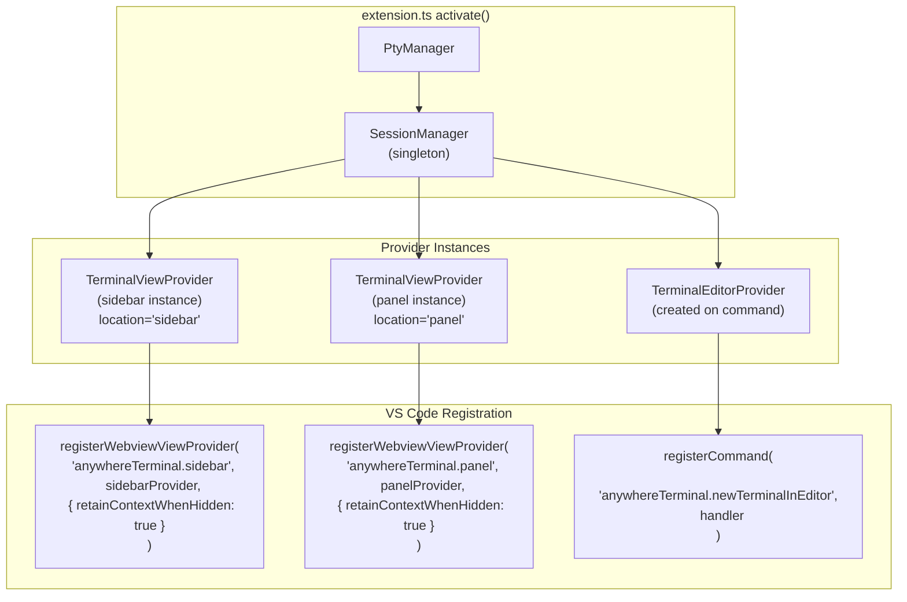
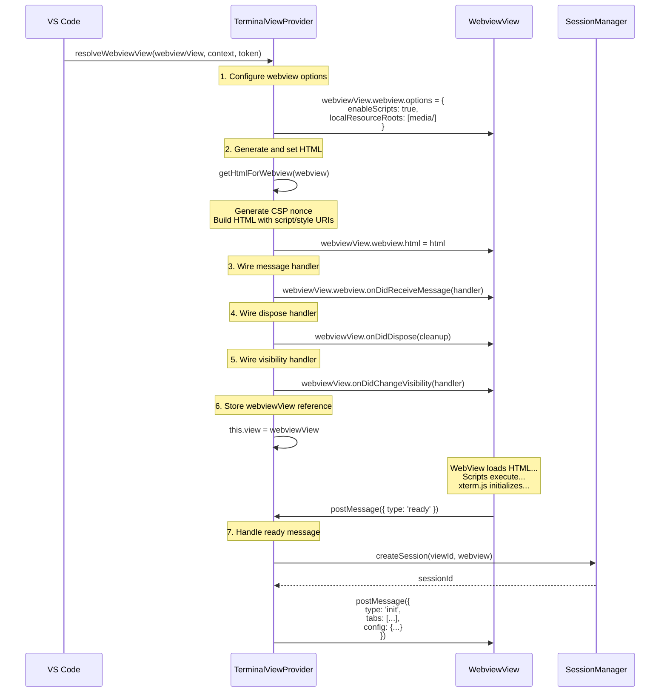
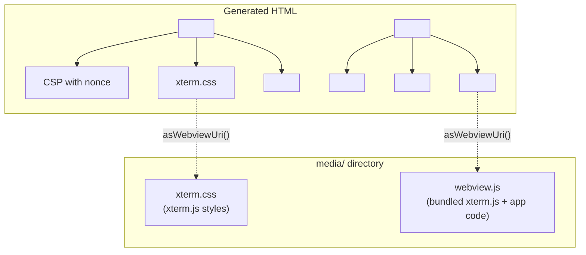
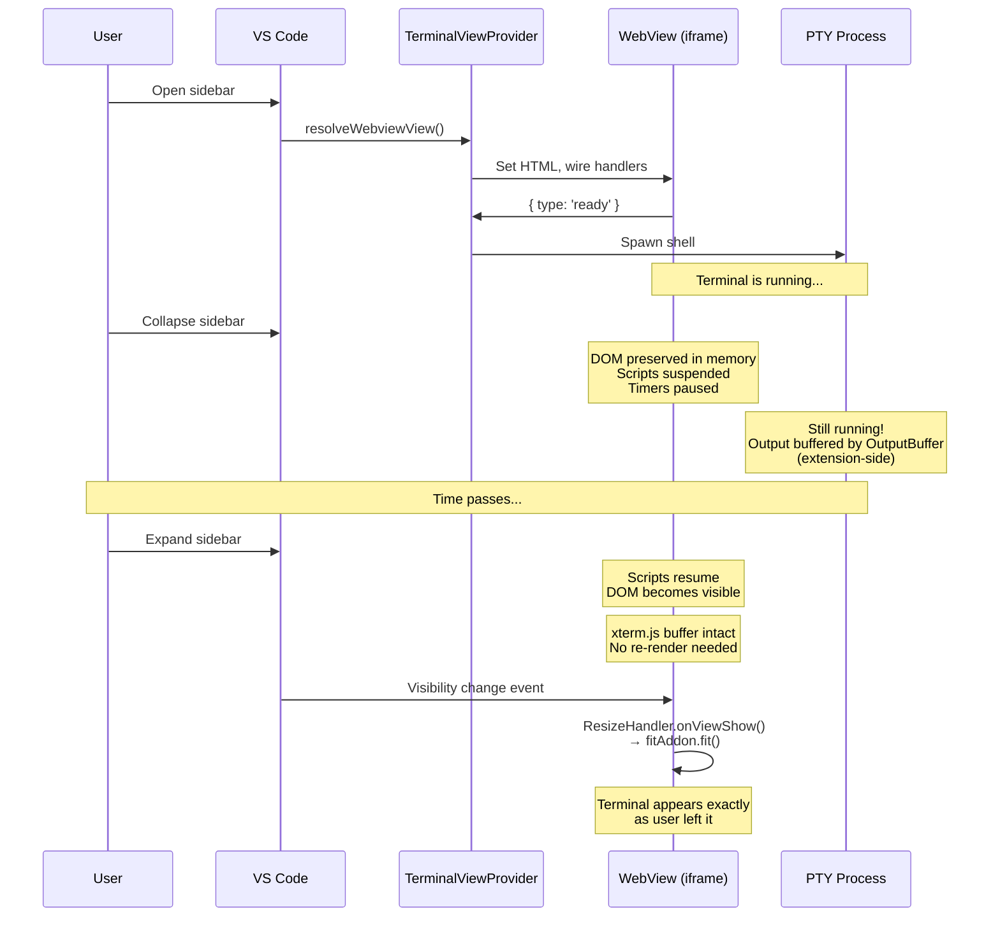
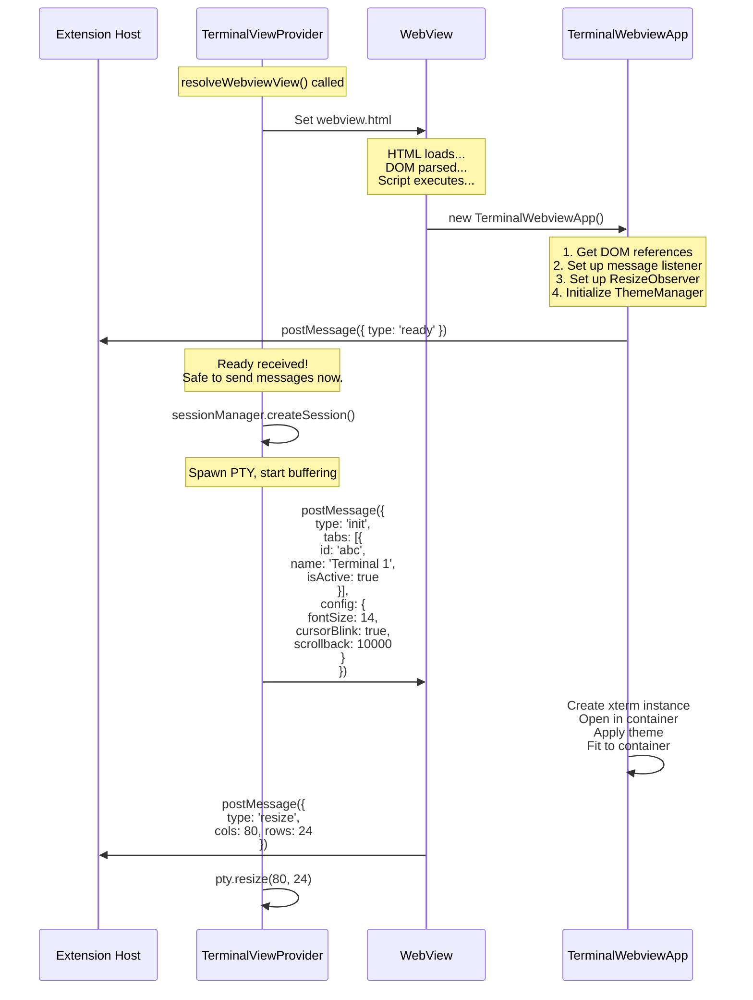
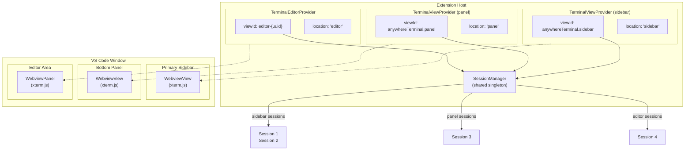
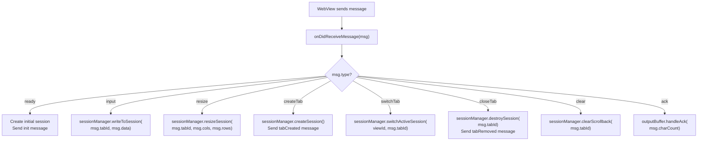
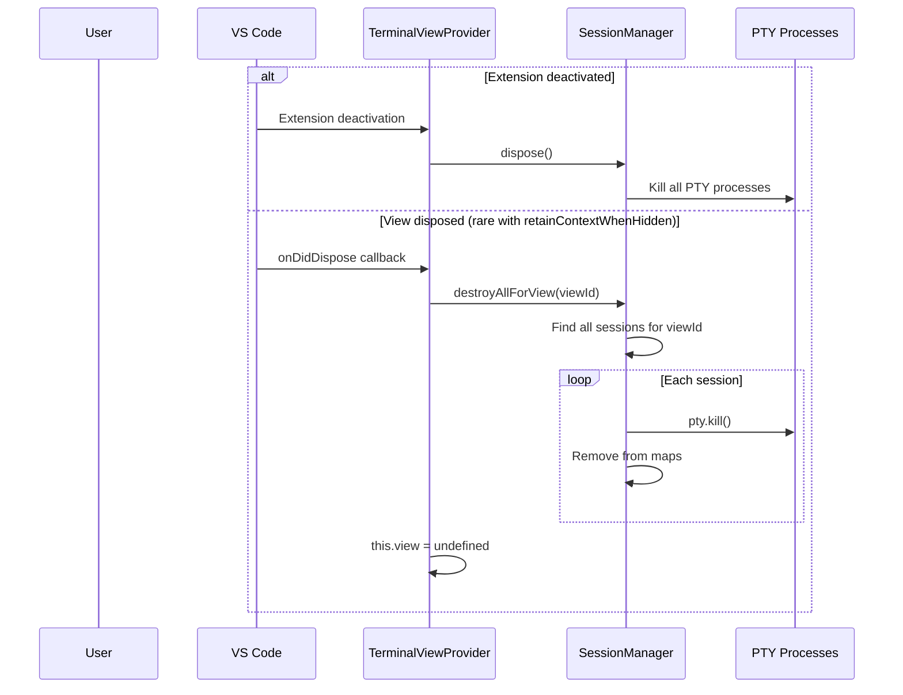

# WebviewViewProvider Lifecycle — Detailed Design

## 1. Overview

**TerminalViewProvider** implements `vscode.WebviewViewProvider`, the VS Code API for embedding webview content inside sidebar and panel views. It is the bridge between VS Code's view system and our terminal sessions: it generates the webview HTML, wires up message handlers, and delegates terminal operations to the SessionManager.

The same `TerminalViewProvider` class is instantiated multiple times — once per view location (sidebar, panel). Each instance manages its own set of terminal sessions through a unique `viewId`. The editor area uses a separate `TerminalEditorProvider` class that works with `WebviewPanel` instead.

### Reference Sources
- VS Code API: `vscode.WebviewViewProvider`, `WebviewView`, `WebviewPanel`
- VS Code: `src/vs/workbench/api/browser/mainThreadWebviewViews.ts` (provider lifecycle)
- Reference project: `vscode-sidebar-terminal/src/providers/SidebarTerminalProvider.ts`

---

## 2. Provider Registration

### Registration in extension.ts

Providers are registered during extension activation. Each registration binds a `TerminalViewProvider` instance to a specific view ID declared in `package.json`.

```typescript
// src/extension.ts

export function activate(context: vscode.ExtensionContext) {
  const sessionManager = new SessionManager(new PtyManager());

  // Sidebar view
  const sidebarProvider = new TerminalViewProvider(
    context.extensionUri,
    sessionManager,
    'sidebar',
  );

  context.subscriptions.push(
    vscode.window.registerWebviewViewProvider(
      'anywhereTerminal.sidebar',
      sidebarProvider,
      { webviewOptions: { retainContextWhenHidden: true } },
    ),
  );

  // Panel view (same class, different instance and viewId)
  const panelProvider = new TerminalViewProvider(
    context.extensionUri,
    sessionManager,
    'panel',
  );

  context.subscriptions.push(
    vscode.window.registerWebviewViewProvider(
      'anywhereTerminal.panel',
      panelProvider,
      { webviewOptions: { retainContextWhenHidden: true } },
    ),
  );

  // Editor area uses a different provider
  context.subscriptions.push(
    vscode.commands.registerCommand(
      'anywhereTerminal.newTerminalInEditor',
      () => TerminalEditorProvider.createPanel(context, sessionManager),
    ),
  );

  // Cleanup on deactivation
  context.subscriptions.push(sessionManager);
}
```

### Registration Diagram



---

## 3. resolveWebviewView Lifecycle

### When resolveWebviewView is Called

VS Code calls `resolveWebviewView()` when the view first becomes visible. This happens in these scenarios:

| Trigger | Description |
|---|---|
| Extension activated + view visible | User has the sidebar/panel open when the extension activates |
| User opens view | Clicks the AnyWhere Terminal icon in the activity bar |
| User expands collapsed view | Re-expands a previously collapsed sidebar section |
| View restored after reload | VS Code reloads window and restores view state |

> **Important**: `resolveWebviewView()` is called **at most once** when `retainContextWhenHidden` is `true`. The webview persists even when hidden, so VS Code never needs to re-resolve it.

### resolveWebviewView Sequence



### resolveWebviewView Implementation

```typescript
export class TerminalViewProvider implements vscode.WebviewViewProvider {
  public static readonly sidebarViewType = 'anywhereTerminal.sidebar';
  public static readonly panelViewType = 'anywhereTerminal.panel';

  private view: vscode.WebviewView | undefined;

  constructor(
    private readonly extensionUri: vscode.Uri,
    private readonly sessionManager: SessionManager,
    private readonly location: 'sidebar' | 'panel',
  ) {}

  resolveWebviewView(
    webviewView: vscode.WebviewView,
    context: vscode.WebviewViewResolveContext,
    token: vscode.CancellationToken,
  ): void {
    this.view = webviewView;

    // 1. Configure webview options
    webviewView.webview.options = {
      enableScripts: true,
      localResourceRoots: [
        vscode.Uri.joinPath(this.extensionUri, 'media'),
      ],
    };

    // 2. Set HTML content
    webviewView.webview.html = this.getHtmlForWebview(webviewView.webview);

    // 3. Wire message handler
    webviewView.webview.onDidReceiveMessage((msg) => {
      this.handleMessage(msg, webviewView);
    });

    // 4. Wire dispose handler
    webviewView.onDidDispose(() => {
      this.sessionManager.destroyAllForView(this.getViewId());
      this.view = undefined;
    });

    // 5. Wire visibility handler (for deferred resize)
    webviewView.onDidChangeVisibility(() => {
      if (webviewView.visible) {
        // View became visible — notify webview for resize
        webviewView.webview.postMessage({ type: 'viewShow' });
      }
    });
  }

  private getViewId(): string {
    return this.location === 'sidebar'
      ? TerminalViewProvider.sidebarViewType
      : TerminalViewProvider.panelViewType;
  }
}
```

---

## 4. HTML Generation

### Content Security Policy (CSP)

The webview HTML includes a strict CSP that limits what code can execute:

```
Content-Security-Policy:
  default-src 'none';                          # Block all by default
  style-src ${webview.cspSource} 'unsafe-inline';  # VS Code styles + inline
  script-src 'nonce-${nonce}';                 # Only nonce-tagged scripts
  font-src ${webview.cspSource};               # VS Code fonts (for codicons)
```

| Directive | Value | Purpose |
|---|---|---|
| `default-src` | `'none'` | Block everything by default — explicit allowlist only |
| `style-src` | `${cspSource} 'unsafe-inline'` | Allow VS Code webview styles and inline `<style>` blocks for xterm.js |
| `script-src` | `'nonce-${nonce}'` | Only allow scripts with the correct nonce — prevents XSS |
| `font-src` | `${cspSource}` | Allow loading fonts from VS Code's webview resource origin |

### Nonce Generation

Each render generates a fresh cryptographically random nonce. This ensures that injected scripts cannot execute even if an attacker finds an XSS vector.

```typescript
function getNonce(): string {
  const array = new Uint8Array(16);
  crypto.getRandomValues(array);
  return Array.from(array, (b) => b.toString(16).padStart(2, '0')).join('');
}
```

This produces a 32-character hex string (128 bits of entropy). The nonce is embedded in both the CSP meta tag and the script tag, and is regenerated every time `getHtmlForWebview()` is called.

### Resource URIs

WebView resources must be converted to webview-safe URIs using `webview.asWebviewUri()`. This transforms `file://` URIs into `vscode-webview-resource://` URIs that pass the CSP.

```typescript
private getHtmlForWebview(webview: vscode.Webview): string {
  const nonce = getNonce();

  // Convert file paths to webview URIs
  const scriptUri = webview.asWebviewUri(
    vscode.Uri.joinPath(this.extensionUri, 'media', 'webview.js')
  );
  const styleUri = webview.asWebviewUri(
    vscode.Uri.joinPath(this.extensionUri, 'media', 'xterm.css')
  );

  return `<!DOCTYPE html>
<html lang="en">
<head>
  <meta charset="UTF-8">
  <meta name="viewport" content="width=device-width, initial-scale=1.0">
  <meta http-equiv="Content-Security-Policy"
        content="default-src 'none';
                 style-src ${webview.cspSource} 'unsafe-inline';
                 script-src 'nonce-${nonce}';
                 font-src ${webview.cspSource};">
  <link href="${styleUri}" rel="stylesheet">
  <style>
    html, body {
      height: 100%;
      margin: 0;
      padding: 0;
      overflow: hidden;
    }
    body {
      display: flex;
      flex-direction: column;
    }
    #tab-bar { /* ... tab bar styles ... */ }
    #terminal-container {
      flex: 1;
      overflow: hidden;
    }
  </style>
</head>
<body>
  <div id="tab-bar"></div>
  <div id="terminal-container"></div>
  <script nonce="${nonce}" src="${scriptUri}"></script>
</body>
</html>`;
}
```

### HTML Structure



---

## 5. retainContextWhenHidden Behavior

### What It Does

`retainContextWhenHidden: true` is set at provider registration time (not in `resolveWebviewView`). It controls whether the webview's iframe DOM is preserved when the view is hidden (sidebar collapsed, panel minimized, view scrolled out of sight).

### Behavior Comparison

| Aspect | retainContextWhenHidden: true | retainContextWhenHidden: false |
|---|---|---|
| DOM on hide | **Preserved** | Destroyed |
| Scripts on hide | **Suspended** (timers paused) | Terminated |
| State on show | **Intact** (xterm buffer preserved) | Lost (must rebuild) |
| resolveWebviewView calls | **Once** (ever) | Every time view becomes visible |
| Memory cost | Higher (DOM kept in memory) | Lower |
| PTY process | Continues running | Continues running |
| Output while hidden | Buffered → delivered when scripts resume | Buffered in scrollback cache → restored |
| Required for us? | **Yes** (prevents terminal state loss) | No (but requires complex restore logic) |

### Lifecycle with retainContextWhenHidden: true



### Output Delivery While Hidden

When the webview is hidden with `retainContextWhenHidden: true`:

1. PTY output arrives at the OutputBuffer (extension host)
2. OutputBuffer calls `webview.postMessage()` — this **still works** even when the view is hidden
3. The message is queued by VS Code's webview infrastructure
4. When scripts resume (view becomes visible), queued messages are delivered
5. xterm.js processes the messages and renders the output

This means terminal output appears seamlessly when the user re-expands the sidebar — no explicit restore logic needed.

### Scrollback Cache as Safety Net

Despite `retainContextWhenHidden: true`, the scrollback cache is still maintained as a safety net for these scenarios:
- VS Code reload (window.reload) — destroys all webviews
- Extension host restart — webview may be recreated
- Memory pressure — VS Code may reclaim webview memory in extreme cases

---

## 6. Ready Handshake

### Purpose

The ready handshake ensures the extension doesn't send messages to the webview before it's ready to receive them. Without this, race conditions can occur: the extension might post an `init` message before the webview has set up its message listener.

### Handshake Sequence



### Message Types

```typescript
// WebView → Extension: Ready signal
interface ReadyMessage {
  type: 'ready';
}

// Extension → WebView: Initialization data
interface InitMessage {
  type: 'init';
  tabs: Array<{
    id: string;
    name: string;
    isActive: boolean;
  }>;
  config: {
    fontSize: number;
    fontFamily: string;
    cursorBlink: boolean;
    scrollback: number;
    location: 'panel' | 'sidebar' | 'editor';
  };
}
```

### Pre-Ready Message Queue

Messages received by the provider before the `ready` signal are **not queued** in our design. This is safe because:

1. The provider doesn't send any messages until it receives `ready`
2. PTY processes are not spawned until `ready` is received
3. The only direction for pre-ready messages is webview→extension, and the extension's `onDidReceiveMessage` handler is already registered

---

## 7. Multi-Location Support

### Architecture

The same `TerminalViewProvider` class serves both sidebar and panel locations. Each instance has its own `location` property and `viewId`, resulting in isolated terminal sessions per location.



### WebviewViewProvider vs. WebviewPanel

| Aspect | WebviewViewProvider | WebviewPanel |
|---|---|---|
| Used for | Sidebar, Panel | Editor area |
| Registration | `registerWebviewViewProvider()` | `createWebviewPanel()` |
| Lifecycle | VS Code manages (resolve on show) | Extension manages (create/dispose) |
| retainContextWhenHidden | Set at registration | Set on panel options |
| View ID | Static (from package.json) | Dynamic (generated per panel) |
| Class in our code | `TerminalViewProvider` | `TerminalEditorProvider` |
| Multiple instances | One per registered viewId | One per opened editor tab |

### TerminalEditorProvider

The editor area uses `WebviewPanel` (not `WebviewViewProvider`) because editor tabs are created on-demand via commands, not declared statically in `package.json`.

```typescript
export class TerminalEditorProvider {
  static createPanel(
    context: vscode.ExtensionContext,
    sessionManager: SessionManager,
  ): vscode.WebviewPanel {
    const panel = vscode.window.createWebviewPanel(
      'anywhereTerminal.editor',        // viewType
      'Terminal',                         // title
      vscode.ViewColumn.Active,          // show in active editor column
      {
        enableScripts: true,
        retainContextWhenHidden: true,
        localResourceRoots: [
          vscode.Uri.joinPath(context.extensionUri, 'media'),
        ],
      },
    );

    // Generate unique viewId for session tracking
    const viewId = `editor-${crypto.randomUUID()}`;

    // HTML generation is identical to TerminalViewProvider
    panel.webview.html = getHtmlForWebview(
      panel.webview,
      context.extensionUri,
    );

    // Message handling is identical
    panel.webview.onDidReceiveMessage((msg) => {
      handleMessage(msg, panel.webview, viewId, sessionManager);
    });

    // Cleanup on close
    panel.onDidDispose(() => {
      sessionManager.destroyAllForView(viewId);
    });

    return panel;
  }
}
```

---

## 8. Message Handling

### onDidReceiveMessage Router

The provider's message handler routes incoming webview messages to the appropriate SessionManager method:



### Error Handling in Message Router

```typescript
private handleMessage(
  msg: WebViewToExtensionMessage,
  webviewView: vscode.WebviewView,
): void {
  try {
    switch (msg.type) {
      case 'ready':
        this.onReady(webviewView);
        break;
      case 'input':
        this.sessionManager.writeToSession(msg.tabId, msg.data);
        break;
      case 'resize':
        this.sessionManager.resizeSession(msg.tabId, msg.cols, msg.rows);
        break;
      // ... other cases ...
      default:
        console.warn(`Unknown message type: ${(msg as any).type}`);
    }
  } catch (err) {
    console.error(`Error handling message ${msg.type}:`, err);
    // Don't rethrow — isolated error shouldn't crash the provider
  }
}
```

---

## 9. Dispose & Cleanup

### Dispose Flow



### Disposable Registration

Following VS Code conventions, all event subscriptions are registered as disposables:

```typescript
resolveWebviewView(webviewView: vscode.WebviewView): void {
  // All subscriptions added to view's disposable bag
  const disposables: vscode.Disposable[] = [];

  disposables.push(
    webviewView.webview.onDidReceiveMessage((msg) => {
      this.handleMessage(msg, webviewView);
    }),
  );

  disposables.push(
    webviewView.onDidChangeVisibility(() => {
      // Handle visibility change
    }),
  );

  webviewView.onDidDispose(() => {
    // Clean up all subscriptions
    disposables.forEach((d) => d.dispose());
    this.sessionManager.destroyAllForView(this.getViewId());
    this.view = undefined;
  });
}
```

---

## 10. Interface Definition

```typescript
interface ITerminalViewProvider extends vscode.WebviewViewProvider {
  /**
   * The VS Code WebviewView instance (set after resolveWebviewView).
   * Undefined before the view is first shown.
   */
  readonly view: vscode.WebviewView | undefined;

  /**
   * Get the location of this provider ('sidebar' | 'panel').
   */
  readonly location: 'sidebar' | 'panel';
}

interface ITerminalEditorProvider {
  /**
   * Create a new terminal panel in the editor area.
   * Returns the WebviewPanel for further manipulation.
   */
  createPanel(): vscode.WebviewPanel;
}
```

---

## 11. File Locations

```
src/providers/TerminalViewProvider.ts    — WebviewViewProvider for sidebar/panel
src/providers/TerminalEditorProvider.ts  — WebviewPanel for editor area
src/extension.ts                         — Provider registration
```

### Dependencies
- `vscode` — `WebviewViewProvider`, `WebviewView`, `WebviewPanel`, `Uri`
- `SessionManager` — terminal session CRUD
- `ConfigManager` — terminal configuration

### Dependents
- `extension.ts` — creates and registers providers during activation
