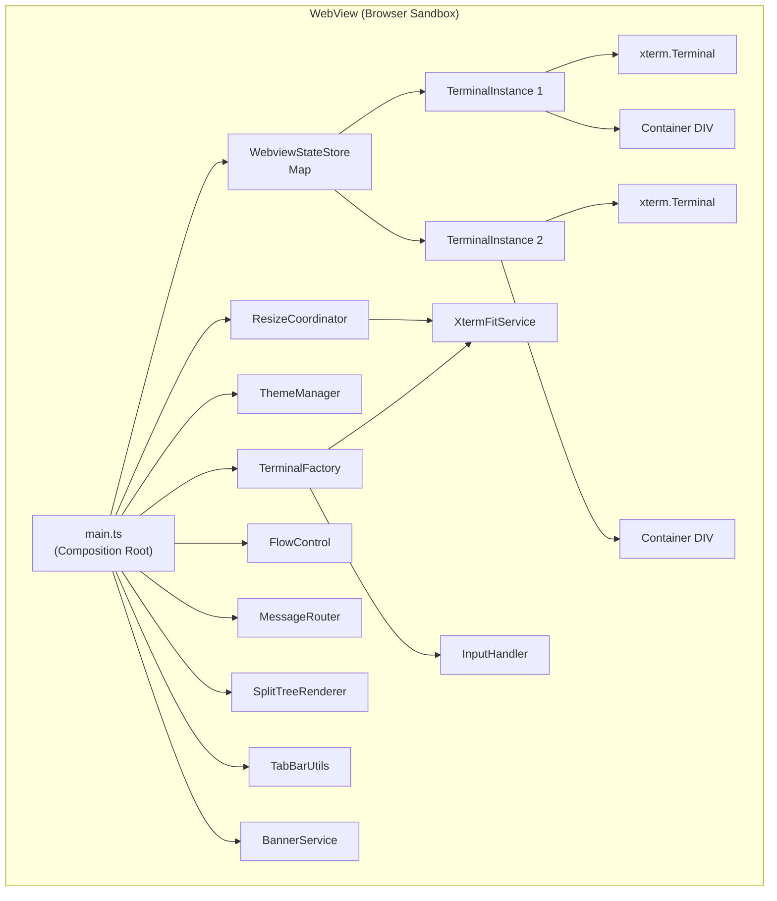
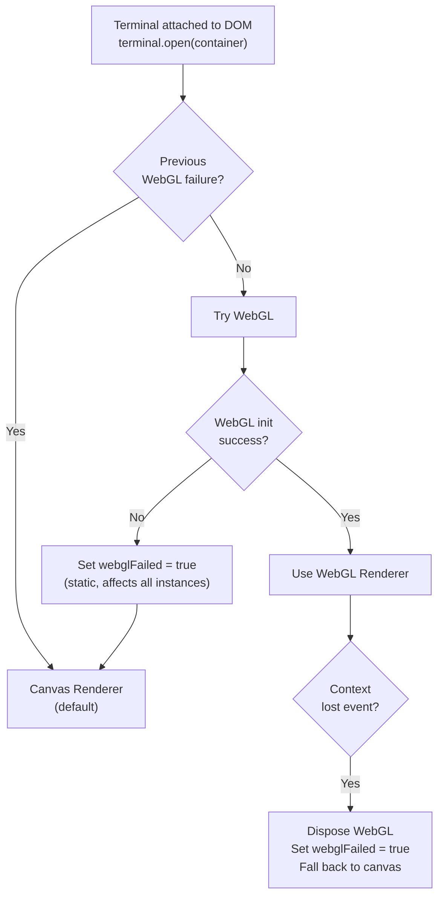
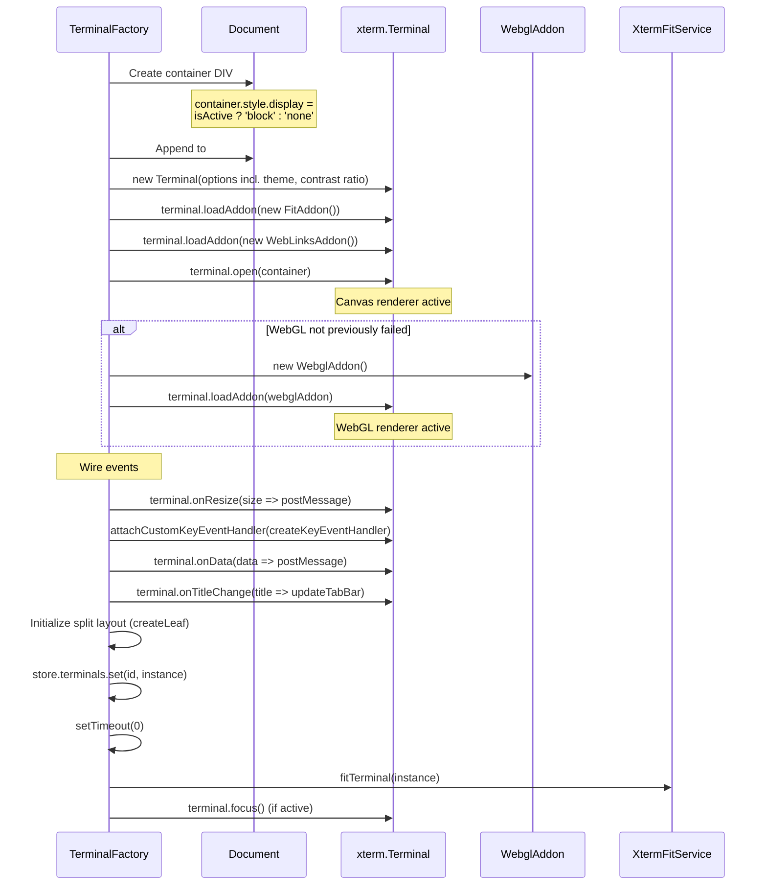

# xterm.js Integration — Detailed Design

## 1. Overview

The webview renders terminal output using [xterm.js](https://xtermjs.org/), the same terminal emulator library used by VS Code's built-in terminal. This document covers initialization, configuration, addon management, renderer selection, and terminal instance lifecycle — all running inside the webview's browser sandbox.

### Reference Sources
- VS Code: `xtermTerminal.ts`, `xtermAddonImporter.ts`, `terminalInstance.ts`
- Reference project: `webview/main.ts` (TerminalWebviewManager)
- xterm.js docs: https://xtermjs.org/docs/

---

## 2. Architecture



### TerminalInstance Interface

```typescript
interface TerminalInstance {
  id: string;                    // Tab/session ID
  name: string;                  // Display name ("Terminal 1")
  terminal: Terminal;            // xterm.js Terminal
  container: HTMLDivElement;     // DOM container element
  exited: boolean;               // Whether the PTY process has exited
}
```

> **Note**: `fitAddon` and `webLinksAddon` properties were removed in Phase 7. The addons are still loaded into the terminal but references are not stored on the instance since they are never read back.

---

## 3. xterm.js Initialization

### Module Loading

The xterm.js module is loaded via a static `import` at the top of `TerminalFactory.ts`. Since the webview is bundled via esbuild (IIFE format), the import is synchronous. There is no lazy loading or module-level caching — the constructor is available immediately.

```typescript
import { Terminal } from '@xterm/xterm';
```

### Terminal Constructor Options

From `TerminalFactory.createTerminal()`:

```typescript
const terminal = new Terminal({
  // Core behavior
  scrollback: config.scrollback || 10000,
  cursorBlink: config.cursorBlink ?? true,
  cursorStyle: 'block',
  
  // Font (from config + CSS variable fallback)
  fontFamily: config.fontFamily || getFontFamily(), // CSS var or 'monospace'
  fontSize: config.fontSize || 14,
  
  // macOS-specific
  macOptionIsMeta: false,
  macOptionClickForcesSelection: true,
  
  // Theme
  theme: themeManager.getTheme(),
  
  // Behavior
  rightClickSelectsWord: false,
  fastScrollSensitivity: 5,
  
  // Tab handling
  tabStopWidth: 8,
  
  // Drawing
  drawBoldTextInBrightColors: true,
  minimumContrastRatio: themeManager.getMinimumContrastRatio(), // 7 for HC, 4.5 for normal
  
  // Scrollbar: 1px overview ruler to minimize FitAddon width deduction
  overviewRuler: { width: 1 },
});
```

### Configuration Mapping Table

| xterm.js Option | Source | Default |
|----------------|--------|---------|
| `scrollback` | `anywhereTerminal.scrollback` | 10000 |
| `cursorBlink` | `anywhereTerminal.cursorBlink` | true |
| `fontSize` | `anywhereTerminal.fontSize` → `editor.fontSize` | 14 |
| `fontFamily` | `anywhereTerminal.fontFamily` → CSS `--vscode-editor-font-family` | monospace |
| `theme` | VS Code CSS variables via ThemeManager | (auto from theme) |
| `macOptionIsMeta` | Fixed | false |
| `minimumContrastRatio` | ThemeManager (7 for high-contrast, 4.5 for normal) | 4.5 |
| `overviewRuler.width` | Fixed | 1 (minimizes scrollbar deduction) |

---

## 4. Addon Loading Strategy

### Always Loaded (Synchronous, on Terminal Creation)

All three addons are loaded synchronously during `TerminalFactory.createTerminal()`. There is no lazy loading, addon cache, or tiered strategy — all addons are bundled by esbuild.

| Addon | Package | Purpose | Notes |
|-------|---------|---------|-------|
| FitAddon | `@xterm/addon-fit` | Auto-resize terminal to container | Loaded but `.fit()` is not called — custom `fitTerminal()` via XtermFitService is used instead |
| WebLinksAddon | `@xterm/addon-web-links` | Clickable URLs | Always loaded |
| WebglAddon | `@xterm/addon-webgl` | GPU-accelerated rendering (Retina) | Always attempted; falls back to canvas on failure |

### WebGL Loading Strategy

WebGL is loaded immediately after `terminal.open()`, not on-demand via config. There is no `gpuAcceleration` config setting. The strategy:

1. Attempt `new WebglAddon()` and load it into the terminal
2. Register `onContextLoss` handler for graceful fallback
3. If WebGL init fails (sync throw), set `webglFailed = true`
4. Once `webglFailed` is true, all future terminals skip WebGL (static failure memory)

```typescript
if (!this.webglFailed) {
  try {
    const webglAddon = new WebglAddon();
    webglAddon.onContextLoss(() => {
      webglAddon.dispose();
      this.webglFailed = true;
    });
    terminal.loadAddon(webglAddon);
  } catch {
    this.webglFailed = true;
  }
}
```

---

## 5. Renderer Selection

### Decision Logic

There is no `gpuAcceleration` config. WebGL is always attempted unless it has previously failed:



### Key Design Decisions

1. **Canvas first, upgrade immediately**: Terminal opens with canvas renderer via `terminal.open(container)`. WebGL is loaded immediately after — not deferred or on-demand.

2. **Static failure memory**: The `webglFailed` flag on `TerminalFactory` prevents retrying for all future terminal instances. This avoids wasting resources on repeated failures.

3. **Context loss handling**: WebGL contexts can be lost (browser reclaims GPU memory). The `onContextLoss` event triggers graceful fallback to canvas renderer.

4. **Custom fit replaces FitAddon.fit()**: `XtermFitService.fitTerminal()` uses `getBoundingClientRect()` and xterm's `_core._renderService.dimensions` for dimension calculation. See `resize-handling.md` for details.

---

## 6. Terminal Instance Lifecycle

### Creation Sequence



### Event Wiring

Each terminal instance has these event handlers:

| Event | Handler | Action |
|-------|---------|--------|
| `terminal.onData` | `(data) => postMessage({ type: 'input', tabId, data })` | Forward keystrokes to extension (skipped if `exited`) |
| `terminal.onResize` | `postMessage({ type: 'resize', tabId, cols, rows })` | Notify extension of dimension change (immediate, not debounced) |
| `terminal.write` callback | `flowControl.ackChars(data.length, tabId)` | Per-session flow control acknowledgment |
| `terminal.onTitleChange` | `(title) => instance.name = title; updateTabBar()` | Update tab name from OSC title |
| `ResizeObserver` | Debounced: `ResizeCoordinator.debouncedFit()` | Auto-resize on container change (100ms debounce) |
| `customKeyEventHandler` | `createKeyEventHandler(deps)` factory | Clipboard intercept, keybinding filter. See keyboard-input.md |

### Disposal

Disposal is handled by `removeTerminal()` in `main.ts`:

```typescript
function removeTerminal(id: string): void {
  const instance = store.terminals.get(id);
  if (!instance) return;

  // 1. Dispose xterm.js (disposes loaded addons too)
  instance.terminal.dispose();

  // 2. Remove DOM element
  instance.container.remove();

  // 3. Remove from state
  store.terminals.delete(id);
  flowControl.delete(id);

  // 4. Delegate split cleanup to SplitTreeRenderer
  splitRenderer.removeTab(id);
  store.persist();

  // 5. Switch to next available tab or request new one
  if (store.activeTabId === id) {
    const remaining = Array.from(store.tabLayouts.keys());
    if (remaining.length > 0) {
      switchTab(remaining[remaining.length - 1]);
    } else {
      store.activeTabId = null;
      vscode.postMessage({ type: 'createTab' });
    }
  }
  updateTabBar();
}
```

### Disposal Guard After Async Operations

The `setTimeout(0)` in `createTerminal()` checks if the terminal still exists before fitting:

```typescript
setTimeout(() => {
  // Guard: terminal may have been disposed during async delay
  if (!store.terminals.has(id)) return;
  fitTerminal(instance);
  if (isActive) terminal.focus();
}, 0);
```

---

## 7. Tab Switching

### Show/Hide Pattern

Multiple xterm.js instances exist simultaneously, but only one tab is visible per view. Tab switching is done via CSS `display` property, with split pane container management handled by `SplitTreeRenderer`:

```typescript
function switchTab(newTabId: string): void {
  const next = store.terminals.get(newTabId);
  if (!next) return;

  // Hide current tab (both split container and root container)
  if (store.activeTabId && store.activeTabId !== newTabId) {
    splitRenderer.hideTabContainer(store.activeTabId);
    const current = store.terminals.get(store.activeTabId);
    if (current) current.container.style.display = 'none';
  }

  // Show new tab
  store.activeTabId = newTabId;
  splitRenderer.showTabContainer(newTabId);
  next.container.style.display = 'block';

  // Fit all panes in the tab after display change
  requestAnimationFrame(() => {
    if (!store.terminals.has(newTabId)) return;
    factory.fitAllAndFocus(newTabId, next);
  });

  splitRenderer.updateActivePaneVisual(newTabId);
  updateTabBar();
  vscode.postMessage({ type: 'switchTab', tabId: newTabId });
}
```

### Why Not Destroy/Recreate?

Keeping hidden terminals alive (with `display: none`) preserves:
- Scrollback buffer
- Terminal state (cursor position, modes)
- No re-render cost on switch
- Instant tab switching

The memory cost is acceptable for typical tab counts (1-5 terminals).

---

## 8. Configuration Updates

When the extension sends a `configUpdate` message, `TerminalFactory.applyConfig()` applies changes to all terminal instances:

```typescript
applyConfig(config: Partial<TerminalConfig>): void {
  // Persist for future tab creation
  Object.assign(this.store.currentConfig, config);

  const needsRefit = config.fontSize !== undefined || config.fontFamily !== undefined;

  for (const instance of this.store.terminals.values()) {
    const term = instance.terminal;
    if (config.fontSize !== undefined) term.options.fontSize = config.fontSize || 14;
    if (config.cursorBlink !== undefined) term.options.cursorBlink = config.cursorBlink;
    if (config.scrollback !== undefined) term.options.scrollback = config.scrollback;
    if (config.fontFamily !== undefined) term.options.fontFamily = config.fontFamily || this.getFontFamily();

    if (needsRefit) this.fitTerminal(instance);
  }
}
```

### Configuration Change → Refit

Font size or family changes affect cell dimensions. After applying a font update:
1. Set `terminal.options.fontSize` or `fontFamily`
2. Call `XtermFitService.fitTerminal()` — recalculates cols/rows via `getBoundingClientRect()`
3. `terminal.onResize` fires with new dimensions
4. Immediate postMessage sends new cols/rows to extension
5. Extension calls `pty.resize(cols, rows)`

---

## 9. Dependencies (npm packages)

### Runtime (all bundled into webview.js)

| Package | Version | Purpose |
|---------|---------|---------|
| `@xterm/xterm` | ^6.x | Core terminal emulator |
| `@xterm/addon-fit` | ^0.10.x | Auto-resize (loaded but `.fit()` not called; XtermFitService replaces it) |
| `@xterm/addon-web-links` | ^0.11.x | Clickable URLs |
| `@xterm/addon-webgl` | ^0.18.x | GPU rendering (always loaded, not on-demand) |

### CSS

xterm.js requires its CSS file (`@xterm/xterm/css/xterm.css`) to be loaded in the webview. Options:
1. **Copy to media/**: `xterm.css` copied during build, loaded via `<link>` tag
2. **Bundle inline**: Import in webview main.ts, esbuild CSS loader bundles it

We use option 1 (explicit `<link>` tag) for better CSP compliance and cacheability.

---

## 10. File Location

```
src/webview/main.ts                     — Composition root (293 LOC), wires all modules
src/webview/terminal/TerminalFactory.ts — Terminal creation, addon loading, config application
src/webview/resize/XtermFitService.ts   — Custom fitTerminal() using xterm _core (sole xterm private API user)
src/webview/resize/ResizeCoordinator.ts — ResizeObserver, debounce, visibility, location inference
src/webview/theme/ThemeManager.ts       — CSS variable → ITheme, MutationObserver theme watching
src/webview/state/WebviewStateStore.ts  — Centralized mutable state (terminals, layouts, config)
src/webview/messaging/MessageRouter.ts  — Typed dispatch table for ExtensionToWebViewMessage
src/webview/flow/FlowControl.ts         — Per-session ack batching
src/webview/InputHandler.ts             — createKeyEventHandler() factory
src/webview/ui/BannerService.ts         — Error/warning/info banner display
src/webview/split/SplitTreeRenderer.ts  — Split pane DOM rendering and lifecycle
src/webview/TabBarUtils.ts              — Tab bar data building and rendering
```
