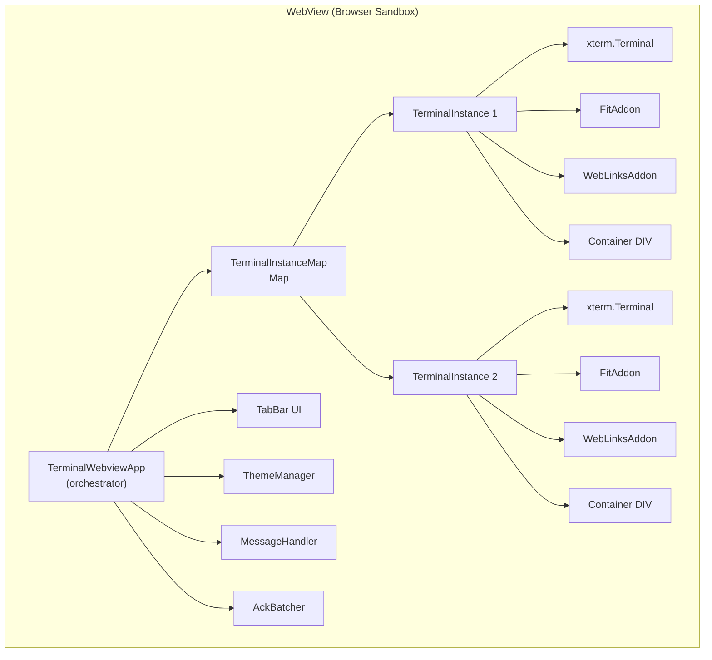
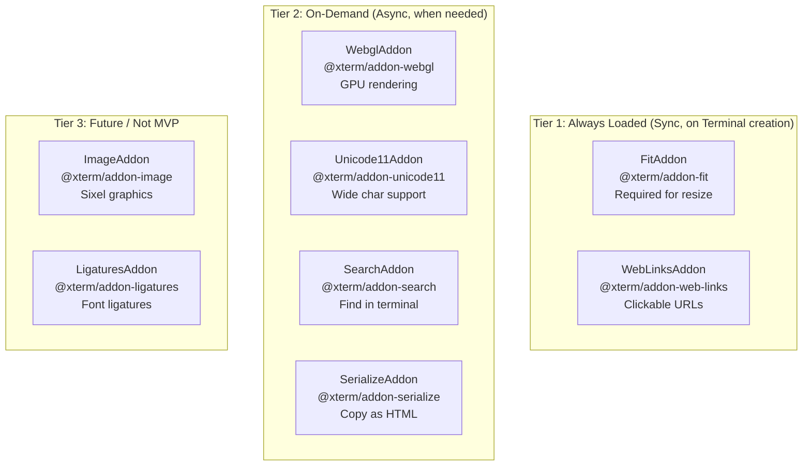
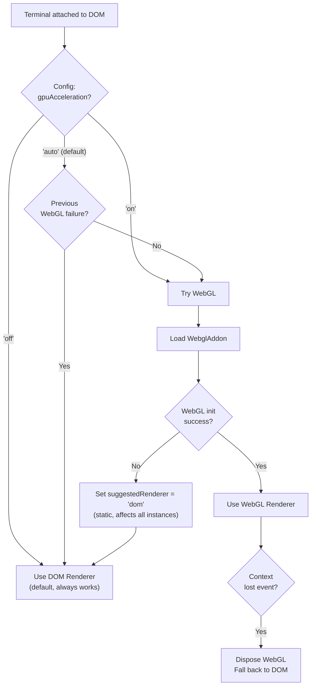
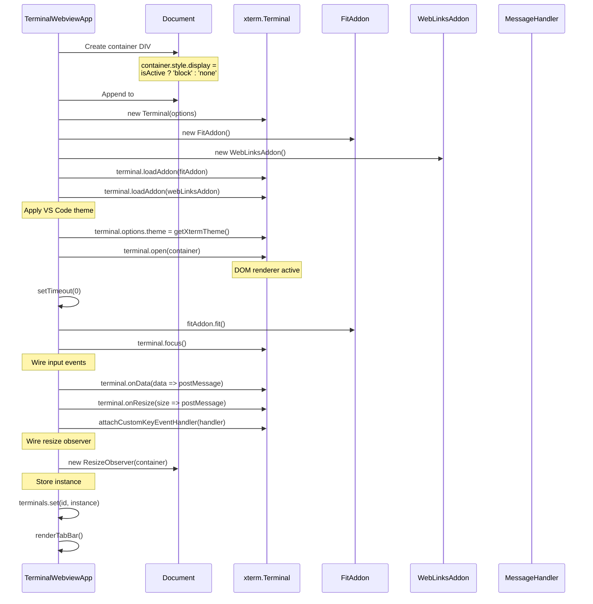

# xterm.js Integration — Detailed Design

## 1. Overview

The webview renders terminal output using [xterm.js](https://xtermjs.org/), the same terminal emulator library used by VS Code's built-in terminal. This document covers initialization, configuration, addon management, renderer selection, and terminal instance lifecycle — all running inside the webview's browser sandbox.

### Reference Sources
- VS Code: `xtermTerminal.ts`, `xtermAddonImporter.ts`, `terminalInstance.ts`
- Reference project: `webview/main.ts` (TerminalWebviewManager)
- xterm.js docs: https://xtermjs.org/docs/

---

## 2. Architecture



### TerminalInstance Interface

```typescript
interface TerminalInstance {
  id: string;                    // Tab/session ID
  name: string;                  // Display name ("Terminal 1")
  terminal: Terminal;            // xterm.js Terminal
  fitAddon: FitAddon;           // Auto-resize addon
  webLinksAddon: WebLinksAddon; // Clickable URLs
  container: HTMLDivElement;     // DOM container element
}
```

---

## 3. xterm.js Initialization

### Lazy Loading Pattern

Following VS Code's pattern (`terminalInstance.ts:772-785`), the xterm.js module is loaded lazily and cached at module level:

```typescript
// Module-level cache — shared across all terminal instances
let xtermModule: typeof import('@xterm/xterm') | undefined;

async function getXtermModule(): Promise<typeof import('@xterm/xterm')> {
  if (!xtermModule) {
    xtermModule = await import('@xterm/xterm');
  }
  return xtermModule;
}
```

In practice, since our webview bundles xterm.js via esbuild (IIFE format), the import is synchronous. The lazy pattern is still useful for:
- Deferring initialization until the first terminal is needed
- Consistent pattern if we later split-bundle addons

### Terminal Constructor Options

Derived from VS Code's `xtermTerminal.ts:189-265`:

```typescript
const terminal = new Terminal({
  // Core behavior
  allowProposedApi: true,         // Access to unstable xterm APIs
  scrollback: config.scrollback,  // Default: 10000
  cursorBlink: config.cursorBlink,
  cursorStyle: 'block',           // 'block' | 'underline' | 'bar'
  
  // Font (from VS Code theme CSS variables)
  fontFamily: getFontFamily(),    // --vscode-editor-font-family or 'monospace'
  fontSize: getFontSize(),        // anywhereTerminal.fontSize or VS Code editor size
  
  // macOS-specific
  macOptionIsMeta: false,         // Configurable: treat Option as Meta key
  macOptionClickForcesSelection: true,
  
  // Theme
  theme: getXtermTheme(),         // Built from VS Code CSS variables
  
  // Behavior
  rightClickSelectsWord: false,   // VS Code default: context menu
  fastScrollSensitivity: 5,
  
  // Tab handling
  tabStopWidth: 8,
  
  // Drawing
  drawBoldTextInBrightColors: true,
  minimumContrastRatio: 4.5,      // WCAG AA compliance
});
```

### Configuration Mapping Table

| xterm.js Option | Source | Default |
|----------------|--------|---------|
| `scrollback` | `anywhereTerminal.scrollback` | 10000 |
| `cursorBlink` | `anywhereTerminal.cursorBlink` | true |
| `fontSize` | `anywhereTerminal.fontSize` → `editor.fontSize` | 14 |
| `fontFamily` | `terminal.integrated.fontFamily` → `editor.fontFamily` | monospace |
| `theme` | VS Code CSS variables | (auto from theme) |
| `macOptionIsMeta` | Future config | false |
| `minimumContrastRatio` | Fixed | 4.5 |

---

## 4. Addon Loading Strategy

### Tiered Loading

Following VS Code's approach (`xtermAddonImporter.ts`), addons are loaded in tiers based on when they're needed:



### Addon Cache

```typescript
// Module-level addon cache (from VS Code pattern)
const addonCache = new Map<string, any>();

async function loadAddon<T>(name: string, importFn: () => Promise<T>): Promise<T> {
  let addon = addonCache.get(name);
  if (!addon) {
    addon = await importFn();
    addonCache.set(name, addon);
  }
  return addon;
}
```

### MVP Addons (Phase 1)

| Addon | Package | Loaded When | Purpose |
|-------|---------|-------------|---------|
| FitAddon | `@xterm/addon-fit` | Terminal created | Auto-resize terminal to container |
| WebLinksAddon | `@xterm/addon-web-links` | Terminal created | Make URLs clickable |

### Phase 2+ Addons

| Addon | Package | Loaded When | Purpose |
|-------|---------|-------------|---------|
| WebglAddon | `@xterm/addon-webgl` | Config `gpuAcceleration !== 'off'` | GPU-accelerated rendering |
| Unicode11Addon | `@xterm/addon-unicode11` | Always (small, improves CJK) | Unicode 11 width support |
| SearchAddon | `@xterm/addon-search` | First Ctrl+F | Find text in terminal |
| SerializeAddon | `@xterm/addon-serialize` | First "Copy as HTML" | Serialize terminal with formatting |

---

## 5. Renderer Selection

### Decision Logic

Adapted from VS Code (`xtermTerminal.ts:578`):



### Key Design Decisions

1. **DOM first, upgrade later**: Terminal always opens with DOM renderer via `terminal.open(container)`. WebGL is loaded as an addon after DOM render is working.

2. **Static failure memory**: If WebGL fails once, a module-level flag prevents retrying for all future terminal instances. This avoids wasting resources on repeated failures.

3. **Context loss handling**: WebGL contexts can be lost (browser reclaims GPU memory). The `onContextLoss` event triggers graceful fallback to DOM renderer.

4. **Dimension refresh**: WebGL and DOM renderers produce slightly different cell dimensions. After renderer switch, `fitAddon.fit()` must be called to recalculate.

---

## 6. Terminal Instance Lifecycle

### Creation Sequence



### Event Wiring

Each terminal instance has these event handlers:

| Event | Handler | Action |
|-------|---------|--------|
| `terminal.onData` | `(data) => postMessage({ type: 'input', tabId, data })` | Forward keystrokes to extension |
| `terminal.onResize` | Debounced: `postMessage({ type: 'resize', tabId, cols, rows })` | Notify extension of dimension change |
| `terminal.write` callback | `ackBatcher.ack(data.length)` | Flow control acknowledgment |
| `ResizeObserver` | Debounced: `fitAddon.fit()` | Auto-resize on container change |
| `customKeyEventHandler` | Clipboard intercept, keybinding filter | See keyboard-input.md |

### Disposal

```typescript
function removeTerminal(id: string): void {
  const instance = terminals.get(id);
  if (!instance) return;

  // 1. Dispose xterm.js (disposes loaded addons too)
  instance.terminal.dispose();

  // 2. Remove DOM element
  instance.container.remove();

  // 3. Remove from map
  terminals.delete(id);

  // 4. If this was active tab, switch to next
  if (activeTabId === id) {
    const remaining = Array.from(terminals.keys());
    if (remaining.length > 0) {
      switchTab(remaining[remaining.length - 1]);
    } else {
      activeTabId = null;
    }
  }

  // 5. Update tab bar
  renderTabBar();
}
```

### Disposal Guard After Async Operations

Following VS Code's pattern, always check if the terminal was disposed during async operations:

```typescript
loadAddon('webgl', () => import('@xterm/addon-webgl')).then(WebglAddon => {
  // Guard: terminal may have been disposed during async load
  if (!terminals.has(id)) return;
  
  const addon = new WebglAddon();
  terminal.loadAddon(addon);
});
```

---

## 7. Tab Switching

### Show/Hide Pattern

Multiple xterm.js instances exist simultaneously, but only one is visible per view. Tab switching is done via CSS `display` property:

```typescript
function switchTab(newTabId: string): void {
  // Hide current
  if (activeTabId) {
    const current = terminals.get(activeTabId);
    if (current) {
      current.container.style.display = 'none';
    }
  }

  // Show new
  const next = terminals.get(newTabId);
  if (next) {
    next.container.style.display = 'block';
    activeTabId = newTabId;

    // Fit after display change (container now has dimensions)
    requestAnimationFrame(() => {
      next.fitAddon.fit();
      next.terminal.focus();
    });
  }

  // Update tab bar active state
  renderTabBar();

  // Notify extension
  vscode.postMessage({ type: 'switchTab', tabId: newTabId });
}
```

### Why Not Destroy/Recreate?

Keeping hidden terminals alive (with `display: none`) preserves:
- Scrollback buffer
- Terminal state (cursor position, modes)
- No re-render cost on switch
- Instant tab switching

The memory cost is acceptable for typical tab counts (1-5 terminals).

---

## 8. Configuration Updates

When the extension sends a `configUpdate` message, the webview applies changes to all terminal instances:

```typescript
function applyConfig(config: Partial<TerminalConfig>): void {
  for (const instance of terminals.values()) {
    const term = instance.terminal;

    if (config.fontSize !== undefined) {
      term.options.fontSize = config.fontSize;
    }
    if (config.cursorBlink !== undefined) {
      term.options.cursorBlink = config.cursorBlink;
    }
    if (config.scrollback !== undefined) {
      term.options.scrollback = config.scrollback;
    }

    // Refit after font size changes
    if (config.fontSize !== undefined) {
      instance.fitAddon.fit();
    }
  }
}
```

### Configuration Change → Refit

Font size changes affect cell dimensions. After applying a font size update:
1. Set `terminal.options.fontSize`
2. Call `fitAddon.fit()` — recalculates cols/rows
3. `terminal.onResize` fires with new dimensions
4. Debounced postMessage sends new cols/rows to extension
5. Extension calls `pty.resize(cols, rows)`

---

## 9. Dependencies (npm packages)

### Runtime (bundled into webview.js)

| Package | Version | Size | Purpose |
|---------|---------|------|---------|
| `@xterm/xterm` | ^5.x | ~300KB | Core terminal emulator |
| `@xterm/addon-fit` | ^0.10.x | ~5KB | Auto-resize |
| `@xterm/addon-web-links` | ^0.11.x | ~8KB | Clickable URLs |

### Optional (Phase 2+, bundled on demand)

| Package | Version | Size | Purpose |
|---------|---------|------|---------|
| `@xterm/addon-webgl` | ^0.18.x | ~150KB | GPU rendering |
| `@xterm/addon-unicode11` | ^0.8.x | ~15KB | Unicode 11 widths |
| `@xterm/addon-search` | ^0.15.x | ~10KB | Find in terminal |
| `@xterm/addon-serialize` | ^0.13.x | ~8KB | Copy as HTML |

### CSS

xterm.js requires its CSS file (`@xterm/xterm/css/xterm.css`) to be loaded in the webview. Options:
1. **Copy to media/**: `xterm.css` copied during build, loaded via `<link>` tag
2. **Bundle inline**: Import in webview main.ts, esbuild CSS loader bundles it

We use option 1 (explicit `<link>` tag) for better CSP compliance and cacheability.

---

## 10. File Location

```
src/webview/main.ts          — Entry point, TerminalWebviewApp class
src/webview/terminal/         — (Phase 2: extract TerminalManager, InputHandler)
src/webview/ui/               — (Phase 2: extract TabManager, ThemeManager)
```

For MVP (Phase 1), all webview code is in `main.ts` (~400-500 lines). Extraction to separate modules happens in Phase 2 when complexity warrants it.
